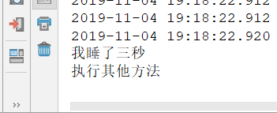
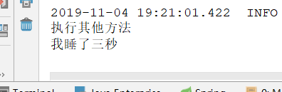
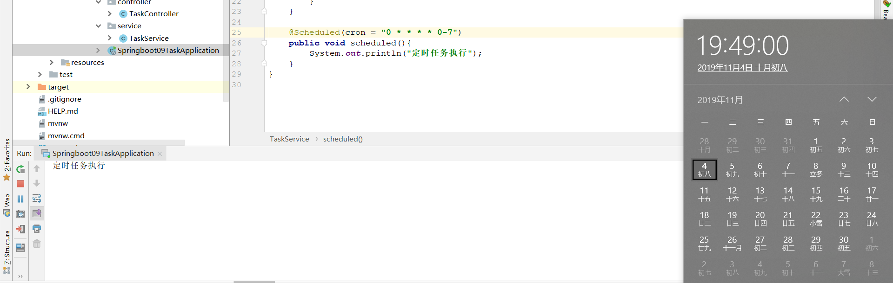
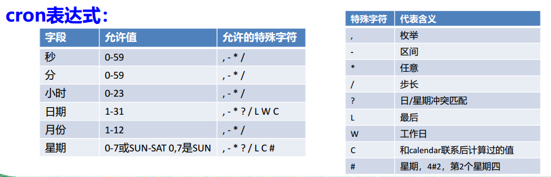
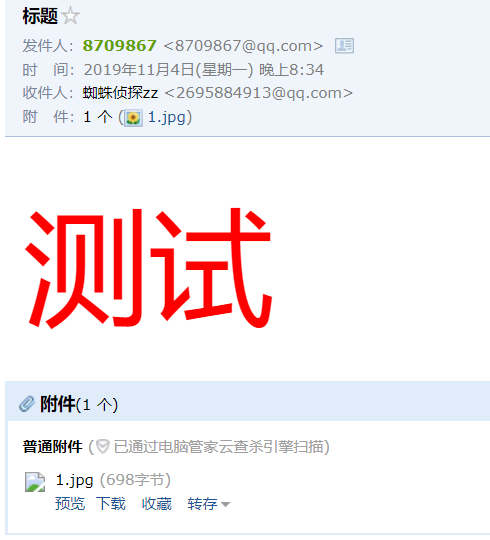

## 一、异步任务

当一个方法需要执行很长时间时，并且这个方法的执行对下面的代码没有任何影响（没有用到返回值），便可以使用异步来加快程序的运行，而不是等待那个方法执行完才执行下面的。

举个例子：

```java
@Service
public class TaskService {

    public void hello(){
        try {
            Thread.sleep(3000);
            System.out.println("我睡了三秒");
        } catch (InterruptedException e) {
            e.printStackTrace();
        }
    }
}
```

```java
@RestController
public class TaskController {

    @Autowired
    private TaskService taskService;


    @GetMapping("hello")
    public String hello(){
        taskService.hello();
        System.out.println("执行其他方法");
        return "success";
    }

}
```

很简单的代码，hello方法睡眠了三秒，而在controller中便需要等待三秒才能执行下面的方法



可以看到控制台，没问题，等了三秒才执行下面的方法。

而让他异步执行对于springboot来说非常简单，只需添加两个注解

### @EnableAsync

对主程序类使用，开启异步注解

### @Async

对方法使用，标明此方法异步调用

```java
@EnableAsync
@SpringBootApplication
public class Springboot09TaskApplication {

    public static void main(String[] args) {
        SpringApplication.run(Springboot09TaskApplication.class, args);
    }

}
```

```java
@Async
public void hello(){
    try {
        Thread.sleep(3000);
        System.out.println("我睡了三秒");
    } catch (InterruptedException e) {
        e.printStackTrace();
    }
}
```

添加好异步注解后，再次执行试一下：



可以看到，先执行了下面的方法，而睡觉方法后执行完毕。

## 二、定时任务

定时任务顾名思义，在指定的时间执行的方法，比如：每天的11点执行，或者每个月的第三个工作日执行等等。

主要也是使用两个注解

@Scheduled和@EnableScheduling

如下：我定制了一个每分钟执行一次的方法，果然在00秒时执行任务。



### 配置规则

cron具有有个小参数，分别为==秒 分 时 日 月 星期几==

cron表达式：



示例：

```
【0 0/5 14,18 * * ?】：每天14点整和18点整，每隔5分钟执行一次，即14:00,14:05,14:10....
【0 15 10 ？ * 1-6】：每个星期1到星期6的10点15分执行一次
【0 0 2 ？ * 6L】：每个月最后一个周六的凌晨2点执行一次
【0 0 2 LW * ？】：每个月的最后一个工作日凌晨2点执行一次
【0 0 2-4 ？ * 2#1】：每个月第一个星期二的凌晨2点到4点，每个整点执行一次
```

## 三、邮件任务

可以使用`spring-boot-starter-mail`组件来进行邮件的发送

配置文件配置：

```properties
spring.mail.username=xxx@qq.com
spring.mail.password=xxx
spring.mail.host=smtp.qq.com
```

注意密码是临时授权码，而不是qq密码，需要去邮箱开启pop3smtp。

在springboot1.x时，发送邮件可能会抛出ssl未打开异常，需要单独配置，而在2.x默认打开了

```properties
spring.mail.properties.mail.smtp.ssl.enable=true
```

测试类：

```java
@SpringBootTest
class Springboot09TaskApplicationTests {

    @Autowired
    JavaMailSenderImpl javaMailSender;

    @Test
    void contextLoads() {
        // 简单的Email发送
        SimpleMailMessage mailMessage = new SimpleMailMessage();
        mailMessage.setSubject("标题");
        mailMessage.setText("简单测试");

        mailMessage.setFrom("xxx@qq.com");
        mailMessage.setTo("xxx@qq.com");
        javaMailSender.send(mailMessage);
    }

    @Test
    void contextLoads2() throws MessagingException {
        // 复杂的Email发送，带附件
        MimeMessage mimeMessage = javaMailSender.createMimeMessage();
        MimeMessageHelper helper = new MimeMessageHelper(mimeMessage,true);

        helper.setSubject("标题");
        helper.setText("<div style='color:red;font-size:100px'>测试</div>",true);

        helper.setFrom("xxx@qq.com");
        helper.setTo("xxx@qq.com");

        // 设置附件
        helper.addAttachment("1.jpg",new File("E:\\download\\QR.png"));
        javaMailSender.send(mimeMessage);
    }

}
```



可以看到没问题