## 一、Spring简单介绍

SpringBoot是为了简化开发人员开发而出现的，在之前使用SSM时，需要配置很多xml文件，才可以进行使用开发，使用Springboot，所有东西基本都自动帮你配好，只需写一些自定义的配置即可开发，是相当方便的一站式开发脚手架。

并且对于部署也相当方便，在以前可能需要安装tomcat然后把项目打成war包，再放到tomcat中，才算部署成功。使用Springboot，只需打成jar包，使用java命令运行即可。

## 二、环境准备

–jdk1.8：Spring Boot 推荐jdk1.7及以上；java version "1.8.0_112"

–maven3.x：maven 3.3以上版本；Apache Maven 3.3.9

–IntelliJIDEA2017：IntelliJ IDEA 2017.2.2 x64、STS

–SpringBoot 1.5.9.RELEASE：1.5.9；

## 三、Springboot Helloworld

我们来做一个功能，用户访问hello接口，然后返回helloworld文字

### 1.创建一个maven项目

### 2.加入springboot依赖

```xml
<parent>
    <groupId>org.springframework.boot</groupId>
    <artifactId>spring-boot-starter-parent</artifactId>
    <version>1.5.9.RELEASE</version>
</parent>
<dependencies>
    <dependency>
        <groupId>org.springframework.boot</groupId>
        <artifactId>spring-boot-starter-web</artifactId>
    </dependency>
</dependencies>
```

### 3.创建一个主程序运行应用

```java
/**
 * @SpringBootApplicaton 用来标注一个主程序类，使用此类启动应用
 */
@SpringBootApplication
public class HelloWorldMainApplication {

    public static void main(String[] args) {
        // 启动应用
        SpringApplication.run(HelloWorldMainApplication.class,args);
    }
}
```

SpringBoot不同于普通的Spring项目，只需配置个注解，即可直接Java运行，而不是放到tomcat中，再启动tomcat。因为SpringBoot中嵌入了tomcat

### 4.编写controller类

```java
@Controller
public class HelloWorldController {

    @ResponseBody
    @RequestMapping("/hello")
    public String hello(){
        return "hello world!";
    }
}
```

### 5.运行主程序测试

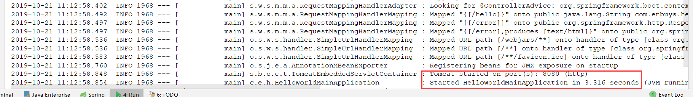

看到started说明启动成功，访问试试

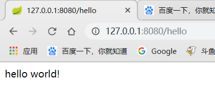

### 6.简化打包部署

Springboot应用只需在maven中配置插件，然后打成jar包后使用java执行即可

```xml
 <!-- 这个插件，可以将应用打包成一个可执行的jar包；-->
    <build>
        <plugins>
            <plugin>
                <groupId>org.springframework.boot</groupId>
                <artifactId>spring-boot-maven-plugin</artifactId>
            </plugin>
        </plugins>
    </build>
```

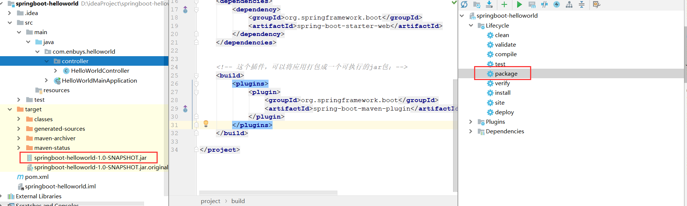

然后我们执行这个jar包试一下

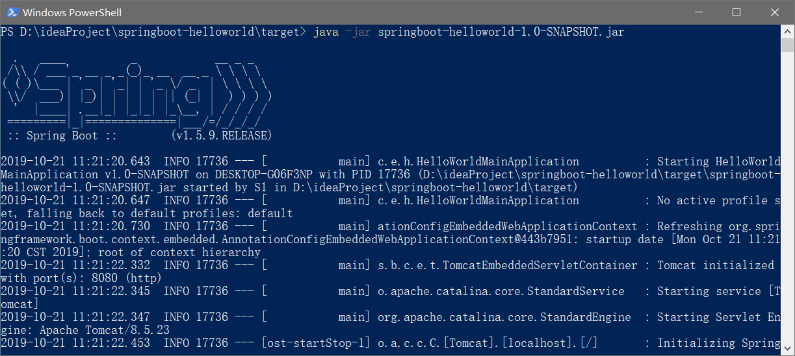

访问`localhost:8080/hello`，也正确访问

## 四、POM文件分析

在使用springboot开发时，pom文件仅仅导入了一个父项目和一个依赖就可以了，我们进入查看每个都做了什么事

### 4.1.父项目

```xml
<parent>
    <groupId>org.springframework.boot</groupId>
    <artifactId>spring-boot-starter-parent</artifactId>
    <version>1.5.9.RELEASE</version>
</parent>
```

我们进入到parent中，发现他也有一个父项目dependencies，在进入看看

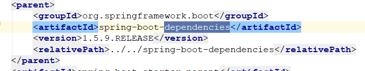

可以发现，主要依赖的jar包以及版本的设置都在dependencies中设置


### 4.2.启动器

```xml
<dependencies>
    <dependency>
        <groupId>org.springframework.boot</groupId>
        <artifactId>spring-boot-starter-web</artifactId>
    </dependency>
</dependencies>
```

和上面一样进入到web中看看

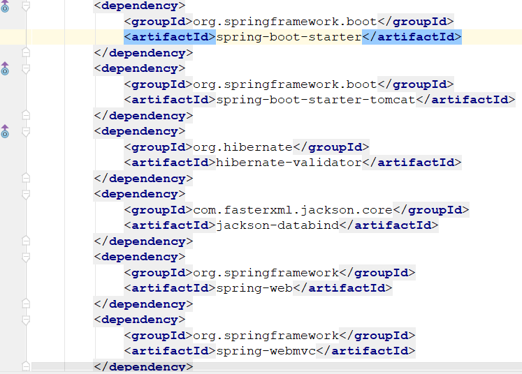

可以看到主要是关于web相关的依赖，比如mvc，tomcat。所以这是一个web启动器

spring-boot-starter：以这个开头代表springboot的启动器，springboot提供了很多启动器，如下图，我们使用的是web启动器。

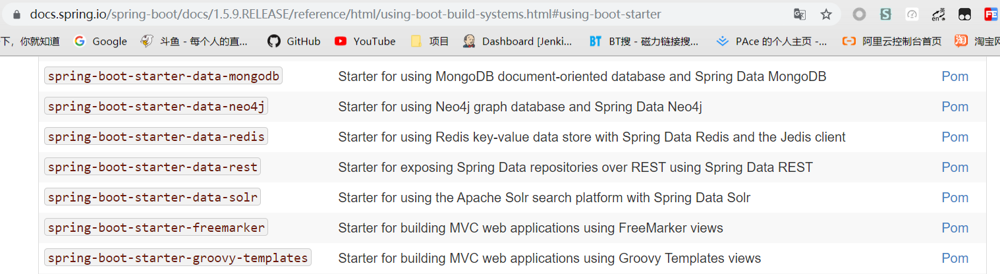

## 五、注解简单分析

前面我们看到Springboot启动开发非常简单，这是因为他们绝大部分需要配置的都由注解完成了

```java
@SpringBootApplication
public class HelloWorldMainApplication {

    public static void main(String[] args) {
        // 启动应用
        SpringApplication.run(HelloWorldMainApplication.class,args);
    }
}
```

**@SpringBootApplication**：这个注解是最主要的注解，标志主程序类运行，也是主配置类，进入这个注解看一下


这里会发现两个重要注解，也是为何这么方便开发的原因，再进源码研究一波：

------

1）**@SpringBootConfiguration**：Springboot的配置类

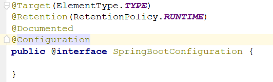

发现有一个@Configuration注解，标志这个类为一个配置类，所以这个大注解的功能就是标志这是一个Springboot的配置类。

------

**2）@EnableAutoConfiguration**：开启自动配置功能

这个注解非常关键，是为我们省去很多xml配置的主要角色。

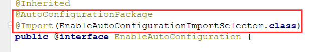

点进去可以看到两个重要注解，@AutoConfigurationPackage和Import：

**2.1）@AutoConfigurationPackage**：自动配置包

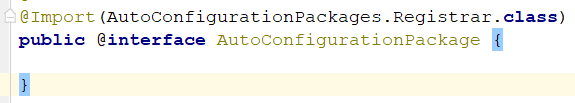

使用了Spring底层注解`@Import`，导入一个`AutoConfigurationPackages.Registrar`组件，Debug启动：

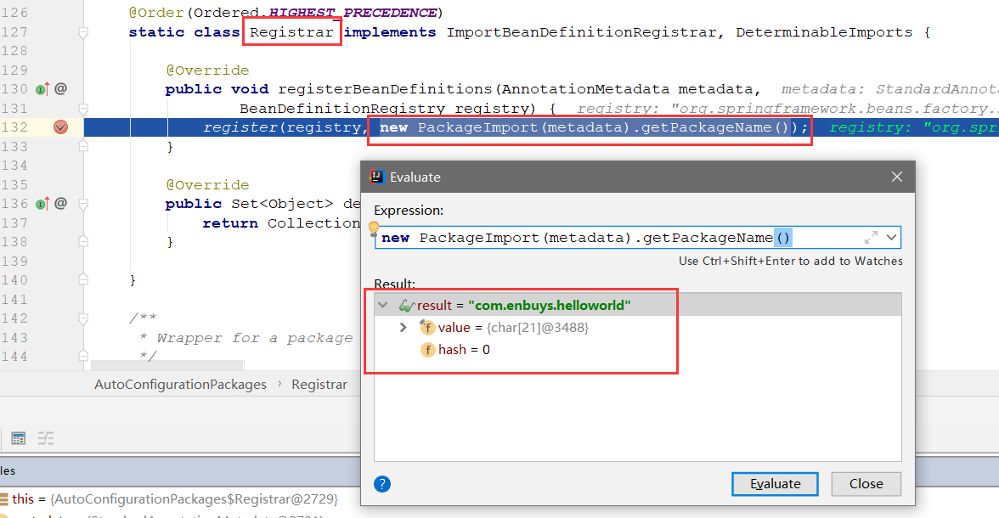

<font color="red">将主配置类（@SpringBootApplication）所在的包及下面所有子包扫描到Spring容器中</font>


**2.2）@Import(EnableAutoConfigurationImportSelector.class)**；给容器中导入组件

我们想要知道它导入了哪些组件，进入源码探寻

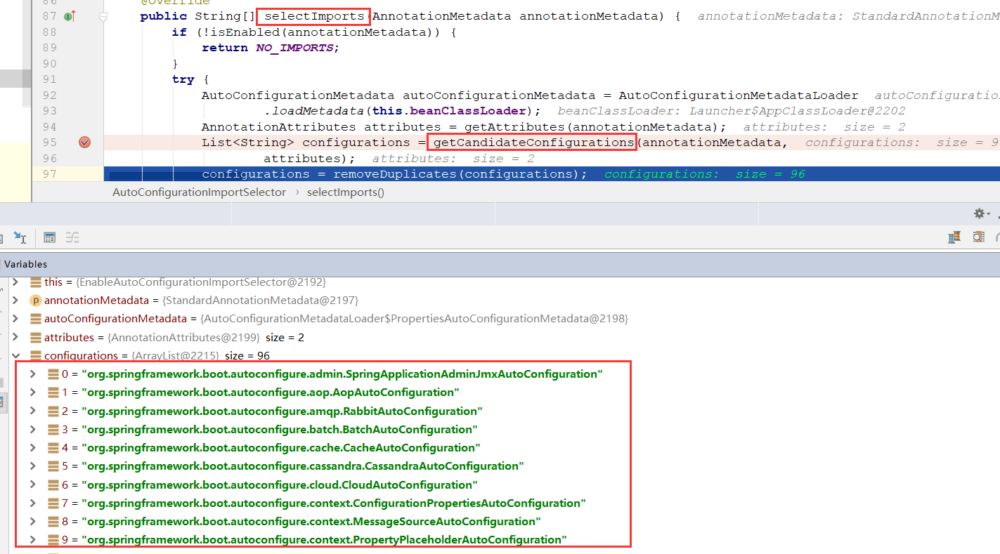

可以看到有一个获取组件的方法，打断点启动，发现配置了很多`XXXAutoConfiguration`类。这些就是所需的配置类，也省去了我们之前的很多xml配置手动加载的工作。

再点进方法中：

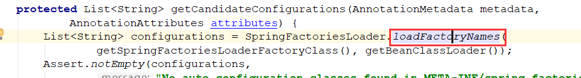

会发现是通过`FACTORIES_RESOURCE_LOCATION`读取配置，来当做properties进行加载的

`public static final String FACTORIES_RESOURCE_LOCATION = "META-INF/spring.factories";`

使用的是这个文件，进入源码看一下：

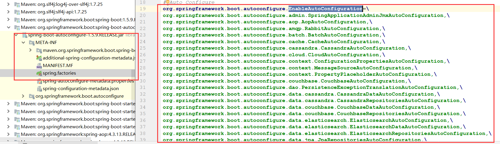

会发现全部在Springboot自带的配置文件中配置好了，所以我们再总结一下：

<font color="red">Spring Boot在启动的时候从类路径下的META-INF/spring.factories中获取EnableAutoConfiguration指定的值，将这些值作为自动配置类导入到容器中，自动配置类就生效，帮我们进行自动配置工作</font>

