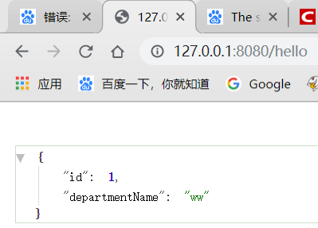
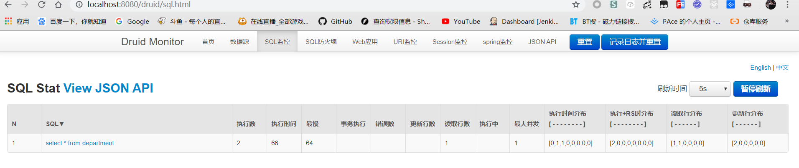
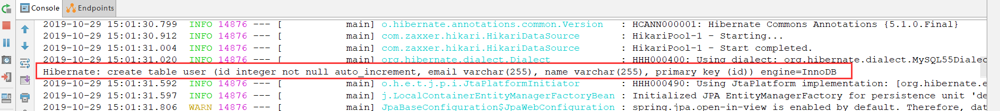
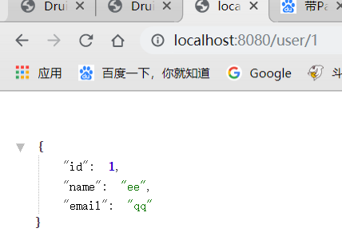

## 一、JDBC

SpringBoot整合JDBC十分简单，只需添加jdbc与mysql依赖即可：

```xml
<dependency>
    <groupId>org.springframework.boot</groupId>
    <artifactId>spring-boot-starter-jdbc</artifactId>
</dependency>
<dependency>
    <groupId>mysql</groupId>
    <artifactId>mysql-connector-java</artifactId>
    <scope>runtime</scope>
</dependency>
```

然后配置数据库相关信息：

```properties
spring.datasource.username=root
spring.datasource.password=root
spring.datasource.url=jdbc:mysql://127.0.0.1:3306/springboot_jdbc?serverTimezone=Asia/Shanghai
# 数据源可写可不写，不写便默认配置
spring.datasource.driver-class-name=com.mysql.cj.jdbc.Driver
```

注意，在SpringBoot1.x时默认使用jdbc.pool做数据源，而再2.x后便默认使用HikariDataSource了

在配置url时，应添加serverTimezone=Asia/Shanghai参数，不然启动会报错

### 1.1.数据源

经过测试，发现2.x使用了HikariDataSource数据源，我们看下源码，对于jdbc的默认配置都在`org.springframework.boot.autoconfigure.jdbc`包下：

**DataSourceConfiguration**：默认支持**tomcat.jdbcpool，hikari，dbcp2**

```java
abstract class DataSourceConfiguration {
    // 支持Tomcat的jdbcpool
	@Configuration(proxyBeanMethods = false)
	@ConditionalOnClass(org.apache.tomcat.jdbc.pool.DataSource.class)
	@ConditionalOnMissingBean(DataSource.class)
	@ConditionalOnProperty(name = "spring.datasource.type", havingValue = "org.apache.tomcat.jdbc.pool.DataSource",
			matchIfMissing = true)
	static class Tomcat {···}
    
    // 支持Hikari，默认使用此数据源
	@Configuration(proxyBeanMethods = false)
	@ConditionalOnClass(HikariDataSource.class)
	@ConditionalOnMissingBean(DataSource.class)
	@ConditionalOnProperty(name = "spring.datasource.type", havingValue = "com.zaxxer.hikari.HikariDataSource",
			matchIfMissing = true)
	static class Hikari {···}
    
    // 支持dbcp2
	@Configuration(proxyBeanMethods = false)
	@ConditionalOnClass(org.apache.commons.dbcp2.BasicDataSource.class)
	@ConditionalOnMissingBean(DataSource.class)
	@ConditionalOnProperty(name = "spring.datasource.type", havingValue = "org.apache.commons.dbcp2.BasicDataSource",
			matchIfMissing = true)
	static class Dbcp2 {···}
	
    // 支持额外的数据源，由用户自己添加
	@Configuration(proxyBeanMethods = false)
	@ConditionalOnMissingBean(DataSource.class)
	@ConditionalOnProperty(name = "spring.datasource.type")
	static class Generic {

		@Bean
		DataSource dataSource(DataSourceProperties properties) {
            // 使用反射的机制，创建在配置文件中配置的type数据源，并绑定属性
			return properties.initializeDataSourceBuilder().build();
		}

	}

```

### 1.2.启动执行sql脚本

SpringBoot在启动项目时，可以执行一些sql脚本，如建表语句或数据插入语句

通过**DataSourceInitializer**：

```java
class DataSourceInitializer{
    private List<Resource> getScripts(String propertyName, List<String> resources, String fallback) {
		if (resources != null) {
			return getResources(propertyName, resources, true);
		}
		String platform = this.properties.getPlatform();
		List<String> fallbackResources = new ArrayList<>();
		// 默认执行schema.sql或schema-all.sql
		fallbackResources.add("classpath*:" + fallback + "-" + platform + ".sql");
		fallbackResources.add("classpath*:" + fallback + ".sql");
		return getResources(propertyName, fallbackResources, false);
	}
    
    // 通过配置文件获取需要自动执行的sql名称，List形式，可以写多个
    boolean createSchema() {
		List<Resource> scripts = getScripts("spring.datasource.schema", this.properties.getSchema(), "schema");
		if (!scripts.isEmpty()) {
			if (!isEnabled()) {
				logger.debug("Initialization disabled (not running DDL scripts)");
				return false;
			}
			String username = this.properties.getSchemaUsername();
			String password = this.properties.getSchemaPassword();
			runScripts(scripts, username, password);
		}
		return !scripts.isEmpty();
	}
}
```

对于springboot2.x，启动时会判断**initialization-mode**是否配置，如果没有配置时默认关闭的，即启动时不会执行任何sql脚本，所以，如果想要自动执行sql脚本，需要配置`spring.datasource.initialization-mode=always`，而对于springboot1.x便不需要

根据源码，springboot会自动执行schema.sql或schema-all.sql（data.sql或data-all.sql）的脚本，当然也可以在配置文件里配置，为list形式，可以配置多个脚本

```properties
spring.datasource.schema=classpath:department.sql,classpath:employee.sql
```


可以看到，库里多了两张表

### 1.3.JDBCTemplate

JDBCTemplate是SpringBoot自动加载的一个组件，用来对数据库进行增删改查操作，这里只测试下查询操作，因为对于使用SpringBoot来说，配合使用Mybatis比较多，JDBC一般不会用。

```java
@RestController
public class JDBCController {

    @Autowired
    private JdbcTemplate jdbcTemplate;

    @RequestMapping("hello")
    public Map hello(){
        return jdbcTemplate.queryForMap("select * from department");
    }
}
```



### 1.4.整合Druid

对于数据源来说，Druid优点很多，自带的数据监控防火墙等等，很好用，所以一般都是使用Druid来做数据源

1）引入Druid

```xml
<dependency>
    <groupId>com.alibaba</groupId>
    <artifactId>druid-spring-boot-starter</artifactId>
    <version>1.1.10</version>
</dependency>
```

2）在配置文件中配置

```yml
spring:
  datasource:
#   数据源基本配置
    username: root
    password: root
    driver-class-name: com.mysql.jdbc.Driver
    url: jdbc:mysql://127.0.0.1:3306/springboot_jdbc?serverTimezone=Asia/Shanghai
    type: com.alibaba.druid.pool.DruidDataSource
#   Druid数据源其他配置
    initialSize: 5
    minIdle: 5
    maxActive: 20
    maxWait: 60000
    timeBetweenEvictionRunsMillis: 60000
    minEvictableIdleTimeMillis: 300000
    validationQuery: SELECT 1 FROM DUAL
    testWhileIdle: true
    testOnBorrow: false
    testOnReturn: false
    poolPreparedStatements: true
#   配置监控统计拦截的filters，去掉后监控界面sql无法统计，'wall'用于防火墙  
    filters: stat,wall
    maxPoolPreparedStatementPerConnectionSize: 20
    useGlobalDataSourceStat: true  
    connectionProperties: druid.stat.mergeSql=true;druid.stat.slowSqlMillis=500
    
```

对于Druid的数据源配置，都是根据官方提供的，不做太多讲解了

3）把Druid加到容器中

```java
@Configuration
public class DruidConfig {

    @ConfigurationProperties(prefix = "spring.datasource")
    @Bean
    public DataSource dataSource(){
        return new DruidDataSource();
    }

    // 配置druid监控
    // 1.配置servlet
    @Bean
    public ServletRegistrationBean statViewServlet(){
        // 处理所有/druid的请求
        ServletRegistrationBean bean = new ServletRegistrationBean(new StatViewServlet(), "/druid/*");
        Map<String,String> initParams = new HashMap<>();

        initParams.put("loginUsername","admin");
        initParams.put("loginPassword","123456");
        initParams.put("allow","");//默认就是允许所有访问
        initParams.put("deny","192.168.15.21"); // 禁止访问路径

        bean.setInitParameters(initParams);
        return bean;
    }
    
    // 2.配置filter
    @Bean
    public FilterRegistrationBean webStatFilter(){
        // 拦截请求，因为要做统计监控
        FilterRegistrationBean bean = new FilterRegistrationBean();
        bean.setFilter(new WebStatFilter());

        Map<String,String> initParams = new HashMap<>();
        initParams.put("exclusions","*.js,*.css,/druid/*");

        bean.setInitParameters(initParams);

        bean.setUrlPatterns(Arrays.asList("/*"));

        return  bean;
    }

}
```

这里运用到我们以前学的知识，配置一个自动配置类，并使用@Bean加载到容器中，并使用@ConfigurationProperties来做配置属性的映射。

而对于Druid监控所必须的Servlet和Filter也不过多介绍了，主要就是配置一些东西就可以



## 二、Mybatis

整合只需添加依赖：

```xml
<dependency>
    <groupId>org.mybatis.spring.boot</groupId>
    <artifactId>mybatis-spring-boot-starter</artifactId>
    <version>1.3.1</version>
</dependency>
```

步骤：

​	1）、配置数据源相关属性（见上一节Druid）

​	2）、给数据库建表

​	3）、创建JavaBean

### 2.1.注解版

Dao:

```java
//指定这是一个操作数据库的mapper
@Mapper
public interface DepartmentMapper {

    @Select("select * from department where id=#{id}")
    public Department getDeptById(Integer id);

    @Delete("delete from department where id=#{id}")
    public int deleteDeptById(Integer id);

    @Options(useGeneratedKeys = true,keyProperty = "id")
    @Insert("insert into department(departmentName) values(#{departmentName})")
    public int insertDept(Department department);

    @Update("update department set departmentName=#{departmentName} where id=#{id}")
    public int updateDept(Department department);
}
```

Controller：

```java
@RestController
public class DepartmentController {

    @Autowired
    private DepartmentDao departmentDao;

    @GetMapping("/dept/{id}")
    public Department getById(@PathVariable("id") Integer id){
        return departmentDao.getById(id);
    }

    @GetMapping("/dept")
    public Department insert(Department department){
        departmentDao.insert(department);
        return department;
    }

}
```

#### 驼峰问题

1）需要使用自动配置，和往常一样，创建一个类，给容器中添加ConfigurationCustomizer组件

```java
@org.springframework.context.annotation.Configuration
public class MybatisConfig {

    @Bean
    public ConfigurationCustomizer configurationCustomizer(){
        return new ConfigurationCustomizer() {
            @Override
            public void customize(Configuration configuration) {
                configuration.setMapUnderscoreToCamelCase(true);
            }
        };
    }
}
```

2）配置文件配置

```properties
mybatis.configuration.map-underscore-to-camel-case=true 
```

#### @Mapper问题

可以发现我们的dao类上添加了一个@Mapper注解，如果有很多dao就需要添加很多的mapper注解，我们也可以在启动器上添加一个mapper扫描注解，便不需要每个dao都添加一个mapper注解了

```java
@MapperScan("com.enbuys.springboot.dao")
```

### 2.2.配置版

随便springboot强调全注解开发，但也要了解下配置mapper文件

dao层：

```java
public interface EmployeeDao {

    public Employee getById(Integer id);

    public int insert(Employee employee);
}
```

mybatis全局配置文件：

```xml
<?xml version="1.0" encoding="UTF-8" ?>
<!DOCTYPE configuration
        PUBLIC "-//mybatis.org//DTD Config 3.0//EN"
        "http://mybatis.org/dtd/mybatis-3-config.dtd">
<configuration>
    <settings>
        <setting name="mapUnderscoreToCamelCase" value="true"/>
    </settings>
</configuration>
```

对应mapper：

```xml
<?xml version="1.0" encoding="UTF-8" ?>
<!DOCTYPE mapper
        PUBLIC "-//mybatis.org//DTD Mapper 3.0//EN"
        "http://mybatis.org/dtd/mybatis-3-mapper.dtd">
<mapper namespace="com.enbuys.springboot.dao.EmployeeDao">

    <!--public Employee getById(Integer id);

    public int insert(Employee employee);-->

    <select id="getById" parameterType="Integer" resultType="com.enbuys.springboot.bean.Employee">
        select * from employee where id = #{id}
    </select>

    <insert id="insert" parameterType="com.enbuys.springboot.bean.Employee">
        insert into employee
        (lastName,email,gender,d_id)
        values (#{lastName},#{email},#{gender},#{dId})
    </insert>

</mapper>
```

springboot配置文件

```yml
# mybatis
mybatis:
  config-location: classpath:mybatis/mybatis-config.xml
  mapper-locations: classpath:mybatis/mapper/*.xml
```

## 三、JPA

对于JPA也不过多介绍了，是一个非常好用的ORM框架，说说如何集成

1）在pom文件中引入：

```xml
<!--引jpa-->
<dependency>
    <groupId>org.springframework.boot</groupId>
    <artifactId>spring-boot-starter-data-jpa</artifactId>
</dependency>
<!--引mysql-->
<dependency>
    <groupId>mysql</groupId>
    <artifactId>mysql-connector-java</artifactId>
    <scope>runtime</scope>
</dependency>
```

2）创建实体类

```java
@Entity
@Table(name = "user")
public class User {

    @Id
    @GeneratedValue(strategy = GenerationType.IDENTITY) // 设置自增主键
    private Integer id;

    @Column(name = "name")
    private String name;

    @Column // 如果不写默认属性名
    private String email;
```

3）写一个接口集成JpaRepository，这个类有很多自带的增删改查的方法，可以直接使用

```java
// 只需继承JpaRepository即可
public interface UserRepository extends JpaRepository<User,Integer> {
}
```

4）配置文件配置

```yaml
spring:
  datasource:
    username: root
    password: root
    driver-class-name: com.mysql.cj.jdbc.Driver
    url: jdbc:mysql://localhost:3306/springboot_jdbc?serverTimezone=Asia/Shanghai
  jpa:
    hibernate:
#     更新或创建表，因为我们没有这个表，所以开启让他创建一张
      ddl-auto: update
#   在控制台打印sql
    show-sql: true
```

可以看到，因为配置了spring.jpa.hibernate.ddl-auto=update，所以在启动项目时，会判断是否有这个表，如果没有创建，如果有判断实体与表映射关系是否正确，如果实体修改了，也会修改表。

如图：新建了user这张表



5）controller测试

```java
@RestController
public class JpaController {

    @Autowired
    private UserRepository userRepository;

    @GetMapping("/user/{id}")
    public User getUserById(@PathVariable("id") Integer id){
        Optional<User> user =  userRepository.findById(id);
        return user.orElseGet(User::new);
    }
}
```



