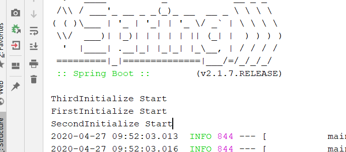
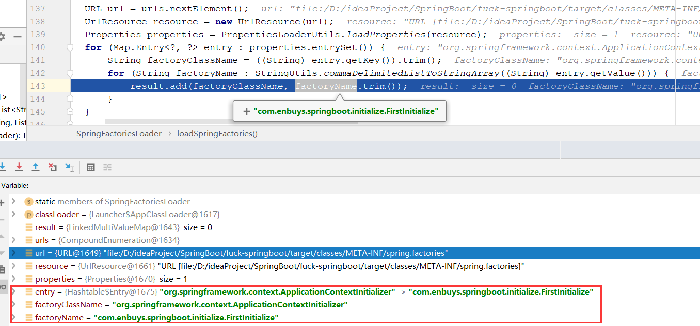
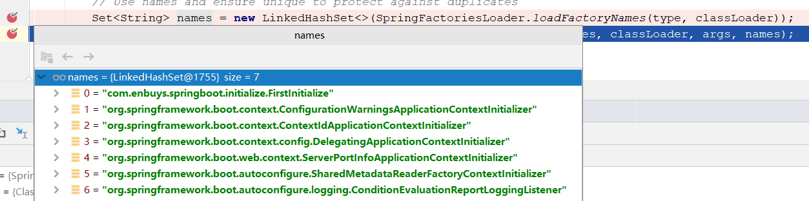
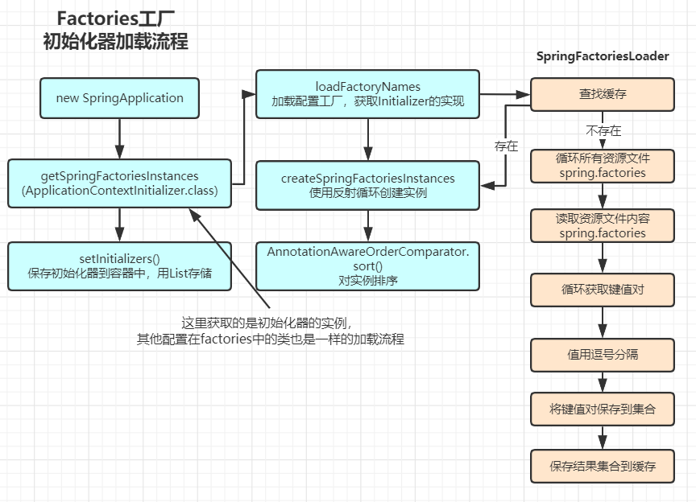
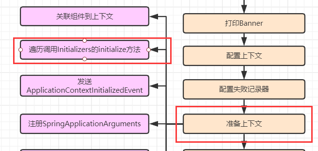

## 系统初始化器介绍

类名：ApplicationContextInitializer

介绍：Spring容器刷新前执行的一个回调函数

作用：Spring容器刷新之前，对容器中注册一些属性

使用：继承接口自定义实现

## 自定义系统初始化器三种方式

### factories添加

一、创建自定义初始化器

```java
@Order(1)
public class FirstInitialize implements ApplicationContextInitializer<ConfigurableApplicationContext> {

    @Override
    public void initialize(ConfigurableApplicationContext applicationContext) {
        ConfigurableEnvironment environment = applicationContext.getEnvironment();

        Map<String,Object> map = new HashMap<>();
        map.put("key1","value1");
        MapPropertySource mapPropertySource = new MapPropertySource("firstInitialize", map);
        environment.getPropertySources().addLast(mapPropertySource);

        System.out.println("FirstInitialize Start");
    }
}
```

二、创建`META-INF/spring.factories`文件

三、配置自定义初始化器

key为：`org.springframework.context.ApplicationContextInitializer`

```properties
org.springframework.context.ApplicationContextInitializer=com.enbuys.springboot.initialize.FirstInitialize
```

### SpringApplication配置

一、创建自定义初始化器

```java
@Order(2)
public class SecondInitialize implements ApplicationContextInitializer<ConfigurableApplicationContext> {

    @Override
    public void initialize(ConfigurableApplicationContext applicationContext) {
        ConfigurableEnvironment environment = applicationContext.getEnvironment();

        Map<String,Object> map = new HashMap<>();
        map.put("key2","value2");
        MapPropertySource mapPropertySource = new MapPropertySource("secondInitialize", map);
        environment.getPropertySources().addLast(mapPropertySource);

        System.out.println("SecondInitialize Start");
    }
}
```

二、在主程序类启动前，添加初始化器

```java
@SpringBootApplication
public class MainApplication {
    public static void main(String[] args) {
//        SpringApplication.run(MainApplication.class,args);
        SpringApplication springApplication = new SpringApplication(MainApplication.class);
        springApplication.addInitializers(new SecondInitialize());
        springApplication.run(args);
    }
}
```

### application.properties中添加

一、创建自定义初始化器

```java
@Order(2)
public class ThirdInitialize implements ApplicationContextInitializer<ConfigurableApplicationContext> {

    @Override
    public void initialize(ConfigurableApplicationContext applicationContext) {
        ConfigurableEnvironment environment = applicationContext.getEnvironment();

        Map<String,Object> map = new HashMap<>();
        map.put("key3","value3");
        MapPropertySource mapPropertySource = new MapPropertySource("thirdInitialize", map);
        environment.getPropertySources().addLast(mapPropertySource);

        System.out.println("ThirdInitialize Start");
    }
}
```

二、创建`application.properties`文件

三、配置自定义初始化器

key为：`context.initializer.classes`

```properties
context.initializer.classes=com.enbuys.springboot.initialize.ThirdInitialize
```



启动后我们会发现，通过application配置的会在前两种之前加载，因为他的加载时间更靠前，为什么会这样，我们后面源码解析再看

## 工厂加载机制流程

通过之前SpringBoot启动流程的了解，我们知道对于系统初始化器是在SpringBoot框架初始化时进行的，所以我们跟着代码Debug看看是如何加载这些初始化器的。

```java
public static ConfigurableApplicationContext run(Class<?>[] primarySources, String[] args) {
    return new SpringApplication(primarySources).run(args);
}

public SpringApplication(Class<?>... primarySources) {
    this(null, primarySources);
}

public SpringApplication(ResourceLoader resourceLoader, Class<?>... primarySources) {
    this.resourceLoader = resourceLoader;
    Assert.notNull(primarySources, "PrimarySources must not be null");
    this.primarySources = new LinkedHashSet<>(Arrays.asList(primarySources));
    this.webApplicationType = WebApplicationType.deduceFromClasspath();
    // 加载ApplicationContextInitializer
    setInitializers((Collection) getSpringFactoriesInstances(ApplicationContextInitializer.class));
    setListeners((Collection) getSpringFactoriesInstances(ApplicationListener.class));
    this.mainApplicationClass = deduceMainApplicationClass();
}
```

通过源码的跟进，我们会发现在初始化SpringBoot时，会使用`setInitializers()`设置`Initializer`，设置前会调用`getSpringFactoriesInstances()`方法获取项目中的工厂实例，所以我们进入`getSpringFactoriesInstances`

```java
private <T> Collection<T> getSpringFactoriesInstances(Class<T> type) {
    // 调用重载方法
    return getSpringFactoriesInstances(type, new Class<?>[] {});
}

private <T> Collection<T> getSpringFactoriesInstances(Class<T> type, Class<?>[] parameterTypes, Object... args) {
    // 创建ClassLoader
    ClassLoader classLoader = getClassLoader();
    // loadFactoryNames获取初始化器集合
    Set<String> names = new LinkedHashSet<>(SpringFactoriesLoader.loadFactoryNames(type, classLoader));
    // 创建初始化器实例
    List<T> instances = createSpringFactoriesInstances(type, parameterTypes, classLoader, args, names);
    // 对初始化器实例排序
    AnnotationAwareOrderComparator.sort(instances);
    // 返回实例集合
    return instances;
}
```

通过源码阅读，我们大致了解分为几个步骤，加载初始化器，创建初始化器，排序，所以我们一步步来看

### 加载工厂配置

```java
public final class SpringFactoriesLoader {
    
    // 默认初始化工厂存放位置
    public static final String FACTORIES_RESOURCE_LOCATION = "META-INF/spring.factories";

    public static List<String> loadFactoryNames(Class<?> factoryClass, @Nullable ClassLoader classLoader) {
        // 获取工厂中key名称，为org.springframework.context.ApplicationContextInitializer
        String factoryClassName = factoryClass.getName();
        // 加载工厂，返回ApplicationContextInitializer的值
        return loadSpringFactories(classLoader).getOrDefault(factoryClassName, Collections.emptyList());
    }

    private static Map<String, List<String>> loadSpringFactories(@Nullable ClassLoader classLoader) {
        // 先从缓存中找
        MultiValueMap<String, String> result = cache.get(classLoader);
        if (result != null) {
            return result;
        }

        try {
            // 使用类加载器加载所有名字叫spring.factories的配置文件
            Enumeration<URL> urls = (classLoader != null ?
                                     classLoader.getResources(FACTORIES_RESOURCE_LOCATION) :
                                     ClassLoader.getSystemResources(FACTORIES_RESOURCE_LOCATION));
            result = new LinkedMultiValueMap<>();
            // 循环这些配置文件
            while (urls.hasMoreElements()) {
                // 获取单个，target/classes/META-INF/spring.factories
                URL url = urls.nextElement();
                UrlResource resource = new UrlResource(url);
                // 加载配置文件，将内容使用Properties保存
                Properties properties = PropertiesLoaderUtils.loadProperties(resource);
                // 循环Properties
                for (Map.Entry<?, ?> entry : properties.entrySet()) {
                    // 获取键
                    String factoryClassName = ((String) entry.getKey()).trim();
                    // 将值使用逗号分隔，然后循环
                    for (String factoryName : StringUtils.commaDelimitedListToStringArray((String) entry.getValue())) {
                        // 向集合中添加键值对
                        result.add(factoryClassName, factoryName.trim());
                    }
                }
            }
            // 保存缓存
            cache.put(classLoader, result);
            // 返回
            return result;
        }
        catch (IOException ex) {
            throw new IllegalArgumentException("Unable to load factories from location [" +
                                               FACTORIES_RESOURCE_LOCATION + "]", ex);
        }
    }
}
```



经历过加载后，会返回所以`spring.factories`中key为`ApplicationContextInitializer`的值（全限定类名）



### 创建初始化器

```java
private <T> List<T> createSpringFactoriesInstances(Class<T> type, Class<?>[] parameterTypes,
      ClassLoader classLoader, Object[] args, Set<String> names) {
    // 创建结果保存集合
   List<T> instances = new ArrayList<>(names.size());
    // 循环初始化器的全限定类名
   for (String name : names) {
      try {
          // 使用反射创建实例
         Class<?> instanceClass = ClassUtils.forName(name, classLoader);
         Assert.isAssignable(type, instanceClass);
         Constructor<?> constructor = instanceClass.getDeclaredConstructor(parameterTypes);
         T instance = (T) BeanUtils.instantiateClass(constructor, args);
          // 保存到结果集合
         instances.add(instance);
      }
      catch (Throwable ex) {
         throw new IllegalArgumentException("Cannot instantiate " + type + " : " + name, ex);
      }
   }
    // 返回实例
   return instances;
}
```

创建相对简单，就是根据全限定类名通过反射创建实例，保存返回

然后就是排序了，排序相对简单，这里就不看了。

排序完就会回到`setInitializers()`方法中

```java
public void setInitializers(Collection<? extends ApplicationContextInitializer<?>> initializers) {
   this.initializers = new ArrayList<>();
   this.initializers.addAll(initializers);
}
```

这里就是将实例加载到容器中，用List集合保存初始化器们

### 总结工厂加载流程



## 其他两种方式加载流程

我们刚刚了解了工厂加载初始化器的流程，下面看下其他两种方式，对于第一种来说，其他两种相对简单

### SpringApplication配置

对于这种方式，我们是先实例化出来SpringApplication后，才进行`addInitializers()`的

```java
public void addInitializers(ApplicationContextInitializer<?>... initializers) {
    this.initializers.addAll(Arrays.asList(initializers));
}
```

直接向容器中的初始化集合添加初始化器

### 环境变量配置

环境变量的配置比较特殊，他是在`DelegatingApplicationContextInitializer`中进行加载的，我们直接取看下源码

```java
public class DelegatingApplicationContextInitializer
    implements ApplicationContextInitializer<ConfigurableApplicationContext>, Ordered {

    // NOTE: Similar to org.springframework.web.context.ContextLoader

    private static final String PROPERTY_NAME = "context.initializer.classes";

    // 优先级最高
    private int order = 0;
    
    @Override
    public void initialize(ConfigurableApplicationContext context) {
        // 获取环境
        ConfigurableEnvironment environment = context.getEnvironment();
        // 获取环境配置的初始化器
        List<Class<?>> initializerClasses = getInitializerClasses(environment);
        if (!initializerClasses.isEmpty()) {
            // 不为空，调用这些初始化器的回调方法
            applyInitializerClasses(context, initializerClasses);
        }
    }
    
    // 获取环境配置的初始化器
    private List<Class<?>> getInitializerClasses(ConfigurableEnvironment env) {
        // 获取环境配置 PROPERTY_NAME = "context.initializer.classes" 的值
        String classNames = env.getProperty(PROPERTY_NAME);
        List<Class<?>> classes = new ArrayList<>();
        if (StringUtils.hasLength(classNames)) {
            // 将值的逗号分隔，循环这些值
            for (String className : StringUtils.tokenizeToStringArray(classNames, ",")) {
                // 创建实例，添加到集合中
                classes.add(getInitializerClass(className));
            }
        }
        return classes;
    }
    
    // 向下调用初始化器的回调方法
    private void applyInitializerClasses(ConfigurableApplicationContext context, List<Class<?>> initializerClasses) {
        Class<?> contextClass = context.getClass();
        List<ApplicationContextInitializer<?>> initializers = new ArrayList<>();
        for (Class<?> initializerClass : initializerClasses) {
            initializers.add(instantiateInitializer(contextClass, initializerClass));
        }
        applyInitializers(context, initializers);
    }
    
    @SuppressWarnings({ "unchecked", "rawtypes" })
    private void applyInitializers(ConfigurableApplicationContext context,
                                   List<ApplicationContextInitializer<?>> initializers) {
        // 排序
        initializers.sort(new AnnotationAwareOrderComparator());
        // 循环调用初始化器的initialize方法
        for (ApplicationContextInitializer initializer : initializers) {
            initializer.initialize(context);
        }
    }
}
```

`DelegatingApplicationContextInitializer`是SpringBoot自定义的初始化器，和我们定义的初始化器一样，只不过它的**优先级最高，为0**，所以当**工厂加载后**，会将此类排在最高

1. 再调用初始化回调方法时，便会调用此类的`initialize`方法

2. 然后它会加载环境配置文件中的初始化器，并直接调用其初始化方法

这也是为什么我们配置第三种初始化器时，明明order靠后，缺第一个执行的原因。

## 初始化回调方法调用

刚刚看完了三种初始化器加载方式，接着我们看看它是如何被调用的



之前看SpringBoot流程时，知道对于初始化器调用是在准备上下文中进行的，所以我们跟着代码查看

```java
private void prepareContext(ConfigurableApplicationContext context, ConfigurableEnvironment environment,
                            SpringApplicationRunListeners listeners, ApplicationArguments applicationArguments, Banner printedBanner) {
    context.setEnvironment(environment);
    postProcessApplicationContext(context);
    // 调用初始化方法
    applyInitializers(context);
    //···
}

@SuppressWarnings({ "rawtypes", "unchecked" })
protected void applyInitializers(ConfigurableApplicationContext context) {
    // 循环容器中的ApplicationContextInitializer对象（之前加载好的）
    for (ApplicationContextInitializer initializer : getInitializers()) {
      Class<?> requiredType = GenericTypeResolver.resolveTypeArgument(initializer.getClass(),
ApplicationContextInitializer.class);
        // 这里会判断初始化器的泛型，是否instanceOf ConfigurableApplicationContext
        Assert.isInstanceOf(requiredType, context, "Unable to call initializer.");
        // 如果是，调用初始化方法
        initializer.initialize(context);
    }
}
```

run() ——》 prepareContext() ——》 applyInitializers() ——》 循环initialize()

## 初始化器总结

- 定义在spring.factories中的，在SpringBoot初始化时加载，被SpringFactoriesLoader加载
- SpringApplication配置的，在SpringBoot初始化后添加到容器中
- 环境变量的，在SpringBoot.run()启动时被`DelegatingApplicationContextInitializer`加载调用