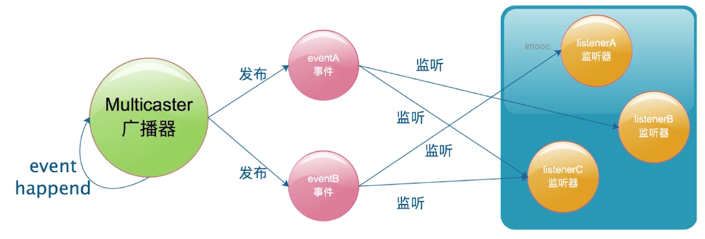
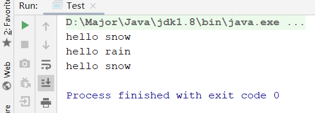
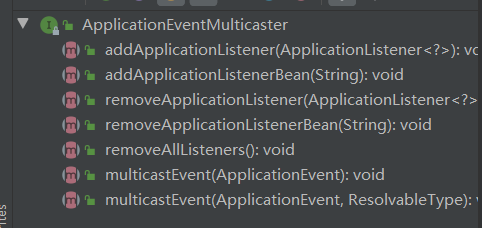
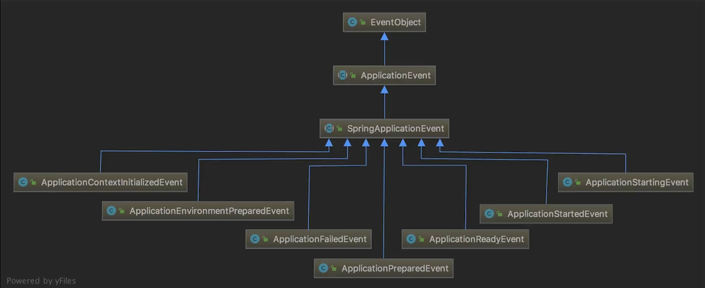
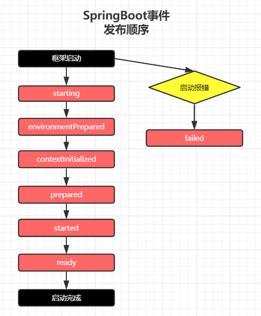
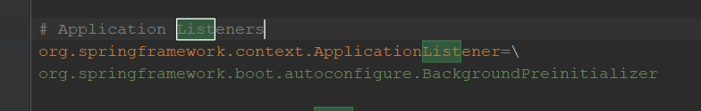
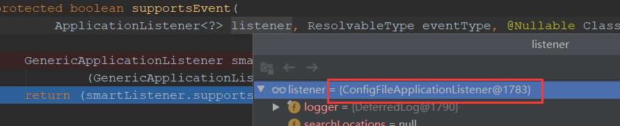
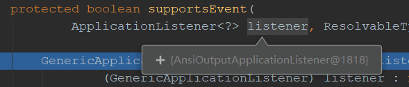
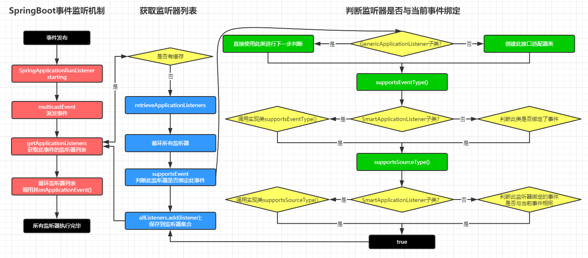
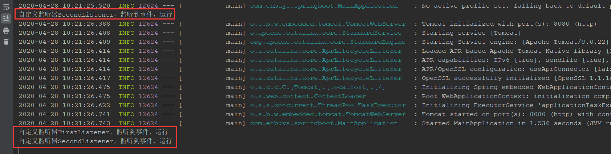

## SpringBoot的事件监听机制



SpringBoot中使用了大量的事件监听机制，就比如`ApplicationStartingEvent`应用启动事件，`ApplicationStartedEvent`应用启动完毕事件等，当这些事件发布后，会有对应的监听器根据事件类型做出不同处理

我们这节，就是介绍SpringBoot中的事件，广播，监听器之间的关系，做了哪些事

## 自定义监听器设计模式

为了加深监听器模式的理解，我们手写一个监听器模式

### 事件

```java
public abstract class WeatherEvent {
    public abstract String getWeather();
}

public class SnowEvent extends WeatherEvent {
    @Override
    public String getWeather() {
        return "snow";
    }
}

public class RainEvent extends WeatherEvent {
    @Override
    public String getWeather() {
        return "rain";
    }
}
```

### 监听器

```java
public interface WeatherListener {
    void onWeatherEvent(WeatherEvent event);
}

public class SnowListener implements WeatherListener {
    @Override
    public void onWeatherEvent(WeatherEvent event) {
        if (event instanceof SnowEvent) {
            System.out.println("hello " + event.getWeather());
        }
    }
}

public class RainListener implements WeatherListener {
    @Override
    public void onWeatherEvent(WeatherEvent event) {
        if (event instanceof RainEvent) {
            System.out.println("hello " + event.getWeather());
        }
    }
}
```

### 广播器

```java
public interface EventMulticaster {

    void multicastEvent(WeatherEvent event); // 发布事件

    void addListener(WeatherListener weatherListener); // 添加监听器

    void removeListener(WeatherListener weatherListener); // 删除监听器

}

public class WeatherEventMulticaster implements EventMulticaster {

    private List<WeatherListener> listenerList = new ArrayList<>();

    @Override
    public void multicastEvent(WeatherEvent event) {
        // 发布事件时，调用所有监听器中的方法
        listenerList.forEach(i -> i.onWeatherEvent(event));
    }

    @Override
    public void addListener(WeatherListener weatherListener) {
        listenerList.add(weatherListener);
    }

    @Override
    public void removeListener(WeatherListener weatherListener) {
        listenerList.remove(weatherListener);
    }
}
```

### 测试发布事件

```java
public class Test {
    public static void main(String[] args) {
        // 事件广播器
        WeatherEventMulticaster eventMulticaster = new WeatherEventMulticaster();
        // 创建事件监听器
        RainListener rainListener = new RainListener();
        SnowListener snowListener = new SnowListener();

        // 添加监听器
        eventMulticaster.addListener(rainListener);
        eventMulticaster.addListener(snowListener);

        // 发布事件
        eventMulticaster.multicastEvent(new SnowEvent());
        eventMulticaster.multicastEvent(new RainEvent());
        eventMulticaster.removeListener(rainListener);
        eventMulticaster.multicastEvent(new SnowEvent());
        eventMulticaster.multicastEvent(new RainEvent());
    }
}
```



这样当事件发布后，对应的监听器就会执行响应的方法

监听模式主要有四个要素组成：监听器，广播器，事件，事件触发机制，所以我们接下来就看看SpringBoot中这四要素是如何实现，关联的

## SpringBoot中的监听器模式

### SpringBoot监听器

SpringBoot的监听器接口为`ApplicationListener`

```java
// JDK8后新加的注释，标明此类只能又一个方法
@FunctionalInterface 
// 继承EventListener，这是个空类，继承此类主要表示这个类或接口是监听器设计模式的一员
// 可以通过泛型，来绑定事件，通过这里可以发现，SpringBoot的事件接口为ApplicationEvent
public interface ApplicationListener<E extends ApplicationEvent> extends EventListener {

   /**
    * Handle an application event.
    * @param event the event to respond to
    * 事件发生后，监听器执行的方法
    */
   void onApplicationEvent(E event);

}
```

虽然接口代码很少，但是可以了解很多东西

### SpringBoot广播器

SpringBoot广播器接口为`ApplicationEventMulticaster`



它的主要方法和我们之前实现的差不多，主要有三个

- 添加监听器
- 删除监听器
- 发布事件

### SpringBoot事件



事件的结构图如上图，主要的事件有：

- `ApplicationStartingEvent`：应用启动事件
- `ApplicationEnvironmentPreparedEvent`：应用环境准备完毕事件
- `ApplicationContextInitializedEvent`：应用上下文初始化完毕事件，Bean还没有加载
- `ApplicationPreparedEvent`：应用准备完毕事件，Bean正在加载，但还没有完全加载完毕
- `ApplicationStartedEvent`：应用启动完毕事件，Bean加载完毕，但还没有调用ApplicationRunner
- `ApplicationReadyEvent`：应用准备完毕事件，ApplicationRunner调用完毕后发布
- `ApplicationFailedEvent`：应用启动失败事件

### 事件发送顺序



### 监听器加载机制

监听器的加载机制其实是和上一章初始化器一模一样的，我们可以看下代码

```java
public SpringApplication(ResourceLoader resourceLoader, Class<?>... primarySources) {
    this.resourceLoader = resourceLoader;
    Assert.notNull(primarySources, "PrimarySources must not be null");
    this.primarySources = new LinkedHashSet<>(Arrays.asList(primarySources));
    this.webApplicationType = WebApplicationType.deduceFromClasspath();
    setInitializers((Collection) getSpringFactoriesInstances(ApplicationContextInitializer.class));
    // 加载监听器
    setListeners((Collection) getSpringFactoriesInstances(ApplicationListener.class));
    this.mainApplicationClass = deduceMainApplicationClass();
}
```

在SpringBoot初始化时进行调用，这里我们会发现，他`getSpringFactoriesInstances()`方法和初始化器一模一样，只不过传入的参数为`ApplicationListener`，所以当获取`factories`中的配置时，会获取`key`为`org.springframework.context.ApplicationListener`的值，对其反射创建对象存到容器中，比如下面这个：



## 监听器模式源码解析

我们跟着源码，看看事件发布时，监听器是如何工作的

直接从源码开始，对于监听器与事件绑定判断较为复杂，做好心理准备

```java
public ConfigurableApplicationContext run(String... args) {
    StopWatch stopWatch = new StopWatch();
    stopWatch.start();
    ConfigurableApplicationContext context = null;
    Collection<SpringBootExceptionReporter> exceptionReporters = new ArrayList<>();
    configureHeadlessProperty();
    SpringApplicationRunListeners listeners = getRunListeners(args);
    // 发布starting事件
    listeners.starting();
    // ···
}
```

直接从`run`方法开始，因为事件很多，其实大同小异，所以我们只看`starting`事件

```java
class SpringApplicationRunListeners {

    private final List<SpringApplicationRunListener> listeners;

    public void starting() {
        // 循环所有SpringApplicationRunListener，调用starting方法
        for (SpringApplicationRunListener listener : this.listeners) {
            listener.starting();
        }
    }

    public void environmentPrepared(ConfigurableEnvironment environment) {
        for (SpringApplicationRunListener listener : this.listeners) {
            listener.environmentPrepared(environment);
        }
    }
    //···
}

public class EventPublishingRunListener implements SpringApplicationRunListener, Ordered {
    @Override
    public void starting() {
        // 创建一个Starting事件，发布出去
        this.initialMulticaster.multicastEvent(new ApplicationStartingEvent(this.application, this.args));
    }
}
```

这里主要是调用广播器，来发布事件

```java
public class SimpleApplicationEventMulticaster extends AbstractApplicationEventMulticaster {
    @Override
    public void multicastEvent(ApplicationEvent event) {
        // 调用重载方法
        multicastEvent(event, resolveDefaultEventType(event));
    }

    @Override
    // 发布事件
    public void multicastEvent(final ApplicationEvent event, @Nullable ResolvableType eventType) {
        // 判断事件的类型 org.springframework.boot.context.event.ApplicationStartingEvent
        ResolvableType type = (eventType != null ? eventType : resolveDefaultEventType(event));
        // 获取执行器，目的是多线程执行，这里为空，所以下面会同步执行
        Executor executor = getTaskExecutor();
        // 重点方法getApplicationListeners，获取该事件绑定的所有监听器
        for (ApplicationListener<?> listener : getApplicationListeners(event, type)) {
            if (executor != null) {
                executor.execute(() -> invokeListener(listener, event));
            }
            else {
                invokeListener(listener, event);
            }
        }
    }
}
```

### 开始获取事件对应的监听器列表

发布事件时，就来到了重点方法`getApplicationListeners()`，通过计算获取所有该事件的监听器们

```java
protected Collection<ApplicationListener<?>> getApplicationListeners(
    ApplicationEvent event, ResolvableType eventType) {
	// 主要是获取SpringApplication
    Object source = event.getSource();
    Class<?> sourceType = (source != null ? source.getClass() : null);
    // 创建缓存
    ListenerCacheKey cacheKey = new ListenerCacheKey(eventType, sourceType);

    // 判断缓存是否存在已经找到的监听器列表
    ListenerRetriever retriever = this.retrieverCache.get(cacheKey);
    // 存在直接返回
    if (retriever != null) {
        return retriever.getApplicationListeners();
    }
	// 不存在，进行寻找
    if (this.beanClassLoader == null ||
        (ClassUtils.isCacheSafe(event.getClass(), this.beanClassLoader) &&
         (sourceType == null || ClassUtils.isCacheSafe(sourceType, this.beanClassLoader)))) {
        // Fully synchronized building and caching of a ListenerRetriever
        synchronized (this.retrievalMutex) {
            // 再次获取
            retriever = this.retrieverCache.get(cacheKey);
            if (retriever != null) {
                return retriever.getApplicationListeners();
            }
            retriever = new ListenerRetriever(true);
            // 重点方法，retrieveApplicationListeners()获取监听器
            Collection<ApplicationListener<?>> listeners =
                retrieveApplicationListeners(eventType, sourceType, retriever);
            // 将监听器列表保存到缓存中
            this.retrieverCache.put(cacheKey, retriever);
            return listeners;
        }
    }
    else {
        // No ListenerRetriever caching -> no synchronization necessary
        return retrieveApplicationListeners(eventType, sourceType, null);
    }
}
```

继续进入重点方法`retrieveApplicationListeners()`获取监听器

```java
private Collection<ApplicationListener<?>> retrieveApplicationListeners(
    ResolvableType eventType, @Nullable Class<?> sourceType, @Nullable ListenerRetriever retriever) {
	// 创建集合用来保存监听器
    List<ApplicationListener<?>> allListeners = new ArrayList<>();
    // 防止重复
    Set<ApplicationListener<?>> listeners;
    Set<String> listenerBeans;
    // 初始化，获取factories中配置的所有默认监听器，用来在之后进行计算
    synchronized (this.retrievalMutex) {
        listeners = new LinkedHashSet<>(this.defaultRetriever.applicationListeners);
        listenerBeans = new LinkedHashSet<>(this.defaultRetriever.applicationListenerBeans);
    }
    // 循环监听器查询
    for (ApplicationListener<?> listener : listeners) {
        // 关键方法supportsEvent()，寻找该监听器是否绑定此事件
        if (supportsEvent(listener, eventType, sourceType)) {
            if (retriever != null) {
                retriever.applicationListeners.add(listener);
            }
            // 如果该监听器绑定此事件，添加到集合中
            allListeners.add(listener);
        }
    }
    // ··· 关于ListenerBeans的，不需要关注
    
    // 对监听器列表排序
    AnnotationAwareOrderComparator.sort(allListeners);
    if (retriever != null && retriever.applicationListenerBeans.isEmpty()) {
        retriever.applicationListeners.clear();
        retriever.applicationListeners.addAll(allListeners);
    }
    // 返回集合
    return allListeners;
}
```

### supportsEvent实际判断监听器与事件的方法

继续进入`supportsEvent()`，判断此监听器，是否对当前事件感兴趣

```java
protected boolean supportsEvent(
    ApplicationListener<?> listener, ResolvableType eventType, @Nullable Class<?> sourceType) {

    // 判断此监听器，是否为GenericApplicationListener的子类
    // 如果是，直接赋值
    // 如果不是，则创建GenericApplicationListenerAdapter，Adapter适配器类
    GenericApplicationListener smartListener = (listener instanceof GenericApplicationListener ?
                                                (GenericApplicationListener) listener : new GenericApplicationListenerAdapter(listener));
    return (smartListener.supportsEventType(eventType) && smartListener.supportsSourceType(sourceType));
}
```

我们一行行看，这里会判断此监听器类型，打断点调试：



当前类为`ConfigFileApplicationListener`，

```java
public class ConfigFileApplicationListener implements EnvironmentPostProcessor, SmartApplicationListener, Ordered {
}
public interface SmartApplicationListener extends ApplicationListener<ApplicationEvent>, Ordered {
}
```

这里可以发现它没有直接绑定感兴趣的事件，而是实现了`SmartApplicationListener`接口，此接口绑定事件为`ApplicationEvent`总接口，这里是因为此接口有一个`supportsEventType()`方法，在此方法内部会写死具体实现类绑定的事件，后面会看到。

他不是`GenericApplicationListener`的子类，所以会调用第二个方法，创建适配器

```java
public GenericApplicationListenerAdapter(ApplicationListener<?> delegate) {
    Assert.notNull(delegate, "Delegate listener must not be null");
    this.delegate = (ApplicationListener<ApplicationEvent>) delegate;
    // 获取其感兴趣的事件
    this.declaredEventType = resolveDeclaredEventType(this.delegate);
}

@Nullable
private static ResolvableType resolveDeclaredEventType(ApplicationListener<ApplicationEvent> listener) {
    ResolvableType declaredEventType = resolveDeclaredEventType(listener.getClass());
    if (declaredEventType == null || declaredEventType.isAssignableFrom(ApplicationEvent.class)) {
        Class<?> targetClass = AopUtils.getTargetClass(listener);
        if (targetClass != listener.getClass()) {
            declaredEventType = resolveDeclaredEventType(targetClass);
        }
    }
    return declaredEventType;
}
```

然后我们回到`supportsEvent()`方法

```java
protected boolean supportsEvent(
    ApplicationListener<?> listener, ResolvableType eventType, @Nullable Class<?> sourceType) {

    // 判断此监听器，是否为GenericApplicationListener的子类
    // 如果是，直接赋值
    // 如果不是，则创建GenericApplicationListenerAdapter，Adapter适配器类
    GenericApplicationListener smartListener = (listener instanceof GenericApplicationListener ?
                                                (GenericApplicationListener) listener : new GenericApplicationListenerAdapter(listener));
    // 一、判断此类是否为SmartApplicationListener子类，如果是调用该监听器的supportsEventType，如果不是判断是否绑定事件
    // 二、判断此类是否为SmartApplicationListener子类，如果是调用该监听器的supportsSourceType，如果不是判断是绑定事件是否和当前事件相同
    return (smartListener.supportsEventType(eventType) && smartListener.supportsSourceType(sourceType));
}
```

我们首先看第一个判断，这里会判断此监听器是否实现`SmartApplicationListener`，如果实现直接调用实际监听器的`supportsEventType()`方法，因为我们直接看到了他是实现的，所以我们需要进入`ConfigFileApplicationListener`查看

```java
@Override
@SuppressWarnings("unchecked")
public boolean supportsEventType(ResolvableType eventType) {
    // 判断监听器是否实现SmartApplicationListener接口
    if (this.delegate instanceof SmartApplicationListener) {
        Class<? extends ApplicationEvent> eventClass = (Class<? extends ApplicationEvent>) eventType.resolve();
        // 调用实际监听器中的supportsEventType方法
        return (eventClass != null && ((SmartApplicationListener) this.delegate).supportsEventType(eventClass));
    }
    else {
        // 判断此监听器是否绑定事件，如果绑定了返回true
        return (this.declaredEventType == null || this.declaredEventType.isAssignableFrom(eventType));
    }
}

@Override
public boolean supportsEventType(Class<? extends ApplicationEvent> eventType) {
   return ApplicationEnvironmentPreparedEvent.class.isAssignableFrom(eventType)
         || ApplicationPreparedEvent.class.isAssignableFrom(eventType);
}
```

`ConfigFileApplicationListener`感兴趣的是`ApplicationEnvironmentPreparedEvent`事件，但是当前是`Starting`事件，所以返回`false`了。

我们继续看第二个监听器



```java
public class AnsiOutputApplicationListener
      implements ApplicationListener<ApplicationEnvironmentPreparedEvent>, Ordered {
```

它不是`SmartApplicationListener`子类，并且绑定`ApplicationEnvironmentPreparedEvent`事件

有了之前的经验我们先进入第一个判断

```java
@Override
@SuppressWarnings("unchecked")
public boolean supportsEventType(ResolvableType eventType) {
    // 判断监听器是否实现SmartApplicationListener接口
    if (this.delegate instanceof SmartApplicationListener) {
        Class<? extends ApplicationEvent> eventClass = (Class<? extends ApplicationEvent>) eventType.resolve();
        // 调用实际监听器中的supportsEventType方法
        return (eventClass != null && ((SmartApplicationListener) this.delegate).supportsEventType(eventClass));
    }
    else {
        // 判断此监听器是否绑定事件，如果绑定了返回true
        return (this.declaredEventType == null || this.declaredEventType.isAssignableFrom(eventType));
    }
}
```

因为它不是`SmartApplicationListener`子类，并且绑定了事件，所以这里会返回true，进入第二个判断

```java
smartListener.supportsSourceType(sourceType));
```

```java
@Override
public boolean supportsSourceType(@Nullable Class<?> sourceType) {
    // 判断是否为SmartApplicationListener子类
    // 如果是，调用supportsSourceType方法
    // 如果不是，则判断该事件是否与当前监听器绑定
   return !(this.delegate instanceof SmartApplicationListener) ||
         ((SmartApplicationListener) this.delegate).supportsSourceType(sourceType);
}
```

因为他不是`SmartApplicationListener`的子类，所以会判断当前事件是否与该监听器绑定的一致，因为其绑定的`ApplicationEnvironmentPreparedEvent`与当前`Starting`事件不符，所以也会返回`false`。

所以，到此我们就大概了解了SpringBoot内部是如何获取一个事件的监听器列表的。之后会将其总结为流程图，更好的理解。

### 调用监听器

获取到监听器列表后，我们就可以回到发布事件的地方，看看如何被调用的

```java
public class SimpleApplicationEventMulticaster extends AbstractApplicationEventMulticaster {
    @Override
    public void multicastEvent(ApplicationEvent event) {
        // 调用重载方法
        multicastEvent(event, resolveDefaultEventType(event));
    }

    @Override
    // 发布事件
    public void multicastEvent(final ApplicationEvent event, @Nullable ResolvableType eventType) {
        // 判断事件的类型 org.springframework.boot.context.event.ApplicationStartingEvent
        ResolvableType type = (eventType != null ? eventType : resolveDefaultEventType(event));
        // 获取执行器，目的是多线程执行，这里为空，所以下面会同步执行
        Executor executor = getTaskExecutor();
        // 重点方法getApplicationListeners，获取该事件绑定的所有监听器
        for (ApplicationListener<?> listener : getApplicationListeners(event, type)) {
            if (executor != null) {
                // 不为null，多线程异步调用
                executor.execute(() -> invokeListener(listener, event));
            }
            else {
                // 为null，同步调用监听器
                invokeListener(listener, event);
            }
        }
    }
}
```

获取完所有该事件绑定的监听器后，就开始了循环执行监听器

```java
protected void invokeListener(ApplicationListener<?> listener, ApplicationEvent event) {
    ErrorHandler errorHandler = getErrorHandler();
    if (errorHandler != null) {
        try {
            doInvokeListener(listener, event);
        }
        catch (Throwable err) {
            errorHandler.handleError(err);
        }
    }
    else {
        doInvokeListener(listener, event);
    }
}

private void doInvokeListener(ApplicationListener listener, ApplicationEvent event) {
    try {
        listener.onApplicationEvent(event);
    }
    catch (ClassCastException ex) {
      // ··· 异常处理
    }
}
```

就会调用监听器内部的`onApplicationEvent()`方法了，到此监听器的源码解析大致结束了

### SpringBoot监听器流程总结



## 自定义监听器实现

向SpringBoot中添加自定义监听器，其实和之前自定义初始化器有着一样的三种注册方式，这里我们演示最经典的一种，也就是配置在`spring.fatories`工厂的方式：

实现自定义监听器时，有两种实现方式

- 实现`ApplicationListener<T extends ApplicationEvent>`
- 实现`SmartApplicationListener`，通过重写方法进行事件绑定

### 创建自定义监听器

```java
@Order(1)
public class FirstListener implements ApplicationListener<ApplicationStartedEvent> {
    @Override
    public void onApplicationEvent(ApplicationStartedEvent event) {
        System.out.println("自定义监听器FirstListener，监听到事件，运行");
    }
}

@Order(2)
public class SecondListener implements SmartApplicationListener {

    @Override
    public boolean supportsEventType(Class<? extends ApplicationEvent> eventType) {
        return ApplicationPreparedEvent.class.isAssignableFrom(eventType) ||
            ApplicationStartedEvent.class.isAssignableFrom(eventType);
    }

    @Override
    public void onApplicationEvent(ApplicationEvent event) {
        System.out.println("自定义监听器SecondListener，监听到事件，运行");
    }
}
```

### 注册自定义监听器

这里注册在`spring.factories`中

```properties
#org.springframework.context.ApplicationContextInitializer=com.enbuys.springboot.initialize.FirstInitialize
org.springframework.context.ApplicationListener=com.enbuys.springboot.listener.FirstListener,\
  com.enbuys.springboot.listener.SecondListener
```



运行时会发现，因为第二个监听器实现SmartApplicationListener，配置绑定了两个事件，所以运行了两次

### 总结

- 自定义实现监听器有三种注册方式
  - `spring.factories`
  - `application.properties`
  - `SpringApplication.addListeners()`
- 有两种实现方式
  - `ApplicationListener<Event>`：在泛型中绑定事件，**只能绑定一种事件**
  - `SmartApplicationListener#supportsEventType()`：在方法中绑定事件，**可以绑定多个事件**
- 使用Order排序，值越小优先级越高
- 配置在`application.properties`中的优先执行