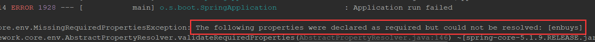
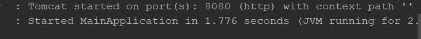
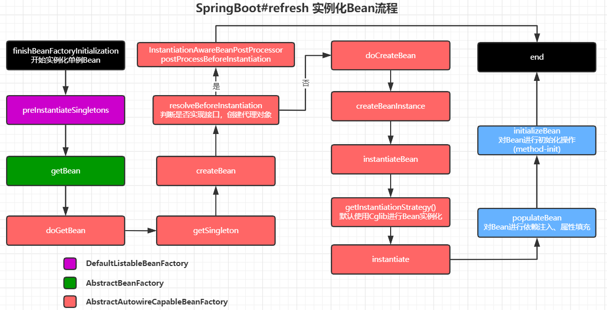

## 攻坚refresh()方法

这个方法其实是Spring提供的方法，SpringBoot直接拿来用了，用于解析Bean，将Bean实例化放到容器中

```java
@Override
public void refresh() throws BeansException, IllegalStateException {
    synchronized (this.startupShutdownMonitor) {
        // 初始化准备工作
        prepareRefresh();

        // 获取BeanFactory，默认为DefaultListableBeanFactory
        ConfigurableListableBeanFactory beanFactory = obtainFreshBeanFactory();

        // 准备BeanFactory，设置属性，添加组件，添加后置处理器
        prepareBeanFactory(beanFactory);

        try {
            // BeanFactory完成创建后的一些操作，由子类实现
            // 比如web环境下，就会设置一些request，session域
            postProcessBeanFactory(beanFactory);

            // 执行BeanFactory的后置处理器，添加Bean的定义与属性
            invokeBeanFactoryPostProcessors(beanFactory);

            // 注册Bean的后置处理器，注意没有执行
            // 需要在Bean创建后执行
            registerBeanPostProcessors(beanFactory);

            // 初始化国际化相关配置
            initMessageSource();

            // 初始化事件广播器
            initApplicationEventMulticaster();

            // 刷新，由子类实现
            // 对于Web来说，会创建一个web容器即Tomcat
            onRefresh();

            // 向事件广播器注册监听器
            registerListeners();

            // 对剩下的单例Bean进行实例化
            finishBeanFactoryInitialization(beanFactory);

            // 完成刷新，清缓存，发布事件
            finishRefresh();
        }
        catch (BeansException ex) {
            // ···
        }
        finally {
            // 清缓存
            resetCommonCaches();
        }
    }
}
```

该方法主要有13个子方法，一个个查看

### prepareRefresh()

该方法主要是进行一些初始化准备工作

```java
protected void prepareRefresh() {
    // 将上下文设置开启状态
    this.startupDate = System.currentTimeMillis();
    this.closed.set(false);
    this.active.set(true);

    // 日志打印

    // 如果是web应用，加载servletContext和ServletConfig到容器中
    initPropertySources();

    // 校验环境中必备属性是否存在，后面会代码讲解什么是必备属性
    getEnvironment().validateRequiredProperties();

    // 系统监听器的注册加载，上一章节已经详细研究过了
    if (this.earlyApplicationListeners == null) {
        this.earlyApplicationListeners = new LinkedHashSet<>(this.applicationListeners);
    }
    else {
        this.applicationListeners.clear();
        this.applicationListeners.addAll(this.earlyApplicationListeners);
    }

    // 初始化earlyApplicationEvents属性
    this.earlyApplicationEvents = new LinkedHashSet<>();
}

@Override
protected void initPropertySources() {
    ConfigurableEnvironment env = getEnvironment();
    if (env instanceof ConfigurableWebEnvironment) {
        ((ConfigurableWebEnvironment) env).initPropertySources(this.servletContext, this.servletConfig);
    }
}
```

总结：

- 容器状态设置（Active）
- 检查必备属性是否存在
- 初始化属性设置（监听器）

什么是必备属性

在学习系统初始化器时，我们说到可以用初始化器进行一些环境设置，在这里就可以进行必备属性的设置

```java
@Order(1)
public class FirstInitialize implements ApplicationContextInitializer<ConfigurableApplicationContext> {

    @Override
    public void initialize(ConfigurableApplicationContext applicationContext) {
        ConfigurableEnvironment environment = applicationContext.getEnvironment();

        // 设置必备属性
        environment.setRequiredProperties("enbuys");

        /*Map<String,Object> map = new HashMap<>();
        map.put("key1","value1");
        MapPropertySource mapPropertySource = new MapPropertySource("firstInitialize", map);
        environment.getPropertySources().addLast(mapPropertySource);*/

        System.out.println("FirstInitialize Start");
    }
}
```

这里设置完必备属性后启动



会发现启动报错，提示有必备属性没有设置，所以我们需要在环境配置，也就是`application.properties`中配置此属性，才能正常启动，这也是必备属性检查的意思

```properties
#context.initializer.classes=com.enbuys.springboot.initialize.ThirdInitialize
enbuys=test
```



配置完成后正常启动

### obtainFreshBeanFactory()

这个方法相对简单，就是获取BeanFactory

```java
protected ConfigurableListableBeanFactory obtainFreshBeanFactory() {
    refreshBeanFactory();
    return getBeanFactory();
}

@Override
protected final void refreshBeanFactory() throws IllegalStateException {
    // 对refreshed属性设置，表示现在在刷新
    if (!this.refreshed.compareAndSet(false, true)) {
        throw new IllegalStateException(
            "GenericApplicationContext does not support multiple refresh attempts: just call 'refresh' once");
    }
    // 为BeanFactory设置序列化id
    this.beanFactory.setSerializationId(getId());
}

@Override
public final ConfigurableListableBeanFactory getBeanFactory() {
    // 返回一个默认的BeanFactory，为DefaultListableBeanFactory
    return this.beanFactory;
}
```

总结：

- 定义BeanFactory的序列化ID
- 获取一个默认的BeanFactory，为`DefaultListableBeanFactory`

### prepareBeanFactory(beanFactory)

```java
protected void prepareBeanFactory(ConfigurableListableBeanFactory beanFactory) {
    // 设置ClassLoader等一些属性
    beanFactory.setBeanClassLoader(getClassLoader());
    beanFactory.setBeanExpressionResolver(new StandardBeanExpressionResolver(beanFactory.getBeanClassLoader()));
    beanFactory.addPropertyEditorRegistrar(new ResourceEditorRegistrar(this, getEnvironment()));

    // 添加后置处理器，并忽略Aware
    // 这里为什么时候后置处理器，把Aware移除，我们在下一个方法研究
    beanFactory.addBeanPostProcessor(new ApplicationContextAwareProcessor(this));
    beanFactory.ignoreDependencyInterface(EnvironmentAware.class);
    beanFactory.ignoreDependencyInterface(EmbeddedValueResolverAware.class);
    beanFactory.ignoreDependencyInterface(ResourceLoaderAware.class);
    beanFactory.ignoreDependencyInterface(ApplicationEventPublisherAware.class);
    beanFactory.ignoreDependencyInterface(MessageSourceAware.class);
    beanFactory.ignoreDependencyInterface(ApplicationContextAware.class);

    // 添加一些依赖，使其调用时指向自身
    beanFactory.registerResolvableDependency(BeanFactory.class, beanFactory);
    beanFactory.registerResolvableDependency(ResourceLoader.class, this);
    beanFactory.registerResolvableDependency(ApplicationEventPublisher.class, this);
    beanFactory.registerResolvableDependency(ApplicationContext.class, this);

    // 添加后置处理器
    beanFactory.addBeanPostProcessor(new ApplicationListenerDetector(this));

    // 判断是否有loadTimeWeaver这个Bean，如果有添加后置处理器
    if (beanFactory.containsBean(LOAD_TIME_WEAVER_BEAN_NAME)) {
        beanFactory.addBeanPostProcessor(new LoadTimeWeaverAwareProcessor(beanFactory));
        // Set a temporary ClassLoader for type matching.
        beanFactory.setTempClassLoader(new ContextTypeMatchClassLoader(beanFactory.getBeanClassLoader()));
    }

    // 注册一些必要的环境，如果不存在，注册默认环境
    if (!beanFactory.containsLocalBean(ENVIRONMENT_BEAN_NAME)) {
        beanFactory.registerSingleton(ENVIRONMENT_BEAN_NAME, getEnvironment());
    }
    if (!beanFactory.containsLocalBean(SYSTEM_PROPERTIES_BEAN_NAME)) {
        beanFactory.registerSingleton(SYSTEM_PROPERTIES_BEAN_NAME, getEnvironment().getSystemProperties());
    }
    if (!beanFactory.containsLocalBean(SYSTEM_ENVIRONMENT_BEAN_NAME)) {
        beanFactory.registerSingleton(SYSTEM_ENVIRONMENT_BEAN_NAME, getEnvironment().getSystemEnvironment());
    }
}
```

总结：准备BeanFactory也比较简单，没有复杂的逻辑关系，就是创建处理一些依赖

- 设置BeanFactory一些属性
- 添加后置处理器
- 设置忽略的自动装配接口
- 注册一些组件

### postProcessBeanFactory(beanFactory)

方法目的是，在BeanFactory完成创建后，对BeanFactory进行一些属性配置

这个方法主要由子实现类实现，一般为web环境，我们看下web环境下它的实现是做了什么事

```java
@Override
protected void postProcessBeanFactory(ConfigurableListableBeanFactory beanFactory) {
    // 添加后置处理器
    beanFactory.addBeanPostProcessor(new WebApplicationContextServletContextAwareProcessor(this));
    beanFactory.ignoreDependencyInterface(ServletContextAware.class);
    // 向BeanFactory中注册一些作用域
    registerWebApplicationScopes();
}

private void registerWebApplicationScopes() {
    ExistingWebApplicationScopes existingScopes = new ExistingWebApplicationScopes(getBeanFactory());
    // 注册作用域
    WebApplicationContextUtils.registerWebApplicationScopes(getBeanFactory());
    existingScopes.restore();
}

public static void registerWebApplicationScopes(ConfigurableListableBeanFactory beanFactory,
                                                @Nullable ServletContext sc) {
	// 注册Request，Session作用域，都是Web环境特有的东西
    beanFactory.registerScope(WebApplicationContext.SCOPE_REQUEST, new RequestScope());
    beanFactory.registerScope(WebApplicationContext.SCOPE_SESSION, new SessionScope());
    if (sc != null) {
        ServletContextScope appScope = new ServletContextScope(sc);
        beanFactory.registerScope(WebApplicationContext.SCOPE_APPLICATION, appScope);
        // Register as ServletContext attribute, for ContextCleanupListener to detect it.
        sc.setAttribute(ServletContextScope.class.getName(), appScope);
    }

    beanFactory.registerResolvableDependency(ServletRequest.class, new RequestObjectFactory());
    beanFactory.registerResolvableDependency(ServletResponse.class, new ResponseObjectFactory());
    beanFactory.registerResolvableDependency(HttpSession.class, new SessionObjectFactory());
    beanFactory.registerResolvableDependency(WebRequest.class, new WebRequestObjectFactory());
    if (jsfPresent) {
        FacesDependencyRegistrar.registerFacesDependencies(beanFactory);
    }
}
```

总结：

- 子类重写该方法，以对BeanFactory完成创建后，做进一步的设置
- 比如Web环境下，就是为BeanFactory注册Request，Session作用域

### invokeBeanFactoryPostProcessors(beanFactory)

执行BeanFactory后置处理器，向容器中添加Bean的定义和属性

```java
protected void invokeBeanFactoryPostProcessors(ConfigurableListableBeanFactory beanFactory) {
    // 1，首先获取所有的BeanFactory的后置处理器
    // 2.然后调用这些后置处理器
    PostProcessorRegistrationDelegate.invokeBeanFactoryPostProcessors(beanFactory, getBeanFactoryPostProcessors());

    // 不需要关注
    if (beanFactory.getTempClassLoader() == null && beanFactory.containsBean(LOAD_TIME_WEAVER_BEAN_NAME)) {
        beanFactory.addBeanPostProcessor(new LoadTimeWeaverAwareProcessor(beanFactory));
        beanFactory.setTempClassLoader(new ContextTypeMatchClassLoader(beanFactory.getBeanClassLoader()));
    }
}
```

#### 获取BeanFactory后置处理器

分为两步，获取BeanFactory后置处理器，然后调用，我们先看`getBeanFactoryPostProcessors()`

```java
public List<BeanFactoryPostProcessor> getBeanFactoryPostProcessors() {
   return this.beanFactoryPostProcessors;
}
```

直接从容器中获取后置处理器，那么这里是什么时候添加进去的呢？

就是**通过事件监听机制添加**的，比如`ConfigFileApplicationListener`

```java
@Override
public void onApplicationEvent(ApplicationEvent event) {
    if (event instanceof ApplicationEnvironmentPreparedEvent) {
        onApplicationEnvironmentPreparedEvent((ApplicationEnvironmentPreparedEvent) event);
    }
    if (event instanceof ApplicationPreparedEvent) {
        onApplicationPreparedEvent(event);
    }
}

private void onApplicationPreparedEvent(ApplicationEvent event) {
    this.logger.switchTo(ConfigFileApplicationListener.class);
    addPostProcessors(((ApplicationPreparedEvent) event).getApplicationContext());
}

protected void addPostProcessors(ConfigurableApplicationContext context) {
    context.addBeanFactoryPostProcessor(new PropertySourceOrderingPostProcessor(context));
}
```

这里就可以看到，当`ApplicationPreparedEvent`事件发布后，就会向容器添加一个BeanFactory后置处理器

#### 执行BeanFactory后置处理器

然后就说BeanFactory后置处理器的执行，这里代码较多，其实不难理解

```java
public static void invokeBeanFactoryPostProcessors(
    ConfigurableListableBeanFactory beanFactory, List<BeanFactoryPostProcessor> beanFactoryPostProcessors) {

    // 用来保存已经执行的Bean
    Set<String> processedBeans = new HashSet<>();

    // 判断是否为BeanDefinitionRegistry，默认的BeanFactory是DefaultListableBeanFactory，是此子类实现
    if (beanFactory instanceof BeanDefinitionRegistry) {
        BeanDefinitionRegistry registry = (BeanDefinitionRegistry) beanFactory;
        // 创建一些容器用来存放后置处理器
        List<BeanFactoryPostProcessor> regularPostProcessors = new ArrayList<>();
        List<BeanDefinitionRegistryPostProcessor> registryProcessors = new ArrayList<>();

        // 循环后置处理器，判断类型，保存到不同的容器中
        for (BeanFactoryPostProcessor postProcessor : beanFactoryPostProcessors) {
            if (postProcessor instanceof BeanDefinitionRegistryPostProcessor) {
                BeanDefinitionRegistryPostProcessor registryProcessor =
                    (BeanDefinitionRegistryPostProcessor) postProcessor;
                registryProcessor.postProcessBeanDefinitionRegistry(registry);
                registryProcessors.add(registryProcessor);
            }
            else {
                regularPostProcessors.add(postProcessor);
            }
        }

        // 创建容器，保存当前需要执行的后置处理器，因为后置处理器类型不同且执行顺序不同，所以要分批次执行
        List<BeanDefinitionRegistryPostProcessor> currentRegistryProcessors = new ArrayList<>();

        // 首先，调用实现PriorityOrdered的BeanDefinitionRegistryPostProcessors。
        String[] postProcessorNames =
            beanFactory.getBeanNamesForType(BeanDefinitionRegistryPostProcessor.class, true, false);
        for (String ppName : postProcessorNames) {
            // 判断是否为PriorityOrdered类型
            if (beanFactory.isTypeMatch(ppName, PriorityOrdered.class)) {
                // 添加到当前需要执行的集合中
                currentRegistryProcessors.add(beanFactory.getBean(ppName, BeanDefinitionRegistryPostProcessor.class));
			   // 保存到已执行的Bean
                processedBeans.add(ppName);
            }
        }
        // 排序
        sortPostProcessors(currentRegistryProcessors, beanFactory);
        registryProcessors.addAll(currentRegistryProcessors);
        // 执行后置处理器的postProcessBeanDefinitionRegistry方法
        invokeBeanDefinitionRegistryPostProcessors(currentRegistryProcessors, registry);
        currentRegistryProcessors.clear();

        // 接下来，调用实现Ordered的BeanDefinitionRegistryPostProcessors。方法和上一段代码类似
        postProcessorNames = beanFactory.getBeanNamesForType(BeanDefinitionRegistryPostProcessor.class, true, false);
        for (String ppName : postProcessorNames) {
            if (!processedBeans.contains(ppName) && beanFactory.isTypeMatch(ppName, Ordered.class)) {
                currentRegistryProcessors.add(beanFactory.getBean(ppName, BeanDefinitionRegistryPostProcessor.class));
                processedBeans.add(ppName);
            }
        }
        sortPostProcessors(currentRegistryProcessors, beanFactory);
        registryProcessors.addAll(currentRegistryProcessors);
        invokeBeanDefinitionRegistryPostProcessors(currentRegistryProcessors, registry);
        currentRegistryProcessors.clear();

        // 最后，调用所有其他BeanDefinitionRegistryPostProcessor，直到没有其他的出现。
        // 为什么要这么做呢？因为当执行上面后置处理器的postProcessBeanDefinitionRegistry后，会向容器中添加Bean的定义，可能这个Bean是BeanFactory后置处理器，就会出现新的后置处理器
        // 所以这里会循环找是否有新的后置处理器，进行执行，直到没有新的跳出循环
        boolean reiterate = true;
        while (reiterate) {
            reiterate = false;
            postProcessorNames = beanFactory.getBeanNamesForType(BeanDefinitionRegistryPostProcessor.class, true, false);
            for (String ppName : postProcessorNames) {
                if (!processedBeans.contains(ppName)) {
                    currentRegistryProcessors.add(beanFactory.getBean(ppName, BeanDefinitionRegistryPostProcessor.class));
                    processedBeans.add(ppName);
                    reiterate = true;
                }
            }
            sortPostProcessors(currentRegistryProcessors, beanFactory);
            registryProcessors.addAll(currentRegistryProcessors);
            invokeBeanDefinitionRegistryPostProcessors(currentRegistryProcessors, registry);
            currentRegistryProcessors.clear();
        }

        // 现在，调用到目前为止已处理的所有处理器的postProcessBeanFactory回调。
        invokeBeanFactoryPostProcessors(registryProcessors, beanFactory);
        invokeBeanFactoryPostProcessors(regularPostProcessors, beanFactory);
    }

    else {
        // Invoke factory processors registered with the context instance.
        invokeBeanFactoryPostProcessors(beanFactoryPostProcessors, beanFactory);
    }

    // 获取所有BeanFactoryPostProcessor的子类实现
    String[] postProcessorNames =
        beanFactory.getBeanNamesForType(BeanFactoryPostProcessor.class, true, false);

    // 对子类实现进行分类，PriorityOrdered，Ordered，nonOrdered
    List<BeanFactoryPostProcessor> priorityOrderedPostProcessors = new ArrayList<>();
    List<String> orderedPostProcessorNames = new ArrayList<>();
    List<String> nonOrderedPostProcessorNames = new ArrayList<>();
    for (String ppName : postProcessorNames) {
        if (processedBeans.contains(ppName)) {
            // skip - already processed in first phase above
        }
        else if (beanFactory.isTypeMatch(ppName, PriorityOrdered.class)) {
            priorityOrderedPostProcessors.add(beanFactory.getBean(ppName, BeanFactoryPostProcessor.class));
        }
        else if (beanFactory.isTypeMatch(ppName, Ordered.class)) {
            orderedPostProcessorNames.add(ppName);
        }
        else {
            nonOrderedPostProcessorNames.add(ppName);
        }
    }

    // 首先排序执行PriorityOrdered类型的
    sortPostProcessors(priorityOrderedPostProcessors, beanFactory);
    invokeBeanFactoryPostProcessors(priorityOrderedPostProcessors, beanFactory);

    // 然后排序执行Ordered类型的
    List<BeanFactoryPostProcessor> orderedPostProcessors = new ArrayList<>();
    for (String postProcessorName : orderedPostProcessorNames) {
        orderedPostProcessors.add(beanFactory.getBean(postProcessorName, BeanFactoryPostProcessor.class));
    }
    sortPostProcessors(orderedPostProcessors, beanFactory);
    invokeBeanFactoryPostProcessors(orderedPostProcessors, beanFactory);

    // 最后执行nonOrdered类型的
    List<BeanFactoryPostProcessor> nonOrderedPostProcessors = new ArrayList<>();
    for (String postProcessorName : nonOrderedPostProcessorNames) {
        nonOrderedPostProcessors.add(beanFactory.getBean(postProcessorName, BeanFactoryPostProcessor.class));
    }
    invokeBeanFactoryPostProcessors(nonOrderedPostProcessors, beanFactory);

    // 清除一些缓存
    beanFactory.clearMetadataCache();
}
```

这个方法看着很长，其实很多都是重复的代码

#### 总结

- 获取容器中所有的BeanFactoryPostProcessor

- 根据BeanFactoryPostProcessor类型分类，执行`postProcessBeanDefinitionRegistry`方法，向容器中添加Bean的定义
- 根据BeanFactoryPostProcessor类型分类，执行`postProcessBeanFactory`，向容器中添加Bean的属性

### registerBeanPostProcessors(beanFactory)

向容器中注册Bean的后置处理器，但是不执行，因为是Bean的后置处理器，肯定是Bean实例化后进行执行的，所以这里仅仅是注册

```java
public static void registerBeanPostProcessors(
    ConfigurableListableBeanFactory beanFactory, AbstractApplicationContext applicationContext) {
    // 获取所有BeanPostProcessor名称
    String[] postProcessorNames = beanFactory.getBeanNamesForType(BeanPostProcessor.class, true, false);

    // 创建Checker，记录实例化信息
    int beanProcessorTargetCount = beanFactory.getBeanPostProcessorCount() + 1 + postProcessorNames.length;
    beanFactory.addBeanPostProcessor(new BeanPostProcessorChecker(beanFactory, beanProcessorTargetCount));

    // 这里就和BeanFactoryPostProcessor差不多
    // 判断是否实现排序接口，保存到不同的容器集合中
    List<BeanPostProcessor> priorityOrderedPostProcessors = new ArrayList<>();
    List<BeanPostProcessor> internalPostProcessors = new ArrayList<>();
    List<String> orderedPostProcessorNames = new ArrayList<>();
    List<String> nonOrderedPostProcessorNames = new ArrayList<>();
    for (String ppName : postProcessorNames) {
        if (beanFactory.isTypeMatch(ppName, PriorityOrdered.class)) {
            BeanPostProcessor pp = beanFactory.getBean(ppName, BeanPostProcessor.class);
            priorityOrderedPostProcessors.add(pp);
            if (pp instanceof MergedBeanDefinitionPostProcessor) {
                internalPostProcessors.add(pp);
            }
        }
        else if (beanFactory.isTypeMatch(ppName, Ordered.class)) {
            orderedPostProcessorNames.add(ppName);
        }
        else {
            nonOrderedPostProcessorNames.add(ppName);
        }
    }

    // 对于实现PriorityOrdered的BeanPostProcessor，排序注册
    sortPostProcessors(priorityOrderedPostProcessors, beanFactory);
    registerBeanPostProcessors(beanFactory, priorityOrderedPostProcessors);

    // 对于实现Ordered的BeanPostProcessor，排序注册
    List<BeanPostProcessor> orderedPostProcessors = new ArrayList<>();
    for (String ppName : orderedPostProcessorNames) {
        BeanPostProcessor pp = beanFactory.getBean(ppName, BeanPostProcessor.class);
        orderedPostProcessors.add(pp);
        if (pp instanceof MergedBeanDefinitionPostProcessor) {
            internalPostProcessors.add(pp);
        }
    }
    sortPostProcessors(orderedPostProcessors, beanFactory);
    registerBeanPostProcessors(beanFactory, orderedPostProcessors);

    // 注册剩下没有实现排序接口的
    List<BeanPostProcessor> nonOrderedPostProcessors = new ArrayList<>();
    for (String ppName : nonOrderedPostProcessorNames) {
        BeanPostProcessor pp = beanFactory.getBean(ppName, BeanPostProcessor.class);
        nonOrderedPostProcessors.add(pp);
        if (pp instanceof MergedBeanDefinitionPostProcessor) {
            internalPostProcessors.add(pp);
        }
    }
    registerBeanPostProcessors(beanFactory, nonOrderedPostProcessors);

    // Finally, re-register all internal BeanPostProcessors.
    sortPostProcessors(internalPostProcessors, beanFactory);
    registerBeanPostProcessors(beanFactory, internalPostProcessors);

    // Re-register post-processor for detecting inner beans as ApplicationListeners,
    // moving it to the end of the processor chain (for picking up proxies etc).
    beanFactory.addBeanPostProcessor(new ApplicationListenerDetector(applicationContext));
}
```

总结：

- 找到所有BeanPostProcessor实现
- 将其按照排序接口实现类型，进行排序注册

### initMessageSource()

这个方法主要是对国际化配置，判断容器是否存在MessageSource，如果没有创建一个实例

```java
protected void initMessageSource() {
    ConfigurableListableBeanFactory beanFactory = getBeanFactory();
    if (beanFactory.containsLocalBean(MESSAGE_SOURCE_BEAN_NAME)) {
        this.messageSource = beanFactory.getBean(MESSAGE_SOURCE_BEAN_NAME, MessageSource.class);
        // Make MessageSource aware of parent MessageSource.
        if (this.parent != null && this.messageSource instanceof HierarchicalMessageSource) {
            HierarchicalMessageSource hms = (HierarchicalMessageSource) this.messageSource;
            if (hms.getParentMessageSource() == null) {
                // Only set parent context as parent MessageSource if no parent MessageSource
                // registered already.
                hms.setParentMessageSource(getInternalParentMessageSource());
            }
        }
        if (logger.isTraceEnabled()) {
            logger.trace("Using MessageSource [" + this.messageSource + "]");
        }
    }
    else {
        // Use empty MessageSource to be able to accept getMessage calls.
        DelegatingMessageSource dms = new DelegatingMessageSource();
        dms.setParentMessageSource(getInternalParentMessageSource());
        this.messageSource = dms;
        beanFactory.registerSingleton(MESSAGE_SOURCE_BEAN_NAME, this.messageSource);
        if (logger.isTraceEnabled()) {
            logger.trace("No '" + MESSAGE_SOURCE_BEAN_NAME + "' bean, using [" + this.messageSource + "]");
        }
    }
}
```

### initApplicationEventMulticaster()

初始化事件广播器

```java
protected void initApplicationEventMulticaster() {
    ConfigurableListableBeanFactory beanFactory = getBeanFactory();
    if (beanFactory.containsLocalBean(APPLICATION_EVENT_MULTICASTER_BEAN_NAME)) {
        this.applicationEventMulticaster =
            beanFactory.getBean(APPLICATION_EVENT_MULTICASTER_BEAN_NAME, ApplicationEventMulticaster.class);
        if (logger.isTraceEnabled()) {
            logger.trace("Using ApplicationEventMulticaster [" + this.applicationEventMulticaster + "]");
        }
    }
    else {
        this.applicationEventMulticaster = new SimpleApplicationEventMulticaster(beanFactory);
        beanFactory.registerSingleton(APPLICATION_EVENT_MULTICASTER_BEAN_NAME, this.applicationEventMulticaster);
        if (logger.isTraceEnabled()) {
            logger.trace("No '" + APPLICATION_EVENT_MULTICASTER_BEAN_NAME + "' bean, using " +
                         "[" + this.applicationEventMulticaster.getClass().getSimpleName() + "]");
        }
    }
}
```

判断容器是否存在广播器，如果没有创建一个广播器`SimpleApplicationEventMulticaster`到容器中

对于SpringBoot事件监听模式，我们在上一节进行了详细介绍

### onRefresh()

空方法，由子类实现，这里我们是Web环境下，所以会创建一个Web容器即Tomcat，后面会详细介绍

```java
@Override
protected void onRefresh() {
   super.onRefresh();
   try {
      createWebServer();
   }
   catch (Throwable ex) {
      throw new ApplicationContextException("Unable to start web server", ex);
   }
}
```

### registerListeners()

注册监听器，向广播器中添加监听器，这里也不做过多介绍了

```java
protected void registerListeners() {
    // Register statically specified listeners first.
    for (ApplicationListener<?> listener : getApplicationListeners()) {
        getApplicationEventMulticaster().addApplicationListener(listener);
    }

    // Do not initialize FactoryBeans here: We need to leave all regular beans
    // uninitialized to let post-processors apply to them!
    String[] listenerBeanNames = getBeanNamesForType(ApplicationListener.class, true, false);
    for (String listenerBeanName : listenerBeanNames) {
        getApplicationEventMulticaster().addApplicationListenerBean(listenerBeanName);
    }

    // earlyApplicationEvents是指，当监听器还没有初始化完毕时，就有事件发送过来了
    // 会保存在earlyApplicationEvents中，等监听器初始化完毕，进行执行
    Set<ApplicationEvent> earlyEventsToProcess = this.earlyApplicationEvents;
    this.earlyApplicationEvents = null;
    if (earlyEventsToProcess != null) {
        for (ApplicationEvent earlyEvent : earlyEventsToProcess) {
            // 执行之前的事件
            getApplicationEventMulticaster().multicastEvent(earlyEvent);
        }
    }
}
```

### finishBeanFactoryInitialization(beanFactory)

重点方法！！！实例化剩下的所有单例Bean的方法

一点点跟踪代码查看

```java
protected void finishBeanFactoryInitialization(ConfigurableListableBeanFactory beanFactory) {
    //··· 不需要关心

    // AOP织入相关的
    String[] weaverAwareNames = beanFactory.getBeanNamesForType(LoadTimeWeaverAware.class, false, false);
    for (String weaverAwareName : weaverAwareNames) {
        getBean(weaverAwareName);
    }

    // Stop using the temporary ClassLoader for type matching.
    beanFactory.setTempClassLoader(null);

    // 标识现在正在实例化，不要加载新的bean进来了
    beanFactory.freezeConfiguration();

    // 加载所有剩下的单例Bean
    beanFactory.preInstantiateSingletons();
}
```

进入`preInstantiateSingletons()`方法

```java
@Override
public void preInstantiateSingletons() throws BeansException {
    // 所有Bean名称
    List<String> beanNames = new ArrayList<>(this.beanDefinitionNames);

    // 循环加载所有Bean
    for (String beanName : beanNames) {
        // 获取BeanDefinition，也就是此Bean的所有信息
        RootBeanDefinition bd = getMergedLocalBeanDefinition(beanName);
        // 判断Bean是否懒加载，单例，抽象的
        if (!bd.isAbstract() && bd.isSingleton() && !bd.isLazyInit()) {
            // 符合条件，进入，开始实例化bean
            // 判断是否为工厂Bean，如果是，需要添加“&”
            if (isFactoryBean(beanName)) {
                Object bean = getBean(FACTORY_BEAN_PREFIX + beanName);
                if (bean instanceof FactoryBean) {
                    final FactoryBean<?> factory = (FactoryBean<?>) bean;
                    boolean isEagerInit;
                    if (System.getSecurityManager() != null && factory instanceof SmartFactoryBean) {
                        isEagerInit = AccessController.doPrivileged((PrivilegedAction<Boolean>)
                                                                    ((SmartFactoryBean<?>) factory)::isEagerInit,
                                                                    getAccessControlContext());
                    }
                    else {
                        isEagerInit = (factory instanceof SmartFactoryBean &&
                                       ((SmartFactoryBean<?>) factory).isEagerInit());
                    }
                    if (isEagerInit) {
                        // 开始实例化Bean
                        getBean(beanName);
                    }
                }
            }
            else {
                // 实例化Bean
                getBean(beanName);
            }
        }
    }

    // 触发所有Bean初始化后的回调
    for (String beanName : beanNames) {
        Object singletonInstance = getSingleton(beanName);
        if (singletonInstance instanceof SmartInitializingSingleton) {
            final SmartInitializingSingleton smartSingleton = (SmartInitializingSingleton) singletonInstance;
            if (System.getSecurityManager() != null) {
                AccessController.doPrivileged((PrivilegedAction<Object>) () -> {
                    smartSingleton.afterSingletonsInstantiated();
                    return null;
                }, getAccessControlContext());
            }
            else {
                smartSingleton.afterSingletonsInstantiated();
            }
        }
    }
}
```

进入`getBean`方法

```java
@Override
public Object getBean(String name) throws BeansException {
   return doGetBean(name, null, null, false);
}
```

`doGetBean`，因为方法较长，所以我们会进行一些精简，取出一些日志打印，对于一些校验的用文字代替等

```java
protected <T> T doGetBean(final String name, @Nullable final Class<T> requiredType,
                          @Nullable final Object[] args, boolean typeCheckOnly) throws BeansException {
	// 处理Bean的名称，主要是对FactoryBean进行处理，去掉&
    final String beanName = transformedBeanName(name);
    Object bean;

    // 实例化完成的单例Bean，会放到singletonObjects容器中，这里是判断是否已经实例化过了
    Object sharedInstance = getSingleton(beanName);
    // 判断是否已经实例化过
    if (sharedInstance != null && args == null) {
        // 实例化过，直接从容器中取
        bean = getObjectForBeanInstance(sharedInstance, name, beanName, null);
    }

    else {
        // 判断是否能从缓存获取
        // 检查该类父工厂中是否存在bean定义，如果有就不进行实例化了
        // 标记此类正在实例化

        try {
            // 获取BeanDefinition
            final RootBeanDefinition mbd = getMergedLocalBeanDefinition(beanName);
            // 再次检查
            checkMergedBeanDefinition(mbd, beanName, args);

            // 获取此类的依赖对象
            String[] dependsOn = mbd.getDependsOn();
            if (dependsOn != null) {
                // 如果存在依赖对象，循环调用getBean先创建依赖对象
            }

            // 创建单例Bean
            if (mbd.isSingleton()) {
                // 获取单例Bean
                sharedInstance = getSingleton(beanName, () -> {
                    try {
                        // 实际创建Bean的地方
                        return createBean(beanName, mbd, args);
                    }
                    catch (BeansException ex) {
                    }
                });
                bean = getObjectForBeanInstance(sharedInstance, name, beanName, mbd);
            }
            else if (mbd.isPrototype()) {
                // 创建原型bean
            }
            else {
                // 其他类型Bean创建
            }
        }
        catch (BeansException ex) {
            cleanupAfterBeanCreationFailure(beanName);
            throw ex;
        }
    }

    // 检查所需类型是否与实际bean实例的类型匹配，如果不匹配.进行转变
    
    return (T) bean;
}
```

通过源码阅读，我们先去看`getSingleton`方法

```java
public Object getSingleton(String beanName, ObjectFactory<?> singletonFactory) {
    Assert.notNull(beanName, "Bean name must not be null");
    synchronized (this.singletonObjects) {
        Object singletonObject = this.singletonObjects.get(beanName);
        if (singletonObject == null) {
            // 进行Bean校验，校验是否为单例Bean

            try {
                // 实际创建Bean的地方，这里是一个接口，实际会调用具体实现类
              	// 这里的具体实现就是刚刚上个方法体内部的createBean方法
                singletonObject = singletonFactory.getObject();
                newSingleton = true;
            }
            // ··· 先省略，先看创建Bean，创建完成后再来研究
        }
        return singletonObject;
    }
}
```

进入`createBean`方法

```java
@Override
protected Object createBean(String beanName, RootBeanDefinition mbd, @Nullable Object[] args)
    throws BeanCreationException {

    // 对Bean进行检查

    try {
        // 这里可以通过接口的实现，生成此Bean的代理对象，而不是实际Bean.
        // 官方解释：给BeanPostProcessors一个返回代理而不是目标bean实例的机会
        Object bean = resolveBeforeInstantiation(beanName, mbdToUse);
        if (bean != null) {
            return bean;
        }
    }
/*   主要实现方式就是，创建一个Bean后置处理器，实现InstantiationAwareBeanPostProcessor接口
	并实现postProcessBeforeInstantiation()方法，返回一个代理对象
	实现postProcessorsAfterInitialization()方法，可以对创建的代理对象进行属性设置
@Nullable
protected Object resolveBeforeInstantiation(String beanName, RootBeanDefinition mbd) {
    Object bean = null;
    if (!Boolean.FALSE.equals(mbd.beforeInstantiationResolved)) {
        // Make sure bean class is actually resolved at this point.
        if (!mbd.isSynthetic() && hasInstantiationAwareBeanPostProcessors()) {
            Class<?> targetType = determineTargetType(beanName, mbd);
            if (targetType != null) {
                bean = applyBeanPostProcessorsBeforeInstantiation(targetType, beanName);
                if (bean != null) {
                    bean = applyBeanPostProcessorsAfterInitialization(bean, beanName);
                }
            }
        }
        mbd.beforeInstantiationResolved = (bean != null);
    }
    return bean;
}
*/
    
    try {
        // 如果容器没有Bean后置处理器实现InstantiationAwareBeanPostProcessor接口
        // 会进行Bean的正常实例化，真正实例化Bean的地方
        Object beanInstance = doCreateBean(beanName, mbdToUse, args);
        return beanInstance;
    }
}
```

`doCreateBean`方法

```java
protected Object doCreateBean(final String beanName, final RootBeanDefinition mbd, final @Nullable Object[] args)
    throws BeanCreationException {
    // 判断是否单例
    
    if (instanceWrapper == null) {
        // 实例化Bean
        instanceWrapper = createBeanInstance(beanName, mbd, args);
    }
    
    // 对Bean创建后的后处理操作
    // 比如调用大量BeanPostProcessor接口对Bean进行处理
    // 这里就不进行深究了

    return exposedObject;
}
```

`createBeanInstance()`

```java
protected BeanWrapper createBeanInstance(String beanName, RootBeanDefinition mbd, @Nullable Object[] args) {
   // 进行一系列的判断校验，不需要关心

   // 实例化Bean
   return instantiateBean(beanName, mbd);
}
```

`instantiateBean()`

```java
protected BeanWrapper instantiateBean(final String beanName, final RootBeanDefinition mbd) {
    try {
        Object beanInstance;
        final BeanFactory parent = this;
        if (System.getSecurityManager() != null) {
            beanInstance = AccessController.doPrivileged((PrivilegedAction<Object>) () ->
                                                         getInstantiationStrategy().instantiate(mbd, beanName, parent),
                                                         getAccessControlContext());
        }
        else {
            // getInstantiationStrategy(),获取实例化策略，这里默认为cglib
            // instantiate() 然后对Bean进行实例化，使用反射
            beanInstance = getInstantiationStrategy().instantiate(mbd, beanName, parent);
        }
        BeanWrapper bw = new BeanWrapperImpl(beanInstance);
        initBeanWrapper(bw);
        return bw;
    }
    catch (Throwable ex) {
        throw new BeanCreationException(
            mbd.getResourceDescription(), beanName, "Instantiation of bean failed", ex);
    }
}
```

到此，单例Bean的创建就完成了

#### Bean实例化流程图



### finishRefresh()

主要是清空缓存，发送一个`ContextRefreshedEvent`事件

```java
protected void finishRefresh() {
    // 清缓存
    clearResourceCaches();

    // 不关心
    initLifecycleProcessor();
    getLifecycleProcessor().onRefresh();

    // 发布事件
    publishEvent(new ContextRefreshedEvent(this));

    // 不关心
    LiveBeansView.registerApplicationContext(this);
}
```

### resetCommonCaches()

刷新完毕后，进行一些清理缓存的工作