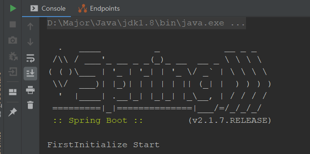
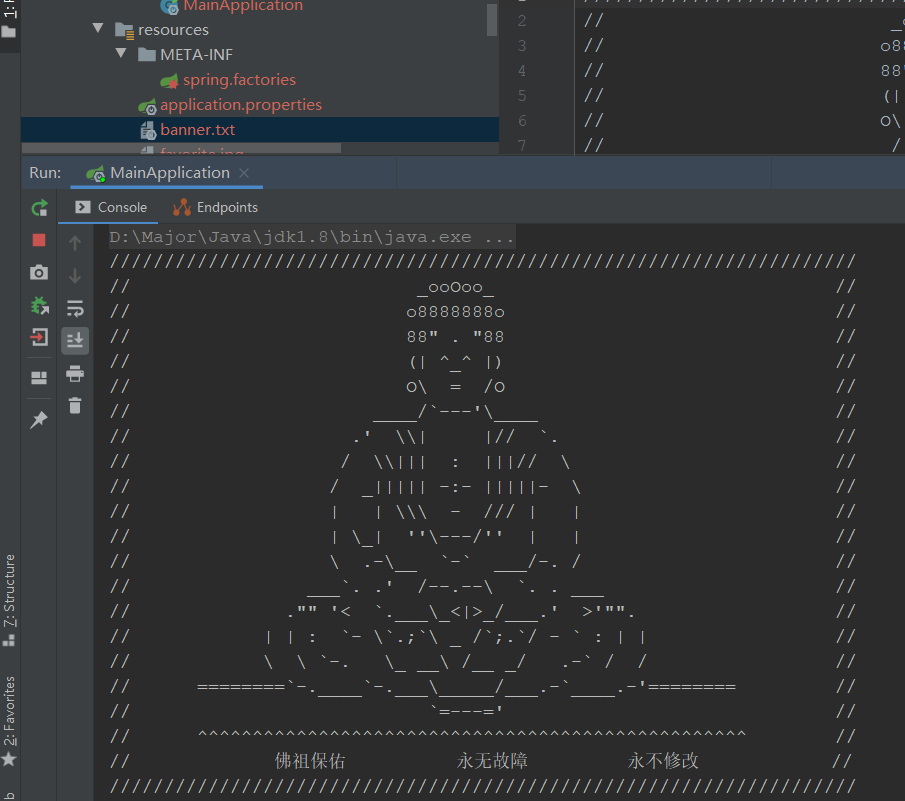

## Banner的使用

banner是什么？就是在项目启动时，打印在控制台的一个图案，springboot默认的banner如下：



那么，有时在公司开发项目时，不想使用spring的banner，而是公司的logo等图案，应该怎么设置呢？

### 文字Banner

默认情况下，在resources目录下创建`banner.txt`，写上你想要的图案，就可以显示



如果想要修改名称，可以配置在`application.properties`环境配置中

```properties
spring.banner.location=myBanner.txt
```

### 图片Banner

在resources目录下，创建`banner.(jpg|png|gif)`


如果想要修改名称，也可以配置在环境中

```properties
spring.banner.image.location=myBanner.jpg
```

### 兜底Banner

兜底Banner是什么意思呢？就是有设置自定义Banner时使用自定义Banner，如果没有设置，使用一个默认的Banner。

设置方法：需要实例化SpringApplication，使用setBanner()设置

```java
SpringApplication springApplication = new SpringApplication(MainApplication.class);
springApplication.setBanner(new ResourceBanner(new ClassPathResource("banner_bak.txt")));
springApplication.run(args);
```

### 关闭Banner

有时我们不想打印banner，也可以在application.properties中关闭

```properties
# 关闭Banner
spring.main.banner-mode=off
```

## Banner源码解析

banner的打印是在run方法中执行的

```java
Banner printedBanner = printBanner(environment);
```

进入源码查看

```java
private Banner printBanner(ConfigurableEnvironment environment) {
    // 判断是否关闭Banner
    if (this.bannerMode == Banner.Mode.OFF) {
        return null;
    }
    // 判断资源加载器是否存在，不存在创建一个
    ResourceLoader resourceLoader = (this.resourceLoader != null) ? this.resourceLoader
        : new DefaultResourceLoader(getClassLoader());
    // 封装了资源加载器和兜底Banner
    SpringApplicationBannerPrinter bannerPrinter = new SpringApplicationBannerPrinter(resourceLoader, this.banner);
    // 判断Banner是打印在log里，还是console中
    if (this.bannerMode == Mode.LOG) {
        return bannerPrinter.print(environment, this.mainApplicationClass, logger);
    }
    return bannerPrinter.print(environment, this.mainApplicationClass, System.out);
}
```

可以看到，这里主要是对Banner打印前，进行一些初始化，判断的工作，真正打印逻辑在print()方法中

```java
public Banner print(Environment environment, Class<?> sourceClass, PrintStream out) {
    // 获取Banner
    Banner banner = getBanner(environment);
    // 打印Banner
    banner.printBanner(environment, sourceClass, out);
    return new PrintedBanner(banner, sourceClass);
}
```

接着，我们就从获取和打印Banner，分别对其源码解析

### 获取Banner

```java
// 获取Banner
private Banner getBanner(Environment environment) {
    Banners banners = new Banners();
    // 查找ImageBanner是否存在
    banners.addIfNotNull(getImageBanner(environment));
    // 查找TextBanner是否存在
    banners.addIfNotNull(getTextBanner(environment));
    // 如果存在自定义Banner，返回
    if (banners.hasAtLeastOneBanner()) {
        return banners;
    }
    // 如果存在兜底Banner，返回兜底Banner
    if (this.fallbackBanner != null) {
        return this.fallbackBanner;
    }
    // 都没有，返回默认Banner，也就是SpringBoot的Banner
    return DEFAULT_BANNER;
}

// 获取图片Banner
private Banner getImageBanner(Environment environment) {
    // BANNER_IMAGE_LOCATION_PROPERTY = "spring.banner.image.location"
    // 判断环境中是否配置了此属性
    String location = environment.getProperty(BANNER_IMAGE_LOCATION_PROPERTY);
    // 如果存在
    if (StringUtils.hasLength(location)) {
        // 加载此路径文件
        Resource resource = this.resourceLoader.getResource(location);
        // 存在封装成ImageBanner返回
        return resource.exists() ? new ImageBanner(resource) : null;
    }
    // 不存在，循环查找默认Banner名称，就是banner.(jpg|png|gif)
    for (String ext : IMAGE_EXTENSION) {
        Resource resource = this.resourceLoader.getResource("banner." + ext);
        if (resource.exists()) {
            return new ImageBanner(resource);
        }
    }
    return null;
}

// 获取文字Banner
private Banner getTextBanner(Environment environment) {
    // BANNER_LOCATION_PROPERTY = "spring.banner.location"
    // DEFAULT_BANNER_LOCATION = "banner.txt"
    // 获取地址，默认配置或自定义配置
    String location = environment.getProperty(BANNER_LOCATION_PROPERTY, DEFAULT_BANNER_LOCATION);
    // 读取配置
    Resource resource = this.resourceLoader.getResource(location);
    // 如果存在，加载返回，不存在返回null
    if (resource.exists()) {
        return new ResourceBanner(resource);
    }
    return null;
}
```

获取Banner原理很简单，分为获取ImageBanner和TextBanner，就是判断环境中是否存在自定义配置或默认配置，进行加载，然后如果不存在，使用兜底Banner，兜底Banner也不存在，使用默认Banner

### 输出Banner

输出Banner有三种方式，默认输出，文本输出，图片输出

#### 默认输出

```java
@Override
public void printBanner(Environment environment, Class<?> sourceClass, PrintStream printStream) {
    // 循环打印每一行字符串
    for (String line : BANNER) {
        printStream.println(line);
    }
    // 获取版本号，这个配置在springboot的一个MANIFEST.MF配置文件中
    String version = SpringBootVersion.getVersion();
    // 拼装版本信息
    version = (version != null) ? " (v" + version + ")" : "";
    StringBuilder padding = new StringBuilder();
    while (padding.length() < STRAP_LINE_SIZE - (version.length() + SPRING_BOOT.length())) {
        padding.append(" ");
    }
	// 设置版本信息颜色，彩色打印
    printStream.println(AnsiOutput.toString(AnsiColor.GREEN, SPRING_BOOT, AnsiColor.DEFAULT, padding.toString(),
                                            AnsiStyle.FAINT, version));
    printStream.println();
}
```

#### 文本输出

```java
@Override
public void printBanner(Environment environment, Class<?> sourceClass, PrintStream out) {
    try {
        // 从流中获取文本，以字符串形式保存
        String banner = StreamUtils.copyToString(this.resource.getInputStream(),
                                                 environment.getProperty("spring.banner.charset", Charset.class, StandardCharsets.UTF_8));
		// 处理字符串，这里主要是将占位符替换
        // 文本Banner可以添加占位符，使用环境中的配置代替
        for (PropertyResolver resolver : getPropertyResolvers(environment, sourceClass)) {
            banner = resolver.resolvePlaceholders(banner);
        }
        // 输出Banner
        out.println(banner);
    }
    catch (Exception ex) {
       // 日志输出
    }
}
```

#### 图片输出

```java
@Override
public void printBanner(Environment environment, Class<?> sourceClass, PrintStream out) {
    // 表示为无界面模式
    String headless = System.getProperty("java.awt.headless");
    try {
        System.setProperty("java.awt.headless", "true");
        printBanner(environment, out);
    }
    //···
}

private void printBanner(Environment environment, PrintStream out) throws IOException {
    // 获取配置文件中image的配置，如果没有使用默认配置
    int width = getProperty(environment, "width", Integer.class, 76);
    int height = getProperty(environment, "height", Integer.class, 0);
    int margin = getProperty(environment, "margin", Integer.class, 2);
    boolean invert = getProperty(environment, "invert", Boolean.class, false);
    // 使用图片工具进行打印输出，这里就不关注了
    Frame[] frames = readFrames(width, height);
    for (int i = 0; i < frames.length; i++) {
        if (i > 0) {
            resetCursor(frames[i - 1].getImage(), out);
        }
        printBanner(frames[i].getImage(), margin, invert, out);
        sleep(frames[i].getDelayTime());
    }
}
```

输出逻辑也很简单，没有什么难的，主要就是获取要输出的字符串，进行一些设置，占位符替换，然后输出到控制台即可。

## 流程总结

