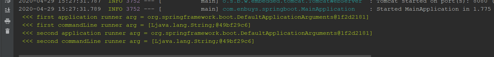

通过前面的学习，我们知道SpringBoot在刷新完毕后，会停止计时，并发送Started事件，但是最后还会发送一个ready事件，当时我们说，判断这两个事件的差异，就是ready是在runners执行后，started是在执行前，就说明其中包含了一个runner的执行过程。

这个runners就是启动加载器，目的是在SpringBoot启动后，立即执行一些事件

学习启动加载器前，我们先看下SpringBoot的计时器

## SpringBoot计时器

首先，在启动时，会调用计时器方法，记录当前时间，然后再结束时候stop，控制台会打印本次启动用了多少时间，所以我们看看SpringBoot的计时器是如何实现的，是简单的获取系统时间进行相减吗？

```java
public ConfigurableApplicationContext run(String... args) {
    StopWatch stopWatch = new StopWatch();
    stopWatch.start();
    // ···
    stopWatch.stop();
    if (this.logStartupInfo) {
        new StartupInfoLogger(this.mainApplicationClass).logStarted(getApplicationLog(), stopWatch);
    }
    // ···
}
```

通过源码，我们可以看到创建了一个StopWatch对象，并调用start，stop方法进行计时，通过日志输出时间

### StopWatch源码分析

所以，我们需要探索StopWatch这个对象

```java
public class StopWatch {

    // 计时器id，用来判断开始结束
    private final String id;
    // 是否保存单个任务到任务集合
    private boolean keepTaskList = true;
	// 将任务保存到集合
    private final List<TaskInfo> taskList = new LinkedList<>();
	// 当前任务开始时间
    private long startTimeMillis;
	// 当前任务名称
    @Nullable
    private String currentTaskName;
	// 最后一个任务的信息
    @Nullable
    private TaskInfo lastTaskInfo;
	// 总任务数
    private int taskCount;
	// 总耗时
    private long totalTimeMillis;

	// 如果不传任务id，默认空
    public StopWatch() {
        this("");
    }
	// 构造
    public StopWatch(String id) {
        this.id = id;
    }

    // 如果不传任务名称，默认空
    public void start() throws IllegalStateException {
        start("");
    }
	// 开始任务
    public void start(String taskName) throws IllegalStateException {
        // 如果当前存在任务，抛异常
        if (this.currentTaskName != null) {
            throw new IllegalStateException("Can't start StopWatch: it's already running");
        }
        // 设置当前任务名
        this.currentTaskName = taskName;
        // 设置开启时间
        this.startTimeMillis = System.currentTimeMillis();
    }

    // 结束任务
    public void stop() throws IllegalStateException {
        // 判断当前任务是否存在，不存在抛异常
        if (this.currentTaskName == null) {
            throw new IllegalStateException("Can't stop StopWatch: it's not running");
        }
        // 当前任务结束时间
        long lastTime = System.currentTimeMillis() - this.startTimeMillis;
        // 添加到总时长
        this.totalTimeMillis += lastTime;
        // 最后任务对象，指向当前任务
        // 任务对象，主要包含任务名和消耗时间，是内部类
        this.lastTaskInfo = new TaskInfo(this.currentTaskName, lastTime);
        // 判断是否开始保存任务功能
        if (this.keepTaskList) {
            // 开启，添加到任务集合
            this.taskList.add(this.lastTaskInfo);
        }
        // 添加任务数
        ++this.taskCount;
        // 清空当前任务
        this.currentTaskName = null;
    }
}
```

通过源码查看，可以看到SpringBoot实现的计时器麻雀虽小五脏俱全，值得我们学习

### 简单使用SpringBoot计时器

```java
@Test
public void test2() throws InterruptedException {
    StopWatch stopWatch = new StopWatch("test");
    stopWatch.start("task1");
    Thread.sleep(100);
    stopWatch.stop();
    stopWatch.start("task2");
    Thread.sleep(2000);
    stopWatch.stop();
    System.out.println(stopWatch.prettyPrint());
}
```


可以看到，打印了两条任务，以及总耗时，非常优雅

## SpringBoot启动加载器解析

接着我们去看一看启动加载器

```java
callRunners(context, applicationArguments);
```

```java
private void callRunners(ApplicationContext context, ApplicationArguments args) {
    List<Object> runners = new ArrayList<>();
    // 从BeanFactory中实例化ApplicationRunner的实现类，保存到集合中
    runners.addAll(context.getBeansOfType(ApplicationRunner.class).values());
    // 从BeanFactory中实例化CommandLineRunner的实现类，保存到集合中
    runners.addAll(context.getBeansOfType(CommandLineRunner.class).values());
    // 根据@Order注解排序
    AnnotationAwareOrderComparator.sort(runners);
    // 循环执行，注意这里会传入args，也就是启动时带的参数
    for (Object runner : new LinkedHashSet<>(runners)) {
        if (runner instanceof ApplicationRunner) {
            callRunner((ApplicationRunner) runner, args);
        }
        if (runner instanceof CommandLineRunner) {
            callRunner((CommandLineRunner) runner, args);
        }
    }
}
```

源码很简单，我们大致了解到几个关键点

- 启动加载器有两种实现方式
  - ApplicationRunner#run
  - CommandLineRunner#run
- 会根据@Order排序，但是ApplicationRunner先执行
- 会传入args参数，这里有个小知识点，参数传入一般为：`--name=pace`的形式
  - ApplicationRunner传入参数时，会将参数解析成key/value形式
  - CommandLineRunner传入参数时，使用的是原形式，不会解析

## 自定义启动加载器

了解完启动加载器源码后，我们自定义启动加载器来测试一下

```java
@Component
@Order(1)
public class FirstApplicationRunner implements ApplicationRunner {

    @Override
    public void run(ApplicationArguments args) throws Exception {
        System.out.println("\u001B[32m <<< first application runner arg = " + args +"]");
    }
}

@Component
@Order(2)
public class SecondApplicationRunner implements ApplicationRunner {

    @Override
    public void run(ApplicationArguments args) throws Exception {
        System.out.println("\u001B[32m <<< second application runner arg = " + args +"]");
    }
}
```

CommandLine方式：

```java
@Component
@Order(1)
public class FirstCommandLineRunner implements CommandLineRunner {

    @Override
    public void run(String... args) throws Exception {
        System.out.println("\u001B[32m <<< first commandLine runner arg = " + args +"]");
    }

}

@Component
@Order(2)
public class SecondCommandLineRunner implements CommandLineRunner {

    @Override
    public void run(String... args) throws Exception {
        System.out.println("\u001B[32m <<< second commandLine runner arg = " + args +"]");
    }

}
```



通过控制台打印也可以看出

- 顺序执行
- 参数不同，一个是封装了对象的参数，一个是纯字符串