## SpringBoot属性配置方式

SpringBoot提供了17种属性配置方式，有以下这些

1. Devtools全局配置
2. 测试环境@TestPropertySource注解
3. 测试环境properties属性
4. 命令行参数
5. SPRING_APPLICATION_JSON属性
6. ServletConfig初始化参数
7. ServletContext初始化参数
8. JDNI属性
9. JAVA系统属性
10. 操作系统环境变量
11. RandomValuePropertySource随机值属性
12. jar包外的application-{profile}.properties属性
13. jar包内的application-{profile}.properties属性
14. jar包外的application.properties属性
15. jar包内的application.properties属性
16. @PropertySource绑定属性
17. 默认属性

属性从上到下，优先级从高到低

属性很多，有的常用有的不常用，下面我们挑几个常用的进行测试

## 属性配置实战

我们从低到高进行实战，只选择一些常用的，不常用的了解即可

为了测试，我们需要使用上一节学到的启动加载器，在SpringBoot启动后，打印属性，属性使用`prop_test`

```java
@Component
@Order(1)
public class PropApplicationRunner implements ApplicationRunner {

    @Autowired
    private Environment environment;

    @Override
    public void run(ApplicationArguments args) throws Exception {
        System.out.println(environment.getProperty("prop_test"));
    }
}
```

### 默认属性

需要实例化SpringApplication，然后设置默认属性

```java
@SpringBootApplication
public class MainApplication {

    public static void main(String[] args) {
        SpringApplication springApplication = new SpringApplication(MainApplication.class);
        Properties properties = new Properties();
        properties.setProperty("prop_test","prop_1");
        springApplication.setDefaultProperties(properties);
        springApplication.run(args);
    }
}
```

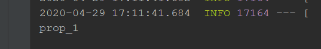

### @PropertySource绑定属性

创建一个demo.properties

```properties
prop_test=prop_2
```

然后再主程序类添加注解绑定属性

```java
@SpringBootApplication
@PropertySource("demo.properties")
public class MainApplication {
```

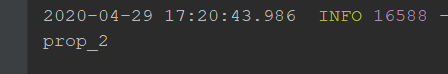

成功替换第一个，说明优先级更高

### application

application配置方式是最常用的方式，分为Properties和yml两种方式，properties会比yml优先级更高，还有就是外部application会比内部优先级高，对于这个内外部就不演示了

创建`application.yml`

```yml
prop_test: prop_3
```

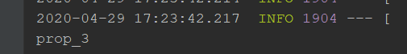

创建`application.properties`

```properties
prop_test=prop_4
```

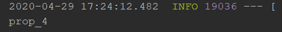

### application-{profile}

这种是多环境配置，我们后面会了解到，Spring Profile默认profile=default

所以我们创建`application-default.properties`，这里就不测试yml形式了，和之前是一样的

```properties
prop_test=prop_5
```

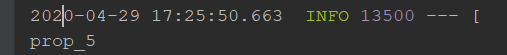

### 命令行参数

命令行参数就是在启动时添加的参数，对于idea可以这样设置

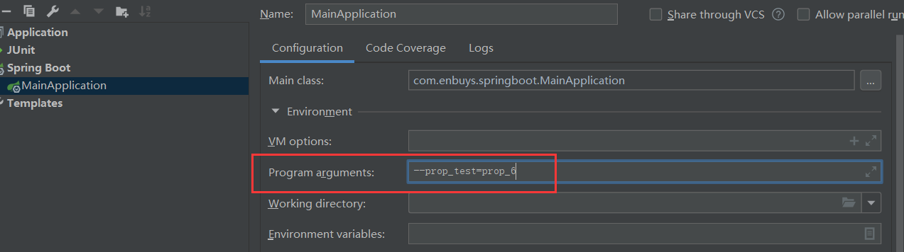

对于java启动，可以设置为`java -jar --prop_test=prop_6 xxx.jar`

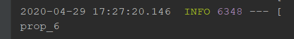

## Environment解析

### 加载Environment

上一小节，我们学习到SpringBoot的一些属性配置方式，可以发现，不管我们怎么配，都是从Environment对象中取得，说明这个对象包含了所有配置，那么我们进入源码看看它是如何进行加载配置文件，组装成Environment对象的。

再SpringApplication.run时，会进行环境配置，所以我们从run方法来着手

```java
ConfigurableEnvironment environment = prepareEnvironment(listeners, applicationArguments);
```

```java
private ConfigurableEnvironment prepareEnvironment(SpringApplicationRunListeners listeners,
                                                   ApplicationArguments applicationArguments) {
    // 创建一个Environment对象，存入一些基础配置
    ConfigurableEnvironment environment = getOrCreateEnvironment();
    // 配置Environment对象，添加其他属性
    configureEnvironment(environment, applicationArguments.getSourceArgs());
    // 发布环境准备事件，ConfigFile监听器会进行更多的属性配置
    listeners.environmentPrepared(environment);
    // 绑定SpringApplication的一些配置
    bindToSpringApplication(environment);
    // 判断当前环境配置是否与应用环境相同，不同进行转换
    if (!this.isCustomEnvironment) {
        environment = new EnvironmentConverter(getClassLoader()).convertEnvironmentIfNecessary(environment,
                                                                                               deduceEnvironmentClass());
    }
    // 添加ConfigurationProperty配置
    ConfigurationPropertySources.attach(environment);
    return environment;
}
```

我们一行行进入源码查看

#### 获取创建Environment

```java
private ConfigurableEnvironment getOrCreateEnvironment() {
    if (this.environment != null) {
        return this.environment;
    }
    //判断当前web环境
    switch (this.webApplicationType) {
        case SERVLET:
            // 为Servlet环境
            return new StandardServletEnvironment();
        case REACTIVE:
            return new StandardReactiveWebEnvironment();
        default:
            return new StandardEnvironment();
    }
}
```

这里判断为Servlet环境后，会进行实例化

```java
public class StandardServletEnvironment extends StandardEnvironment implements ConfigurableWebEnvironment {

    public static final String SERVLET_CONTEXT_PROPERTY_SOURCE_NAME = "servletContextInitParams";

    public static final String SERVLET_CONFIG_PROPERTY_SOURCE_NAME = "servletConfigInitParams";

    /** JNDI property source name: {@value}. */
    public static final String JNDI_PROPERTY_SOURCE_NAME = "jndiProperties";

    @Override
    protected void customizePropertySources(MutablePropertySources propertySources) {
        // 向Environment中添加servletConfig属性集
        propertySources.addLast(new StubPropertySource(SERVLET_CONFIG_PROPERTY_SOURCE_NAME));
        // 向Environment中添加ServletContext属性集
        propertySources.addLast(new StubPropertySource(SERVLET_CONTEXT_PROPERTY_SOURCE_NAME));
        // 如果Jndi存在，向Environment中添加Jndi属性集
        if (JndiLocatorDelegate.isDefaultJndiEnvironmentAvailable()) {
            propertySources.addLast(new JndiPropertySource(JNDI_PROPERTY_SOURCE_NAME));
        }
        // 调用上层配置
        super.customizePropertySources(propertySources);
    }
}

public class StandardEnvironment extends AbstractEnvironment {

    public static final String SYSTEM_ENVIRONMENT_PROPERTY_SOURCE_NAME = "systemEnvironment";

    public static final String SYSTEM_PROPERTIES_PROPERTY_SOURCE_NAME = "systemProperties";

    @Override
    protected void customizePropertySources(MutablePropertySources propertySources) {
        // 向Environment中添加系统属性集
        propertySources.addLast(
            new PropertiesPropertySource(SYSTEM_PROPERTIES_PROPERTY_SOURCE_NAME, getSystemProperties()));
        // 添加系统环境属性集
        propertySources.addLast(
            new SystemEnvironmentPropertySource(SYSTEM_ENVIRONMENT_PROPERTY_SOURCE_NAME, getSystemEnvironment()));
    }

}

public abstract class AbstractEnvironment implements ConfigurableEnvironment {
    public AbstractEnvironment() {
        customizePropertySources(this.propertySources);
    }
}
```

通过代码层级关系，我们会发现，首先调用上层AbstractEnvironment的构造方法，然后向Environment中添加了大量属性集，分别有

- ServletConfig
- ServletContext
- Jndi
- SystemProperties
- SystemEnvironment

#### 配置Environment

```java
protected void configureEnvironment(ConfigurableEnvironment environment, String[] args) {
    // 不需要关注
   if (this.addConversionService) {
      ConversionService conversionService = ApplicationConversionService.getSharedInstance();
      environment.setConversionService((ConfigurableConversionService) conversionService);
   }
    // 添加默认配置
   configurePropertySources(environment, args);
    // 设置Active Profile，这个后面再分析
   configureProfiles(environment, args);
}
```

这里我们主要看一下添加默认配置的方法

```java
protected void configurePropertySources(ConfigurableEnvironment environment, String[] args) {
   MutablePropertySources sources = environment.getPropertySources();
    // 添加DefaultProperties默认配置
   if (this.defaultProperties != null && !this.defaultProperties.isEmpty()) {
      sources.addLast(new MapPropertySource("defaultProperties", this.defaultProperties));
   }
    // 添加命令行中的配置
   if (this.addCommandLineProperties && args.length > 0) {
      String name = CommandLinePropertySource.COMMAND_LINE_PROPERTY_SOURCE_NAME;
      if (sources.contains(name)) {
         PropertySource<?> source = sources.get(name);
         CompositePropertySource composite = new CompositePropertySource(name);
         composite.addPropertySource(
             // 这里就是将 --xx=xx 解析成key/value的形式存储
               new SimpleCommandLinePropertySource("springApplicationCommandLineArgs", args));
         composite.addPropertySource(source);
         sources.replace(name, composite);
      }
      else {
         sources.addFirst(new SimpleCommandLinePropertySource(args));
      }
   }
}
```

即添加默认属性配置和命令行属性

#### 发布环境准备事件

```java
listeners.environmentPrepared(environment);
```

这里对于怎么发布事件的源码就不做研究了，之前都有研究过，我们主要看下`ConfigFile`这个监听器

```java
@Override
public void onApplicationEvent(ApplicationEvent event) {
    // 为ApplicationEnvironmentPreparedEvent
    if (event instanceof ApplicationEnvironmentPreparedEvent) {
        onApplicationEnvironmentPreparedEvent((ApplicationEnvironmentPreparedEvent) event);
    }
    if (event instanceof ApplicationPreparedEvent) {
        onApplicationPreparedEvent(event);
    }
}

private void onApplicationEnvironmentPreparedEvent(ApplicationEnvironmentPreparedEvent event) {
    // 获取环境后置处理器
    List<EnvironmentPostProcessor> postProcessors = loadPostProcessors();
    // 添加自己
    postProcessors.add(this);
    // 排序
    AnnotationAwareOrderComparator.sort(postProcessors);
    // 循环执行
    for (EnvironmentPostProcessor postProcessor : postProcessors) {
        postProcessor.postProcessEnvironment(event.getEnvironment(), event.getSpringApplication());
    }
}
```

这里可以看到，主要是执行环境后置处理器，我们DEBUG看一下，有哪些后置处理器

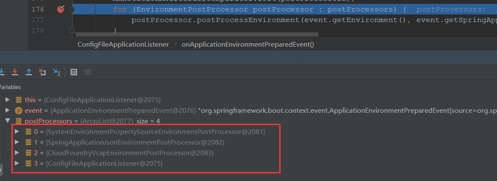

有四个后置处理器，我们一个个看

**SystemEnvironmentPropertySourceEnvironmentPostProcessor**

```java
@Override
public void postProcessEnvironment(ConfigurableEnvironment environment, SpringApplication application) {
   String sourceName = StandardEnvironment.SYSTEM_ENVIRONMENT_PROPERTY_SOURCE_NAME;
   PropertySource<?> propertySource = environment.getPropertySources().get(sourceName);
   if (propertySource != null) {
      replacePropertySource(environment, sourceName, propertySource);
   }
}
```

这个没有做什么事情，主要就是将之前SystemEnvironment配置加载重新放到一个新的对象中，不需要关心

**SpringApplicationJsonEnvironmentPostProcessor**

```java
@Override
public void postProcessEnvironment(ConfigurableEnvironment environment, SpringApplication application) {
   MutablePropertySources propertySources = environment.getPropertySources();
    // 加载spring_application_json中的属性
   propertySources.stream().map(JsonPropertyValue::get).filter(Objects::nonNull).findFirst()
         .ifPresent((v) -> processJson(environment, v));
}
```

这个看名字也就知道了，是加载SPRING_APPLICATION_JSON配置的属性

**CloudFoundryVcapEnvironmentPostProcessor**

这个类是微服务环境的配置，主要是加载vcap的配置，需要太关注

**最后就是调用自身**

```java
@Override
public void postProcessEnvironment(ConfigurableEnvironment environment, SpringApplication application) {
   addPropertySources(environment, application.getResourceLoader());
}

protected void addPropertySources(ConfigurableEnvironment environment, ResourceLoader resourceLoader) {
    // 首先添加RandomValueProperty属性到环境中
    RandomValuePropertySource.addToEnvironment(environment);
    // 加载application-{profile}.(properties|yml)属性到环境中
    new Loader(environment, resourceLoader).load();
}

public void load() {
    this.profiles = new LinkedList<>();
    this.processedProfiles = new LinkedList<>();
    this.activatedProfiles = false;
    this.loaded = new LinkedHashMap<>();
    initializeProfiles();
    while (!this.profiles.isEmpty()) {
        Profile profile = this.profiles.poll();
        if (profile != null && !profile.isDefaultProfile()) {
            addProfileToEnvironment(profile.getName());
        }
        load(profile, this::getPositiveProfileFilter, addToLoaded(MutablePropertySources::addLast, false));
        this.processedProfiles.add(profile);
    }
    resetEnvironmentProfiles(this.processedProfiles);
    load(null, this::getNegativeProfileFilter, addToLoaded(MutablePropertySources::addFirst, true));
    addLoadedPropertySources();
}
```

总结这个事件发布，加载了以下配置属性：

- SPRING_APPLICATION_JSON
- vcap
- Random属性集
- application-{profile}.(properties|yml)

#### 绑定SpringApplication

```java
protected void bindToSpringApplication(ConfigurableEnvironment environment) {
   try {
      Binder.get(environment).bind("spring.main", Bindable.ofInstance(this));
   }
   catch (Exception ex) {
      throw new IllegalStateException("Cannot bind to SpringApplication", ex);
   }
}
```

这里主要是为SpringApplication绑定一些属性，`spring.main.xxx`

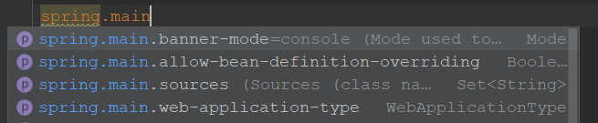

比如Banner的打印情况，如果为off，后面打印步骤就不会进行打印

#### 添加ConfigurationProperty

```java
private static final String ATTACHED_PROPERTY_SOURCE_NAME = "configurationProperties";

public static void attach(Environment environment) {
   Assert.isInstanceOf(ConfigurableEnvironment.class, environment);
   MutablePropertySources sources = ((ConfigurableEnvironment) environment).getPropertySources();
   PropertySource<?> attached = sources.get(ATTACHED_PROPERTY_SOURCE_NAME);
   if (attached != null && attached.getSource() != sources) {
      sources.remove(ATTACHED_PROPERTY_SOURCE_NAME);
      attached = null;
   }
   if (attached == null) {
      sources.addFirst(new ConfigurationPropertySourcesPropertySource(ATTACHED_PROPERTY_SOURCE_NAME,
            new SpringConfigurationPropertySources(sources)));
   }
}
```

主要是向环境中，添加ConfigurationProperties属性

到此，加载Environment方法就结束了，这里除了Devtools，测试相关的，@PropertySources注解，其他配置方式全部都包含在内了

对于@PropertSources，是和自动化装配有关的，我们后面再看

### 总结Environment加载流程

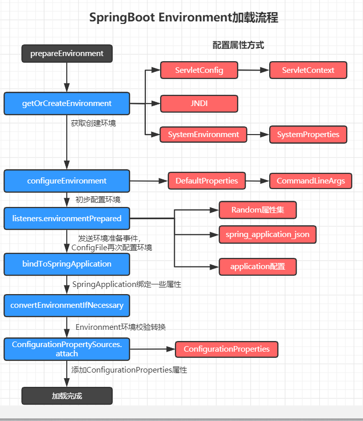

## SpringProfile

### SpringProfile的使用

- springprofile的作用，就是在不同的环境使用不同的配置参数，切换环境时，只需切换配置文件，而不是修改配置文件中的具体配置。

- 当需要配置profile时，一般配合`application.properties`使用，需要在切环境时改变的属性，配置在profile文件中，不需要改变的定义在application中
- SpringBoot默认使用`application-default.properties`，即profile=default
- 修改默认profile：`spring.profiles.default=xxx`，注意，此配置需要配置在命令行参数或其他地方，不能配置在application.properties，为何这样，解析时再说
- 修改当前生效的profile：`spring.profiles.active`，配置这个之后，会与default互斥，即default不会再被加载
- 使用多个profile：`spring.profiles.include=pro,dev`
- 修改profile的前缀：profile前缀默认为application，可以使用`spring.config.name`修改其前缀

### SpringProfile解析

#### Profile加载入口

在解析Environment的时候，我们看到，在派发环境准备事件时，ConfigFile监听器会加载application配置文件，所以我们就从这里入手

```java
protected void addPropertySources(ConfigurableEnvironment environment, ResourceLoader resourceLoader) {
    RandomValuePropertySource.addToEnvironment(environment);
    new Loader(environment, resourceLoader).load();
}
public void load() {
    // 进行一系列初始化
    this.profiles = new LinkedList<>();
    this.processedProfiles = new LinkedList<>();
    this.activatedProfiles = false;
    this.loaded = new LinkedHashMap<>();
    
    // 初始化Profiles
    initializeProfiles();
    
    // 如果profiles不为空，循环加载profile
    while (!this.profiles.isEmpty()) {
        Profile profile = this.profiles.poll();
        // 加载default profile，加载完毕，会将配置文件中对象保存到loaded中
        if (profile != null && !profile.isDefaultProfile()) {
            addProfileToEnvironment(profile.getName());
        }
        // 加载application.profile
        load(profile, this::getPositiveProfileFilter, addToLoaded(MutablePropertySources::addLast, false));
        this.processedProfiles.add(profile);
    }
    resetEnvironmentProfiles(this.processedProfiles);
    load(null, this::getNegativeProfileFilter, addToLoaded(MutablePropertySources::addFirst, true));
    // 将loaded保存到Environment环境中
    addLoadedPropertySources();
}
```

#### Profile初始化

```java
public static final String ACTIVE_PROFILES_PROPERTY = "spring.profiles.active";
public static final String INCLUDE_PROFILES_PROPERTY = "spring.profiles.include";

private void initializeProfiles() {
   // 首先设置profile为null，这样先加载application.properties.
   this.profiles.add(null);
    // 获取环境中激活的profile
   Set<Profile> activatedViaProperty = getProfilesActivatedViaProperty();
    // 加载激活的profile
   this.profiles.addAll(getOtherActiveProfiles(activatedViaProperty));
   // 也是添加activeprofile
   addActiveProfiles(activatedViaProperty);
    // 如果profile 为 1，即没有active的profile，一般情况下都是没有配置的
   if (this.profiles.size() == 1) { // only has null profile
       // 这里会获取default profile
       // getDefaultProfiles()：就是判断是否配置了spring.profiles.default属性
       // 如果没有，默认使用default
       // 从这里可以看出，如果你把spring.profiles.default配置在application.properties中
       // 到此application还没有被加载，所以一定是无法生效的
       // 但是命令行参数已经加载到环境中，所以可以生效
      for (String defaultProfileName : this.environment.getDefaultProfiles()) {
         Profile defaultProfile = new Profile(defaultProfileName, true);
          // 添加default
         this.profiles.add(defaultProfile);
      }
   }
}

private Set<Profile> getProfilesActivatedViaProperty() {
    // 判断环境属性是否包含active和include
    if (!this.environment.containsProperty(ACTIVE_PROFILES_PROPERTY)
        && !this.environment.containsProperty(INCLUDE_PROFILES_PROPERTY)) {
        // 返回空
        return Collections.emptySet();
    }
    // 向set集合添加激活的profile返回
    Binder binder = Binder.get(this.environment);
    Set<Profile> activeProfiles = new LinkedHashSet<>();
    activeProfiles.addAll(getProfiles(binder, INCLUDE_PROFILES_PROPERTY));
    activeProfiles.addAll(getProfiles(binder, ACTIVE_PROFILES_PROPERTY));
    return activeProfiles;
}
```

#### Profile加载

回到加载入口方法

```java
// 一般情况下，此时profiles中一共有两个对象
// null和default
while (!this.profiles.isEmpty()) {
    Profile profile = this.profiles.poll();
    // 加载default profile
    if (profile != null && !profile.isDefaultProfile()) {
        addProfileToEnvironment(profile.getName());
    }
    // 加载null profile
    load(profile, this::getPositiveProfileFilter, addToLoaded(MutablePropertySources::addLast, false));
    this.processedProfiles.add(profile);
}
```

首先我们先进入加载`null profile`的`load`方法中

```java
public static final String CONFIG_LOCATION_PROPERTY = "spring.config.location";
public static final String CONFIG_ADDITIONAL_LOCATION_PROPERTY = "spring.config.additional-location";
private static final String DEFAULT_SEARCH_LOCATIONS = "classpath:/,classpath:/config/,file:./,file:./config/";
public static final String CONFIG_NAME_PROPERTY = "spring.config.name";

private void load(Profile profile, DocumentFilterFactory filterFactory, DocumentConsumer consumer) {
    // getSearchLocations()找到所有配置的location
    getSearchLocations().forEach((location) -> {
        boolean isFolder = location.endsWith("/"); // 判断是否以/结尾，说明为文件夹，需要向下查找具体文件
        // 将查找到的文件名前缀，存放到集合中，默认为application
        Set<String> names = isFolder ? getSearchNames() : NO_SEARCH_NAMES;
        // 循环加载文件
        names.forEach((name) -> load(location, name, profile, filterFactory, consumer));
    });
}

private Set<String> getSearchLocations() {
    // 首先判断环境中是否有自定义的location地址，即配置文件存放地址，有则返回
    if (this.environment.containsProperty(CONFIG_LOCATION_PROPERTY)) {
        return getSearchLocations(CONFIG_LOCATION_PROPERTY);
    }
    // 是否有添加的自定义location地址，如果有，添加到默认地址中，一起返回
    Set<String> locations = getSearchLocations(CONFIG_ADDITIONAL_LOCATION_PROPERTY);
    locations.addAll(
        asResolvedSet(ConfigFileApplicationListener.this.searchLocations, DEFAULT_SEARCH_LOCATIONS));
    return locations;
}

// 查找文件名前缀
private Set<String> getSearchNames() {
    // 先判断用户时候自定义了文件前缀
    if (this.environment.containsProperty(CONFIG_NAME_PROPERTY)) {
        String property = this.environment.getProperty(CONFIG_NAME_PROPERTY);
        return asResolvedSet(property, null);
    }
    // 如果没有，返回DEFAULT_NAMES，即application
    return asResolvedSet(ConfigFileApplicationListener.this.names, DEFAULT_NAMES);
}
```

进入重载load方法

```java
private void load(String location, String name, Profile profile, DocumentFilterFactory filterFactory,
      DocumentConsumer consumer) {
    // 前缀名为空的情况
   if (!StringUtils.hasText(name)) {
      //···
   }
   Set<String> processed = new HashSet<>();
    // 这里会有两种资源加载器，Property和Yarn
   for (PropertySourceLoader loader : this.propertySourceLoaders) {
      for (String fileExtension : loader.getFileExtensions()) {
         if (processed.add(fileExtension)) {
             // 加载配置文件
            loadForFileExtension(loader, location + name, "." + fileExtension, profile, filterFactory,
                  consumer);
         }
      }
   }
}

// 加载文件，主要看load方法
private void loadForFileExtension(PropertySourceLoader loader, String prefix, String fileExtension,
                                  Profile profile, DocumentFilterFactory filterFactory, DocumentConsumer consumer) {
    DocumentFilter defaultFilter = filterFactory.getDocumentFilter(null);
    DocumentFilter profileFilter = filterFactory.getDocumentFilter(profile);
    // profile不为空，比如application-defalut.properties
    if (profile != null) {
        // Try profile-specific file & profile section in profile file (gh-340)
        String profileSpecificFile = prefix + "-" + profile + fileExtension;
        load(loader, profileSpecificFile, profile, defaultFilter, consumer);
        load(loader, profileSpecificFile, profile, profileFilter, consumer);
        // Try profile specific sections in files we've already processed
        for (Profile processedProfile : this.processedProfiles) {
            if (processedProfile != null) {
                String previouslyLoaded = prefix + "-" + processedProfile + fileExtension;
                load(loader, previouslyLoaded, profile, profileFilter, consumer);
            }
        }
    }
    // profile为空，比如application.property
    load(loader, prefix + fileExtension, profile, profileFilter, consumer);
}
```

这里主要看load方法

```java
private void load(PropertySourceLoader loader, String location, Profile profile, DocumentFilter filter,
                  DocumentConsumer consumer) {
    // 加载资源文件，location=classpath:/application.properties
    Resource resource = this.resourceLoader.getResource(location);
    // 如果为null返回
    if (resource == null || !resource.exists()) {
        return;
    }
    if (!StringUtils.hasText(StringUtils.getFilenameExtension(resource.getFilename()))) {
        return;
    }
    String name = "applicationConfig: [" + location + "]";
    // 将配置文件中的属性，封装到Document集合中
    List<Document> documents = loadDocuments(loader, name, resource);
    
    // 判空
    
    List<Document> loaded = new ArrayList<>();
    // 循环Document
    for (Document document : documents) {
        if (filter.match(document)) {
            // 添加spring.profiles.active的值到profiles中，后面再次进行加载
            addActiveProfiles(document.getActiveProfiles());
            // 添加spring.profiles.include的值到profiles中，后面再次进行加载
            addIncludedProfiles(document.getIncludeProfiles());
            // 将Document添加到Loaded对象中
            loaded.add(document);
        }
    }
    //···
}
```

Loaded对象：

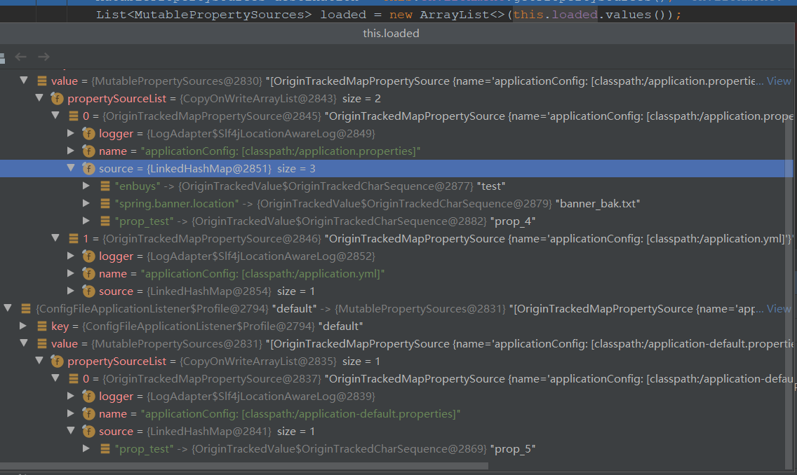

这里循环加载完毕所有配置文件后，会回到一开始入口的load()方法

####    将Profile Loaded保存到Environment中

```java
// 初始化Profiles
initializeProfiles();

// 如果profiles不为空，循环加载profile
while (!this.profiles.isEmpty()) {
    Profile profile = this.profiles.poll();
    // 加载default profile，加载完毕，会将配置文件中对象保存到loaded中
    if (profile != null && !profile.isDefaultProfile()) {
        addProfileToEnvironment(profile.getName());
    }
    // 加载application.profile
    load(profile, this::getPositiveProfileFilter, addToLoaded(MutablePropertySources::addLast, false));
    this.processedProfiles.add(profile);
}
resetEnvironmentProfiles(this.processedProfiles);
load(null, this::getNegativeProfileFilter, addToLoaded(MutablePropertySources::addFirst, true));
// 将loaded保存到Environment环境中
addLoadedPropertySources();
```
这里会去执行`addLoadedPropertySources`方法，保存`loaded`到`Environment`

```java
private void addLoadedPropertySources() {
    // 获取Environment中Destination集合对象
   MutablePropertySources destination = this.environment.getPropertySources();
    // 获取loaded值
   List<MutablePropertySources> loaded = new ArrayList<>(this.loaded.values());
   Collections.reverse(loaded);
   String lastAdded = null;
   Set<String> added = new HashSet<>();
    // 循环loaded中配置文件属性，添加到Destination
   for (MutablePropertySources sources : loaded) {
      for (PropertySource<?> source : sources) {
         if (added.add(source.getName())) {
            addLoadedPropertySource(destination, lastAdded, source);
            lastAdded = source.getName();
         }
      }
   }
}
```

### 总结SpringProfile解析流程

看完SpringProfile解析源码，可能会有点晕晕的，这里就需要使用流程图来帮我们理清思路了

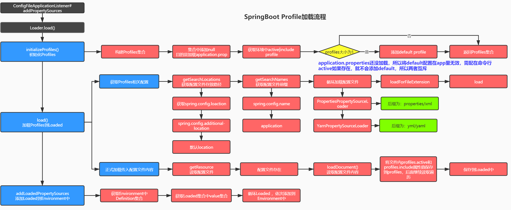