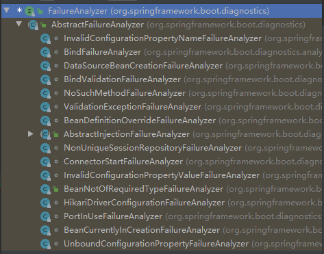
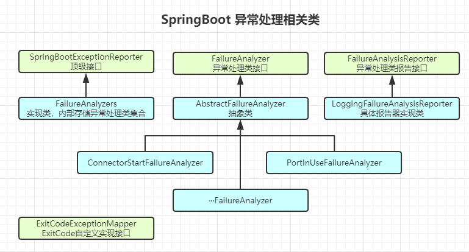
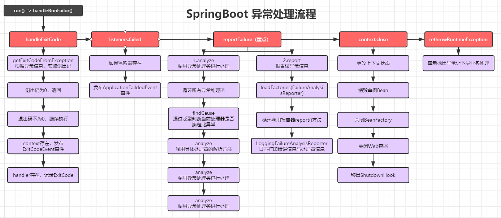
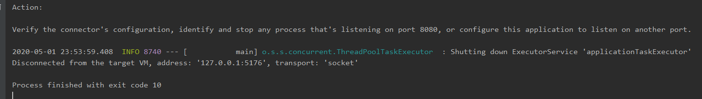

## 异常相关流程介绍

### 异常接口加载入口

首先我们知道，在run方法执行时，会对异常报告器进行加载装配，所以我们看看他是如何装配的，然后找到SpringBoot的异常报告器

```java
public ConfigurableApplicationContext run(String... args) {
    // ···
    // 初始化集合
    Collection<SpringBootExceptionReporter> exceptionReporters = new ArrayList<>();
    // ···
    try {
        //···
        // 加载异常报告器实现类到集合
        exceptionReporters = getSpringFactoriesInstances(SpringBootExceptionReporter.class,
                                                         new Class[] { ConfigurableApplicationContext.class }, context);
        //···
    }
    catch (Throwable ex) {
        // 处理异常
        handleRunFailure(context, ex, exceptionReporters, listeners);
        throw new IllegalStateException(ex);
    }
}
```

通过源码可以看出来，异常报告器的顶级接口是`SpringBootExceptionReporter`，然后SpringBoot会从`factories`工厂配置中，找到此接口的实现类，进行加载，当有异常时，调用`handleRunFailure`方法，处理异常


然后我们就可以找到具体实现类，进入看看

### FailureAnalyzers初始化

接着，我们看看此类初始化实例时，做了哪些事

```java
FailureAnalyzers(ConfigurableApplicationContext context) {
    this(context, null);
}

FailureAnalyzers(ConfigurableApplicationContext context, ClassLoader classLoader) {
    Assert.notNull(context, "Context must not be null");
    // 创建类加载器
    this.classLoader = (classLoader != null) ? classLoader : context.getClassLoader();
    // 加载具体的FailureAnalyzer异常处理类
    this.analyzers = loadFailureAnalyzers(this.classLoader);
    // 准备异常处理器，添加到容器里
    prepareFailureAnalyzers(this.analyzers, context);
}

private List<FailureAnalyzer> loadFailureAnalyzers(ClassLoader classLoader) {
    // 加载所有异常处理实现类
    List<String> analyzerNames = SpringFactoriesLoader.loadFactoryNames(FailureAnalyzer.class, classLoader);
    List<FailureAnalyzer> analyzers = new ArrayList<>();
    // 循环实例化，添加到analyzers中
    for (String analyzerName : analyzerNames) {
        try {
            Constructor<?> constructor = ClassUtils.forName(analyzerName, classLoader).getDeclaredConstructor();
            ReflectionUtils.makeAccessible(constructor);
            analyzers.add((FailureAnalyzer) constructor.newInstance());
        }
        catch (Throwable ex) {
            logger.trace("Failed to load " + analyzerName, ex);
        }
    }
    AnnotationAwareOrderComparator.sort(analyzers);
    return analyzers;
}

private void prepareFailureAnalyzers(List<FailureAnalyzer> analyzers, ConfigurableApplicationContext context) {
    // 循环添加到容器里
    for (FailureAnalyzer analyzer : analyzers) {
        prepareAnalyzer(context, analyzer);
    }
}

private void prepareAnalyzer(ConfigurableApplicationContext context, FailureAnalyzer analyzer) {
    // 判断是BeanFactory还是Environment，添加到不同的容器
    if (analyzer instanceof BeanFactoryAware) {
        ((BeanFactoryAware) analyzer).setBeanFactory(context.getBeanFactory());
    }
    if (analyzer instanceof EnvironmentAware) {
        ((EnvironmentAware) analyzer).setEnvironment(context.getEnvironment());
    }
}
```

异常处理器有大量的实现类，来进行不同的异常处理



### 处理异常

异常处理器准备完成后，进入处理异常的方法，看看做了哪些事

```java
private void handleRunFailure(ConfigurableApplicationContext context, Throwable exception,
                              Collection<SpringBootExceptionReporter> exceptionReporters, SpringApplicationRunListeners listeners) {
    try {
        try {
            // 1.根据异常获取错误码
            handleExitCode(context, exception);
            if (listeners != null) {
                listeners.failed(context, exception);
            }
        }
        finally {
            reportFailure(exceptionReporters, exception);
            if (context != null) {
                context.close();
            }
        }
    }
    catch (Exception ex) {
        logger.warn("Unable to close ApplicationContext", ex);
    }
    ReflectionUtils.rethrowRuntimeException(exception);
}
```

#### handleExitCode

```java
private void handleExitCode(ConfigurableApplicationContext context, Throwable exception) {
    // 根据异常情况，获取异常退出码
    int exitCode = getExitCodeFromException(context, exception);
    // 如果不为0，说明为不正常退出，为0是正常退出，不做处理
    if (exitCode != 0) {
        // 如果context不为null，发布一个ExitCodeEvent事件
        if (context != null) {
            context.publishEvent(new ExitCodeEvent(context, exitCode));
        }
        SpringBootExceptionHandler handler = getSpringBootExceptionHandler();
        // 如果handler存在，记录exitCode
        if (handler != null) {
            handler.registerExitCode(exitCode);
        }
    }
}

private int getExitCodeFromException(ConfigurableApplicationContext context, Throwable exception) {
    // 从容器中获取ExitCode
    int exitCode = getExitCodeFromMappedException(context, exception);
    if (exitCode == 0) {
        exitCode = getExitCodeFromExitCodeGeneratorException(exception);
    }
    return exitCode;
}

private int getExitCodeFromMappedException(ConfigurableApplicationContext context, Throwable exception) {
    if (context == null || !context.isActive()) {
        return 0;
    }
    ExitCodeGenerators generators = new ExitCodeGenerators();
    // 从容器中获取ExitCodeExceptionMapper的实现类
    Collection<ExitCodeExceptionMapper> beans = context.getBeansOfType(ExitCodeExceptionMapper.class).values();
    generators.addAll(exception, beans);
    // 调用实现类，获取ExitCode，如果没有实现类，返回0
    return generators.getExitCode();
}

public void registerExitCode(int exitCode) {
    this.exitCode = exitCode;
}
```

- `ExitCode`为异常退出码，0表示正常退出，否则为异常退出
- 如果异常退出
  - 发布`ExitCodeEvent`事件
  - 记录`exitCode`

#### listeners.failed

```java
public void failed(ConfigurableApplicationContext context, Throwable exception) {
    for (SpringApplicationRunListener listener : this.listeners) {
        callFailedListener(listener, context, exception);
    }
}
private void callFailedListener(SpringApplicationRunListener listener, ConfigurableApplicationContext context,
                                Throwable exception) {
    try {
        listener.failed(context, exception);
    }
}

@Override
public void failed(ConfigurableApplicationContext context, Throwable exception) {
    // 初始化一个ApplicationFailedEvent事件
    ApplicationFailedEvent event = new ApplicationFailedEvent(this.application, this.args, context, exception);
    if (context != null && context.isActive()) {
        // Listeners have been registered to the application context so we should
        // use it at this point if we can
        context.publishEvent(event);
    }
    else {
        // 循环添加监听器
        if (context instanceof AbstractApplicationContext) {
            for (ApplicationListener<?> listener : ((AbstractApplicationContext) context)
                 .getApplicationListeners()) {
                this.initialMulticaster.addApplicationListener(listener);
            }
        }
        // 发布事件
        this.initialMulticaster.setErrorHandler(new LoggingErrorHandler());
        this.initialMulticaster.multicastEvent(event);
    }
}
```

这里主要就是发布一个`ApplicationFaildedEvent`事件

#### reportFailure

```java
private void reportFailure(Collection<SpringBootExceptionReporter> exceptionReporters, Throwable failure) {
    try {
        for (SpringBootExceptionReporter reporter : exceptionReporters) {
            // 循环处理异常
            if (reporter.reportException(failure)) {
                registerLoggedException(failure);
                return;
            }
        }
    }
}
```

这里最关键的代码为：`reporter.reportException()`：即调用异常处理器处理异常，并对异常处理情况进行记录

```java
@Override
public boolean reportException(Throwable failure) {
    // 调用绑定此异常的异常处理器的处理方法，对异常进行处理
    FailureAnalysis analysis = analyze(failure, this.analyzers);
    // 主要目的，记录异常处理情况
    return report(analysis, this.classLoader);
}
```

主要分为两步

- `analyze`：通过具体异常处理器，进行异常处理

```java
private FailureAnalysis analyze(Throwable failure, List<FailureAnalyzer> analyzers) {
    // 循环异常处理器
    for (FailureAnalyzer analyzer : analyzers) {
        try {
            // 判断该异常处理器是否绑定此异常，是则进行处理并返回
            FailureAnalysis analysis = analyzer.analyze(failure);
            if (analysis != null) {
                return analysis;
            }
        }
        catch (Throwable ex) {
            logger.debug("FailureAnalyzer " + analyzer + " failed", ex);
        }
    }
    return null;
}

public abstract class AbstractFailureAnalyzer<T extends Throwable> implements FailureAnalyzer {

    @Override
    public FailureAnalysis analyze(Throwable failure) {
        // 主要通过绑定的泛型进行寻找
        T cause = findCause(failure, getCauseType());
        if (cause != null) {
            // 找到后，调用具体实现类的analyze方法，这里不细看了，等后面再看
            return analyze(failure, cause);
        }
        return null;
    }
    
    protected final <E extends Throwable> E findCause(Throwable failure, Class<E> type) {
        while (failure != null) {
            if (type.isInstance(failure)) {
                return (E) failure;
            }
            failure = failure.getCause();
        }
        return null;
    }
}
```

- `report`：记录异常处理情况

```java
private boolean report(FailureAnalysis analysis, ClassLoader classLoader) {
    // 通过工厂获取FailureAnalysisReporter所有实现类
    List<FailureAnalysisReporter> reporters = SpringFactoriesLoader.loadFactories(FailureAnalysisReporter.class,classLoader);
    if (analysis == null || reporters.isEmpty()) {
        return false;
    }
    // 循环调用其report方法
    for (FailureAnalysisReporter reporter : reporters) {
        reporter.report(analysis);
    }
    return true;
}

public final class LoggingFailureAnalysisReporter implements FailureAnalysisReporter {

    private static final Log logger = LogFactory.getLog(LoggingFailureAnalysisReporter.class);

    @Override
    public void report(FailureAnalysis failureAnalysis) {
        // 对异常进行日志记录
        if (logger.isDebugEnabled()) {
            logger.debug("Application failed to start due to an exception", failureAnalysis.getCause());
        }
        if (logger.isErrorEnabled()) {
            logger.error(buildMessage(failureAnalysis));
        }
    }
}
```

#### context.close

```java
@Override
public void close() {
    synchronized (this.startupShutdownMonitor) {
        // 销毁容器
        doClose();
        // 删除关闭钩子方法
        if (this.shutdownHook != null) {
            try {
                Runtime.getRuntime().removeShutdownHook(this.shutdownHook);
            }
            catch (IllegalStateException ex) {
                // ignore - VM is already shutting down
            }
        }
    }
}

protected void doClose() {
    // Check whether an actual close attempt is necessary...
    if (this.active.get() && this.closed.compareAndSet(false, true)) {
        // 销毁单例Bean
        destroyBeans();

        // BeanFactory置空
        closeBeanFactory();

        // 关闭web容器
        onClose();

        // Reset local application listeners to pre-refresh state.
        if (this.earlyApplicationListeners != null) {
            this.applicationListeners.clear();
            this.applicationListeners.addAll(this.earlyApplicationListeners);
        }

        // 更改状态
        this.active.set(false);
    }
}
```

主要做了以下几件事

- 更改应用上下文状态
- 销毁单例Bean
- BeanFactory置空
- 关闭web容器
- 移出shutDown钩子方法

#### rethrowRuntimeException

```java
public static void rethrowRuntimeException(Throwable ex) {
    if (ex instanceof RuntimeException) {
        throw (RuntimeException) ex;
    }
    if (ex instanceof Error) {
        throw (Error) ex;
    }
    throw new UndeclaredThrowableException(ex);
}
```

重新抛出异常，方便用户进行处理

## 异常处理相关类总结



## 异常处理流程总结



## 自定义异常ExitCode

在我们之前学习时，会发现首先会从容器中找`ExitCodeExceptionMapper`的实现类，然后调用其中方法获取ExitCode，但是默认情况下，该接口是没有实现类的，是SpringBoot提供给开发者的一个外部接口，我们可以通过实现该接口，根据业务进行自定义ExitCode返回

### 自定义实现

```java
@Component
public class MyExitCode implements ExitCodeExceptionMapper {
    @Override
    public int getExitCode(Throwable exception) {
        if(exception instanceof ConnectorStartFailedException){
            return 10;
        }
        return 0;
    }
}
```

### 测试

因为要测试异常，首先需要在执行过程中制造一个异常，这里我们使用端口占用异常

创建一个Socket类，占用8080接口

```java
public class MySocket {

    public static void main(String[] args) throws Exception {
        ServerSocket serverSocket = new ServerSocket(8080);
        serverSocket.accept();
    }
}
```

然后启动主程序



会发现控制台报错，为端口占用，并且exit code是我们设置的10，说明自定义ExitCode成功

## 自定义异常解析器

```java
private void reportFailure(Collection<SpringBootExceptionReporter> exceptionReporters, Throwable failure) {
    try {
        for (SpringBootExceptionReporter reporter : exceptionReporters) {
            if (reporter.reportException(failure)) {
                registerLoggedException(failure);
                return;
            }
        }
    }
}
```

之前在报告异常时，会循环`SpringBootExceptionReporter`的实现，来进行异常处理，之前使用的是`FailureAnalyzers`

那么这里我们是否也可以自定义异常处理呢？当然可以，实现此顶级接口即可

```java
public class MyAnalyzer implements SpringBootExceptionReporter {

    private ConfigurableApplicationContext context;

    // 这里需要在构造方法中注入Context，不然无法加载
    public MyAnalyzer(ConfigurableApplicationContext context) {
        this.context = context;
    }

    @Override
    public boolean reportException(Throwable failure) {
        System.out.println("我的异常处理器开始处理异常了~~");
        // 注意，这里如果返回true，就不会执行下一个异常处理器了
        return false;
    }
}
```

这里有一个细节，源码中带了一个if判断，如果为true，会return结束循环

所以如果我们重新的方法，最后返回true，就不会执行SpringBoot自带的`FailureAnalyzers`异常处理器了

### 总结

- 实现`SpringBootExceptionReporter`接口
- 提供一个有参构造，不然无法加载
- 重写报告异常方法
- 将类添加到`spring.factories`配置中

