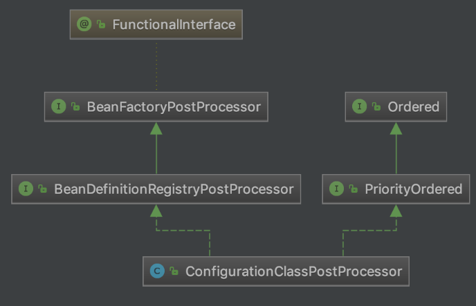
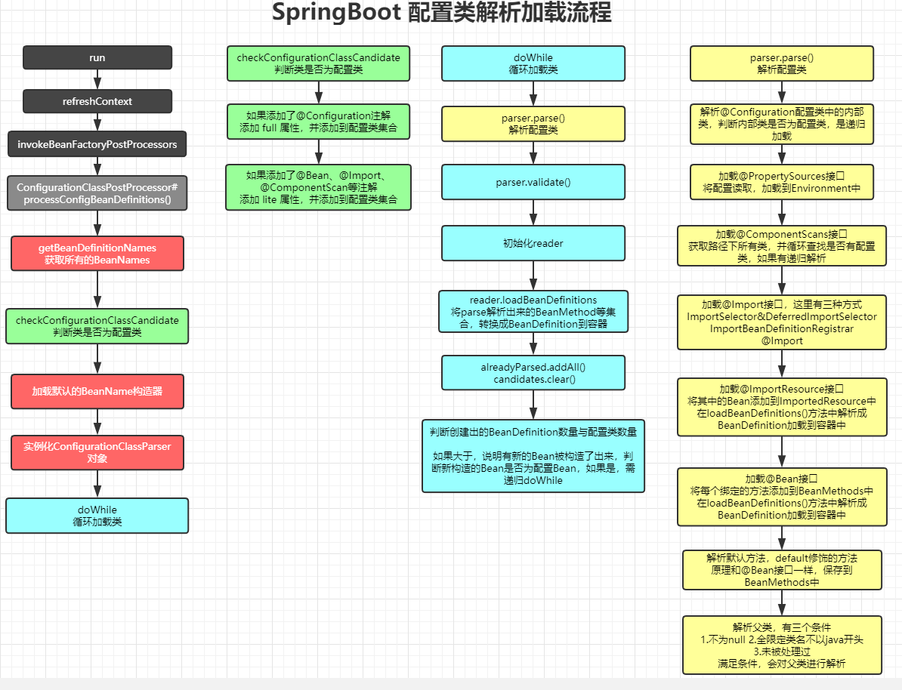

## 带着问题看源码

> 本章节主要讲述配置类的解析加载，所以先思考以下几个问题

- SpringBoot为何使用@Configuration注解，就可以把一个类当做配置类
- SpringBoot如何解析@ComponentScan、@ComponentScans注解的
- SpringBoot对于@Bean、@Import、 @ImportResource 注解又是如何解析的

可以发现，这几个注解都是与配置相关的

## 切入点

对于上述几个问题，有一个类进行了配置类解析加载的工作，即`ConfigurationClassPostProcessor`，看到类名称，就知道它是后置处理器，定是BeanFactory或Bean的后置处理器。

- ConfigurationClassPostProcessor是一个BeanFactory的后置处理器，因此它的主要功能是参与BeanFactory的建造，在这个类中，会解析加了@Configuration的配置类，还会解析@ComponentScan、@ComponentScans注解扫描的包，以及解析@Import等注解。
- ConfigurationClassPostProcessor 实现了 BeanDefinitionRegistryPostProcessor 接口，而 BeanDefinitionRegistryPostProcessor 接口继承了 BeanFactoryPostProcessor 接口，所以 ConfigurationClassPostProcessor 中需要重写 postProcessBeanDefinitionRegistry() 方法和 postProcessBeanFactory() 方法。而ConfigurationClassPostProcessor类的作用就是通过这两个方法去实现的。



通过我们直接对refresh()方法的解析，我们知道对于BeanFactoryPostProcessor都是在invokeBeanFactoryPostProcessors方法中执行的，执行其postProcessBeanDefinitionRegistry()方法

所以，我们有了以上了解，就可以带着问题看源码了

## ConfigurationClassPostProcessor配置类解析

### processConfigBeanDefinitions

> 此方法较长，我们会先对总体流程进行介绍，然后后面分为一个个小节对具体核心方法进行介绍

```java
public void processConfigBeanDefinitions(BeanDefinitionRegistry registry) {
    List<BeanDefinitionHolder> configCandidates = new ArrayList<>();
    // registry就是DefaultListableBeanFactory
    // 获取所有注册的BeanName
    String[] candidateNames = registry.getBeanDefinitionNames();

    // 循环BeanName
    for (String beanName : candidateNames) {
        // 获取对应的BeanDefinition
        BeanDefinition beanDef = registry.getBeanDefinition(beanName);
        // 这里主要用来判断该Bean是否处理过
        if (ConfigurationClassUtils.isFullConfigurationClass(beanDef) ||
            ConfigurationClassUtils.isLiteConfigurationClass(beanDef)) {
            if (logger.isDebugEnabled()) {
                logger.debug("Bean definition has already been processed as a configuration class: " + beanDef);
            }
        }
        // 没有处理过，执行checkConfigurationClassCandidate方法
        // 如果此Bean具有@Configuration注解，添加full属性
        // 如果此Bean具有@Bean、@Import、@ComponentScan等注解，添加lite属性
        // 目的是对于full，后面会使用Cglib进行增强
        // 添加到需要处理的config集合中
        else if (ConfigurationClassUtils.checkConfigurationClassCandidate(beanDef, this.metadataReaderFactory)) {
            configCandidates.add(new BeanDefinitionHolder(beanDef, beanName));
        }
    }

    // 如果不存在需要处理的配置类，直接返回
    if (configCandidates.isEmpty()) {
        return;
    }

    // 根据@Order注解排序
    configCandidates.sort((bd1, bd2) -> {
        int i1 = ConfigurationClassUtils.getOrder(bd1.getBeanDefinition());
        int i2 = ConfigurationClassUtils.getOrder(bd2.getBeanDefinition());
        return Integer.compare(i1, i2);
    });

    // 这里主要是判断是否有BeanName生成器，如果有，则设置为配置的BeanName生成器
    // 默认是没有的
    SingletonBeanRegistry sbr = null;
    if (registry instanceof SingletonBeanRegistry) {
        sbr = (SingletonBeanRegistry) registry;
        if (!this.localBeanNameGeneratorSet) {
            BeanNameGenerator generator = (BeanNameGenerator) sbr.getSingleton(CONFIGURATION_BEAN_NAME_GENERATOR);
            if (generator != null) {
                // componentScanBeanNameGenerator与importBeanNameGenerator定义时就赋值了new AnnotationBeanNameGenerator()
                // 如果存在生成器，重新赋值
                this.componentScanBeanNameGenerator = generator;
                this.importBeanNameGenerator = generator;
            }
        }
    }

    if (this.environment == null) {
        this.environment = new StandardEnvironment();
    }

    // 实例化ConfigurationClassParser对象，该类用来解析@Configuration注解的配置类
    ConfigurationClassParser parser = new ConfigurationClassParser(
        this.metadataReaderFactory, this.problemReporter, this.environment,
        this.resourceLoader, this.componentScanBeanNameGenerator, registry);

    // candidates集合用于保存configCandidates，去重
    // alreadyParsed用于保存已经解析完毕的配置类
    Set<BeanDefinitionHolder> candidates = new LinkedHashSet<>(configCandidates);
    Set<ConfigurationClass> alreadyParsed = new HashSet<>(configCandidates.size());
    
    // doWhile中执行最重要的具体解析流程
    do {
        // 解析配置类的主要方法
        // 解析八种配置类：Component中的内部配置类，@PropertySource，@ComponentScan，@Import，@ImportResource，@Bean，default methods，superclass
        parser.parse(candidates);
        // 对解析出来的ConfigurationClass进行校验
        parser.validate();

        // 将parse出来的ConfigurationClasses集合保存
        Set<ConfigurationClass> configClasses = new LinkedHashSet<>(parser.getConfigurationClasses());
        // 移出已经解析过的
        configClasses.removeAll(alreadyParsed);

        // 判断reader是否存在，不存在实例化一个
        // 用来读取配置类
        if (this.reader == null) {
            this.reader = new ConfigurationClassBeanDefinitionReader(
                registry, this.sourceExtractor, this.resourceLoader, this.environment,
                this.importBeanNameGenerator, parser.getImportRegistry());
        }
        // 将parse方法解析出来的BeanMethod集合，转换成对应的BeanDefinition对象
        this.reader.loadBeanDefinitions(configClasses);
        // 将解析完毕后的配置类添加到已完成集合中
        alreadyParsed.addAll(configClasses);

        // 清空集合
        candidates.clear();
        
        // 这里的判断主要是看解析出来的BeanDefinition数量是否多于原始数量
        // 如果多于，说明有新的Bean加载了进来，比如@Configuration中有两个内部配置类，就会多出两个
        // 接着就会判断多出来的 类是否为配置类，如果为配置类，添加到candidates集合中
        // 这样就会继续doWhile循环加载配置类
        if (registry.getBeanDefinitionCount() > candidateNames.length) {
            String[] newCandidateNames = registry.getBeanDefinitionNames();
            Set<String> oldCandidateNames = new HashSet<>(Arrays.asList(candidateNames));
            Set<String> alreadyParsedClasses = new HashSet<>();
            for (ConfigurationClass configurationClass : alreadyParsed) {
                alreadyParsedClasses.add(configurationClass.getMetadata().getClassName());
            }
            for (String candidateName : newCandidateNames) {
                if (!oldCandidateNames.contains(candidateName)) {
                    BeanDefinition bd = registry.getBeanDefinition(candidateName);
                    if (ConfigurationClassUtils.checkConfigurationClassCandidate(bd, this.metadataReaderFactory) &&
                        !alreadyParsedClasses.contains(bd.getBeanClassName())) {
                        candidates.add(new BeanDefinitionHolder(bd, candidateName));
                    }
                }
            }
            candidateNames = newCandidateNames;
        }
    }
    while (!candidates.isEmpty());

    // Register the ImportRegistry as a bean in order to support ImportAware @Configuration classes
    if (sbr != null && !sbr.containsSingleton(IMPORT_REGISTRY_BEAN_NAME)) {
        sbr.registerSingleton(IMPORT_REGISTRY_BEAN_NAME, parser.getImportRegistry());
    }

    if (this.metadataReaderFactory instanceof CachingMetadataReaderFactory) {
        // Clear cache in externally provided MetadataReaderFactory; this is a no-op
        // for a shared cache since it'll be cleared by the ApplicationContext.
        ((CachingMetadataReaderFactory) this.metadataReaderFactory).clearCache();
    }
}
```

了解完大致流程后，我们对核心方法进行具体源码解析

### checkConfigurationClassCandidate

此方法主要用来判断该类是否为配置类

```java
public static boolean checkConfigurationClassCandidate(BeanDefinition beanDef, MetadataReaderFactory metadataReaderFactory) {
	// ... 省略部分不重要的代码
	if (isFullConfigurationCandidate(metadata)) {
		// 含有@Configuration注解，那么对应的BeanDefinition的configurationClass属性值设置为full
		beanDef.setAttribute(CONFIGURATION_CLASS_ATTRIBUTE, CONFIGURATION_CLASS_FULL);
	}
	else if (isLiteConfigurationCandidate(metadata)) {
		// 含有@Bean,@Component,@ComponentScan,@Import,@ImportResource注解
		// configurationClass属性值设置为lite
		beanDef.setAttribute(CONFIGURATION_CLASS_ATTRIBUTE, CONFIGURATION_CLASS_LITE);
	}
	else {
		return false;
	}
	return true;
}

// 含有@Configuration注解
public static boolean isFullConfigurationCandidate(AnnotationMetadata metadata) {
	return metadata.isAnnotated(Configuration.class.getName());
}

// 判断是否含有candidateIndicators这个集合中的注解
public static boolean isLiteConfigurationCandidate(AnnotationMetadata metadata) {
	// candidateIndicators 是一个静态常量，在初始化时，包含了四个元素
	// 分别为@Component,@ComponentScan,@Import,@ImportResource这四个注解
	// 只要这个类上添加了这四种注解中的一个，就便是这个类是一个配置类，
	// 这个类对应的BeanDefinition中的configurationClass属性值为lite
	for (String indicator : candidateIndicators) {
		if (metadata.isAnnotated(indicator)) {
			return true;
		}
	}
        // 查找有没有加了@Bean注解的方法
	try {
		return metadata.hasAnnotatedMethods(Bean.class.getName());
	}
	catch (Throwable ex) {
		return false;
	}
}

private static final Set<String> candidateIndicators = new HashSet<>(8);

// 类加载至JVM时，向集合中添加了四个元素
static {
	candidateIndicators.add(Component.class.getName());
	candidateIndicators.add(ComponentScan.class.getName());
	candidateIndicators.add(Import.class.getName());
	candidateIndicators.add(ImportResource.class.getName());
}
```

是配置类的，才会加载到configCandidates集合中，用来在下面进行解析处理

### parser.parse

>  该方法调用的是`ConfigurationClassParser.parse()`，`ConfigurationClassParser`类，根据类名就能猜测出，这个类是用来解析配置类的 

```java
public void parse(Set<BeanDefinitionHolder> configCandidates) {
    // 循环需要处理的配置类
    for (BeanDefinitionHolder holder : configCandidates) {
        // 判断其类型是注解方式还是抽象类等方式
        // 最后都会调用processConfigurationClass()方法
        BeanDefinition bd = holder.getBeanDefinition();
        try {
            if (bd instanceof AnnotatedBeanDefinition) {
                parse(((AnnotatedBeanDefinition) bd).getMetadata(), holder.getBeanName());
            }
            else if (bd instanceof AbstractBeanDefinition && ((AbstractBeanDefinition) bd).hasBeanClass()) {
                parse(((AbstractBeanDefinition) bd).getBeanClass(), holder.getBeanName());
            }
            else {
                parse(bd.getBeanClassName(), holder.getBeanName());
            }
        }
        // ···
    }
}
```

所以我们进入processConfigurationClass()方法中查看

```java
protected void processConfigurationClass(ConfigurationClass configClass) throws IOException {
	// 处理配置类，由于配置类可能存在父类(若父类的全类名是以java开头的，则除外)，所以需要将configClass变成sourceClass去解析，然后返回sourceClass的父类。
	// 如果此时父类为空，则不会进行while循环去解析，如果父类不为空，则会循环的去解析父类
	// SourceClass的意义：简单的包装类，目的是为了以统一的方式去处理带有注解的类，不管这些类是如何加载的
	// 如果无法理解，可以把它当做一个黑盒，不会影响看spring源码的主流程
	SourceClass sourceClass = asSourceClass(configClass);
	do {
    // 核心处理逻辑
		sourceClass = doProcessConfigurationClass(configClass, sourceClass);
	}
	while (sourceClass != null);
    // 将解析的配置类存储起来，这样回到parse()方法时，能取到值
	this.configurationClasses.put(configClass, configClass);
}

```

这里主要是看核心处理方法doProcessConfigurationClass()

```java
@Nullable
protected final SourceClass doProcessConfigurationClass(ConfigurationClass configClass, SourceClass sourceClass)
    throws IOException {
	// 处理内部类
    if (configClass.getMetadata().isAnnotated(Component.class.getName())) {
        // Recursively process any member (nested) classes first
        processMemberClasses(configClass, sourceClass);
    }

    // 处理@PropertySources加载的配置文件，加载到Environment中
    for (AnnotationAttributes propertySource : AnnotationConfigUtils.attributesForRepeatable(
        sourceClass.getMetadata(), PropertySources.class,
        org.springframework.context.annotation.PropertySource.class)) {
        if (this.environment instanceof ConfigurableEnvironment) {
            processPropertySource(propertySource);
        }
        else {
            logger.info("Ignoring @PropertySource annotation on [" + sourceClass.getMetadata().getClassName() +
                        "]. Reason: Environment must implement ConfigurableEnvironment");
        }
    }

    // 处理@ComponentScan扫描的包下的所有类，加载成BeanDefinition对象
    // 根据设置的basePackages或basePackageClasses进行加载，如果没设置路径，默认使用当前类所在路径
    // 可以设置excludeFilters，includeFilters进行过滤
    // 并且如果包下具有配置类，会进行递归解析
    Set<AnnotationAttributes> componentScans = AnnotationConfigUtils.attributesForRepeatable(
        sourceClass.getMetadata(), ComponentScans.class, ComponentScan.class);
    if (!componentScans.isEmpty() &&
        !this.conditionEvaluator.shouldSkip(sourceClass.getMetadata(), ConfigurationPhase.REGISTER_BEAN)) {
        for (AnnotationAttributes componentScan : componentScans) {
            // 将包下的类，解析成BeanDefinition存储到集合中
            Set<BeanDefinitionHolder> scannedBeanDefinitions =
                this.componentScanParser.parse(componentScan, sourceClass.getMetadata().getClassName());
            // 循环BeanDefinition，主要是用来查找配置类的
            for (BeanDefinitionHolder holder : scannedBeanDefinitions) {
                BeanDefinition bdCand = holder.getBeanDefinition().getOriginatingBeanDefinition();
                if (bdCand == null) {
                    bdCand = holder.getBeanDefinition();
                }
                // 如果该Bean属于配置类，递归解析
                if (ConfigurationClassUtils.checkConfigurationClassCandidate(bdCand, this.metadataReaderFactory)) {
                    parse(bdCand.getBeanClassName(), holder.getBeanName());
                }
            }
        }
    }

    // 解析@Import实现类，分为三种情况
    // 一、ImportSelector.class & DeferredImportSelector.class
    // 会执行selectImports方法，获取返回的String数组，进行加载配置类，后者优先级低于前者
    // 二、ImportBeanDefinitionRegistrar.class
    // 对于此接口实现，加载其方法中注册的Bean，判断是否为配置Bean
    // 三、@Import(A.class)
    // 判断是否为配置类，是则加载
    processImports(configClass, sourceClass, getImports(sourceClass), true);

    // 处理@ImportResource配置的配置文件
    // 解析配置文件，添加到ImportedResource集合中
    // 后续再loadBeanDefinitions进行配置中Bean的加载
    AnnotationAttributes importResource =
        AnnotationConfigUtils.attributesFor(sourceClass.getMetadata(), ImportResource.class);
    if (importResource != null) {
        String[] resources = importResource.getStringArray("locations");
        Class<? extends BeanDefinitionReader> readerClass = importResource.getClass("reader");
        for (String resource : resources) {
            String resolvedResource = this.environment.resolveRequiredPlaceholders(resource);
            configClass.addImportedResource(resolvedResource, readerClass);
        }
    }

    // 将使用@Bean注解绑定的 方法，添加到BeanMethods中
    // 并保存到configClass中
    // 后续会在loadBeanDefinitions进行配置中Bean的加载
    Set<MethodMetadata> beanMethods = retrieveBeanMethodMetadata(sourceClass);
    for (MethodMetadata methodMetadata : beanMethods) {
        configClass.addBeanMethod(new BeanMethod(methodMetadata, configClass));
    }

    // 对于Bean默认方法，处理逻辑和@Bean一样，添加到BeanMethods中，在后续进行Bean的加载
    processInterfaces(configClass, sourceClass);

    // 处理该配置类父类，有三个条件
    // 1.不能为null 2.全路径不以java开头 3.未被处理过
    // 满足条件，会对父类进行一个解析
    if (sourceClass.getMetadata().hasSuperClass()) {
        String superclass = sourceClass.getMetadata().getSuperClassName();
        if (superclass != null && !superclass.startsWith("java") &&
            !this.knownSuperclasses.containsKey(superclass)) {
            this.knownSuperclasses.put(superclass, configClass);
            // Superclass found, return its annotation metadata and recurse
            return sourceClass.getSuperClass();
        }
    }

    // No superclass -> processing is complete
    return null;
}
```

###  loadBeanDefinitions 

解析完配置类后，我们看一下主要加载BeanDefinition的方法

```java
public void loadBeanDefinitions(Set<ConfigurationClass> configurationModel) {
	TrackedConditionEvaluator trackedConditionEvaluator = new TrackedConditionEvaluator();
	for (ConfigurationClass configClass : configurationModel) {
    // 循环调用loadBeanDefinitionsForConfigurationClass()
		loadBeanDefinitionsForConfigurationClass(configClass, trackedConditionEvaluator);
	}
}

private void loadBeanDefinitionsForConfigurationClass(
		ConfigurationClass configClass, TrackedConditionEvaluator trackedConditionEvaluator) {
	// 省略部分代码 ... 

	if (configClass.isImported()) {
		registerBeanDefinitionForImportedConfigurationClass(configClass);
	}
    
	// 将parse解析的BeanMethod进行循环加载成BeanDefinition，放到容器中
	for (BeanMethod beanMethod : configClass.getBeanMethods()) {
		loadBeanDefinitionsForBeanMethod(beanMethod);
	}
    
    // 将ImportedResource集合中的类进行解析加载BeanDefinition
	loadBeanDefinitionsFromImportedResources(configClass.getImportedResources());
    
	// 如果bean上存在@Import注解，且import的是一个实现了ImportBeanDefinitionRegistrar接口,则执行ImportBeanDefinitionRegistrar的registerBeanDefinitions()方法
	loadBeanDefinitionsFromRegistrars(configClass.getImportBeanDefinitionRegistrars());
}

```

可以看到，该方法就是将我们刚刚解析出来的一些配置，解析BeanDefinition加载到容器中

## 总结配置类加载流程

