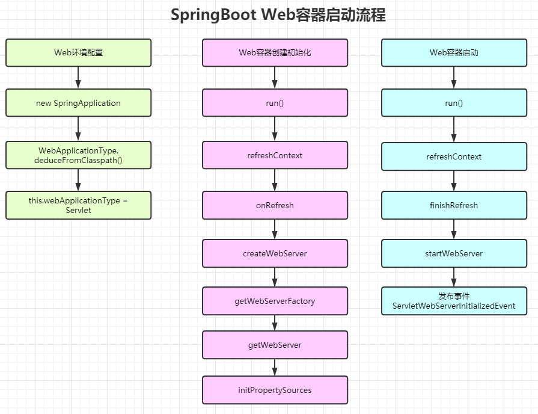
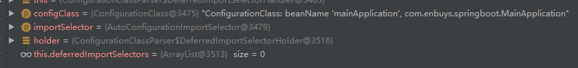
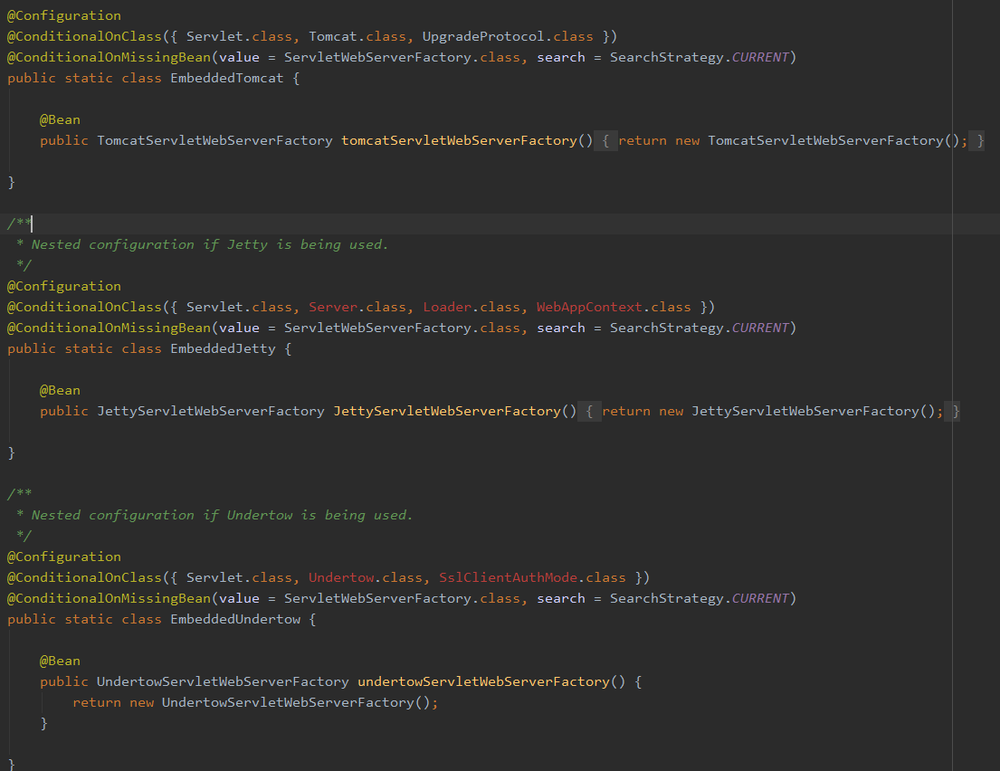
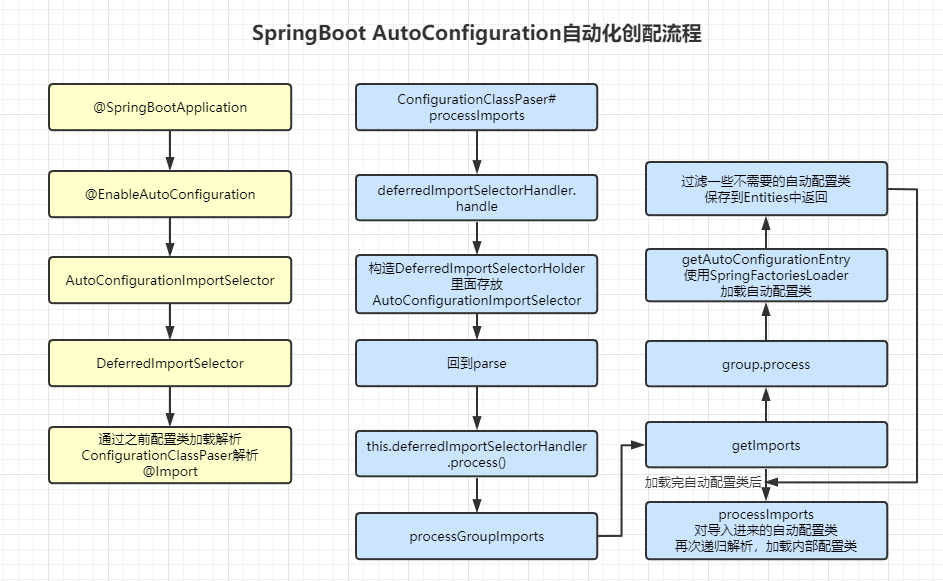

## Web容器启动

通过之前启动流程的学习，我们知道在实例化SpringApplication应用时，确定了当前所处的环境是否为web环境，在run方法启动时，刷新上下文中，会进行Web容器的创建

我们这节就跟着源码详细看一下Web容器的启动流程

### Web环境的配置

```java
public SpringApplication(ResourceLoader resourceLoader, Class<?>... primarySources) {
    this.resourceLoader = resourceLoader;
    Assert.notNull(primarySources, "PrimarySources must not be null");
    this.primarySources = new LinkedHashSet<>(Arrays.asList(primarySources));
    // 确定当前环境，是否为web应用
    this.webApplicationType = WebApplicationType.deduceFromClasspath();
    setInitializers((Collection) getSpringFactoriesInstances(ApplicationContextInitializer.class));
    setListeners((Collection) getSpringFactoriesInstances(ApplicationListener.class));
    this.mainApplicationClass = deduceMainApplicationClass();
}

/*
SERVLET_INDICATOR_CLASSES = { "javax.servlet.Servlet",    "org.springframework.web.context.ConfigurableWebApplicationContext" };

WEBMVC_INDICATOR_CLASS = "org.springframework." + "web.servlet.DispatcherServlet";

WEBFLUX_INDICATOR_CLASS = "org." + "springframework.web.reactive.DispatcherHandler";

JERSEY_INDICATOR_CLASS = "org.glassfish.jersey.servlet.ServletContainer";
*/
static WebApplicationType deduceFromClasspath() {
    // 判断环境中 是否有webflux相关类，确定是否为reactive环境
    if (ClassUtils.isPresent(WEBFLUX_INDICATOR_CLASS, null) && !ClassUtils.isPresent(WEBMVC_INDICATOR_CLASS, null)
        && !ClassUtils.isPresent(JERSEY_INDICATOR_CLASS, null)) {
        return WebApplicationType.REACTIVE;
    }
    // 判断是否为普通的环境
    for (String className : SERVLET_INDICATOR_CLASSES) {
        if (!ClassUtils.isPresent(className, null)) {
            return WebApplicationType.NONE;
        }
    }
    // 都不是返回Servlet环境
    return WebApplicationType.SERVLET;
}
```

通过上面源码，我们可以看到SpringBoot是如何判断当前环境的，实际就是看classpath下是否具有绝对特征的类。

接着我们去run方法中的refresh中查看启动流程

### WebServer的初始化

在refresh之前，有一步创建应用上下文的操作，在这里就会使用到我们刚刚赋值的webApplicationType，根据他创建默认的WebServerContextClass，进行初始化

之前我们说到，`onRefresh();`此方法会根据环境 调用不同的具体实现类，因为我们是Web环境，所以去ServletWebServerApplicationContext中查看具体实现

```java
@Override
protected void onRefresh() {
    super.onRefresh();
    try {
        createWebServer();
    }
    catch (Throwable ex) {
        throw new ApplicationContextException("Unable to start web server", ex);
    }
}

// 创建web服务器
private void createWebServer() {
    WebServer webServer = this.webServer;
    ServletContext servletContext = getServletContext();
    if (webServer == null && servletContext == null) {
        // 通过BeanFactory工厂，创建一个ServletServer工厂
        ServletWebServerFactory factory = getWebServerFactory();
        // 从工厂中取服务器对象，这里是Tomcat
        this.webServer = factory.getWebServer(getSelfInitializer());
    }
    else if (servletContext != null) {
        try {
            getSelfInitializer().onStartup(servletContext);
        }
        catch (ServletException ex) {
            throw new ApplicationContextException("Cannot initialize servlet context", ex);
        }
    }
    // 对Tomcat容器进行一些配置修改操作
    initPropertySources();
}
@Override
protected void initPropertySources() {
    // 获取环境，从环境中获取信息修改Tomcat
    ConfigurableEnvironment env = getEnvironment();
    if (env instanceof ConfigurableWebEnvironment) {
        ((ConfigurableWebEnvironment) env).initPropertySources(this.servletContext, null);
    }
}
@Override
public void initPropertySources(@Nullable ServletContext servletContext, @Nullable ServletConfig servletConfig) {
    WebApplicationContextUtils.initServletPropertySources(getPropertySources(), servletContext, servletConfig);
}

@Override
protected void customizePropertySources(MutablePropertySources propertySources) {
    // 这里主要是判断是否有实现servletContextInitParams或servletConfigInitParams
    // 如果有进行一个替换
    propertySources.addLast(new StubPropertySource(SERVLET_CONFIG_PROPERTY_SOURCE_NAME));
    propertySources.addLast(new StubPropertySource(SERVLET_CONTEXT_PROPERTY_SOURCE_NAME));
    if (JndiLocatorDelegate.isDefaultJndiEnvironmentAvailable()) {
        propertySources.addLast(new JndiPropertySource(JNDI_PROPERTY_SOURCE_NAME));
    }
    super.customizePropertySources(propertySources);
}
```

到此，Tomcat就准备完毕了，接着就是对Tomcat的启动

### WebServer启动

启动还是在refresh方法 中，在finishRefresh()时进行

```java
@Override
protected void finishRefresh() {
    super.finishRefresh();
    WebServer webServer = startWebServer();
    if (webServer != null) {
        // 启动完毕后，发布事件
        publishEvent(new ServletWebServerInitializedEvent(webServer, this));
    }
}

private WebServer startWebServer() {
    WebServer webServer = this.webServer;
    if (webServer != null) {
        // 根据不同的web容器，启动，这里是Tomcat
        webServer.start();
    }
    return webServer;
}

@Override
public void start() throws WebServerException {
    synchronized (this.monitor) {
        if (this.started) {
            return;
        }
        try {
            addPreviouslyRemovedConnectors();
            // 开启8080的监听
            Connector connector = this.tomcat.getConnector();
            if (connector != null && this.autoStart) {
                performDeferredLoadOnStartup();
            }
            checkThatConnectorsHaveStarted();
            // 标记启动状态为true
            this.started = true;
            // 输出日志，很常见，就是这里打印的
            logger.info("Tomcat started on port(s): " + getPortsDescription(true) + " with context path '"
                        + getContextPath() + "'");
        }
        catch (ConnectorStartFailedException ex) {
            stopSilently();
            throw ex;
        }
        catch (Exception ex) {
            throw new WebServerException("Unable to start embedded Tomcat server", ex);
        }
        finally {
            Context context = findContext();
            ContextBindings.unbindClassLoader(context, context.getNamingToken(), getClass().getClassLoader());
        }
    }
}
```

也是很简单的

### 总结Web启动流程



## WebServer是如何被加载的

刚刚我们了解到，在WebServer初始化时，会使用BeanFactory工厂，创建一个ServletServer工厂，然后从工厂取得Tomcat实例，那么这时就有疑问了，Servlet工厂是何时何地被加载的？

对SpringBoot开发有一定经验的都知道，SpringBoot使用大量的自动化配置，主要依靠`EnableAutoConfiguration`实现，所以，此节我们就需要对此进行解析，并配合我们之前学习的配置类加载解析，进行研究

首先来到SpringBoot的注解`@SpringBootApplication`

```java
@EnableAutoConfiguration
public @interface SpringBootApplication {
}
@Import(AutoConfigurationImportSelector.class)
public @interface EnableAutoConfiguration {
}
public class AutoConfigurationImportSelector implements DeferredImportSelector, BeanClassLoaderAware,
ResourceLoaderAware, BeanFactoryAware, EnvironmentAware, Ordered {
}
```

通过一层层关系，我们发现自动配置主要实现了`DeferredImportSelector`这个接口，这接口我们熟啊，之前学习配置类解析时刚刚知道，在`ConfigurationClassPaser`进行八大类配置加载时，其中之一就是它

所以我们再回到配置类加载的地方，再进行一个探究探索

> 代码进行了精简

```java
// 处理@Import相关注解
private void processImports(ConfigurationClass configClass, SourceClass currentSourceClass,      Collection<SourceClass> importCandidates, boolean checkForCircularImports) {
    for (SourceClass candidate : importCandidates) {
        // 处理@ImportSelector注解
        if (candidate.isAssignable(ImportSelector.class)) {
            // Candidate class is an ImportSelector -> delegate to it to determine imports
            Class<?> candidateClass = candidate.loadClass();
            ImportSelector selector = BeanUtils.instantiateClass(candidateClass, ImportSelector.class);
            ParserStrategyUtils.invokeAwareMethods(
                selector, this.environment, this.resourceLoader, this.registry);
            // 处理DeferredImportSelector注解，这不就是刚刚自动配置类实现的注解吗
            if (selector instanceof DeferredImportSelector) {
                this.deferredImportSelectorHandler.handle(configClass, (DeferredImportSelector) selector);
            }
        }
    }
}
```

找到目标后，进入`handle`方法查看

```java
public void handle(ConfigurationClass configClass, DeferredImportSelector importSelector) {
    DeferredImportSelectorHolder holder = new DeferredImportSelectorHolder(
        configClass, importSelector);
    if (this.deferredImportSelectors == null) {
        DeferredImportSelectorGroupingHandler handler = new DeferredImportSelectorGroupingHandler();
        handler.register(holder);
        handler.processGroupImports();
    }
    else {
        this.deferredImportSelectors.add(holder);
    }
}
```

这里代码比较简单，就是构造一个`DeferredImportSelectorHolder`，此对象中存放`configClass`和`Selectors`，以供之后使用，所以这里其实不是重点代码，但是我们可以断点看一下



可以发现，此时`importSelector`，就是我们想要找的自动配置类

接着，我们回到`parse`方法

```java
public void parse(Set<BeanDefinitionHolder> configCandidates) {
    for (BeanDefinitionHolder holder : configCandidates) {
        BeanDefinition bd = holder.getBeanDefinition();
        // ···
    }

    // 使用刚刚构建的处理器，进行处理
    this.deferredImportSelectorHandler.process();
}
```

这里就是处理自动配置的地方了，跟进去看看

```java
public void process() {
    List<DeferredImportSelectorHolder> deferredImports = this.deferredImportSelectors;
    this.deferredImportSelectors = null;
    try {
        if (deferredImports != null) {
            DeferredImportSelectorGroupingHandler handler = new DeferredImportSelectorGroupingHandler();
            deferredImports.sort(DEFERRED_IMPORT_COMPARATOR);
            // 循环创建AutoConfigurationGroup对象
            deferredImports.forEach(handler::register);
            // 处理Group对象
            handler.processGroupImports();
        }
    }
    finally {
        this.deferredImportSelectors = new ArrayList<>();
    }
}

public void processGroupImports() {
    for (DeferredImportSelectorGrouping grouping : this.groupings.values()) {
        // 首先会调用getImports方法，望文生义，应该是获取import进了的对象的
        grouping.getImports().forEach(entry -> {
            ConfigurationClass configurationClass = this.configurationClasses.get(
                entry.getMetadata());
            try {
                // 递归对配置类进行处理，获取其中是否包含其他配置类
                // 比如Tomcat就包含了@Bean注入的Web容器工厂，进行加载
                processImports(configurationClass, asSourceClass(configurationClass),
                               asSourceClasses(entry.getImportClassName()), false);
            }
            catch (BeanDefinitionStoreException ex) {
                throw ex;
            }
            catch (Throwable ex) {
                throw new BeanDefinitionStoreException(
                    "Failed to process import candidates for configuration class [" +
                    configurationClass.getMetadata().getClassName() + "]", ex);
            }
        });
    }
}
```

这里首先进入`getImports()`方法

```java
public Iterable<Group.Entry> getImports() {
    for (DeferredImportSelectorHolder deferredImport : this.deferredImports) {
        // 循环调用process方法
        this.group.process(deferredImport.getConfigurationClass().getMetadata(),
                           deferredImport.getImportSelector());
    }
    return this.group.selectImports();
}
```

这个`process()`就是关键方法了

```java
@Override
public void process(AnnotationMetadata annotationMetadata, DeferredImportSelector deferredImportSelector) {
    // 断言
    Assert.state(deferredImportSelector instanceof AutoConfigurationImportSelector,
                 () -> String.format("Only %s implementations are supported, got %s",
                                     AutoConfigurationImportSelector.class.getSimpleName(),
                                     deferredImportSelector.getClass().getName()));
    // 获取自动配置类们
    AutoConfigurationEntry autoConfigurationEntry = ((AutoConfigurationImportSelector) deferredImportSelector)
        .getAutoConfigurationEntry(getAutoConfigurationMetadata(), annotationMetadata);
    this.autoConfigurationEntries.add(autoConfigurationEntry);
    // 循环放到entires中
    for (String importClassName : autoConfigurationEntry.getConfigurations()) {
        this.entries.putIfAbsent(importClassName, annotationMetadata);
    }
}

// 获取自动配置类
protected AutoConfigurationEntry getAutoConfigurationEntry(AutoConfigurationMetadata autoConfigurationMetadata,
                                                           AnnotationMetadata annotationMetadata) {
    // 判断是否开启自动配置：spring.boot.enableautoconfiguration
    if (!isEnabled(annotationMetadata)) {
        return EMPTY_ENTRY;
    }
    // 获取属性，exclude
    AnnotationAttributes attributes = getAttributes(annotationMetadata);
    // 这里就是使用SpringFactoriesLoader，来加载EnableAutoConfiguration实现类，真正加载自动配置类的地方
    List<String> configurations = getCandidateConfigurations(annotationMetadata, attributes);
    // 移出一些重复类
    configurations = removeDuplicates(configurations);
    // 移出排除的类
    Set<String> exclusions = getExclusions(annotationMetadata, attributes);
    checkExcludedClasses(configurations, exclusions);
    configurations.removeAll(exclusions);
    // 过滤一些不需要的类
    configurations = filter(configurations, autoConfigurationMetadata);
    fireAutoConfigurationImportEvents(configurations, exclusions);
    // 返回加载进来的自动配置类
    return new AutoConfigurationEntry(configurations, exclusions);
}

// 从spring.factories中，获取EnableAutoConfiguration下的自动配置类
protected List<String> getCandidateConfigurations(AnnotationMetadata metadata, AnnotationAttributes attributes) {
    List<String> configurations = SpringFactoriesLoader.loadFactoryNames(getSpringFactoriesLoaderFactoryClass(),
                                                                         getBeanClassLoader());
    Assert.notEmpty(configurations, "No auto configuration classes found in META-INF/spring.factories. If you "
                    + "are using a custom packaging, make sure that file is correct.");
    return configurations;
}
```

到此，我们就找到了自动配置类加载的地方，别忘了我们一开始的问题是WebServer是如何被加载的，所以我们要去看一下WebServer的自动配置类：`ServletWebServerFactoryAutoConfiguration`

```java
@Import({ ServletWebServerFactoryAutoConfiguration.BeanPostProcessorsRegistrar.class,
		ServletWebServerFactoryConfiguration.EmbeddedTomcat.class,
		ServletWebServerFactoryConfiguration.EmbeddedJetty.class,
		ServletWebServerFactoryConfiguration.EmbeddedUndertow.class })
public class ServletWebServerFactoryAutoConfiguration {
```

通过类的注解，就会发现导入了三个容器实现，其中就有Tomcat



这里就会发现，除了Tomcat满足所有条件，其他两种容器都不满足条件，这也是为什么我们会使用Tomcat做Web容器的原因

并且Tomcat中，使用@Bean方式注入了ServletServer工厂，这也是为什么我们能从BeanFactory中获取Web服务器工厂的原因，具体配置类加载我们之前已经说过了对于@Bean方式会加载成BeanMethods中统一实例化

### 总结AutoConfiguration流程



