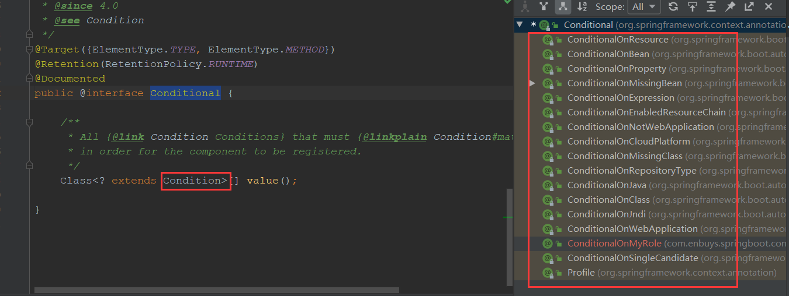
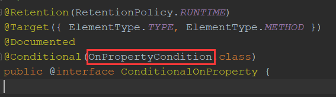
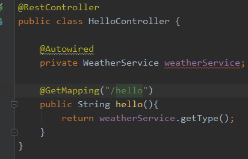

这一节比较简单，我们主要分析一下starter的使用，说到starter，一定离不开@Condition这个注解，可以看到每个自动化配置类上，几乎都加了这个注解，所以我们从这个注解开始了解

## @Conditional解析

### @Conditional源码查看



通过此注解的源码可以看到，具有大量实现接口，比如常见的

- `ConditionalOnBean`：Bean存在时生效
- `ConditionalOnProperty`：某个配置存在时生效

那么他们都是如何进行匹配的呢？这时我们就需要进入到`Condition`接口中

```java
@FunctionalInterface
public interface Condition {

	/**
	 * Determine if the condition matches.
	 * @param context the condition context
	 * @param metadata metadata of the {@link org.springframework.core.type.AnnotationMetadata class}
	 * or {@link org.springframework.core.type.MethodMetadata method} being checked
	 * @return {@code true} if the condition matches and the component can be registered,
	 * or {@code false} to veto the annotated component's registration
	 */
	boolean matches(ConditionContext context, AnnotatedTypeMetadata metadata);

}
```

可以看到此接口最重要的方法就是`matches`方法，那么我们就知道了，对于生效不生效，都是具体的`matches`方法实现的，所以我们就可以拿一个接口查看

**比如`@ConditionalOnProperty`**



```java
@Order(Ordered.HIGHEST_PRECEDENCE + 40)
class OnPropertyCondition extends SpringBootCondition {
}

public abstract class SpringBootCondition implements Condition {

    @Override
    public final boolean matches(ConditionContext context, AnnotatedTypeMetadata metadata) {
        String classOrMethodName = getClassOrMethodName(metadata);
        try {
            // 调用getMatchOutcome，来判断是否满足生效条件
            ConditionOutcome outcome = getMatchOutcome(context, metadata);
            logOutcome(classOrMethodName, outcome);
            recordEvaluation(context, classOrMethodName, outcome);
            return outcome.isMatch();
        }
    }
}
```

进入类中，没发现`matches`方法实现，所以去父类查看，发现其实对生效条件的校验，是在子类的`getMatchOutcome`方法实现的，所以我们再回到`OnPropertyCondition`中查看此方法

```java
@Override
public ConditionOutcome getMatchOutcome(ConditionContext context, AnnotatedTypeMetadata metadata) {
    // 首先获取注解上的属性，比如value，havingvalue，name等等
    List<AnnotationAttributes> allAnnotationAttributes = annotationAttributesFromMultiValueMap(
        metadata.getAllAnnotationAttributes(ConditionalOnProperty.class.getName()));
    // 构造两个集合，存放匹配的与不匹配的集合
    List<ConditionMessage> noMatch = new ArrayList<>();
    List<ConditionMessage> match = new ArrayList<>();
    // 循环处理Property
    for (AnnotationAttributes annotationAttributes : allAnnotationAttributes) {
        // 主要方法为determineOutcome，来判断环境中是否有配置的Property
        ConditionOutcome outcome = determineOutcome(annotationAttributes, context.getEnvironment());
        (outcome.isMatch() ? match : noMatch).add(outcome.getConditionMessage());
    }
    // 如果不匹配集合中有数据，返回false
    if (!noMatch.isEmpty()) {
        return ConditionOutcome.noMatch(ConditionMessage.of(noMatch));
    }
    return ConditionOutcome.match(ConditionMessage.of(match));
}

private ConditionOutcome determineOutcome(AnnotationAttributes annotationAttributes, PropertyResolver resolver) {
    Spec spec = new Spec(annotationAttributes);
    // 创建两个集合，和之前一样，存放不匹配的配置和不存在的配置
    List<String> missingProperties = new ArrayList<>();
    List<String> nonMatchingProperties = new ArrayList<>();
    // 从环境中查找配置，存放到miss或匹配集合
    spec.collectProperties(resolver, missingProperties, nonMatchingProperties);
    // 判断miss集合不为空，返回noMatch
    if (!missingProperties.isEmpty()) {
        return ConditionOutcome.noMatch(ConditionMessage.forCondition(ConditionalOnProperty.class, spec)
                                        .didNotFind("property", "properties").items(Style.QUOTE, missingProperties));
    }
    // 判断不匹配集合是否为空，返回noMatch
    if (!nonMatchingProperties.isEmpty()) {
        return ConditionOutcome.noMatch(ConditionMessage.forCondition(ConditionalOnProperty.class, spec)
                                        .found("different value in property", "different value in properties")
                                        .items(Style.QUOTE, nonMatchingProperties));
    }
    // 两个集合都为空，返回match
    return ConditionOutcome
        .match(ConditionMessage.forCondition(ConditionalOnProperty.class, spec).because("matched"));
}

// 从环境中查找具体配置
private void collectProperties(PropertyResolver resolver, List<String> missing, List<String> nonMatching) {
    // 
    for (String name : this.names) {
        String key = this.prefix + name;
        // 这里resolve就是Environment对象，判断环境中是否有此配置
        if (resolver.containsProperty(key)) {
            // 有的话，再判断值是否匹配，不匹配放到不集合中
            if (!isMatch(resolver.getProperty(key), this.havingValue)) {
                nonMatching.add(name);
            }
        }
        else {
            // 没找到，放到miss集合中
            if (!this.matchIfMissing) {
                missing.add(name);
            }
        }
    }
}
```

到此`@ConditionalOnProperty`就解析完毕了，不是很复杂，就是从环境中获取配置，判断是否存在

### 自定义@Conditional

接着我们模仿`@ConditionalOnProperty`，创建一个自定义的`@Conditional`注解

1）创建MyCondition对象，实现`Condition`接口，重写`matches`方法

```java
public class MyCondition implements Condition {
    @Override
    public boolean matches(ConditionContext context, AnnotatedTypeMetadata metadata) {
        // 判断注解类型，为我们创建的注解
        String[] value = (String[]) metadata.getAnnotationAttributes("com.enbuys.springboot.condition.ConditionalOnMyRole")
                .get("value");
        // 循环判断环境中是否有配置的属性
        for (String s : value) {
            if(context.getEnvironment().getProperty(s) == null){
                return false;
            }
        }
        return true;
    }
}
```

2）创建`ConditionalOnMyRole`注解，并绑定刚刚实现的Condition

```java
@Target({ElementType.TYPE, ElementType.METHOD})
@Retention(RetentionPolicy.RUNTIME)
@Documented
@Conditional(MyCondition.class)
public @interface ConditionalOnMyRole {

    String[] value() default {};

}
```

3）编写一个类，使用`ConditionOnMyRole`注解

```java
@Component
//@ConditionalOnProperty("com.enbuys.condition")
@ConditionalOnMyRole({"com.enbuys.condition","com.enbuys.condition2"})
public class AAA {
}
```

这样，就简单实现了一个自定义的判断是否生效的注解

## 自定义Starter

SpringBoot有很多starter插件，比如mybatis，redis，特点就是可拔插，通过简单的maven控制，就可以实现功能的添加，只需在环境中配置一些属性，就可以直接使用

我们先制作一个简单的starter，然后再分析starter是如何被加载的

### 制作Starter

首先新创建一个工程，为SpringBoot项目，添加依赖

```xml
<project xmlns="http://maven.apache.org/POM/4.0.0" xmlns:xsi="http://www.w3.org/2001/XMLSchema-instance"
         xsi:schemaLocation="http://maven.apache.org/POM/4.0.0 https://maven.apache.org/xsd/maven-4.0.0.xsd">
    <modelVersion>4.0.0</modelVersion>
    <parent>
        <groupId>org.springframework.boot</groupId>
        <artifactId>spring-boot-starter-parent</artifactId>
        <version>2.2.7.RELEASE</version>
        <relativePath/> <!-- lookup parent from repository -->
    </parent>
    <groupId>com.enbuys</groupId>
    <artifactId>demo-spring-boot-starter</artifactId>
    <version>0.0.1-SNAPSHOT</version>
    <name>demo-spring-boot-starter</name>
    <description>Demo project for Spring Boot</description>

    <properties>
        <java.version>1.8</java.version>
    </properties>

    <dependencies>
        <dependency>
            <groupId>org.springframework.boot</groupId>
            <artifactId>spring-boot-starter</artifactId>
        </dependency>
        <dependency>
            <groupId>org.springframework.boot</groupId>
            <artifactId>spring-boot-autoconfigure</artifactId>
        </dependency>
        <dependency>
            <groupId>org.springframework.boot</groupId>
            <artifactId>spring-boot-starter-test</artifactId>
            <scope>test</scope>
            <exclusions>
                <exclusion>
                    <groupId>org.junit.vintage</groupId>
                    <artifactId>junit-vintage-engine</artifactId>
                </exclusion>
            </exclusions>
        </dependency>
    </dependencies>

    <build>
        <plugins>
            <plugin>
                <groupId>org.springframework.boot</groupId>
                <artifactId>spring-boot-maven-plugin</artifactId>
            </plugin>
        </plugins>
    </build>

</project>
```

然后就可以进行自定义Starter的制作，上述依赖中最关键的就是`AutoConfiguration`依赖

创建数据源，主要目的为从配置文件取数据

```java
@ConfigurationProperties(prefix = "weather")
public class WeatherSource {
    private String type;
    private String rate;

    public String getType() {
        return type;
    }

    public void setType(String type) {
        this.type = type;
    }

    public String getRate() {
        return rate;
    }

    public void setRate(String rate) {
        this.rate = rate;
    }
}
```

创建Service，提供给外部使用的接口

```java
public class WeatherService {

    private WeatherSource weatherSource;

    public WeatherService(WeatherSource weatherSource){
        this.weatherSource = weatherSource;
    }

    public String getType(){
        return weatherSource.getType();
    }

    public String getRate(){
        return weatherSource.getRate();
    }
}
```

自动配置类

```java
@Configuration
@EnableConfigurationProperties(WeatherSource.class)
@ConditionalOnProperty(name = "weather.enable",havingValue = "enable")
public class WeatherAutoConfiguration {

    @Autowired
    private WeatherSource weatherSource;

    @Bean
    public WeatherService weatherService(){
        return new WeatherService(weatherSource);
    }
}
```

自动配置类很关键，可以看到他启用了数据源，这样就会把数据源加载的容器，然后使用@Bean的方式注入Service，这样外部就可以使用Service进行操作

添加自动配置类到`spring.factories`中

```properties
org.springframework.boot.autoconfigure.EnableAutoConfiguration=com.enbuys.demospringbootstarter.weather.WeatherAutoConfiguration
```

然后使用`maven clean install`命令，将jar包打到仓库，这样别的工厂就可以引用了

到此，自定义的Starter就制作完毕，最关键有三点

- 使用`@ConfigurationProperties`，制作一个数据源对象，获取配置文件中的数据
- 创建自动配置类，使用`@Bean`，`@EnableConfigurationProperties`，向容器添加接口
- 将自动配置类添加到工厂中

接着就是测试，测试很简单，只需在springboot项目依赖中，引入我们刚刚创建的starter即可

```xml
<dependency>
    <groupId>com.enbuys</groupId>
    <artifactId>demo-spring-boot-starter</artifactId>
    <version>0.0.1-SNAPSHOT</version>
</dependency>
```



### Starter加载原理

Starter的加载原理其实我们之前都已经学习过了，因为它主要使用自动配置类，然后装载到工厂中，通过前面的知识我们可以知道：

- SpringBoot启动时，在run -》 refreshContext -》 invokeBeanFactoryPostProcessor执行后置处理时
- 会执行到ConfigurationClassPostProcessor，就会使用ConfigurationClassPaser对配置类进行解析
- 其中就会读取spring.factories文件中的EnableAutoConfiguration实现类，进行加载
- 再递归实现类中是否添加了新的配置类

这样就将自动配置类加载到容器中，这也是为什么接口可以直接@Autowired使用的原因