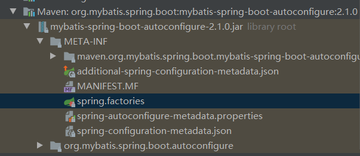
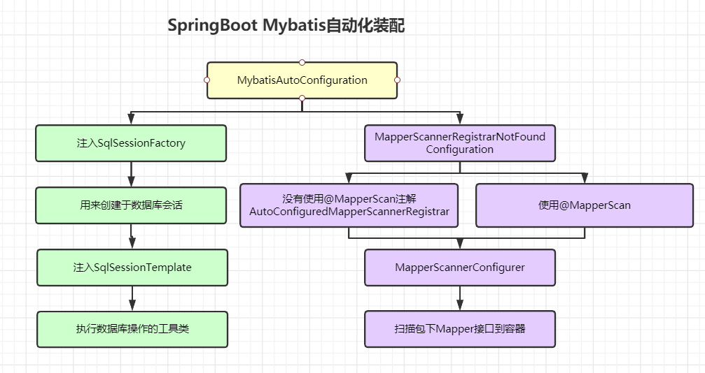

通过前面stater的学习，我们看看最常用的mybatis-starter是如何实现自动配置加载的

通过学习，我们知道mybatis一定也引入了一个AutoConfiguration的包，所以我们直接去源码包中查看



进入`spring.factories`文件中查看

```properties
# Auto Configure
org.springframework.boot.autoconfigure.EnableAutoConfiguration=\
org.mybatis.spring.boot.autoconfigure.MybatisLanguageDriverAutoConfiguration,\
org.mybatis.spring.boot.autoconfigure.MybatisAutoConfiguration
```

这里引入了两个自动配置类，其中我们只需要关注`MybatisAutoConfiguration`，另一个用不到

接下来我会对`MybatisAutoConfiguration`的源码进行解析，提炼精简，最后总结该自动配置类做了哪些事

```java
@org.springframework.context.annotation.Configuration
// 确保环境中存在SqlSessionFactory，好用来创建SqlSession
@ConditionalOnClass({ SqlSessionFactory.class, SqlSessionFactoryBean.class })
// 存在数据源信息
@ConditionalOnSingleCandidate(DataSource.class)
// 加载Mybatis配置，这里就可以去此配置文件中，看看Mybatis有哪些配置，我们可以配置在环境上
@EnableConfigurationProperties(MybatisProperties.class)
// 在数据源加载完毕后进行加载
@AutoConfigureAfter({ DataSourceAutoConfiguration.class, MybatisLanguageDriverAutoConfiguration.class })
public class MybatisAutoConfiguration implements InitializingBean {

// 加载SqlSessionFactory，用来创建SqlSession
  @Bean
  @ConditionalOnMissingBean
  public SqlSessionFactory sqlSessionFactory(DataSource dataSource) throws Exception {
    SqlSessionFactoryBean factory = new SqlSessionFactoryBean();
    factory.setDataSource(dataSource);
    factory.setVfs(SpringBootVFS.class);
    //···
    return factory.getObject();
  }


// 加载SqlSessionTemplate，为具体执行增删改查操作的工具类
  @Bean
  @ConditionalOnMissingBean
  public SqlSessionTemplate sqlSessionTemplate(SqlSessionFactory sqlSessionFactory) {
    ExecutorType executorType = this.properties.getExecutorType();
    if (executorType != null) {
      return new SqlSessionTemplate(sqlSessionFactory, executorType);
    } else {
      return new SqlSessionTemplate(sqlSessionFactory);
    }
  }

// 自动扫描Mapper接口所在的包，并对其加载
// 通过ImportBeanDefinitionRegistrar#registerBeanDefinitions实现
// 加载时机我们在之前配置加载解析时详细说过
  public static class AutoConfiguredMapperScannerRegistrar implements BeanFactoryAware, ImportBeanDefinitionRegistrar {

    private BeanFactory beanFactory;

    @Override
    public void registerBeanDefinitions(AnnotationMetadata importingClassMetadata, BeanDefinitionRegistry registry) {

      BeanDefinitionBuilder builder = BeanDefinitionBuilder.genericBeanDefinition(MapperScannerConfigurer.class);
      builder.addPropertyValue("processPropertyPlaceHolders", true);
      builder.addPropertyValue("annotationClass", Mapper.class);
      builder.addPropertyValue("basePackage", StringUtils.collectionToCommaDelimitedString(packages));
      BeanWrapper beanWrapper = new BeanWrapperImpl(MapperScannerConfigurer.class);
      Stream.of(beanWrapper.getPropertyDescriptors())
          // Need to mybatis-spring 2.0.2+
          .filter(x -> x.getName().equals("lazyInitialization")).findAny()
          .ifPresent(x -> builder.addPropertyValue("lazyInitialization", "${mybatis.lazy-initialization:false}"));
        // 注册Mapper接口
      registry.registerBeanDefinition(MapperScannerConfigurer.class.getName(), builder.getBeanDefinition());
    }

    @Override
    public void setBeanFactory(BeanFactory beanFactory) {
      this.beanFactory = beanFactory;
    }

  }

// 主要是自动配置-自动扫描Mapper接口类，@Import
// 注意！这里会发现只有在环境不存在MapperScannerConfigurer的时候加载，为什么会这样呢？因为上面说的自动扫描是扫描默认包下的接口，但是一般情况下，我们会使用@MapperScan注解，来绑定扫描某个路径下的Mapper接口
// 所以，为了防止重复加载，只有在@MapperScan不存在时，才会自动扫描Mapper
  @org.springframework.context.annotation.Configuration
  @Import(AutoConfiguredMapperScannerRegistrar.class)
  @ConditionalOnMissingBean({ MapperFactoryBean.class, MapperScannerConfigurer.class })
  public static class MapperScannerRegistrarNotFoundConfiguration implements InitializingBean {

    @Override
    public void afterPropertiesSet() {
      logger.debug(
          "Not found configuration for registering mapper bean using @MapperScan, MapperFactoryBean and MapperScannerConfigurer.");
    }

  }

}
```

总结SpringBoot对Mybatis自动化装配



