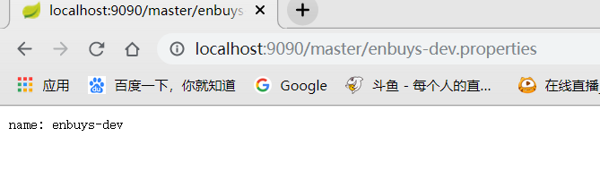
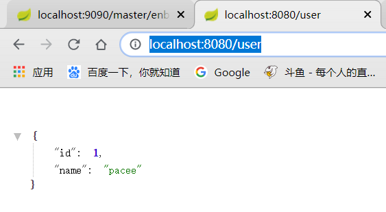
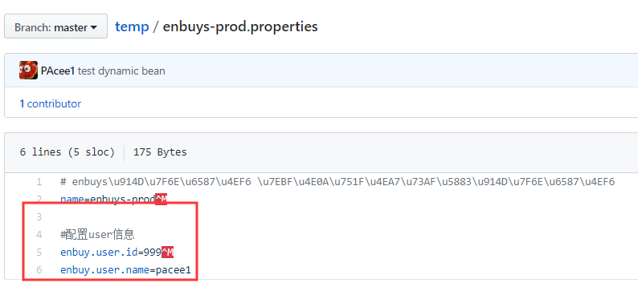
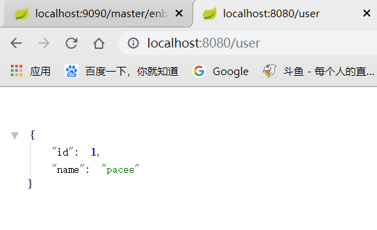
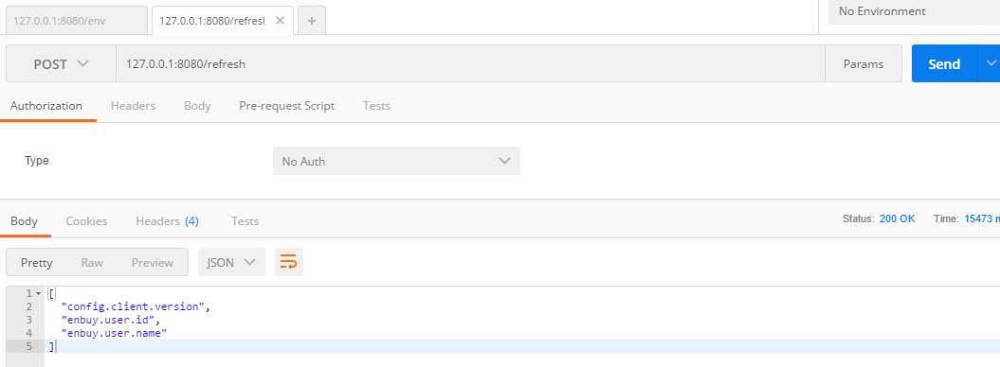
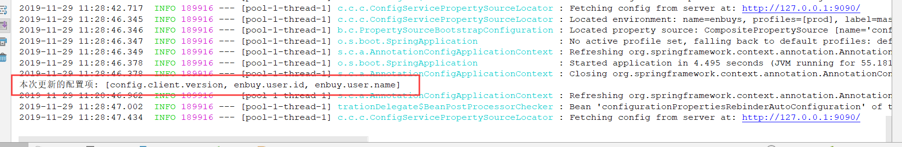
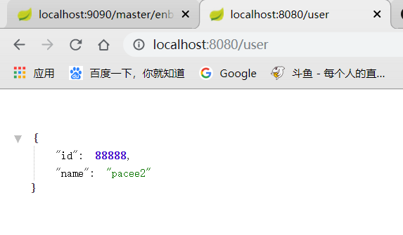
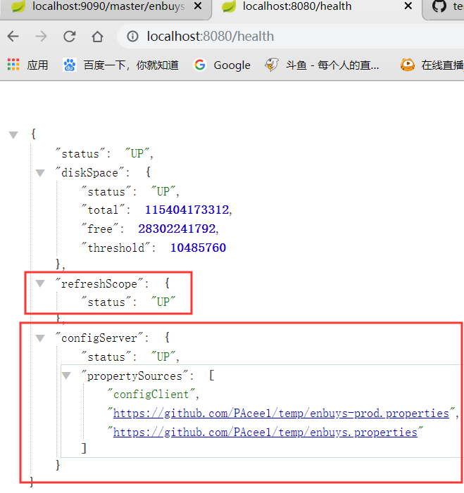
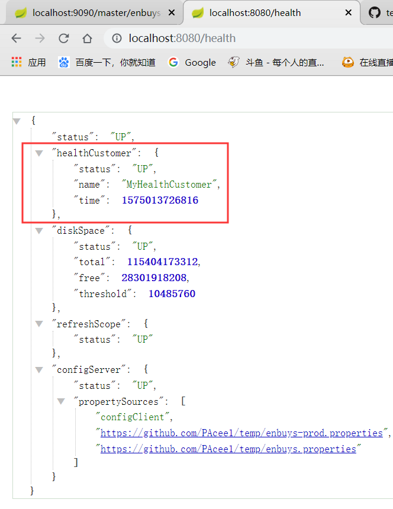

## 一、分布式Config

### 1.分布式配置架构

#### 传统架构


可以看到，在传统架构中，**每个配置硬编码到应用中**，写在properties或者xml里，跟随这项目一起保存到git或者svn仓库中。当配置越来越多的时候，比如MQ，数据库，Redis，ES等等的配置，只能一个文件一个文件的累加，并且**每当修改时都需要重新打包部署**，浪费时间且冗余。

缺点：

- 硬编码
- 写在properties，集群环境下需要替换和重启
- 写在xml中，和应用一起打包，替换需要重新打包部署

#### SpringCloud Config


由于常用的项目+配置的方式有很大缺点，**SpringCloud提供了一个配置中心来统一管理配置，它分为服务端和客户端**。解决了**配置中心化，版本控制，硬编码**等问题

服务端即**分布式配置中心**，为一个单独的微服务应用，用于**连接客户端与仓库**，为客户端提供相应的配置信息等。服务器默认采用git来存储配置信息，这样有助于对环境配置进行版本管理，并且可以通过git客户端工具来方便的管理和访问配置内容。

客户端是指**通过指定的配置中心来管理应用资源**，以及与业务相关的配置内容，并在启动的时候从配置中心获取和加载配置信息。

### 2.EnvironmentRepository仓储

这里我们先介绍一下SpringCloudConfig的仓储，对于配置服务器管理多个配置，客户端获取时需要一定的规则来获取，SpringCloudConfigServer提供了EnvironmentRepository接口供客户端获取，其具体规则为：

- {application}：配置客户端应用名称
- {profile}：客户端使用的配置文件环境，比如开发环境或线上环境
- {label}：版本信息，比如git的分支master or dev

服务端配置映射主要有五种：

- /{application}/{profile}[/{label}]
- /{application}-{profile}.yml
- /{label}/{application}-{profile}.yml
- /{application}-{profile}.properties
- /{label}/{application}-{profile}.properties

### 3.搭建Spring Cloud Conifg Server

关于SpringCloud Config Server的搭建非常简单，最主要是用到`@EnableConfigServer`这个注解

首先需要基于SpringBoot创建一个SpringCloud应用，pom文件额外需要添加：

```xml
<dependency>
   <groupId>org.springframework.cloud</groupId>
   <artifactId>spring-cloud-config-server</artifactId>
</dependency>
```

#### 基于本地Git仓库

1.需要在启动器类上加入`@EnableConfigServer`注解

2.在`application.properties`中添加配置信息，如下：主要是配置本地git路径

```properties
## 配置服务器应用名称
spring.application.name = spring-cloud-config-server

## 配置服务器端口
server.port = 9090

## 关闭管理端actuator 的安全
## /env /health 端口完全开放
management.security.enabled = false

# 配置本地git路径
spring.cloud.config.server.git.uri=${user.dir}\\src\\esource\\configs
```

> Tips：${user.dir}为此项目在电脑上的**绝对路径**，比如windows系统下（D:\ideaProject\SpringCloud\...），如果在linux系统下即（home/...），使用这个做路径可以很好的适配各个平台的文件路径

3.对应本地git路径创建文件夹及文件


这里我们创建三个配置文件

- enbuys：默认的配置
  - `name=enbuys`
- enbuys-dev：开发环境时的配置
  - `name=enbuys-dev`
- enbuys-prod：线上生产环境配置
  - `name=enbuys-prod`

4.在configs目录下进行git初始化

```
> git init
> git add .
> git commit -m "first commit"
```

5.启动测试

访问<http://localhost:9090/enbuys/test>


因为我想访问dev的，打错了，所以可以发现，如果输入一个没有的配置文件，其会自动使用默认的配置文件

再访问下http://localhost:9090/enbuys/dev


可以发现会把`enbuys-dev`与默认配置文件都输出出来

> 我们这里使用的映射即为`/{label}/{application}-{profile}.properties`

#### 基于远程Git仓库

即把我们的配置放到github上面，方法也很简单，和本地仓库类似

1.添加注解`@EnableConfigServer`

2.在github上创建一个Repository


3.根据github提示，找个文件夹绑定远程仓库


4.将三个配置文件放到`init`的那个文件夹，上传到远程git仓库

```
> git add .
> git commit -m 'add config server'
> git push -u origin master
```

5.修改项目中的`git.url`路径

```properties
# 远程git仓库
spring.cloud.config.server.git.uri=https://github.com/PAcee1/temp
```

6.测试


可以看到正确输出远程仓库上的信息

> Tips:`spring.cloud.config.server.git.force-pull`，因为git拉取时有时会走本地缓存，如果配置这个可以保证强制拉取远程仓库上的配置

#### 不同方式访问

还记得我们在上面介绍EnvironmentRepository仓储时，对资源的映射方式有好几种，我们来测试一下：

``/{application}/{profile}[/{label}]``：

这种就是我们上面使用的，对于请求比较模糊时使用，会输出很多信息

`/{application}-{profile}.properties`：


使用这种方式，可以具体的显示出配置文件中的信息

`/{label}/{application}-{profile}.properties`



也是一样输出详细信息

### 4.搭建Spring Cloud Config Client

客户端加入的pom依赖和server不同，为：

```xml
<dependency>
   <groupId>org.springframework.cloud</groupId>
   <artifactId>spring-cloud-starter-config</artifactId>
</dependency>
```

搭建客户端获取服务器中的配置也非常简单

1.配置`application.properties`

```properties
## 配置客户端应用名称
spring.application.name = spring-cloud-config-client

## 配置客户端应用服务端口
server.port = 8080

## 关闭管理端actuator 的安全
## /env /health 端口完全开放
management.security.enabled = false
```

还是基本的一些配置信息

2.配置`bootstrap.properties`

```properties
## 配置客户端应用关联的应用
## spring.cloud.config.name 是可选的
## 如果没有配置，采用 ${spring.application.name}
spring.cloud.config.name = enbuys
## 关联 profile
spring.cloud.config.profile = prod
## 关联 label
spring.cloud.config.label = master
## 配置配置服务器URI
spring.cloud.config.uri = http://127.0.0.1:9090/
```

> Tips：这里的cloud的config配置也可以写在`application.properties`，这里写在`bootstrap`的配置文件中主要还是一个规范问题，因为SpringCloud使用`Bootstrap`做上下文，对于关于SpringCloud的配置也应该写在`bootstrap.properties`里

3.启动测试


首先可以在控制台看到SpringCloud加载时去请求服务器获取配置信息

然后在在浏览器上查看


可以看到也正确加载到`Environment`中了

### 5.动态配置Bean

动态配置Bean在之前学springBoot的时候已经做过，无非是在Bean上加一个`@ConfigurationProperties`注解

这里我们要说的是，从SpringCloud Config Server拉取Bean的信息进行注入，

#### 客户端配置文件注入

Bean：

```java
@ConfigurationProperties(prefix = "enbuy.user")
public class User {

    private Integer id;

    private String name;

    public Integer getId() {
        return id;
    }

    public void setId(Integer id) {
        this.id = id;
    }

    public String getName() {
        return name;
    }

    public void setName(String name) {
        this.name = name;
    }

    @Override
    public String toString() {
        return "User{" +
                "id=" + id +
                ", name='" + name + '\'' +
                '}';
    }
}
```

application.properties:

```properties
#配置user信息
enbuy.user.id=1
enbuy.user.name=pacee
```

UserController：

```java
@RestController
@EnableConfigurationProperties(User.class)
public class UserController {

    //通过构造器注入
    private final User user;

    @Autowired
    public UserController(User user) {
        this.user = user;
    }

    @GetMapping("/user")
    public User user() {
        return user;
    }
}
```

访问<http://localhost:8080/user>



正确显示出来

#### 服务器配置文件注入

其次，我们将配置放到github上的配置文件上，然后再进行拉取远程配置注入



再次访问<http://localhost:8080/user>



可以发现还是原来的信息，这是为什么呢？

**因为这里使用的还是原来的远程配置，没有动态的刷新配置，这里我们先对客户端环境进行`refresh`**



可以看到，刷新了三个信息，版本以及我们修改的Bean信息。

再次请求


可以发现正确修改成远程配置服务器上的信息了。这里有两个问题需要注意的：！

==1.拉取远程服务器上的配置，比客户端中application或bootstrap的配置优先级高==

==2.SpringCloud当配置服务器修改时，不会自动刷新客户端拉取新的配置==

#### 自动拉取服务器配置

这里我们就应该对第二个问题展开探究，这里实现的方式有很多种

- SpringCloud提供的`SpringCloud Bus`
- 使用定时器配合`ContextRefresh`进行刷新

这里我们先使用`ContextRefresh`，因为这种方式适配各种情景，比如我们不使用http请求即Git当配置服务器，而是zookeeper实现配置服务器，这种方式就可以完全适应，不用修改任何东西。

Java代码实现：

```java
@SpringBootApplication
public class SpringCloudLesson3ConfigClientApplication {

    @Autowired
    private ContextRefresher contextRefresher;

    public static void main(String[] args) {
        SpringApplication.run(SpringCloudLesson3ConfigClientApplication.class, args);
    }

    @Scheduled(fixedRate = 1000L)
    public void update() {

        Set<String> keys = contextRefresher.refresh();

        if (!keys.isEmpty()) {
            System.out.println("本次更新的配置项: " + keys);
        }

    }
}
```

可以看到，这里我们使用1秒刷新一次的策略，代码也是比较简单。



可以看到，正确刷新了我们服务器上修改的配置



请求user，输出信息也是我们期望的。

这样我们就简单实现了自动拉取配置服务器上修改的内容了


## 二、Health EndPoint

之前介绍过几个传动器端点，前面一直在使用env这个端点，现在说下health端点。

这个端点可以查看服务的健康程度，就包含我们刚刚配置的Config Server

因为我们上面已经配了全局的端点敏感性为false，所以可以直接查看



可以看到默认包含四个PropertySource

- status：总体健康程度
- diskSpace：磁盘健康
- refreshScope：刷新的健康
- configServer：配置服务器的健康程度

### 自定义健康组件

我们先观察下Health的源码：

```java
@ConfigurationProperties(prefix = "endpoints.health")
public class HealthEndpoint extends AbstractEndpoint<Health> {

   private final HealthIndicator healthIndicator;

   /**
    * Time to live for cached result, in milliseconds.
    */
   private long timeToLive = 1000;

   /**
    * Create a new {@link HealthEndpoint} instance.
    * @param healthAggregator the health aggregator
    * @param healthIndicators the health indicators
    */
   public HealthEndpoint(HealthAggregator healthAggregator,
         Map<String, HealthIndicator> healthIndicators) {
      super("health", false);
      Assert.notNull(healthAggregator, "HealthAggregator must not be null");
      Assert.notNull(healthIndicators, "HealthIndicators must not be null");
      CompositeHealthIndicator healthIndicator = new CompositeHealthIndicator(
            healthAggregator);
      for (Map.Entry<String, HealthIndicator> entry : healthIndicators.entrySet()) {
         healthIndicator.addHealthIndicator(getKey(entry.getKey()), entry.getValue());
      }
      this.healthIndicator = healthIndicator;
   }
```

可以发现，在构造函数中，`HealthEndpoint`循环`HealthIndicator`加入到容器中，看到这个就想起在SpringBoot学习时，那些自动配置类也是这样循环加入容器的，我们便可以仿照SpringBoot添加组件的方式，创建一个类实现`HealthIndicator`，然后添加到容器中。

**1.创建一个类实现`HealthIndicator**`

```java
public class HealthCustomer implements HealthIndicator {
    
    @Override
    public Health health() {
        return null;
    }
}
```

可以看到这里需要返回一个`Health`对象，再进到`Health`里查看

```java
public final class Health {

   private final Status status;

   private final Map<String, Object> details;

   /**
    * Create a new {@link Health} instance with the specified status and details.
    * @param builder the Builder to use
    */
   private Health(Builder builder) {
      Assert.notNull(builder, "Builder must not be null");
      this.status = builder.status;
      this.details = Collections.unmodifiableMap(builder.details);
   }
```

可以看到`Health`是由`Builder`创建的，那意思是我们也需要创建一个`Builder`来初始化`Health`，再看下`Builder`

```java
public static class Builder {

   private Status status;

   private Map<String, Object> details;

   /**
    * Create new Builder instance.
    */
   public Builder() {
      this.status = Status.UNKNOWN;
      this.details = new LinkedHashMap<String, Object>();
   }
```

`Builder`的创建就很简单了，传递`status`状态已经具体的`detailsMap`信息即可

**2.在我们的类中创建`Builder`并初始化`Health`返回**

```java
@Component
public class HealthCustomer implements HealthIndicator {

    @Override
    public Health health() {
        Health.Builder builder = new Health.Builder();
        builder.status(Status.UP);
        builder.withDetail("name","MyHealthCustomer");
        builder.withDetail("time",System.currentTimeMillis());
        Health health = builder.build();
        return health;
    }
}
```

这样就创建完毕我们自定义的`Health`组件了，记得要加上`@Component`注解

**3.浏览器查看**



正确加载进`HealthEndpoint`中