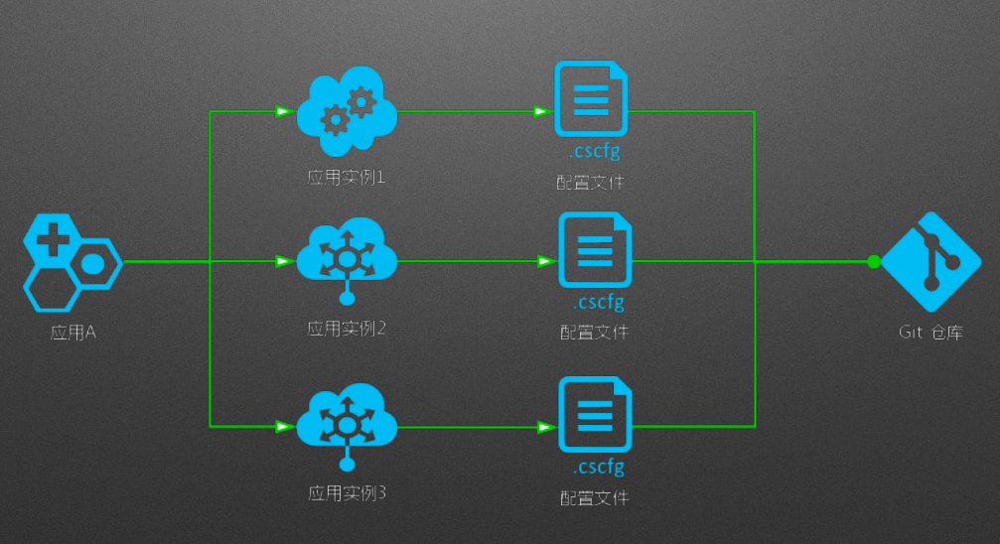
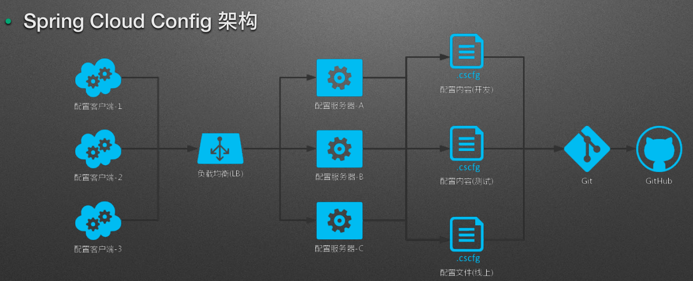
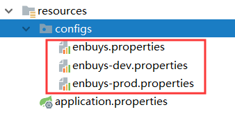
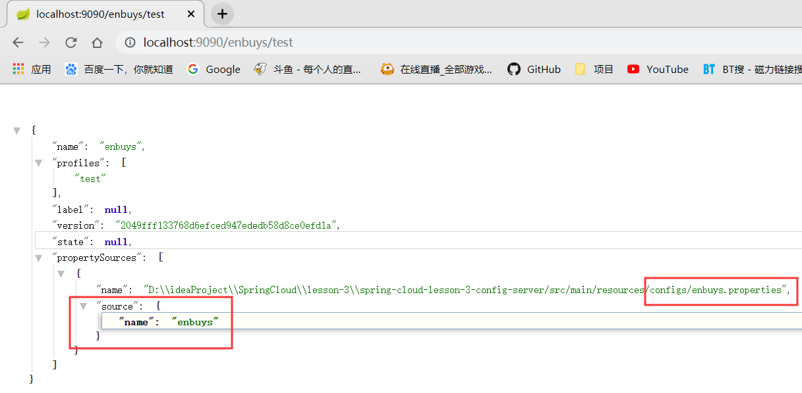
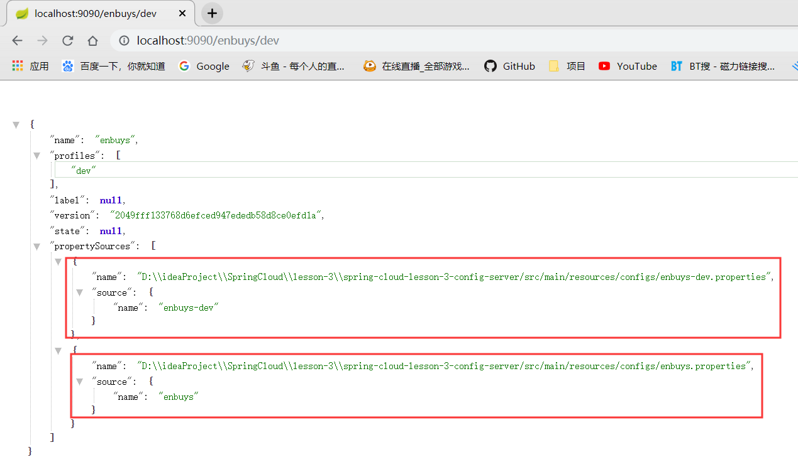
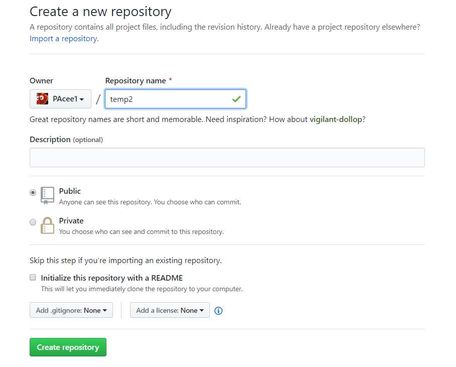
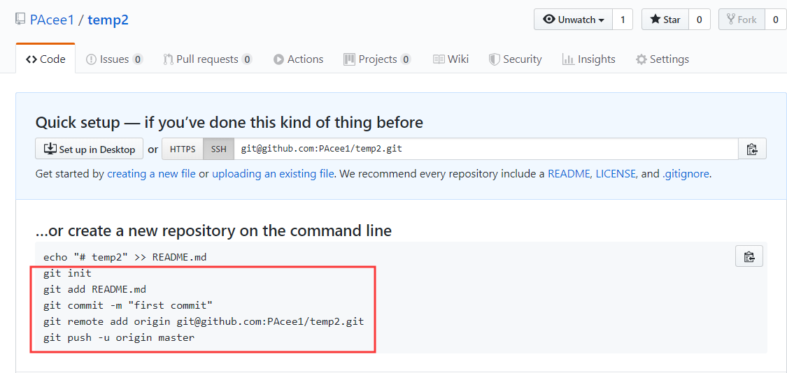
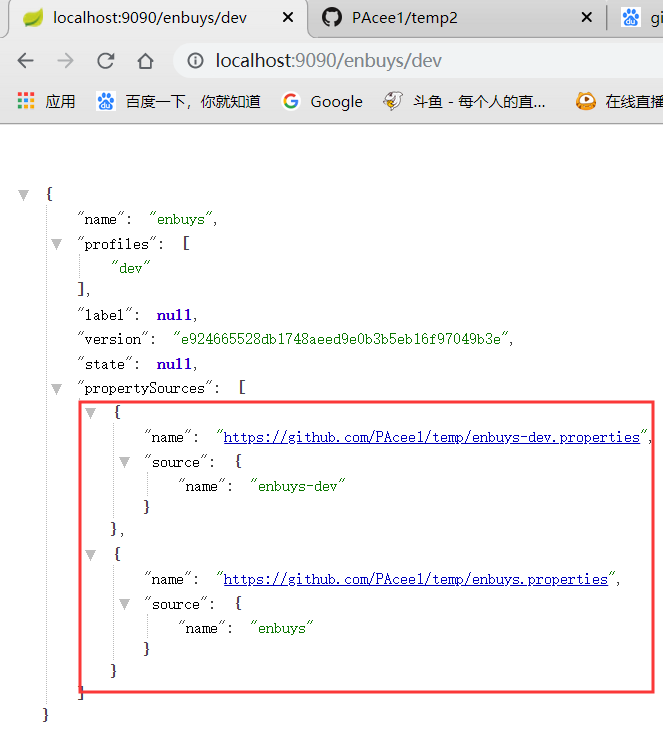
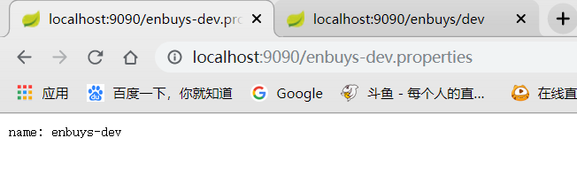
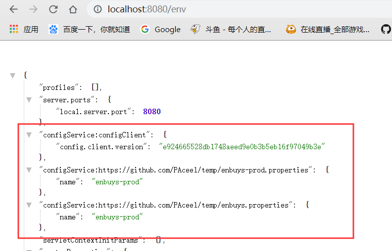

## 一、分布式Config

### 1.分布式配置架构

#### 传统架构



可以看到，在传统架构中，**每个配置硬编码到应用中**，写在properties或者xml里，跟随这项目一起保存到git或者svn仓库中。当配置越来越多的时候，比如MQ，数据库，Redis，ES等等的配置，只能一个文件一个文件的累加，并且**每当修改时都需要重新打包部署**，浪费时间且冗余。

缺点：

- 硬编码
- 写在properties，集群环境下需要替换和重启
- 写在xml中，和应用一起打包，替换需要重新打包部署

#### SpringCloud Config



由于常用的项目+配置的方式有很大缺点，**SpringCloud提供了一个配置中心来统一管理配置，它分为服务端和客户端**。解决了**配置中心化，版本控制，硬编码**等问题

服务端即**分布式配置中心**，为一个单独的微服务应用，用于**连接客户端与仓库**，为客户端提供相应的配置信息等。服务器默认采用git来存储配置信息，这样有助于对环境配置进行版本管理，并且可以通过git客户端工具来方便的管理和访问配置内容。

客户端是指**通过指定的配置中心来管理应用资源**，以及与业务相关的配置内容，并在启动的时候从配置中心获取和加载配置信息。

### 2.EnvironmentRepository仓储

这里我们先介绍一下SpringCloudConfig的仓储，对于配置服务器管理多个配置，客户端获取时需要一定的规则来获取，SpringCloudConfigServer提供了EnvironmentRepository接口供客户端获取，其具体规则为：

- {application}：配置客户端应用名称
- {profile}：客户端使用的配置文件环境，比如开发环境或线上环境
- {label}：版本信息，比如git的分支master or dev

服务端配置映射主要有五种：

- /{application}/{profile}[/{label}]
- /{application}-{profile}.yml
- /{label}/{application}-{profile}.yml
- /{application}-{profile}.properties
- /{label}/{application}-{profile}.properties

### 3.搭建Spring Cloud Conifg Server

关于SpringCloud Config Server的搭建非常简单，最主要是用到`@EnableConfigServer`这个注解

首先需要基于SpringBoot创建一个SpringCloud应用，pom文件额外需要添加：

```xml
<dependency>
   <groupId>org.springframework.cloud</groupId>
   <artifactId>spring-cloud-config-server</artifactId>
</dependency>
```

#### 基于本地Git仓库

1.需要在启动器类上加入`@EnableConfigServer`注解

2.在`application.properties`中添加配置信息，如下：主要是配置本地git路径

```properties
## 配置服务器应用名称
spring.application.name = spring-cloud-config-server

## 配置服务器端口
server.port = 9090

## 关闭管理端actuator 的安全
## /env /health 端口完全开放
management.security.enabled = false

# 配置本地git路径
spring.cloud.config.server.git.uri=${user.dir}\\src\\esource\\configs
```

> Tips：${user.dir}为此项目在电脑上的绝对路径，比如windows系统下（D:\ideaProject\SpringCloud\...），如果在linux系统下即（home/...），使用这个做路径可以很好的适配各个平台的文件路径

3.对应本地git路径创建文件夹及文件



这里我们创建三个配置文件

- enbuys：默认的配置
  - `name=enbuys`
- enbuys-dev：开发环境时的配置
  - `name=enbuys-dev`
- enbuys-prod：线上生产环境配置
  - `name=enbuys-prod`

4.在configs目录下进行git初始化

```
> git init
> git add .
> git commit -m "first commit"
```

5.启动测试

访问<http://localhost:9090/enbuys/test>



因为我想访问dev的，打错了，所以可以发现，如果输入一个没有的配置文件，其会自动使用默认的配置文件

再访问下http://localhost:9090/enbuys/dev



可以发现会把`enbuys-dev`与默认配置文件都输出出来

> 我们这里使用的映射即为`/{label}/{application}-{profile}.properties`

#### 基于远程Git仓库

即把我们的配置放到github上面，方法也很简单，和本地仓库类似

1.添加注解`@EnableConfigServer`

2.在github上创建一个Repository



3.根据github提示，找个文件夹绑定远程仓库



4.将三个配置文件放到`init`的那个文件夹，上传到远程git仓库

```
> git add .
> git commit -m 'add config server'
> git push -u origin master
```

5.修改项目中的`git.url`路径

```properties
# 远程git仓库
spring.cloud.config.server.git.uri=https://github.com/PAcee1/temp
```

6.测试



可以看到正确输出远程仓库上的信息

> Tips:`spring.cloud.config.server.git.force-pull`，因为git拉取时有时会走本地缓存，如果配置这个可以保证强制拉取远程仓库上的配置

#### 不同方式访问

还记得我们在上面介绍EnvironmentRepository仓储时，对资源的映射方式有好几种，我们来测试一下：

``/{application}/{profile}[/{label}]``：

这种就是我们上面使用的，对于请求比较模糊时使用，会输出很多信息

`/{application}-{profile}.properties`：



使用这种方式，可以具体的显示出配置文件中的信息

`/{label}/{application}-{profile}.properties`

### 4.搭建Spring Cloud Config Client

搭建客户端获取服务器中的配置也非常简单

1.配置`application.properties`

```properties
## 配置客户端应用名称
spring.application.name = spring-cloud-config-client

## 配置客户端应用服务端口
server.port = 8080

## 关闭管理端actuator 的安全
## /env /health 端口完全开放
management.security.enabled = false
```

还是基本的一些配置信息

2.配置`bootstrap.properties`

```properties
## 配置客户端应用关联的应用
## spring.cloud.config.name 是可选的
## 如果没有配置，采用 ${spring.application.name}
spring.cloud.config.name = enbuys
## 关联 profile
spring.cloud.config.profile = prod
## 关联 label
spring.cloud.config.label = master
## 配置配置服务器URI
spring.cloud.config.uri = http://127.0.0.1:9090/
```

> Tips：这里的cloud的config配置也可以写在`application.properties`，这里写在`bootstrap`的配置文件中主要还是一个规范问题，因为SpringCloud使用`Bootstrap`做上下文，对于关于SpringCloud的配置也应该写在`bootstrap.properties`里

3.启动测试


首先可以在控制台看到SpringCloud加载时去请求服务器获取配置信息

然后在在浏览器上查看



可以看到也正确加载到Environment中了