## 一、简单介绍

### 1.服务发现

在计算机网络中，一种自动发现设备或服务的技术，一般通过服务发现协议来实现。

常见的协议有：

- Java：jini
- REST
- Web Service

### 2.服务注册

在计算机网络中，为了更好的去治理服务，将服务注册到一个注册中心，统一管理，以便更好的被发现和消费，即服务注册。

常见的注册中心：

- zookeeper：高一致性，损失高可用性，性能最差
- Netflix Eureka：高可用但不高一致性
- Consul：两者结合，又高可用又高一致性，比较均衡，而且不止是注册中心，还能充当配置中心的角色

### 3.Eureka

Eureka是网飞公司发明的一种服务发现中间件，包括服务发现客户端与服务器 

## 二、Eureka Server

Eureka服务端：是Eureka Client的注册中心，用于服务的注册，管理以及实例状态信息的管理。

要在SpringCloud中使用Eureka Server，必要的两个条件为依赖与注解

==注意：使用的SpringCloud的版本为Dalston.SR4，对于Finchley可能会有不同！==

### 添加Maven依赖

在SpringCloud的基础上添加

```xml
<dependency>
    <groupId>org.springframework.cloud</groupId>
    <artifactId>spring-cloud-starter-eureka-server</artifactId>
</dependency>
```

### 添加SpringBoot配置

```properties
## Spring Cloud Eureka 服务器应用名称
spring.application.name = spring-cloud-eureka-server

## Spring Cloud Eureka 服务器服务端口
server.port = 9090

## 管理端口安全失效
management.security.enabled= false
```

还是和之前一样，开启管理端点，配置应用名称与端口，一般来说，作为Server使用9090端口，而Client使用8080

### 激活Server

在启动器类上添加`@EnableEurekaServer`注解

```java
@SpringBootApplication
@EnableEurekaServer
public class SpringCloudLesson4EurekaServerApplication {

   public static void main(String[] args) {
      SpringApplication.run(SpringCloudLesson4EurekaServerApplication.class, args);
   }
}
```

### 一些问题

#### 1.启动报错

>  com.netflix.discovery.shared.transport.TransportException: Cannot execute request on any known server

在启动时，会发现报错，这时我们访问9090是可以访问的，再查看下健康状态：


可以发现是正常的，并且有一个猫腻：`Spring Cloud Eureka Discovery Client`

这说明SpringCloud Eureka Server既是服务端又是客户端，所以：

==eureka默认会把自己也作为客户端注册自己，所以便会出现这个问题==

解决方法：关闭eureka自注册功能与向注册中心获取注册信息

```properties
# 关闭eureka自注册
eureka.client.register-with-eureka=false
### 取消向注册中心获取注册信息（服务、实例信息）
eureka.client.fetch-registry = false
```

需要注意的是：==这个配置是在单节点时添加的，如果是集群状态，就不需要配置了==

#### 2.连接报错

在控制台，启动后会一直刷新报错：

>  Caused by: org.apache.http.conn.ConnectTimeoutException: Connect to localhost:8761 timed out

这个原因是在Eureka的`EurekaClientConfigBean`中，默认的服务器配置为

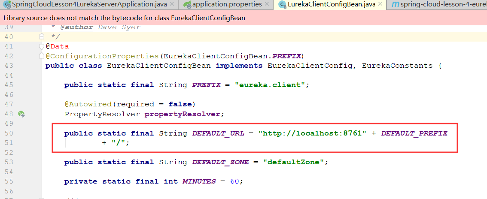

##### 自连接解决

我们8761这个端口并没有应用，所以我们一种解决方法就是覆盖此配置，在配置文件中设置让其Server自己连自己：

```properties
eureka.client.service-url.defaultZone=http://localhost:9090/eureka
```

更改后可以发现，服务端注册地址改为了我们自己，并且控制台不再报错

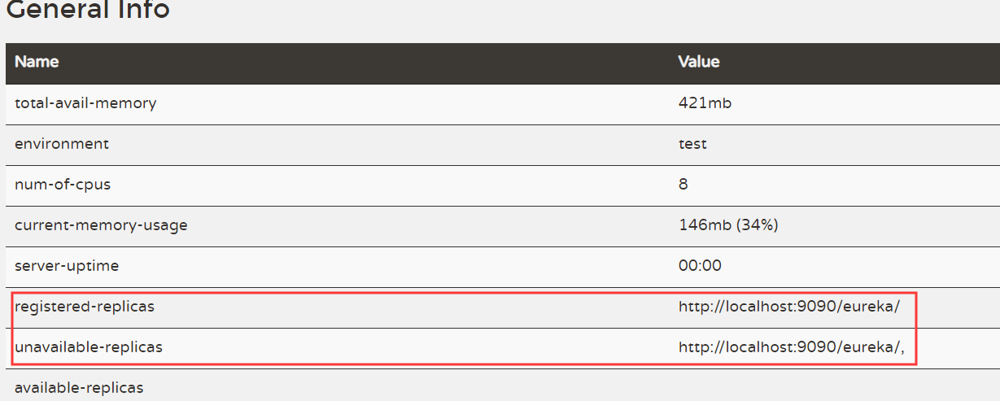

##### 修改配置解决

碰到这个问题，我们还有一种思考方式，进入源码查看，看看这个peer集群在单机情况下能否关闭

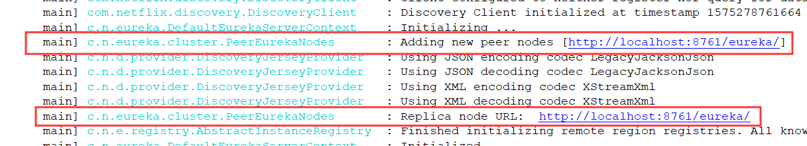

启动时可以看到，是在`PeerEurekaNodes`类中进行的添加集群节点，进入查看源码

```java
protected List<String> resolvePeerUrls() {
    InstanceInfo myInfo = applicationInfoManager.getInfo();
    String zone = InstanceInfo.getZone(clientConfig.getAvailabilityZones(clientConfig.getRegion()), myInfo);
    List<String> replicaUrls = EndpointUtils
            .getDiscoveryServiceUrls(clientConfig, zone, new EndpointUtils.InstanceInfoBasedUrlRandomizer(myInfo));

    int idx = 0;
    while (idx < replicaUrls.size()) {
        if (isThisMyUrl(replicaUrls.get(idx))) {
            replicaUrls.remove(idx);
        } else {
            idx++;
        }
    }
    return replicaUrls;
}
```

会发现有一个`resolvePeerUrls`的方法，我们打断点看看，会不会进来：


正确进入，并且发现，如果`isThisMyUrl()`判断为true的话，会将这个默认节点删除，这就是我们想要的！

再进入`isThisMyUrl`打断点看看：

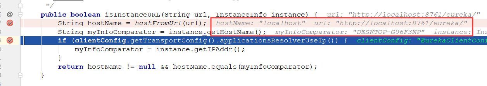

会发现格式化后url为`localhost`，而`instance.getHostName()`为计算机的名称，这里就有说法了，是不是只要在`EurekaInstanceConfigBean`中配置`hostName`这个属性，就能实现8761这个节点的去除，即不再报错呢？

先看下这个类中是否有这个属性：

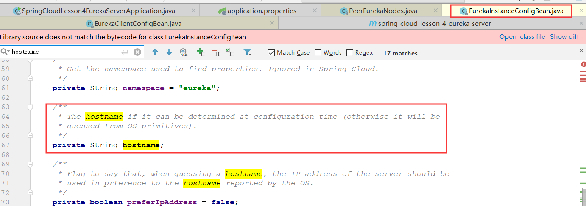

果然有，进入到配置文件中配置试一下

```properties
eureka.instance.hostname = localhost
```

再次启动，看看节点是否被删除

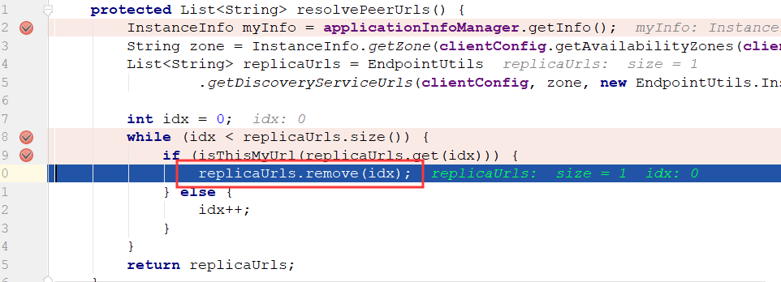

果然执行了删除节点的方法，并且控制台不报错了。

##### 总结

```properties
# 直接删除peer节点，单机启动
eureka.instance.hostname = localhost
#自连接解决
#eureka.client.service-url.defaultZone=http://localhost:9090/eureka
```


## 三、Eureka Client

Eureka Client为当前服务提供注册，同步的功能，同步注册到Server上，并且具有查找服务，获取实例信息的能力等。

### 添加Maven依赖

在SpringCloud的基础上

```xml
<dependency>
   <groupId>org.springframework.cloud</groupId>
   <artifactId>spring-cloud-starter-eureka</artifactId>
</dependency>
```

### 添加SpringBoot配置

```properties
## Spring Cloud Eureka 客户端应用名称
spring.application.name = spring-cloud-eureka-client

## Spring Cloud Eureka 客户端服务端口
server.port = 8080

## 管理端口安全失效
management.security.enabled = false
```

这里使用8080做客户端端口

### 激活Client

激活方式也很简单，一样是添加注解，这里有两种注解以供选择：

- @EnableEurekaClient：Eureka的客户端，如果是使用其他方式如Consul便需要修改
- @EnableDiscoveryClient：推荐使用这种，因为支持所有客户端实现，修改时只需重启即可

### 添加Eureka Client配置

`bootstrap.properties`

```properties
eureka.client.serviceUrl.defaultZone = http://localhost:9090/eureka
```

### 其他的一些配置

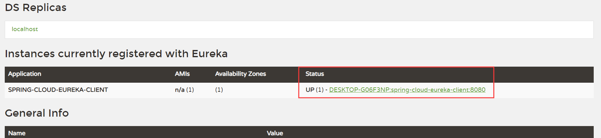

启动成功后，如果点开应用Status，默认前往info页面，可以添加一些配置来修改此跳转地址

```properties
# 调整状态页面
eureka.instance.status-page-url-path=/status
# 调整健康检查页面
eureka.instance.health-check-url-path=/health
```

修改后再次查看

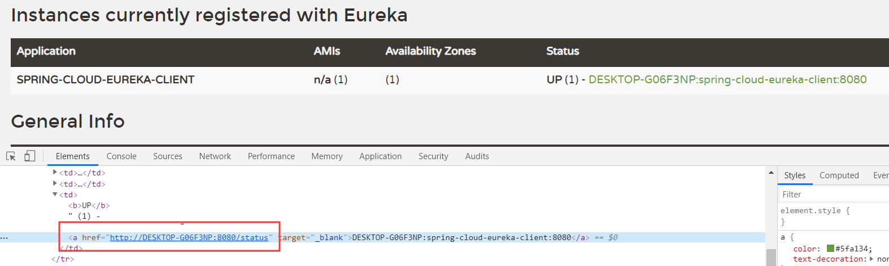

发现地址正确修改，点击也转跳到status页面，注：status是自己写的一个controller，仅返回OK字符串

## 四、整合SpringCloud Config

首先我们要做的是把Config也当做Eureka Client注册到Eureka Server中

### 配置Config

**1.添加Maven依赖**

```xml
<!-- 增加 Eureka Client -->
<dependency>
   <groupId>org.springframework.cloud</groupId>
   <artifactId>spring-cloud-starter-eureka</artifactId>
</dependency>

<dependency>
   <groupId>org.springframework.cloud</groupId>
   <artifactId>spring-cloud-config-server</artifactId>
</dependency>
```

**2.修改`application.properties`**

```properties
# 修改应用名称
spring.application.name=spring-cloud-client-server
# 修改端口 7070
server.port=7070
# 关闭actouator
management.security.enabled=false

# 配置远程git仓库
spring.cloud.config.server.git.url=https://github.com/PAcee1/temp
# 强制拉取git信息
spring.cloud.config.server.git.force-pull=true

# 注册到Eureka
eureka.clent.service-url.defaultZone=http://localhost:9090/eureka
```

**3.启动类添加组件**

```java
@SpringBootApplication
@EnableConfigServer
@EnableDiscoveryClient
public class SpringCloudLesson4ConfigServerApplication {

   public static void main(String[] args) {
      SpringApplication.run(SpringCloudLesson4ConfigServerApplication.class, args);
   }
}
```

4.启动测试

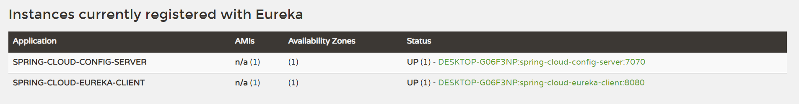

正确注册到Eureka服务器中

### 配置Eureka Client

第二步需要在之前配置的Eureka Client中连接SpringCloud Config

**1.添加Config依赖**

```xml
<!-- 增加 Spring Cloud Config 客户端依赖 -->
<dependency>
   <groupId>org.springframework.cloud</groupId>
   <artifactId>spring-cloud-starter-config</artifactId>
</dependency>
```

**2.在bootstrap.propertis中配置Config信息进行连接**

```properties
## 配置SpringCloud Config
# Config 名称
spring.cloud.config.name=enbuys
# Config 的 profile
spring.cloud.config.profile=prod
# Config 的 label
spring.cloud.config.label=master
# 配置Config 服务发现
spring.cloud.config.discovery.enabled=true
spring.cloud.config.discovery.service-id=spring-cloud-config-server
```

**3.启动测试**

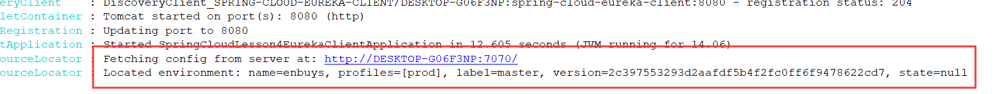

可以看到成功连接，并且打印出文件信息，访问<http://localhost:8080/env>

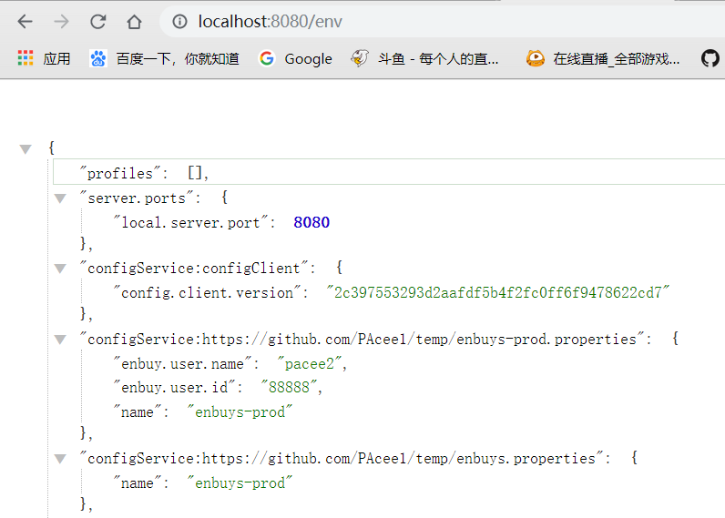

也正确被加载

### 好处

之前Client直接连接ConfigServer，使用的配置文件为：

```properties
spring.cloud.config.name = enbuys
spring.cloud.config.profile = prod
spring.cloud.config.label = master

spring.cloud.config.uri = http://127.0.0.1:9090/
```

可以发现前三个都一样，最后一个绑定config的uri时，使用的写死的地址，这时如果我们配置中心地址修改等，不仅配置中心需要重启服务，客户端也需要修改，这样就降低了高可用性。

现在Client连接Config Server，是通过Eureka Server进行连接的，配置文件为：

```properties
# 配置Config 服务发现
spring.cloud.config.discovery.enabled=true
spring.cloud.config.discovery.service-id=spring-cloud-config-server
```

所以，当Config Server修改了地址，只要不修改应用名称，都不用重启服务

