## 一、简介

高可用：一般用于生产环境，由客户端应用关联注册中心集群，这样避免注册中心的单点故障。

常见的配置手段：

- 多注册中心主机
- 注册中心DNS
- 广播

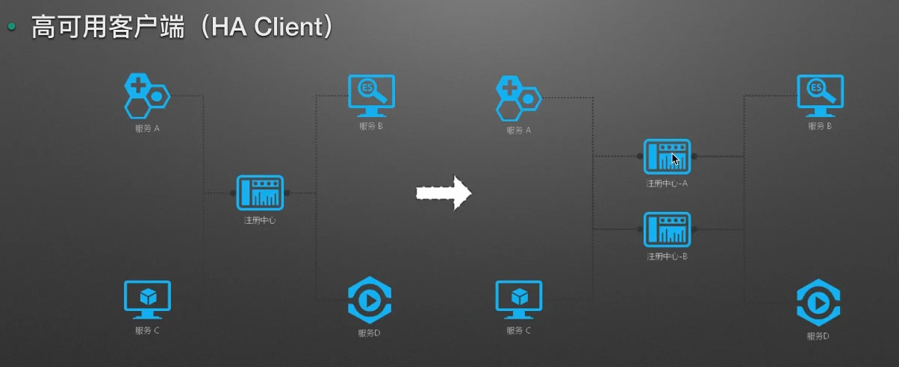

## 二、高可用Eureka

### Eureka Client

如果一个Eureka客户端应用配置了多个`Eureka Server`，默认只会选择一台可用的注册中心，当这台注册中心DOWN掉之后，才会选择其他的可用注册中心。

#### 配置

```properties
## 应用名称
spring.application.name = spring-cloud-eureka-client

## 客户端 端口随即可用
server.port = 8080

## 管理端安全失效
management.security.enabled = false

# 配置连接eureka server
eureka.client.service-url.defaultZone=http://127.0.0.1:9090/eureka,http://127.0.0.1:9091/eureka
```

这里可以发现，与之前不同的是`defaultZone`配置了两个，并用逗号分隔，这样简单的配置，`EurekaClient`就会随机选择一个作为当前的注册中心，而当此注册中心挂掉时，才会选择另外的。

#### 测试

我们在idea中设置可以启动多个实例，然后将启动参数改为9091，再启动一个`eureka server`试试。


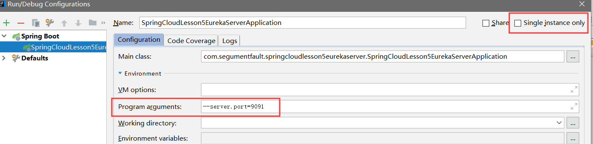

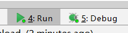


这时我们启动了9090和9091，再**重启客户端**试试


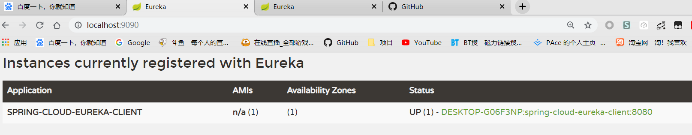

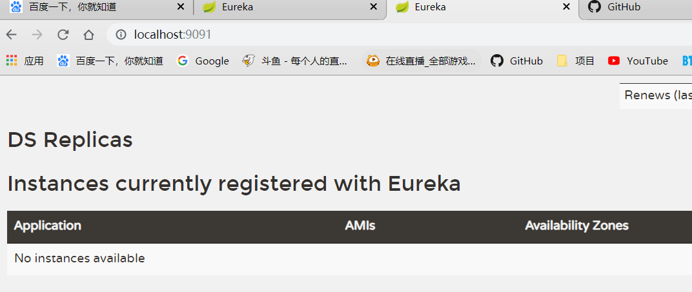


发现**绑定到9090端口的服务器**上了，而9091没有任何客户端绑定

这时我们**关闭9090这台Server**


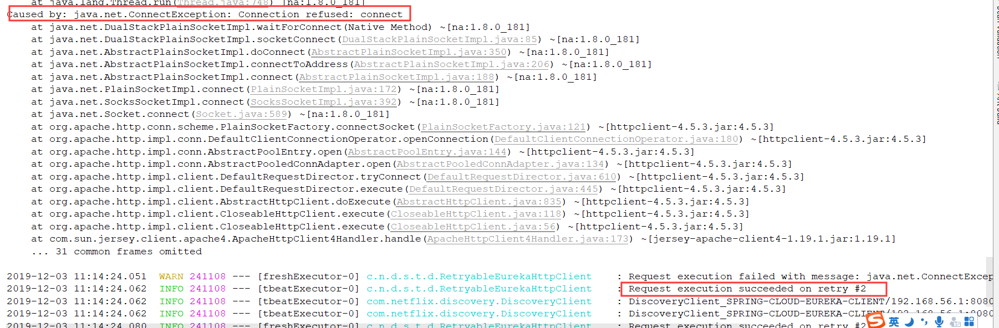


可以发现一段时间后会报错，然后**尝试连接9091的Server，并成功连接上**


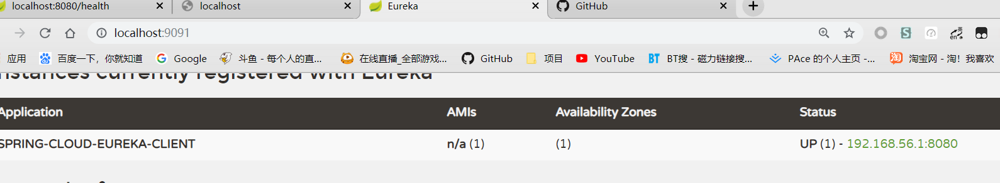

#### 源码查看

我们进入源码看看`defaultZone`这个配置是如何生效的，因为前缀是`eureka.client`所以直接进入到`EurekaClientConfigBean`中查看

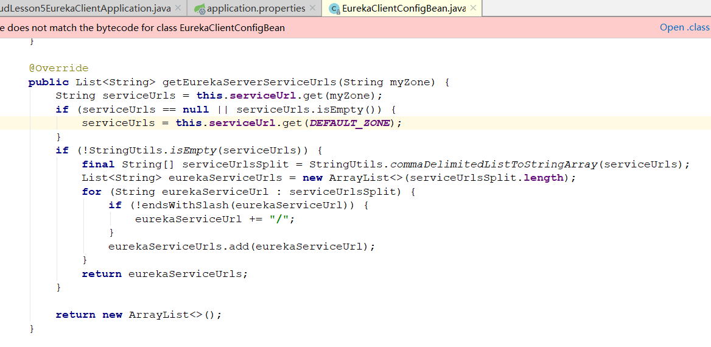

可以找到这样一段代码，做了几件事：

- 判断配置文件中是否修改了`defaultZone`,比如叫`DevZone`
- 如果不存在 使用默认的`defaultZone`
- 判断值是否存在，如果存在，将其转为String数组
- 循环添加到`eurekaServiceUrls`这个List中，并返回
- 这样就结束了此方法，当Eureka寻找服务器连接时，就会从`eurekaServiceUrls`里随机挑选一个进行连接

#### 其他的一些配置

还有两个比较重要的配置：

```properties
# 获取全部应用元信息的时间间隔
eureka.client.registryFetchIntervalSeconds=5
# 调整应用元信息间隔时间
eureka.client.instanceInfoReplicationIntervalSeconds=5
```

### Eureka Server

Server高可用不但需要提供集群环境，解决单点故障问题。同时，**还需要处理各个注册中心间的信息同步问题**。

在刚刚的测试中，我们开启了两个Server，9090和9091，但是可以看到，当Eureka Client8080连接注册中心的时候，**只能和一个绑定，另一个是没有任何信息的**，这就没有解决注册中心信息同步的问题。

接下来我们进行Server的配置，来让Eureka注册中心实现高可用。

#### 公共配置

针对信息同步问题，`SpringCloudEureka`有一种很简单的方法，也就是我们上个笔记中写到的，`Eureka Server`在启动时会报错，因为会默认连接8761这个端口，因为它默认是集群状态的，所以会连接另外一台机器，而这时我们便只需将`defaultZone`那个参数的值改为我们第二台机器即可，即9090绑定9091,9091绑定9090。

首先说下公共配置，可以将两者都需要的配置写在`appliction.properties`中：

```properties
# 设置名称
spring.application.name=spring-cloud-eureka-server

# 管理端安全失效
management.security.enabled=false

eureka.client.register-with-eureka=true
eureka.client.fetch-registry=true

# 配置信息
eureka.instance.prefer-ip-address=true
eureka.instance.instance-id=${spring.cloud.client.ipAddress}:${server.port}
```

需要注意的是，我们需要把之前关闭的注册到eureka以及获取注册中心的两个配置打开，而不是false，这个默认打开，再写一遍是为了对比之前的配置。

#### 配置Peer1

配置第一个注册中心，我们把它端口改为9090，`application-peer1.properties`:

```properties
# 设置peer1端口为9090
server.port=9090
# 设置连接到peer2的Server地址
eureka.client.service-url.defaultZone=http://localhost:9091/eureka
# 设置hostname为peer1，可设可不设
eureka.instance.hostname=peer1
```

需要注意的是，主要配置就两个：

- 端口
- 连接地址：连接地址的ip与port都写另一台机器的，而不是本机器

并且这个文件的名称并不是固定的`-peer1`可以设置为其他的，在启动时修改为横线后面的值即可

#### 配置Peer2

`application-peer2.properties`：

```properties
# 设置peer1端口为9091
server.port=9091
# 设置连接到peer2的Server地址
eureka.client.service-url.defaultZone=http://localhost:9090/eureka
# 设置hostname为peer1，可设可不设
eureka.instance.hostname=peer2
```

#### 启动测试

1.设置启动参数为`--spring.profiles.active=peer1`，并且关闭`single install`

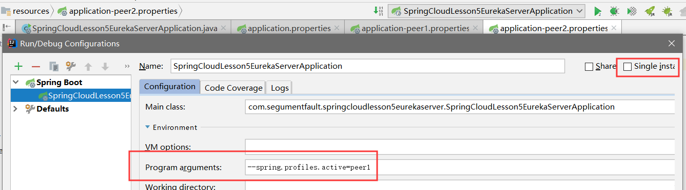

然后启动

2.再次设置启动参数为`--spring.profiles.active=peer2`，修改完后再启动

这时两个Server都启动起来了，打开网页查看<http://localhost:9090/>

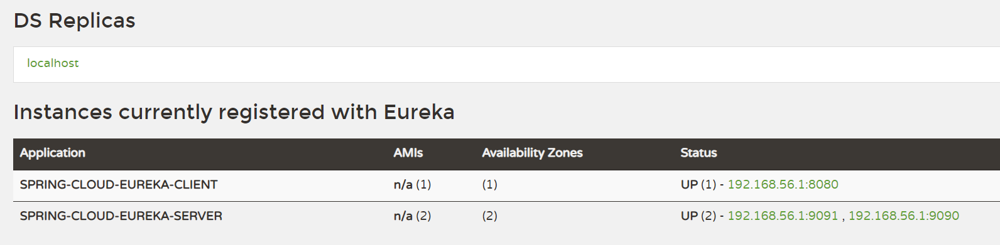

可以看到Eureka-Server连接了两个，说明高可用集群搭建成功，并且Client也连接上去

再查看<http://localhost:9091/>

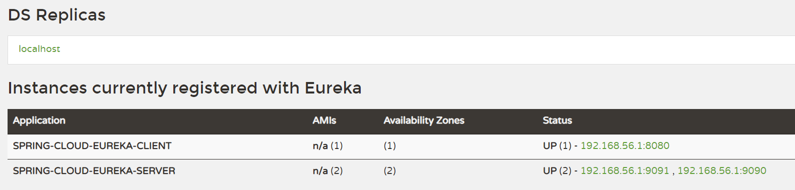

发现也是一模一样的，说明信息同步也成功。

## 三、SpringCloud Consul

在springboot2以后，Eureka便不再维护了，Consul成功上位，这里简单学习下Consul，因为大多数公司还是在使用稳定的Dalston版本的Eureka。

### Consul 介绍

Spring Cloud Consul项目是针对Consul的服务治理实现。Consul是一个分布式高可用的系统，**它具有比较均衡的一致性与高可用性**，它包含多个组件，但是作为一个整体，在微服务架构中为我们的基础设施提供服务发现和服务配置的工具。它包含了下面几个特性：

- 服务发现
- 健康检查
- Key/Value存储
- 多数据中心

由于Spring Cloud Consul项目的实现，我们可以轻松的将基于Spring Boot的微服务应用注册到Consul上，并通过此实现微服务架构中的服务治理。

### Consul Server

在上面学习时，Eureka的Server也是在springCloud中配置并启动的，但是Consul的服务端是需要在<https://www.consul.io/>官网下载的。

我这里使用windows版本，下载后解压到文件夹中

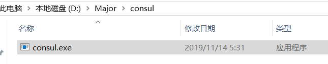

启动cmd使服务启动，启动命令为`consul agent -dev`

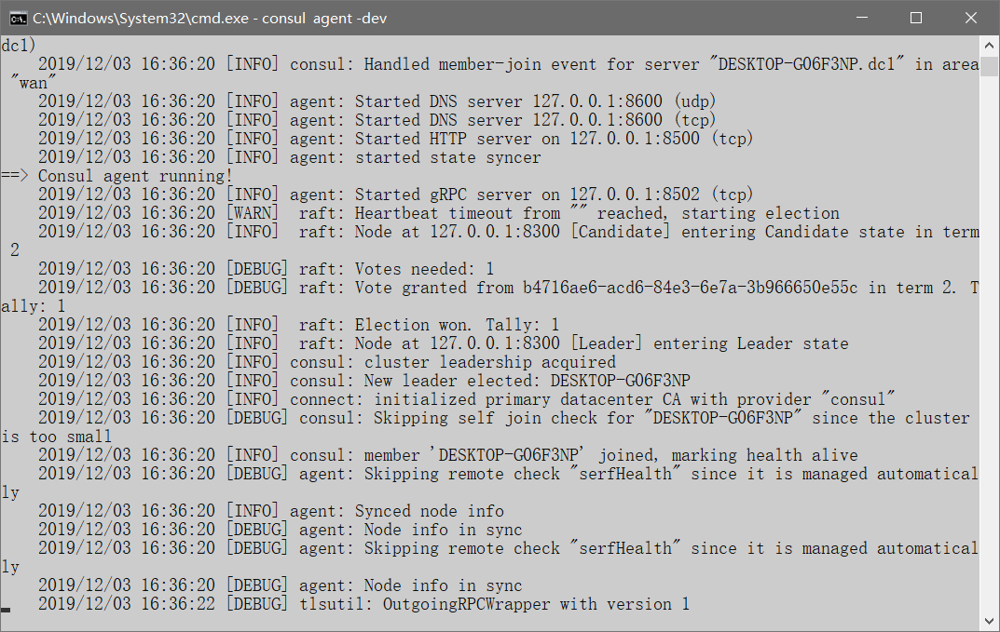

成功启动后可以登录<http://localhost:8500/ui>查看可视化界面

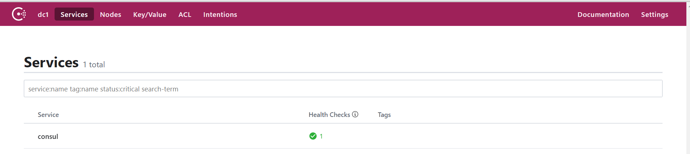

默认会将自己注册到服务器中。

这时，Consul的Server就准备好了，下一步便是SpringCloud整合Consul实现Client端

### Consul Client

#### 添加Maven依赖

```xml
<dependency>
   <groupId>org.springframework.cloud</groupId>
   <artifactId>spring-cloud-starter-consul-discovery</artifactId>
</dependency>
```

#### 开启注解

注解还是和之前一样，使用`@EnableDiscoveryClient`

#### 添加配置

```properties
## 应用名称
spring.application.name = spring-cloud-consul

## 服务端口
server.port = 8080

## 管理安全失效
management.security.enabled = false

## 连接 Consul 服务器的配置
### Consul 主机地址
spring.cloud.consul.host = localhost
### Consul 服务端口
spring.cloud.consul.port = 8500
```

consul的主要配置的前缀为`spring.cloud.consul`，其配置可以到配置类中查看`ConsulProperties`

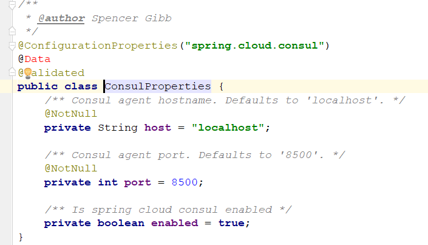

也就只有三个配置，很简单

#### 启动测试

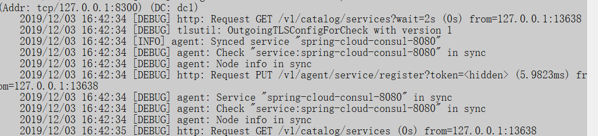

##### 健康问题

cmd控制台可以发现Client已经被注册，再查看Consul的服务端

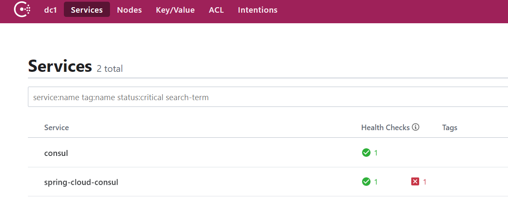

可以发现是没有通过健康检查的，这里是一个Bug，原因是：

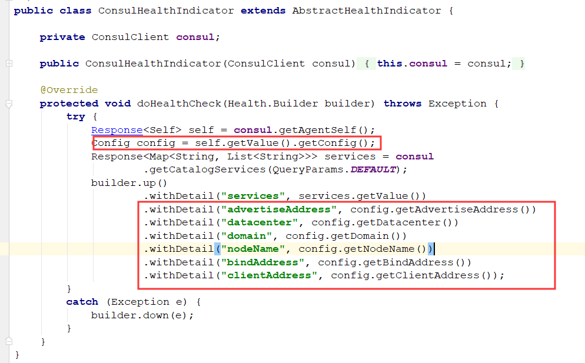

这里如果没有配置config这些值，那么config.getXxx是为null的，但是builder这个withDetail()方法是禁止为null的，不然会抛出异常，这里看下<http://localhost:8080/health>：

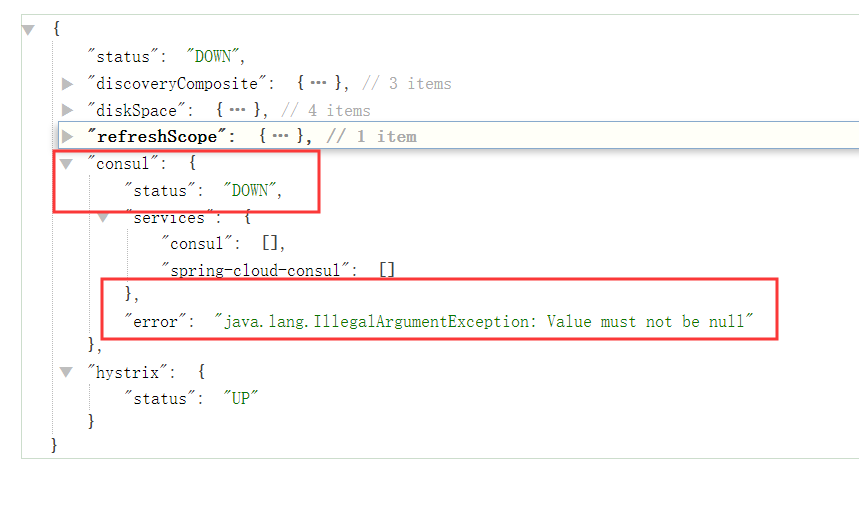

可以发现status为DOWN，并且错误原因就是value为null，这里也没有什么特别好的解决方法，一种解决方法是写一个Controller返回ok，然后配置健康检查通过这个controller进行，便可以跳过健康检查。

##### 解决方案

```java
@RestController
public class CheckController {

    @GetMapping("/check")
    public String check() {
        return "OK";
    }

}
```

`application.properties`

```properties
### 调整 Health Check 路劲，使其传递到 Consul 服务器，帮助回调
spring.cloud.consul.discovery.healthCheckPath = /check
```

这样Consul健康检查会走我们的路径，必然是通过的，重启Client

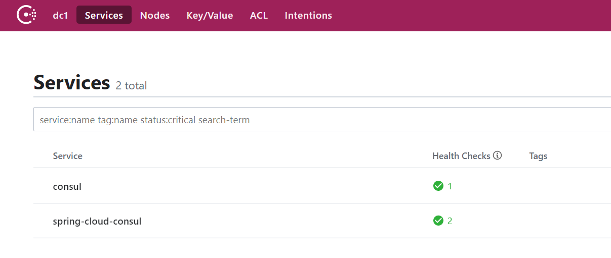

可以发现正确注册进去了