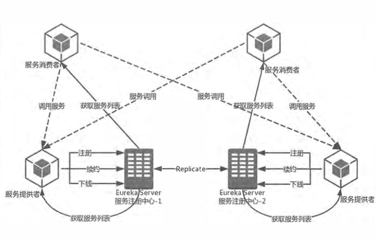
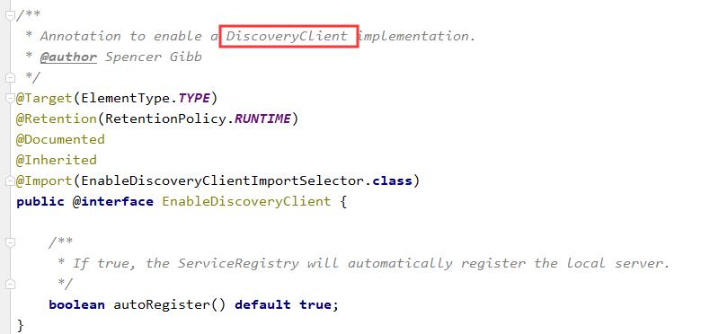
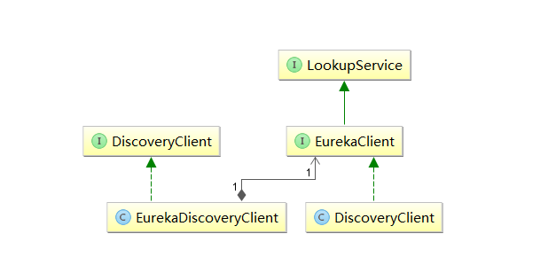
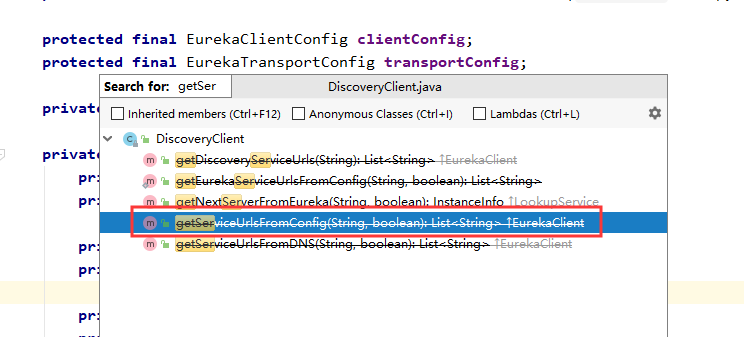
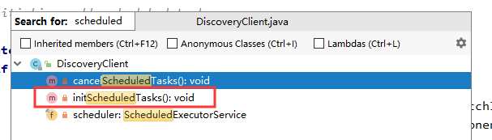
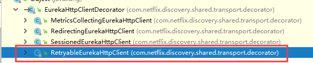

## 一、基础架构

Spring Cloud Eureke作为服务治理架构，有三个核心要素：

- 服务注册中心：Eureka Server，提供注册发现服务功能
- 服务提供方：Eureka Client，将自己的服务注册到注册中心，以供消费
- 服务消费方：消费者从注册中心获取服务，并且调用，实现方式有Ribbon或Fegin

下面我们详细说下从服务注册，到服务治理，到服务调用各个要素所涉及的重要通信行为



### 服务提供方

#### 服务注册

服务提供者需要将自己的注册到Server，一般是通过REST请求，并携带自己独有的元信息，比如ip，端口，服务名等等。

服务注册需要开启配置：`eureka.client.register-with-eureka=true`（默认开启）

#### 服务同步

注意，如图所示，有两个服务提供方分别到不同的注册中心注册，这时，因为注册中心高可用相互注册，所以当一个服务提供者注册时会请求转发到另一个注册中心，实现服务同步的功能。

#### 服务续约

在服务注册完毕后，服务提供者会维护一个心跳，来告诉注册中心我还活着，防止注册中心的“失效剔除”将此服务排除。

服务续约有两个重要配置：

```properties
# 用于定义心跳时间，默认30s续约一次
eureka.instance.lease-renewal-interval-in-seconds=30
# 用于定义服务失效时间 默认90s
eureka.instance.lease-expiration-duration-in-seconds=90
```

### 服务消费者

#### 服务获取

当服务消费者获取服务时，会请求注册中心，注册中心为了性能考虑，会维护一份只读的服务列表副本，同时该缓存30秒更新一次。

获取服务必须开启配置：`eureka.client.fetch-registry=true`

修改缓存更新时间：`eureka.client.registry-fetch-interval-seconds=30`

#### 服务调用

服务消费者获取清单后，根据返回的服务元数据信息，通过一些算法来进行服务调用，比如Ribbon使用轮询方式实现负载均衡的服务调用。

#### 服务下线

在Client关闭时，会通过REST请求告知注册中心下线信息，注册中心会把服务状态改为DOWN，并传播给其他注册中心。

### 服务注册中心

#### 失效剔除

当一段时间没有接收到客户端信息时，会将服务剔除，默认每隔60秒查询一次，如果有超过90秒没有续约的服务将被剔除

#### 自我保护

当有些时候，查看Eureka图形化界面时，会发现一段话：

> EMERGENCY! EUREKA MAY BE INCORRECTLY CLAIMING INSTANCES ARE UP WHEN THEY'RE NOT.
> RENEWALS ARE LESSER THAN THRESHOLD AND HENCE THE INSTANCES ARE NOT BEING EXPIRED JUST
> TO BE SAFE.

这是Eureka Server的自我保护机制，当Eureka Server运行期间，心跳失败比例在15分钟内低于85%，就会出现这个提示，将实力注册信息保护，不会过期，这个在单机调试时很经常出现。

本地开发时，添加配置来关闭自我保护`eureka.server.enable-self-preservation=false`

## 二、源码分析

我们通过一步步的源码，探究服务注册，获取，续约等实现

首先，我们知道Eureka Client非常简单，只需两步便可以将自己服务注册到Server上，即

- 开启注解`@EnableDiscoveryClient`
- 配置`eureka.client.serviceUrl.defaultZone`

我们根据这两点进行探寻，先进入注解查看



可以发现，非常简单，介绍中说是`DisCoverClient`的实现类，通过搜索`DiscoveryClient`，我们可以发现有一个类和一个接口。通过梳理可以得到如下图的关系：

[](http://blog.didispace.com/assets/eureka-code-1.png)

主要的实现还是通过`netflix`的`DiscoveryClient`实现，我们进入查看；

首先源码非常多，我们先搜索`serviceUrl`试试



通过搜索发现一个过时方法，从配置中获取`ServiceUrl`，他是直接调用了`EndpointUtils`中的同名方法，如下：

```java
public static List<String> getServiceUrlsFromConfig(EurekaClientConfig clientConfig, String instanceZone, boolean preferSameZone) {
        List<String> orderedUrls = new ArrayList<String>();
        String region = getRegion(clientConfig);
        String[] availZones = clientConfig.getAvailabilityZones(clientConfig.getRegion());
        if (availZones == null || availZones.length == 0) {
            availZones = new String[1];
            availZones[0] = DEFAULT_ZONE;
        }
        logger.debug("The availability zone for the given region {} are {}", region, Arrays.toString(availZones));
        int myZoneOffset = getZoneOffset(instanceZone, preferSameZone, availZones);

        List<String> serviceUrls = clientConfig.getEurekaServerServiceUrls(availZones[myZoneOffset]);
    ···
}
```

### Region、Zone

这里只放出我们需要的一些内容，如`getRegion`与`getAvailabilityZones`方法

- `getRegion`：如果没有配置，默认去`defaultRegion`，一个`Client`只会有一个`Region`；可以通过配置`eureka.client.region`属性特殊定义
- `getAvailabilityZones`：如果没有配置，默认取`defaultZone`，由逗号分隔，可以有多个`Zones`，即`Region`与`Zones`是一对多关系，可以通过配置：`eureka.client.availability-zones`属性配置

### ServiceUrl

紧接着可以看到，`getEurekaServerServiceUrls()`方法被调用了，用来获取`ServiceUrls`。

这个方法是由`EurekaClientConfigBean`实现的，这个方法在之前笔记中也有讲过：

```java
@Override
	public List<String> getEurekaServerServiceUrls(String myZone) {
		String serviceUrls = this.serviceUrl.get(myZone);
		if (serviceUrls == null || serviceUrls.isEmpty()) {
			serviceUrls = this.serviceUrl.get(DEFAULT_ZONE);
		}
		if (!StringUtils.isEmpty(serviceUrls)) {
			final String[] serviceUrlsSplit = StringUtils.commaDelimitedListToStringArray(serviceUrls);
			List<String> eurekaServiceUrls = new ArrayList<>(serviceUrlsSplit.length);
			for (String eurekaServiceUrl : serviceUrlsSplit) {
				if (!endsWithSlash(eurekaServiceUrl)) {
					eurekaServiceUrl += "/";
				}
				eurekaServiceUrls.add(eurekaServiceUrl);
			}
			return eurekaServiceUrls;
		}

		return new ArrayList<>();
	}
```

做了几件事：

- 判断配置文件中是否修改了`defaultZone`,比如叫`DevZone`
- 如果不存在 使用默认的`defaultZone`
- 判断值是否存在，如果存在，将其转为String数组
- 循环添加到`eurekaServiceUrls`这个List中，并返回

### 服务注册

看完这些必要的注册中心信息后，在回头查看`NetFlix`实现的`DiscoveryClient`类，来寻找服务注册的代码，

根据逻辑来说，服务注册，续约都是定时任务，应该找带有`Scheduled`的方法，查询一下



应该是这个`initScheduledTasks()`：

```java
private void initScheduledTasks() {
    ...
    if (clientConfig.shouldRegisterWithEureka()) {
        ...
        // InstanceInfo replicator
        instanceInfoReplicator = new InstanceInfoReplicator(
                this,
               instanceInfo,
                clientConfig.getInstanceInfoReplicationIntervalSeconds(),
                2); // burstSize
        ...
        instanceInfoReplicator.start(clientConfig.getInitialInstanceInfoReplicationIntervalSeconds());
    } else {
        logger.info("Not registering with Eureka server per configuration");
    }
}
```

可以看到`if (clientConfig.shouldRegisterWithEureka())`这个条件，即注册服务，他实例化了一个`InstanceInfoReplicator`对象，应该是一个线程，进入看看它的`run`方法

```java
public void run() {
        try {
            discoveryClient.refreshInstanceInfo();

            Long dirtyTimestamp = instanceInfo.isDirtyWithTime();
            if (dirtyTimestamp != null) {
                discoveryClient.register();
                instanceInfo.unsetIsDirty(dirtyTimestamp);
            }
        } catch (Throwable t) {
            logger.warn("There was a problem with the instance info replicator", t);
        } finally {
            Future next = scheduler.schedule(this, replicationIntervalSeconds, TimeUnit.SECONDS);
            scheduledPeriodicRef.set(next);
        }
    }
```

可以看到，最重要的一行，就是`discoveryClient.register();`进入查看

```java
boolean register() throws Throwable {
        logger.info(PREFIX + appPathIdentifier + ": registering service...");
        EurekaHttpResponse<Void> httpResponse;
        try {
            httpResponse = eurekaTransport.registrationClient.register(instanceInfo);
        } catch (Exception e) {
            logger.warn("{} - registration failed {}", PREFIX + appPathIdentifier, e.getMessage(), e);
            throw e;
        }
        if (logger.isInfoEnabled()) {
            logger.info("{} - registration status: {}", PREFIX + appPathIdentifier, httpResponse.getStatusCode());
        }
        return httpResponse.getStatusCode() == 204;
    }
```

再进入查看`eurekaTransport.registrationClient.register(instanceInfo);`

找到`EurekaHttpClientDecorator`这个类，但是这个类是抽象类，我们需要找到它的子实现类



经过一一查看找到了`RetryableEurekaHttpClient`这个类，这个类发现了两个重要方法

- execut()
- getHostCandidates()

我们一一探索

#### 1.execut()

```java
@Override
protected <R> EurekaHttpResponse<R> execute(RequestExecutor<R> requestExecutor) {
    List<EurekaEndpoint> candidateHosts = null;
    int endpointIdx = 0;
    for (int retry = 0; retry < numberOfRetries; retry++) {
        EurekaHttpClient currentHttpClient = delegate.get();
        EurekaEndpoint currentEndpoint = null;
        if (currentHttpClient == null) {
            if (candidateHosts == null) {
                candidateHosts = getHostCandidates();
                if (candidateHosts.isEmpty()) {
                    throw new TransportException("There is no known eureka server; cluster server list is empty");
                }
            }
            if (endpointIdx >= candidateHosts.size()) {
                throw new TransportException("Cannot execute request on any known server");
            }

            currentEndpoint = candidateHosts.get(endpointIdx++);
            currentHttpClient = clientFactory.newClient(currentEndpoint);
        }

        try {
            EurekaHttpResponse<R> response = requestExecutor.execute(currentHttpClient);
            if (serverStatusEvaluator.accept(response.getStatusCode(), requestExecutor.getRequestType())) {
                delegate.set(currentHttpClient);
                if (retry > 0) {
                    logger.info("Request execution succeeded on retry #{}", retry);
                }
                return response;
            }
            logger.warn("Request execution failure with status code {}; retrying on another server if available", response.getStatusCode());
        } catch (Exception e) {
            logger.warn("Request execution failed with message: {}", e.getMessage());  // just log message as the underlying client should log the stacktrace
        }

        // Connection error or 5xx from the server that must be retried on another server
        delegate.compareAndSet(currentHttpClient, null);
        if (currentEndpoint != null) {
            quarantineSet.add(currentEndpoint);
        }
    }
    throw new TransportException("Retry limit reached; giving up on completing the request");
}
```

因为代码长度过长，这里我们缩减一下：

```java
int endpointIdx = 0;
//用来保存所有Eureka Server信息(8761、8762、8763、8764)
List<EurekaEndpoint> candidateHosts = null;
//numberOfRetries的值代码写死默认为3次
for (int retry = 0; retry < numberOfRetries; retry++) {
	/**
	 *首次进入循环时，获取全量的Eureka Server信息(8761、8762、8763、8764)
	 */
	if (candidateHosts == null) {
        candidateHosts = getHostCandidates();
    }
	/**
	 *通过endpointIdx自增，依次获取Eureka Server信息，然后发送
	 *注册的Post请求.
	 */
    currentEndpoint = candidateHosts.get(endpointIdx++);
    currentHttpClient = clientFactory.newClient(currentEndpoint);
    try {
       /**
	 	*发送注册的Post请求动作，注意如果成功，则跳出循环，如果失败则
	 	*根据endpointIdx依次获取下一个Eureka Server.
	 	*/
        response = requestExecutor.execute(currentHttpClient);
        return respones;
    } catch (Exception e) {
        //向注册中心(Eureka Server)发起注册的post出现异常时，打印日志...
    }
    //如果此次注册动作失败，将当前的信息保存到quarantineSet中(一个Set集合)
    if (currentEndpoint != null) {
        quarantineSet.add(currentEndpoint);
    }
}
//如果都失败,则以异常形式抛出...
throw new TransportException("Retry limit reached; giving up on completing the request");

```

在第10行，还有一个重要方法getHostCandidates()，我们也把源码贴出，一并查看

#### 2.getHostCandidates()

```java
private List<EurekaEndpoint> getHostCandidates() {
    List<EurekaEndpoint> candidateHosts = clusterResolver.getClusterEndpoints();
    quarantineSet.retainAll(candidateHosts);

    // If enough hosts are bad, we have no choice but start over again
    int threshold = (int) (candidateHosts.size() * transportConfig.getRetryableClientQuarantineRefreshPercentage());
    if (quarantineSet.isEmpty()) {
        // no-op
    } else if (quarantineSet.size() >= threshold) {
        logger.debug("Clearing quarantined list of size {}", quarantineSet.size());
        quarantineSet.clear();
    } else {
        List<EurekaEndpoint> remainingHosts = new ArrayList<>(candidateHosts.size());
        for (EurekaEndpoint endpoint : candidateHosts) {
            if (!quarantineSet.contains(endpoint)) {
                remainingHosts.add(endpoint);
            }
        }
        candidateHosts = remainingHosts;
    }

    return candidateHosts;
}
```

这里我们也精简一下：

```java
private List<EurekaEndpoint> getHostCandidates() {
    /**
     * 获取所有defaultZone配置的注册中心信息(Eureka Server)，
     * 在本文例子中代表4个(8761、8762、8763、8764)Eureka Server
     */
    List candidateHosts = clusterResolver.getClusterEndpoints();
    /**
     * quarantineSet这个Set集合中保存的是不可用的Eureka Server
     * 此处是拿不可用的Eureka Server与全量的Eureka Server取交集
     */
    quarantineSet.retainAll(candidateHosts);
    /**
     * 根据RetryableClientQuarantineRefreshPercentage参数计算阈值
     * 该阈值后续会和quarantineSet中保存的不可用的Eureka Server个数
     * 作比较，从而判断是否返回全量的Eureka Server还是过滤掉不可用的
     * Eureka Server。
     */
    int threshold = 
       (int) (
        candidateHosts.size()
              *
        transportConfig.getRetryableClientQuarantineRefreshPercentage()
        );
    if (quarantineSet.isEmpty()) {
        /**
         * 首次进入的时候，此时quarantineSet为空，直接返回全量的
         * Eureka Server列表
         */
    } else if (quarantineSet.size() >= threshold) {
        /**
         * 将不可用的Eureka Server与threshold值相比较，如果不可
         * 用的Eureka Server个数大于阈值，则将之间保存的Eureka
         * Server内容直接清空，并返回全量的Eureka Server列表。
         */
        quarantineSet.clear();
    } else {
        /**
         * 通过quarantineSet集合保存不可用的Eureka Server来过滤
         * 全量的EurekaServer，从而获取此次Eureka Client要注册要
         * 注册的Eureka Server实例地址。
         */
        List<EurekaEndpoint> remainingHosts = new ArrayList<>(candidateHosts.size());
        for (EurekaEndpoint endpoint : candidateHosts) {
            if (!quarantineSet.contains(endpoint)) {
                remainingHosts.add(endpoint);
            }
        }
        candidateHosts = remainingHosts;
    }
    return candidateHosts;
}
```

#### 3.总结两个方法

##### getHostCandidates

1. 先从配置文件中获取所有Zone配置
2. 将这些信息与`quarantineSet`集合中信息取交集，为不可用Eureka Server的集合
3. 计算阈值`threshold`（这个值很有用，后面会说到）
4. 判断是否第一次进入，如果是直接返回全部信息
5. 判断不可用集合是否大于阈值，如果是清空Set，即返回空
6. 最后的else进行添加，将可用的Server保存到List返回

##### execut

1. 首先循环3次，这个次数是固定的，`DEFAULT_NUMBER_OF_RETRIES = 3;`
2. 调用`getHostCandidates()`方法获取可用的`Eureka Server List`
3. 获取完毕循环请求再此集合中的Server
4. 如果成功，跳出返回
5. 如果失败，`endpointIdx++`，并将此Server保存到`quarantineSet`中，即不可用Eureka Server
6. 如果全部都失败，抛出异常

**这里会有一个问题，我们一会再说**

### 服务续约

```java
if (clientConfig.shouldRegisterWithEureka()) {
		int renewalIntervalInSecs = instanceInfo.getLeaseInfo().getRenewalIntervalInSecs();
        int expBackOffBound = clientConfig.getHeartbeatExecutorExponentialBackOffBound();
        logger.info("Starting heartbeat executor: " + "renew interval is: " + renewalIntervalInSecs);

        // Heartbeat timer
        scheduler.schedule(
                new TimedSupervisorTask(
                        "heartbeat",
                        scheduler,
                        heartbeatExecutor,
                        renewalIntervalInSecs,
                        TimeUnit.SECONDS,
                        expBackOffBound,
                        new HeartbeatThread()
                ),
                renewalIntervalInSecs, TimeUnit.SECONDS);
		// InstanceInfo replicator
		……
	}
```

从源码中，“服务续约”与“服务注册”在同一个if逻辑中，这个不难理解，服务注册到Eureka Server后，自然需要一个心跳去续约，防止被剔除，所以他们肯定是成对出现的。从源码中，我们可以清楚看到了，对于服务续约相关的时间控制参数：

```properties
eureka.instance.lease-renewal-interval-in-seconds=30
eureka.instance.lease-expiration-duration-in-seconds=90
```

而“服务获取”的逻辑在独立的一个if判断中，其判断依据就是我们之前所提到的`eureka.client.fetch-registry=true`参数，它默认是为true的，大部分情况下我们不需要关心。为了定期的更新客户端的服务清单，以保证服务访问的正确性。

这里看到服务续约为`new HeartbeatThread()`，

```java
private class HeartbeatThread implements Runnable {
    public void run() {
        if (renew()) {
            lastSuccessfulHeartbeatTimestamp = System.currentTimeMillis();
        }
    }
}
```

这里调用了`renew`方法

```java
boolean renew() {
        EurekaHttpResponse<InstanceInfo> httpResponse;
        try {
            httpResponse = eurekaTransport.registrationClient.sendHeartBeat(instanceInfo.getAppName(), instanceInfo.getId(), instanceInfo, null);
            logger.debug("{} - Heartbeat status: {}", PREFIX + appPathIdentifier, httpResponse.getStatusCode());
            if (httpResponse.getStatusCode() == 404) {
                REREGISTER_COUNTER.increment();
                logger.info("{} - Re-registering apps/{}", PREFIX + appPathIdentifier, instanceInfo.getAppName());
                return register();
            }
            return httpResponse.getStatusCode() == 200;
        } catch (Throwable e) {
            logger.error("{} - was unable to send heartbeat!", PREFIX + appPathIdentifier, e);
            return false;
        }
    }
```

实现相对简单，直接以REST请求进行续约，如果续约失败，返回404会进行register，成功返回true并开始计时，等待下一次心跳

### 服务获取

紧接着，我们看看服务获取，这个实现也在刚刚看到的`initScheduledTasks`中，

```java
if (clientConfig.shouldFetchRegistry()) {
    // registry cache refresh timer
    int registryFetchIntervalSeconds = clientConfig.getRegistryFetchIntervalSeconds();
    int expBackOffBound = clientConfig.getCacheRefreshExecutorExponentialBackOffBound();
    scheduler.schedule(
        new TimedSupervisorTask(
            "cacheRefresh",
            scheduler,
            cacheRefreshExecutor,
            registryFetchIntervalSeconds,
            TimeUnit.SECONDS,
            expBackOffBound,
            new CacheRefreshThread()
        ),
        registryFetchIntervalSeconds, TimeUnit.SECONDS);
}
```

`if (clientConfig.shouldFetchRegistry())`即我们之前开启的配置，其实他是默认开启的，`eureka.client.fetch-registry=true`

还可以发现`getRegistryFetchIntervalSeconds()`方法就是我们刚刚说的，修改缓存更新时间配置

因为源码相对复杂，就不细细探究了，主要会根据是否是第一次获取，来发起不同的REST请求和对应的处理，具体逻辑和之前类似。

### 注册中心注册

接下来我们看下注册中心是如何接收请求的， Eureka Server对于各类REST请求的定义都位于：`com.netflix.eureka.resources`包下。

在`ApplicationResource`中有一个`addInstance()`方法，应该是添加实例

```java
@POST
@Consumes({"application/json", "application/xml"})
public Response addInstance(InstanceInfo info,
                            @HeaderParam(PeerEurekaNode.HEADER_REPLICATION) String isReplication) {
    logger.debug("Registering instance {} (replication={})", info.getId(), isReplication);
    // validate that the instanceinfo contains all the necessary required fields
    if (isBlank(info.getId())) {
        return Response.status(400).entity("Missing instanceId").build();
    } else if (isBlank(info.getHostName())) {
        return Response.status(400).entity("Missing hostname").build();
    } else if (isBlank(info.getAppName())) {
        return Response.status(400).entity("Missing appName").build();
    } else if (!appName.equals(info.getAppName())) {
        return Response.status(400).entity("Mismatched appName, expecting " + appName + " but was " + info.getAppName()).build();
    } else if (info.getDataCenterInfo() == null) {
        return Response.status(400).entity("Missing dataCenterInfo").build();
    } else if (info.getDataCenterInfo().getName() == null) {
        return Response.status(400).entity("Missing dataCenterInfo Name").build();
    }

    // handle cases where clients may be registering with bad DataCenterInfo with missing data
    DataCenterInfo dataCenterInfo = info.getDataCenterInfo();
    if (dataCenterInfo instanceof UniqueIdentifier) {
        String dataCenterInfoId = ((UniqueIdentifier) dataCenterInfo).getId();
        if (isBlank(dataCenterInfoId)) {
            boolean experimental = "true".equalsIgnoreCase(serverConfig.getExperimental("registration.validation.dataCenterInfoId"));
            if (experimental) {
                String entity = "DataCenterInfo of type " + dataCenterInfo.getClass() + " must contain a valid id";
                return Response.status(400).entity(entity).build();
            } else if (dataCenterInfo instanceof AmazonInfo) {
                AmazonInfo amazonInfo = (AmazonInfo) dataCenterInfo;
                String effectiveId = amazonInfo.get(AmazonInfo.MetaDataKey.instanceId);
                if (effectiveId == null) {
                    amazonInfo.getMetadata().put(AmazonInfo.MetaDataKey.instanceId.getName(), info.getId());
                }
            } else {
                logger.warn("Registering DataCenterInfo of type {} without an appropriate id", dataCenterInfo.getClass());
            }
        }
    }

    registry.register(info, "true".equals(isReplication));
    return Response.status(204).build();  // 204 to be backwards compatible
}
```

这里可以发现，上面一大段都是判断实例的值是否存在等等，真正进行注册是`registry.register(info, "true".equals(isReplication));`调用了`InstanceRegistry`类的注册方法，如下：

```java
@Override
public void register(final InstanceInfo info, final boolean isReplication) {
   handleRegistration(info, resolveInstanceLeaseDuration(info), isReplication);
   super.register(info, isReplication);
}
```

这里我们之间查看父类`register`方法，对于handle看名字知道是对实例信息的处理：

```java
public void register(InstanceInfo registrant, int leaseDuration, boolean isReplication) {
    // 判断实例是否存在
    Map<String, Lease<InstanceInfo>> gMap = registry.get(registrant.getAppName());
    // 不存在进行添加到Map中
    if (gMap == null) {
        final ConcurrentHashMap<String, Lease<InstanceInfo>> gNewMap = new ConcurrentHashMap<String, Lease<InstanceInfo>>();
        gMap = registry.putIfAbsent(registrant.getAppName(), gNewMap);
        if (gMap == null) {
            gMap = gNewMap;
        }
    }

    ···
}
```

因为代码太长，我们精简一下，这里主要的注册就是将实例信息放`ConcurrentHashMap`中，即`registry`对象

```java
private final ConcurrentHashMap<String, Map<String, Lease<InstanceInfo>>> registry
        = new ConcurrentHashMap<String, Map<String, Lease<InstanceInfo>>>();
```

它是一个两层Map结构，第一层的key存储服务名：`InstanceInfo`中的`appName`属性，第二层的key存储实例名：`InstanceInfo`中的`instanceId`属性。


对于其他注册中心中的方法，都比较类似，就不一一查看了。


## 三、服务注册中的问题

因为默认只请求3次，那么比如我们的例子，有4个Server，前面三个都挂了，便不会再尝试8764了，直到下一次轮询请求连接Server。

这时因为不可用Set中已经保存了8761,8762,8763，所以，在我们的想法中，这一次请求会直接尝试8764，然后成功连接，然而这时错的，==它并不会走到这个分支，而是被上面的`else if (quarantineSet.size() >= threshold)`这个分支所拦截==，因为Set的容量为3，`threshold`是小于3的！

```java
 else if (quarantineSet.size() >= threshold) {
    logger.debug("Clearing quarantined list of size {}", quarantineSet.size());
    quarantineSet.clear();
} 
```

这时会把Set清空，那么再次循环请求的三次还是8761,8762,8763。并且再次注册失败！

那么，问题的关键是什么？

问题的关键就是`threshold`这个值的由来，因为此时`quarantineSet.size()`的值为3，而3这个值大于`threshold`，从而导致，会将`quarantineSet`集合清空，返回全量的Server列表。

### threshold

```java
int threshold = (int) (candidateHosts.size() * transportConfig.getRetryableClientQuarantineRefreshPercentage());
```

先看代码，他是由配置的host数量乘以一个方法，我们看下这个方法：

```java
private double retryableClientQuarantineRefreshPercentage = 0.66D;
public double getRetryableClientQuarantineRefreshPercentage() {
    return this.retryableClientQuarantineRefreshPercentage;
}
```

可以看到，他是一个默认值，为0.66，所以`4*0.66=2.64`，所以`3>2.64`导致了这个问题，那么我们就应该尝试修改这个值，来达到我们的目的，在`application.properties`修改：

```properties
eureka.client.transport.retryableClientQuarantineRefreshPercentage=1
```

这样当判断是，阈值`threshold=4`，便会直接尝试注册8764了，如果是UP状态会成功连接，达到我们想要的效果