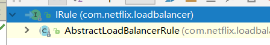
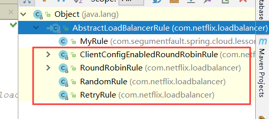
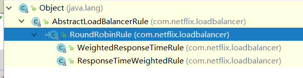
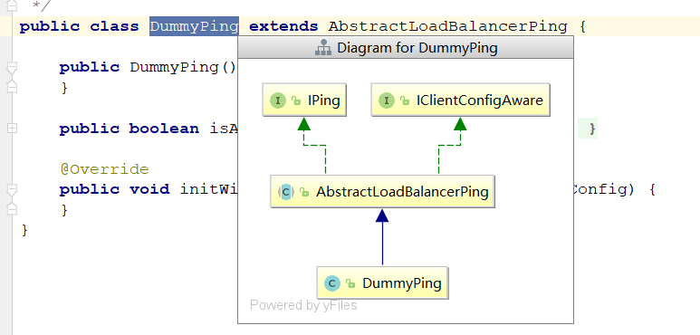

## 一、Ribbon核心接口

对于下面介绍的接口，都很重要，他们组合在一起，就是负载均衡实现的原理，所以我们先来研究他们的接口，最后再看实现的步骤

### 1.负载均衡客户端

Spring对于命名非常灵性，对于负载均衡客户端，我们就可以在源码中搜索Load Balance Client即可，即可搜到LoadBalancerClient，即我们想要的接口，主要作用为：**执行调用**

#### LoadBalancerClient

这里我们简单放出源码，并进行一些转变，比如去掉注解，把父类的方法也拿进来之类的：

```java
public interface LoadBalancerClient extends ServiceInstanceChooser {
    
    // 父类ServiceInstanceChooser方法
    ServiceInstance choose(String serviceId);

   <T> T execute(String serviceId, LoadBalancerRequest<T> request) throws IOException;

   <T> T execute(String serviceId, ServiceInstance serviceInstance, LoadBalancerRequest<T> request) throws IOException;

   URI reconstructURI(ServiceInstance instance, URI original);
}
```

这里主要有三个方法，我们先介绍下功能：

- choose：选择服务器实例，通过一些负载算法，选定一台服务实例
- execute：请求执行回调，针对服务实例，执行具体的请求回调操作
- reconstructURI：转换URI，即把应用名称转换成IP加端口的具体路径，以方便请求

#### RibbonLoadBalancerClient

因为这里是接口，具体的实现还是要看实现类，对于Ribbon来说，实现类为RibbonLoadBalancerClient，我们进行源码查看，主要针对其实现方法：

##### reconstructURI：

```java
@Override
public URI reconstructURI(ServiceInstance instance, URI original) {
    Assert.notNull(instance, "instance can not be null");
    String serviceId = instance.getServiceId();
    RibbonLoadBalancerContext context = this.clientFactory
        .getLoadBalancerContext(serviceId);
    Server server = new Server(instance.getHost(), instance.getPort());
    IClientConfig clientConfig = clientFactory.getClientConfig(serviceId);
    ServerIntrospector serverIntrospector = serverIntrospector(serviceId);
    URI uri = RibbonUtils.updateToHttpsIfNeeded(original, clientConfig,
                                                serverIntrospector, server);
    return context.reconstructURIWithServer(server, uri);
}
```

可以看到，这里做了一大堆的处理，主要目的是：**将ServiceInstance中的实例信息转为Server对象保存**，最后调用`context.reconstructURIWithServer(server, uri);`，所以具体的转换不在RibbonClient中，而是在RibbonLoadBalancerContext，所以我们后面在进行研究。

##### choose

```java
@Override
public ServiceInstance choose(String serviceId) {
   Server server = getServer(serviceId);
   if (server == null) {
      return null;
   }
   return new RibbonServer(serviceId, server, isSecure(server, serviceId),
         serverIntrospector(serviceId).getMetadata(server));
}

protected Server getServer(String serviceId) {
    return getServer(getLoadBalancer(serviceId));
}

protected Server getServer(ILoadBalancer loadBalancer) {
    if (loadBalancer == null) {
        return null;
    }
    return loadBalancer.chooseServer("default"); // TODO: better handling of key
}

protected ILoadBalancer getLoadBalancer(String serviceId) {
    return this.clientFactory.getLoadBalancer(serviceId);
}
```

通过源码不难看出，choose选择服务实例通过一层层递进，choose() -> getServer() -> getServer(loadBalancer) -> loadBalancer.chooseServer("default")，可以知道，最后使用的ILoadBalancer进行的实例选择，对于这个接口我们后面介绍。

对于execute方法是发出请求的重要方法，我们将所有接口都介绍完毕再进行解析。

### 2.负载均衡器上下文

Spring有他的ApplicationContext上下文，SpringCloud有BootstrapContext上下文，对于负载均衡器来说，也有他的上下文LoadBalancerContext，主要作用为：**承上启下**

#### LoadBalancerContext

主要职责：

- 转化 URI：将含应⽤用名称URI 转化成具体主机+端口的形式
- 组件关联：关联 RetryHandler、ILoadBalancer 等
- 记录服务统计信息：记录请求相应时间、错误数量量等

默认实现：RibbonLoadBalancerContext，用于存储被负载均衡器使用的上下文内容以及API操作等等。

```java
public URI reconstructURIWithServer(Server server, URI original) {
    String host = server.getHost();
    int port = server.getPort();
    String scheme = server.getScheme();
    
    if (host.equals(original.getHost()) 
            && port == original.getPort()
            && scheme == original.getScheme()) {
        return original;
    }
    if (scheme == null) {
        scheme = original.getScheme();
    }
    if (scheme == null) {
        scheme = deriveSchemeAndPortFromPartialUri(original).first();
    }

    try {
        StringBuilder sb = new StringBuilder();
        sb.append(scheme).append("://");
        if (!Strings.isNullOrEmpty(original.getRawUserInfo())) {
            sb.append(original.getRawUserInfo()).append("@");
        }
        sb.append(host);
        if (port >= 0) {
            sb.append(":").append(port);
        }
        sb.append(original.getRawPath());
        if (!Strings.isNullOrEmpty(original.getRawQuery())) {
            sb.append("?").append(original.getRawQuery());
        }
        if (!Strings.isNullOrEmpty(original.getRawFragment())) {
            sb.append("#").append(original.getRawFragment());
        }
        URI newURI = new URI(sb.toString());
        return newURI;            
    } catch (URISyntaxException e) {
        throw new RuntimeException(e);
    }
}
```

可以简单看下应用名与IP端口的转换，从`reconstructURIWithServer`的实现逻辑中，我们可以看到，它从`Server`对象中获取host和port信息，然后根据以服务名为host的`URI`对象original中获取其他请求信息，将两者内容进行拼接整合，形成最终要访问的服务实例的具体地址。

#### RibbonLoadBalancerContext

再看下实现类的源码：

```java
public class RibbonLoadBalancerContext extends LoadBalancerContext {
   public RibbonLoadBalancerContext(ILoadBalancer lb) {
      super(lb);
   }

   public RibbonLoadBalancerContext(ILoadBalancer lb, IClientConfig clientConfig) {
      super(lb, clientConfig);
   }

   public RibbonLoadBalancerContext(ILoadBalancer lb, IClientConfig clientConfig,
         RetryHandler handler) {
      super(lb, clientConfig, handler);
   }

   ··· // 省略的方法都是直接调用父类方法的，没有任何意义

}
```

可以看到，这里大量出现ILoadBalancer，这个就是我们的重头戏，负载均衡器！

### 3.负载均衡器

负载均衡器主要做用是**维护服务器状态**

#### ILoadBalancer

```java
public interface ILoadBalancer {

   public void addServers(List<Server> newServers);
   
   public Server chooseServer(Object key);
   
   public void markServerDown(Server server);

   /**
    * @return Only the servers that are up and reachable.
     */
    public List<Server> getReachableServers();

    /**
     * @return All known servers, both reachable and unreachable.
     */
   public List<Server> getAllServers();
}
```

具体的方法又：

- addServers：添加服务实例
- chooseServer：通过关联的Key来获取服务实例或服务实例列表
- markServerDown：标记一个服务为DOWN状态，主要是由IPing的方式来检测，后面介绍
- getReachableServers：可用服务列表
- getAllServers：所有的服务列表


#### ZoneAwareLoadBalancer

接口的主要实现类，比如前面在RibbonLoadBalancerClient中的choose方法，就是使用的这个实现类的chooseServer

```java
public ZoneAwareLoadBalancer(IClientConfig clientConfig, IRule rule,
                                 IPing ping, ServerList<T> serverList, ServerListFilter<T> filter,
                                 ServerListUpdater serverListUpdater) {
    super(clientConfig, rule, ping, serverList, filter, serverListUpdater);
}
@Override
public Server chooseServer(Object key) {
    if (!ENABLED.get() || getLoadBalancerStats().getAvailableZones().size() <= 1) {
        logger.debug("Zone aware logic disabled or there is only one zone");
        return super.chooseServer(key); // 调用父类的chooseServer方法
    }
   ··· // 因为一般只有一个Zone即区域，就是使用默认的defaultZone，所以对于多区域的操作我们省略
}

// 父类BaseLoadBalancer中方法
public Server chooseServer(Object key) {
    if (counter == null) {
        counter = createCounter();
    }
    counter.increment();
    if (rule == null) {
        return null;
    } else {
        try {
            return rule.choose(key);
        } catch (Exception e) {
            logger.warn("LoadBalancer [{}]:  Error choosing server for key {}", name, key, e);
            return null;
        }
    }
}
```

这里可以看到，ILoadBalancer主要是维护服务器实例，对于真正选择一个实例的算法或者规则是`rule.choose(key);`这个方法，即IRule中的方法，所以我们下面介绍IRule

### 4.负载均衡规则接口

主要任务：在多个实例中根据规则选择一个实例

#### IRule

```java
public interface IRule{
    /*
     * choose one alive server from lb.allServers or
     * lb.upServers according to key
     * 
     * @return choosen Server object. NULL is returned if none
     *  server is available 
     */

    public Server choose(Object key);
    
    public void setLoadBalancer(ILoadBalancer lb);
    
    public ILoadBalancer getLoadBalancer();    
}
```

这里主要方法就是choose，各种实现类对此方法进行重写，实现多种规则的实例选择，

实现IRule接口的首先是一个抽象类：



对于这个抽象类：



有很多官方实现的规则，比如RandomRule，随机选择，RoundRobinRule，轮询选择，而Ribbon对于默认的使用为ZoneAvoidanceRule，但是他没有重写choose方法，所以使用的是父类方法，我们看下他的组织结构：


实际使用是ClientConfigEnabledRoundRobinRule

#### ClientConfigEnabledRoundRobinRule

```java
@Override
public Server choose(Object key) {
    if (roundRobinRule != null) {
        return roundRobinRule.choose(key);
    } else {
        throw new IllegalArgumentException(
            "This class has not been initialized with the RoundRobinRule class");
    }
}
```

这里实际使用的还是RoundRobinRule的choose方法，即轮询选择。

对于RoundRobinRule来说，也有很多子类：



就不一一介绍了，我们只需知道IRule是负载均衡选择实例的规则即可

而Ribbon默认是使用ZoneAvoidanceRule~而不是我们上面介绍的RoundRobinRule

### 5.Ping策略

主要任务：**用来判断Server实例是否还存活**

#### IPing

```java
public interface IPing {
    
    /**
     * Checks whether the given <code>Server</code> is "alive" i.e. should be
     * considered a candidate while loadbalancing
     * 
     */
    public boolean isAlive(Server server);
}
```

就一个主要方法，即根据指定服务器，检测是否存活

具体Ribbon使用的实现类为`DummyPing`



```java
public class DummyPing extends AbstractLoadBalancerPing {

    public DummyPing() {
    }

    public boolean isAlive(Server server) {
        return true;
    }

    @Override
    public void initWithNiwsConfig(IClientConfig clientConfig) {
    }
}
```

这里是永远返回true的

## 二、Ribbon负载均衡流程

有了前面的基础，现在我们一步步来分析Ribbon是如何实现负载均衡的。

首先我们做了哪些事？

1. 向容器中添加RestTemplate类，并添加@LoadBalanced注解
2. 使用restTemplate.postForObject()进行服务消费

```java
@Configuration
public class RibbonConfig {
    @Bean
    @LoadBalanced
    RestTemplate restTemplate() {
        return new RestTemplate();
    }
}
@Service
public class RibbonService {
    @Autowired
    RestTemplate restTemplate;
    public String hi(String name) {
        return restTemplate.postForObject("http://eureka-client/hi?name="+name,String.class);
    }
}
```

首先我们debug进入postForObject方法


由上图可以明显的看到，有一个负载均衡拦截器`LoadBalancerInterceptor`

### LoadBalancerInterceptor

```java
@Override
public ClientHttpResponse intercept(final HttpRequest request, final byte[] body,
      final ClientHttpRequestExecution execution) throws IOException {
   final URI originalUri = request.getURI();
   String serviceName = originalUri.getHost();
   Assert.state(serviceName != null, "Request URI does not contain a valid hostname: " + originalUri);
   return this.loadBalancer.execute(serviceName, requestFactory.createRequest(request, body, execution));
}
```

可以明显的看懂，拦截后执行了LoadBalancer的execute方法，即RibbonLoadBalancerClient中的方法。

### RibbonLoadBalancerClient

```java
@Override
public <T> T execute(String serviceId, LoadBalancerRequest<T> request) throws IOException {
   ILoadBalancer loadBalancer = getLoadBalancer(serviceId); // 重点方法
   Server server = getServer(loadBalancer); // 重点方法
   if (server == null) {
      throw new IllegalStateException("No instances available for " + serviceId);
   }
   RibbonServer ribbonServer = new RibbonServer(serviceId, server, isSecure(server,
         serviceId), serverIntrospector(serviceId).getMetadata(server));

   return execute(serviceId, ribbonServer, request);
}
protected Server getServer(ILoadBalancer loadBalancer) {
    if (loadBalancer == null) {
        return null;
    }
    // 重点
    return loadBalancer.chooseServer("default"); // TODO: better handling of key
}
```

这里做了哪些事呢？

getLoadBalancer(serviceId)：从上下文（RibbonLoadBalancerContext）中获取负载均衡器，即我们上面说的ZoneAwareLoadBalancer

getServer(loadBalancer)：执行loadBalancer.chooseServer("default");方法，通过ZoneAwareLoadBalancer获取一个服务实例

所以我们下一步要进入到ZoneAwareLoadBalancer的chooseServer方法中

### ZoneAwareLoadBalancer

这里其实就和上面1.3节介绍的一样啦，直接套用源码

```java
public ZoneAwareLoadBalancer(IClientConfig clientConfig, IRule rule,
                                 IPing ping, ServerList<T> serverList, ServerListFilter<T> filter,
                                 ServerListUpdater serverListUpdater) {
    super(clientConfig, rule, ping, serverList, filter, serverListUpdater);
}
@Override
public Server chooseServer(Object key) {
    if (!ENABLED.get() || getLoadBalancerStats().getAvailableZones().size() <= 1) {
        logger.debug("Zone aware logic disabled or there is only one zone");
        return super.chooseServer(key); // 调用父类的chooseServer方法
    }
   ··· // 因为一般只有一个Zone即区域，就是使用默认的defaultZone，所以对于多区域的操作我们省略
}

// 父类BaseLoadBalancer中方法
public Server chooseServer(Object key) {
    if (counter == null) {
        counter = createCounter();
    }
    counter.increment();
    if (rule == null) {
        return null;
    } else {
        try {
            return rule.choose(key);
        } catch (Exception e) {
            logger.warn("LoadBalancer [{}]:  Error choosing server for key {}", name, key, e);
            return null;
        }
    }
}
```

因为我们只有defaultZone，默认区域，所以直接请求父类chooseServer方法，在这里重要的方法是==rule.choose(key);==，即根据IRule规则接口选择一个可用的，这里具体的使用类为ZoneAvoidanceRule

### ZoneAvoidanceRule

因为前面介绍过，这个类没有重写choose方法，所以实际使用还是父类ClientConfigEnabledRoundRobinRule的choose方法，即：

```java
public class ClientConfigEnabledRoundRobinRule extends AbstractLoadBalancerRule {
    @Override
    public Server choose(Object key) {
        if (roundRobinRule != null) {
            return roundRobinRule.choose(key);
        } else {
            throw new IllegalArgumentException(
                    "This class has not been initialized with the RoundRobinRule class");
        }
    }

}
```

进一步使用RoundRobinRule的轮询选择：

```java
public Server choose(ILoadBalancer lb, Object key) {
    if (lb == null) {
        log.warn("no load balancer");
        return null;
    }

    Server server = null;
    int count = 0;
    while (server == null && count++ < 10) {
        ···
        int nextServerIndex = incrementAndGetModulo(serverCount);
        server = allServers.get(nextServerIndex);
		···
    }
    return server;
}
```

这里省略了一些，可以自行去源码查看，只说比较重要的nextServerIndex，即可用的Server集合中的下一次选择索引，这样很简单的就实现了轮询。

可以发现，这里有个关键词**可用的Server集合**，这里就和IPing有关了，实现类为DummyPing

### DummyPing

这个Ping操作是定时去操作的，随便DummyPing是一定返回true，但是可以修改Ping，比如我们请求他的health端点，看看是否正确请求来判断他是否挂掉之类的。

### 回到RibbonLoadBalancerClient

接着我们回到RibbonLoadBalancerClient中的execute方法

```java
@Override
public <T> T execute(String serviceId, LoadBalancerRequest<T> request) throws IOException {
   ILoadBalancer loadBalancer = getLoadBalancer(serviceId); // 重点方法
   Server server = getServer(loadBalancer); // 重点方法
   if (server == null) {
      throw new IllegalStateException("No instances available for " + serviceId);
   }
   RibbonServer ribbonServer = new RibbonServer(serviceId, server, isSecure(server,
         serviceId), serverIntrospector(serviceId).getMetadata(server));

   return execute(serviceId, ribbonServer, request);
}
```

经过上面一层层的调用执行，我们获取到了一个可用的Server实例，这里拿到要调用的服务的实例的后，把服务名，服务实例等信息包装到 RibbonServer对象中，然后执行重载的execute方法：

```java
@Override
public <T> T execute(String serviceId, ServiceInstance serviceInstance, LoadBalancerRequest<T> request) throws IOException {
   ···// 不关键的代码

   try {
      T returnVal = request.apply(serviceInstance);
      statsRecorder.recordStats(returnVal);
      return returnVal;
   }
   ···// 不关键的代码
}
```

可以看到，这里执行了request.apply(serviceInstance);，即回调LoadBalancerInterceptor中的方法，我们再回到LoadBalancerInterceptor

### 回到LoadBalancerInterceptor

```java
@Override
public ClientHttpResponse intercept(final HttpRequest request, final byte[] body,
      final ClientHttpRequestExecution execution) throws IOException {
   final URI originalUri = request.getURI();
   String serviceName = originalUri.getHost();
   Assert.state(serviceName != null, "Request URI does not contain a valid hostname: " + originalUri);
   return this.loadBalancer.execute(serviceName, requestFactory.createRequest(request, body, execution));
}
```

这里的回调方法即requestFactory.createRequest(request, body, execution)，这里就不往深探索了，其实就是创建一个URIConnection，然后来调用远程服务~

### 总结

1. @LoadBalanced开启了RibbonLoadBalancerClient负载均衡支持
2. 当调用RestTemplate发起请求时会被  LoadBalancerInterceptor请求拦截器给拦截到
3. 拦截器中使用了 RibbonLoadBalancerClient执行请求
4. 然后根据服务id获取了负载均衡器，默认 ZoneAwareLoadBalancer
5. 然后负载均衡器进行服务的选择，默认使用ZoneAvoidanceRule父类中的轮询策略
6. 拿到服务实例后回调 LoadBalancerInterceptor中的requestFactory.createRequest()方法
7. 最后使用URIConnection完成服务调用请求，获取返回结果。


