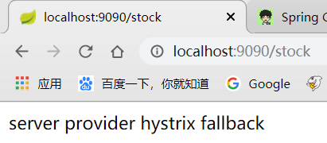
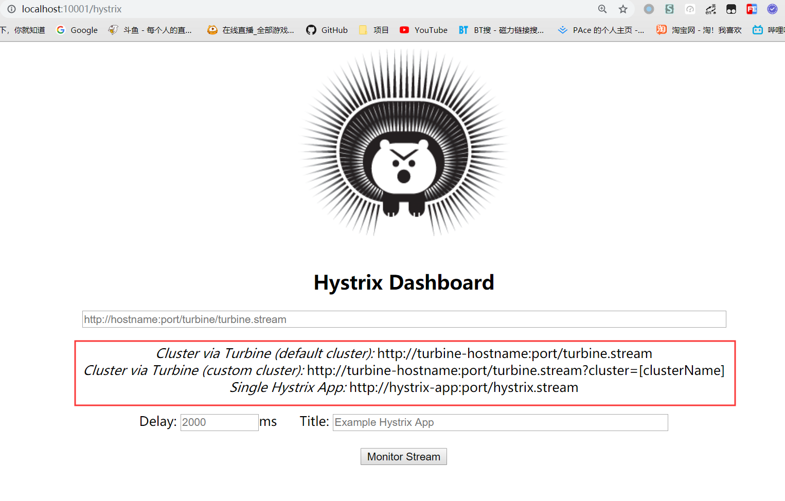
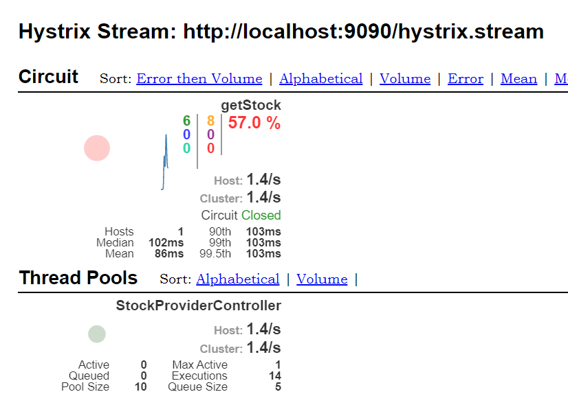
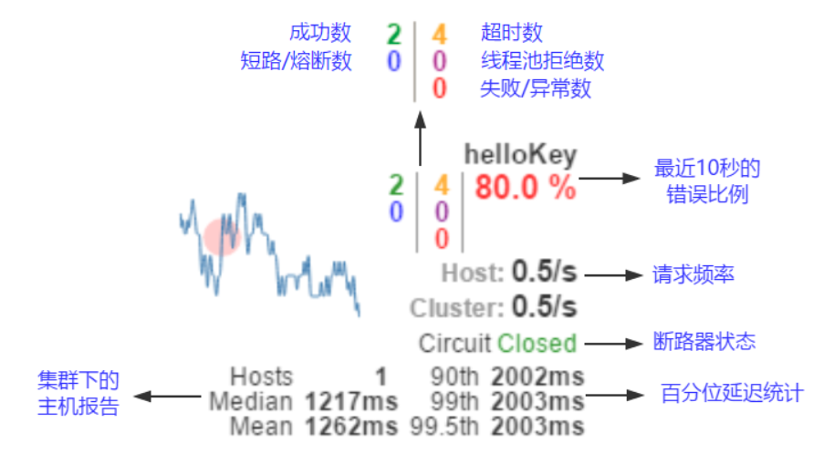

## 一、简单介绍

### 1.问题的提出

在微服务架构中，各个服务的消费提供都是依赖远程调用的方式，这样便会因为网络，服务故障等问题出现请求超时，延迟。若此时服务调用数量增加，导致请求累计，最终会导致系统瘫痪。

举个例子：以淘宝为例，创建订单业务需要先查询库存，库存 > 0才允许创建，如果此时库存服务因某些问题故障，导致无法被访问，那么创建订单的线程会一直等待，最终导致创建失败，如果这是在双十一的时候，那么大量并发冲击，导致无数线程等待库存服务，最终会导致订单服务挂掉。

在微服务架构中，存在着那么多的服务单元，若一个单元出现故障，就会因依赖关系形成故障蔓延，最终导致整个系统的瘫痪，这样的架构相较传统架构就更加的不稳定。为了解决这样的问题，因此产生了断路器模式。

### 2.服务熔断

服务熔断就是在微服务中，添加一个断路器，如果一个服务因某种原因故障（电路故障），这时别的服务请求他时，会通过**断路器监控**（类似电路保险丝），**断路器向调用方返回错误响应**，而不是长时间等待，避免了故障蔓延（电路故障引起火灾）。

## 二、传统Spring Web 

在传统的MVC项目中，是如果添加断路器这种组件的呢？

一般情况下，都是**抛出异常**，比如如果访问时间超过多长时间，抛出异常。如下实现：

创建一个普通的springboot工程：

### 创建Controller

```java
@RestController
public class DemoRestController {

    private final static Random random = new Random();

    /**
     * 当方法执行时间超过 100 ms 时，触发异常
     *
     * @return
     */
    @GetMapping("")
    public String index() throws Exception {

        long executeTime = random.nextInt(200);

        if (executeTime > 100) { // 执行时间超过了 100 ms
            throw new TimeoutException("Execution is timeout!");
        }

        return "Hello,World";
    }

}
```

这里意思是，取一个随机数模拟执行时间，如果超过100，那么抛出`TimeoutException`异常，

### 创建Advice类进行异常处理

```java
// 只针对DemoRestController的异常
@RestControllerAdvice(assignableTypes = DemoRestController.class)
public class DemoRestControllerAdvice {

    // 只处理TimooutException异常
    @ExceptionHandler(TimeoutException.class)
    public Object faultToleranceTimeout(Throwable throwable) {
        return throwable.getMessage(); // 直接打印异常信息
    }
}
```

这里创建一个`Advice`，就是类似`AOP`的形式，对异常进行捕获处理，主要目的是在页面展示异常信息，而不是springboot自带的异常页面。

### 测试

启动主程序类后，进行`localhost:8080`的访问


可以看到，随机的抛出异常，即断路器成功应用

## 三、Spring Cloud Hystrix

首先需要添加Maven依赖

```xml
<!-- 依赖 Hystrix -->
<dependency>
    <groupId>org.springframework.cloud</groupId>
    <artifactId>spring-cloud-starter-hystrix</artifactId>
</dependency>
```

注意：Spring Cloud对于服务熔断，提供了一个公用注解，当然`Hystrix`也有他的注解

- `@EnableHystrix`：Hystrix的开启注解
- `@EnableCircuitBreaker`：SpringCloud的公用断路器接口，推荐使用

这就和Eureka一样，有一个`@EnableEurekaClient`和`@EnableDiscoveryClient`

并且，Hystrix提供了两种开启熔断的方式

- 注解方式
- 编程方式

### 1.服务提供方添加断路器

==这里我们首先使用`@EnableHystrix`注解，并且使用注解方式==

#### 主程序类添加注解

```java
@SpringBootApplication
@EnableHystrix
public class UserServiceProviderApplication {

    public static void main(String[] args) {
        SpringApplication.run(UserServiceProviderApplication.class, args);
    }
}
```

#### 编写Controller

```java
@RestController
public class StockProviderController {

    private final static Random random = new Random();

    @HystrixCommand(
            commandProperties = {
                    @HystrixProperty(name = "execution.isolation.thread.timeoutInMilliseconds",value = "100")
            }, // 设置熔断的条件，此条件为如果执行时间超过100ms，即熔断
            fallbackMethod = "emptyStock" // 设置熔断后执行的方法
    )
    @GetMapping("/stock")
    public String getStock() throws Exception {
        long executeTime = random.nextInt(200);
        // 通过休眠来模拟执行时间
        System.out.println("Execute Time : " + executeTime + " ms");
        Thread.sleep(executeTime);
        return "100";
    }

    private String emptyStock(){
        return "server provider hystrix fallback";
    }
}
```

这里可以看到，主要使用到了几个重要的注解

`@HystrixCommand`：添加Hystrix断路规则，其中有几个属性

- `commandProperties`：断路条件，可以设置多个
  - `@HystrixProperty`：断路具体条件[Hystrix Wiki](https://github.com/Netflix/Hystrix/wiki/Configuration)
- `fallbackMethod`：熔断后执行方法

#### 测试



正确返回`server provider hystrix fallback`，并且控制台输出`Execute Time : 169 ms`


### 2.服务消费方添加断路器

==对于服务消费方，我们使用@EnableCircuitBreaker以及编程方式实现==

#### 主程序添加注解

```java
@SpringBootApplication
@RibbonClient("user-service-provider") // 指定目标应用名称
@EnableCircuitBreaker
public class UserRibbonClientApplication {

    public static void main(String[] args) {
        SpringApplication.run(UserRibbonClientApplication.class, args);
    }

    @Bean
    @LoadBalanced
    public RestTemplate restTemplate(){
        return new RestTemplate();
    }

}
```

#### 编写Hystrix类

```java
public class MyHystrixCommand extends HystrixCommand<String> {

    private final String providerName;

    private final RestTemplate restTemplate;

    public MyHystrixCommand(String providerName, RestTemplate restTemplate) {
        //必需要实现构造方法
        super(HystrixCommandGroupKey.Factory.asKey(
                "User-Ribbon-Client"), // 定义一个组，名称随意
                100); // 执行时间
        this.providerName = providerName;
        this.restTemplate = restTemplate;
    }

    @Override 
    protected String run() throws Exception {
        return restTemplate.getForObject("http://" + providerName + "/stock",
                String.class);
    }

    /**
     * 熔断后执行的方法
     * @return
     */
    @Override
    protected String getFallback() {
        return "server client hystrix fallback";
    }
}
```

这里使用了编程方式来写一个Hystrix熔断类，具体的步骤为：

- 创建一个类，继承`HystrixCommand<T>`（必要）
- 实现抽象方法`run()`，即需要熔断的方法（必要）
- 添加构造方法，**必要添加组名**，可选添加执行超时时间，线程池等。
- 重写熔断后执行方法，`getFallback()`（可选）

#### 编写Controller

```java
@RestController
public class StockRibbonController {

    @Autowired
    private RestTemplate restTemplate;

    @Value("${provider.service.name}")
    private String providerName;

    @GetMapping("/stock")
    public String getStock(){
        String rs = new MyHystrixCommand(providerName, restTemplate).execute();
        return rs;
    }
}
```

主要是实例化刚刚编写的`HystrixCommand`类，然后运行

#### 测试


正确返回服务消费方的回调方法，说明消费方熔断成功

## 四、Hystrix Bashboard

`Hystrix Dashboard`，它主要用来实时监控Hystrix的各项指标信息。通过`Hystrix Dashboard`反馈的实时信息，可以帮助我们快速发现系统中存在的问题。下面通过一个例子来学习。

### 添加Maven依赖

```xml
<dependencies>
    <dependency>
        <groupId>org.springframework.cloud</groupId>
        <artifactId>spring-cloud-starter-hystrix-dashboard</artifactId>
    </dependency>
</dependencies>
```

### 创建主程序类

```java
@SpringBootApplication
@EnableHystrixDashboard
public class HystrixDashboardApplication {

    public static void main(String[] args) {
        SpringApplication.run(HystrixDashboardApplication.class,args);
    }
}
```

注意，这里添加注解开启Hystrix监控，`@EnableHystrixDashboard`

### 添加配置文件

```properties
# 应用名
spring.application.name=hystrix-dashboard
# 端口
server.port=10001
```

### 访问测试

访问<http://localhost:10001/hystrix>



会进入这么一个页面，可以在红框看到，有三种监控方式，一二两种都需要配合Turbine来做，这个我们后面才会学到，所以先使用单机版，在输入框输入：`http://localhost:9090/hystrix.stream`

可以进入以下页面，这时我们疯狂访问8080或者9090，因为都会调用9090的熔断API



可以清楚的看到，调用成功6次，失败8次，失败率为57%

并且还有一些其他的信息，比如那个红点，流量越多，他越大，Ciruit Closed，代表熔断关闭等等



## 五、Hystrix的缺点

对于很多大公司来说，很少使用Hystrix，因为它的缺点很明显

一是对于分布式支持不够，比如超时时间，不能动态的去设置

二是功能太简陋，支持的关于熔断的功能较简单