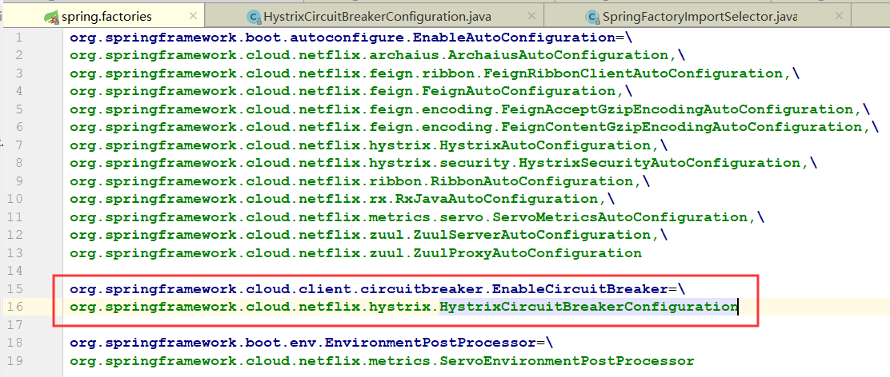
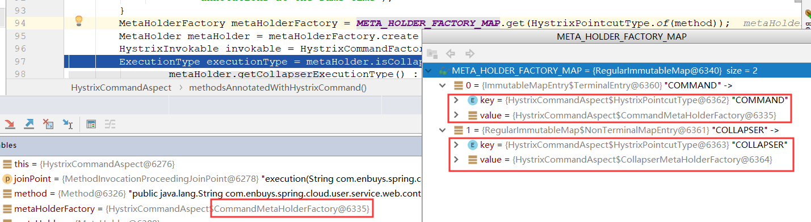
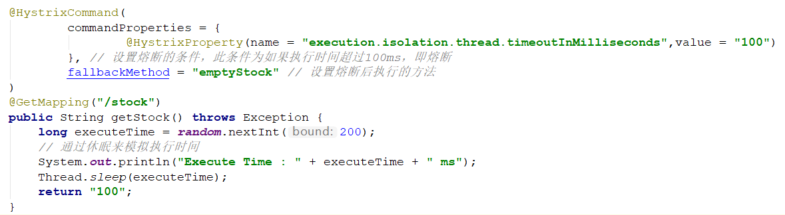

## 一、SpringCloud CircuitBreaker

首先我们从SpringCloud的官方断路器注解` @EnableCircuitBreaker`入手

### @EnableCircuitBreake

```java
@Target(ElementType.TYPE)
@Retention(RetentionPolicy.RUNTIME)
@Documented
@Inherited
@Import(EnableCircuitBreakerImportSelector.class)
public @interface EnableCircuitBreaker {

}
```

可以看到，真正有用的代码就是`@Import`那一行：

`@Import(EnableCircuitBreakerImportSelector.class)`

这里Import了一个选择器，是选择什么呢？就是这个断路器的实现类，即Hystrix

### EnableCircuitBreakerImportSelector

```java
@Order(Ordered.LOWEST_PRECEDENCE - 100)
public class EnableCircuitBreakerImportSelector extends
      SpringFactoryImportSelector<EnableCircuitBreaker> {

   @Override
   protected boolean isEnabled() {
      return new RelaxedPropertyResolver(getEnvironment()).getProperty(
            "spring.cloud.circuit.breaker.enabled", Boolean.class, Boolean.TRUE);
   }

}
```

进入到断路器导入选择器中，可以看到代码很少，主要有两个重点

- 继承`SpringFactoryImportSelector`父类，并且泛型为`EnableCircuitBreaker`
- 可以在配置文件中通过`spring.cloud.circuit.breaker.enabled`，进行断路器的开启和关闭

这样我们再进入`SpringFactoryImportSelector`

### SpringFactoryImportSelector

```java
@CommonsLog
public abstract class SpringFactoryImportSelector<T>
      implements DeferredImportSelector, BeanClassLoaderAware, EnvironmentAware {

   private ClassLoader beanClassLoader;

   private Class<T> annotationClass;

   private Environment environment;

   @SuppressWarnings("unchecked")
   protected SpringFactoryImportSelector() {
      this.annotationClass = (Class<T>) GenericTypeResolver
            .resolveTypeArgument(this.getClass(), SpringFactoryImportSelector.class);
   }

   @Override
   public String[] selectImports(AnnotationMetadata metadata) {
      if (!isEnabled()) {
         return new String[0];
      }
      AnnotationAttributes attributes = AnnotationAttributes.fromMap(
            metadata.getAnnotationAttributes(this.annotationClass.getName(), true));

      Assert.notNull(attributes, "No " + getSimpleName() + " attributes found. Is "
            + metadata.getClassName() + " annotated with @" + getSimpleName() + "?");

      // Find all possible auto configuration classes, filtering duplicates
      List<String> factories = new ArrayList<>(new LinkedHashSet<>(SpringFactoriesLoader
            .loadFactoryNames(this.annotationClass, this.beanClassLoader)));

      if (factories.isEmpty() && !hasDefaultFactory()) {
         throw new IllegalStateException("Annotation @" + getSimpleName()
               + " found, but there are no implementations. Did you forget to include a starter?");
      }

      if (factories.size() > 1) {
         // there should only ever be one DiscoveryClient, but there might be more than
         // one factory
         log.warn("More than one implementation " + "of @" + getSimpleName()
               + " (now relying on @Conditionals to pick one): " + factories);
      }

      return factories.toArray(new String[factories.size()]);
   }

   ···· // 一些代码省略

}
```

代码较多，我们一点一点看

#### 构造方法

首先看他的构造方法

```java
   @SuppressWarnings("unchecked")
   protected SpringFactoryImportSelector() {
      this.annotationClass = (Class<T>) GenericTypeResolver
            .resolveTypeArgument(this.getClass(), SpringFactoryImportSelector.class);
   }
```

这里主要是将注解类进行实例化，其实现，就是刚刚的那个泛型`EnableCircuitBreaker`

#### selectImport

然后我们再看selectImport方法，这个方法主要目的就是选择一个类，为我们的断路器实现类

```java
@Override
public String[] selectImports(AnnotationMetadata metadata) {
   if (!isEnabled()) {
      return new String[0];
   }
   // 获取注解类中的属性
   AnnotationAttributes attributes = AnnotationAttributes.fromMap(
         metadata.getAnnotationAttributes(this.annotationClass.getName(), true));

   ··· // 省略

   // 从spring.factories中加载自动配置类
   // Find all possible auto configuration classes, filtering duplicates
   List<String> factories = new ArrayList<>(new LinkedHashSet<>(SpringFactoriesLoader
         .loadFactoryNames(this.annotationClass, this.beanClassLoader)));

   ··· // 省略
   return factories.toArray(new String[factories.size()]);
}
```

##### 1.获取注解类中的属性

```java
AnnotationAttributes attributes = AnnotationAttributes.fromMap(
         metadata.getAnnotationAttributes(this.annotationClass.getName(), true));
```

这里代码的意思就是将注解类里的注解信息进行保存

因为`EnableCircuitBreaker`中是空的，属性对于他来说不明显，这里我们换个类来解析下，比如`@EnableCaching`

```java
@Target(ElementType.TYPE)
@Retention(RetentionPolicy.RUNTIME)
@Documented
@Import(CachingConfigurationSelector.class)
public @interface EnableCaching {

   boolean proxyTargetClass() default false;

   AdviceMode mode() default AdviceMode.PROXY;

   int order() default Ordered.LOWEST_PRECEDENCE;

}
```

这里可以看到有三个属性，对于`AnnotationAttributes`来说，是将这些属性保存在`LinkedHashMap`里的，其方法名为`key`，值为`value`，即`proxyTargetClass`为`key`，`false`为`value`

##### 2.从spring.factories中加载自动配置类

```java
List<String> factories = new ArrayList<>(new LinkedHashSet<>(SpringFactoriesLoader
         .loadFactoryNames(this.annotationClass, this.beanClassLoader)));
```

这里可以看到`SpringFactoriesLoader`，即从`META-INF/spring.factories`中加载名称叫`this.annotationClass`，即`EnableCircuitBreaker`的自动配置类，这里我们可以全局搜一下`EnableCircuitBreaker`




即会获取到`HystrixCircuitBreakerConfiguration`，这个自动配置类

##### 3.返回数组

```java
return factories.toArray(new String[factories.size()]);
```

将获取到的自动配置类集合转成数组返回

## 二、NetFlix Hystrix

我们接着`HystrixCircuitBreakerConfiguration`分析，因为接下来的源码都属于Hystrix包，所以另开了一个标题

### HystrixCircuitBreakerConfiguration

在这个配置类中，有几个重要的组件

#### HystrixShutdownHook

```java
private class HystrixShutdownHook implements DisposableBean {

   @Override
   public void destroy() throws Exception {
      // Just call Hystrix to reset thread pool etc.
      Hystrix.reset();
   }

}
```

这个组件主要功能是在`Hystrix shutdown`的时候，做一些清理工作

#### HystrixWebConfiguration

```java
@Configuration
@ConditionalOnProperty(value = "hystrix.stream.endpoint.enabled", matchIfMissing = true)
@ConditionalOnWebApplication
@ConditionalOnClass({ Endpoint.class, HystrixMetricsStreamServlet.class })
protected static class HystrixWebConfiguration {

   @Bean
   public HystrixStreamEndpoint hystrixStreamEndpoint() {
      return new HystrixStreamEndpoint();
   }

   @Bean
   public HasFeatures hystrixStreamFeature() {
      return HasFeatures.namedFeature("Hystrix Stream Servlet", HystrixStreamEndpoint.class);
   }
}
```

这个组件主要是开启Hystrix的`Stream EndPoint`，即可以访问`/hystrix.stream`来查看流信息，以及配合`HystrixDashboard`进行监控

#### HystrixMetricsPollerConfiguration

```java
@Configuration
@ConditionalOnProperty(value = "hystrix.metrics.enabled", matchIfMissing = true)
@ConditionalOnClass({ HystrixMetricsPoller.class, GaugeService.class })
@EnableConfigurationProperties(HystrixMetricsProperties.class)
protected static class HystrixMetricsPollerConfiguration implements SmartLifecycle {
```

这个类是配置Hystrix的`metrics`指标，也不做过多介绍了

#### HystrixCommandAspect

Hystrix的命令切面，也是主要实现熔断的切面类，也是Hystrix最重要的类之一

```java
@Aspect
public class HystrixCommandAspect {

    @Pointcut("@annotation(com.netflix.hystrix.contrib.javanica.annotation.HystrixCommand)")
    public void hystrixCommandAnnotationPointcut() {
    }

   @Pointcut("@annotation(com.netflix.hystrix.contrib.javanica.annotation.HystrixCollapser)")
    public void hystrixCollapserAnnotationPointcut() {
    }

}
```

在这个类中，首先可以看到两个切点

- `HystrixCommand`：我们常用的配置熔断的注解
- `HystrixCollapser`：批量熔断的一个注解，不常用

接着往下看重要的方法`methodsAnnotatedWithHystrixCommand()`

```java
@Around("hystrixCommandAnnotationPointcut() || hystrixCollapserAnnotationPointcut()")
public Object methodsAnnotatedWithHystrixCommand(final ProceedingJoinPoint joinPoint) throws Throwable {
    Method method = getMethodFromTarget(joinPoint);
    Validate.notNull(method, "failed to get method from joinPoint: %s", joinPoint);
    if (method.isAnnotationPresent(HystrixCommand.class) && method.isAnnotationPresent(HystrixCollapser.class)) {
        throw new IllegalStateException("method cannot be annotated with HystrixCommand and HystrixCollapser " +
                "annotations at the same time");
    }
    MetaHolderFactory metaHolderFactory = META_HOLDER_FACTORY_MAP.get(HystrixPointcutType.of(method));
    MetaHolder metaHolder = metaHolderFactory.create(joinPoint);
    HystrixInvokable invokable = HystrixCommandFactory.getInstance().create(metaHolder);
    ExecutionType executionType = metaHolder.isCollapserAnnotationPresent() ?
            metaHolder.getCollapserExecutionType() : metaHolder.getExecutionType();

    Object result;
    try {
        if (!metaHolder.isObservable()) {
            result = CommandExecutor.execute(invokable, executionType, metaHolder);
        } else {
            result = executeObservable(invokable, executionType, metaHolder);
        }
    } catch (HystrixBadRequestException e) {
        throw e.getCause() != null ? e.getCause() : e;
    } catch (HystrixRuntimeException e) {
        throw hystrixRuntimeExceptionToThrowable(metaHolder, e);
    }
    return result;
}
```

我们一步步的分析：

##### 切点拦截

```java
@Around("hystrixCommandAnnotationPointcut() || hystrixCollapserAnnotationPointcut()")
```

这里，第一眼可以看到`@Around`中添加了上面所说的那两个切点，所以，当有方法添加了这两个注解时，便会被这个切面类拦截。

##### Method信息保存

```java
Method method = getMethodFromTarget(joinPoint);
```

接着来到了这个方法，是获取被拦截方法的信息，保存到`Method`中。

##### MetaHolderFactory的初始化

```java
MetaHolderFactory metaHolderFactory = META_HOLDER_FACTORY_MAP.get(HystrixPointcutType.of(method));
```

再接着，是根据这个方法的Hystrix注解，判断是`@HystrixCommand`还是`@HystrixCollapser`来进行`MetaHolderFactory`的初始化，这里debug查看一下：



这里可以清楚的看到，因为方法上我们添加的是`@HystrixCommand`，所以工厂的实现是`CommandMetaHolderFactory`。

##### MetaHolder的实例化

```java
MetaHolder metaHolder = metaHolderFactory.create(joinPoint);
```

这里可以看到，通过工厂创建了一个`MetaHolder`对象，对于此对象，保存的是方法信息，熔断设置等等。

比如方法名，返回值类型，熔断条件，`fallback`方法等，其实就是我们在那个类上设置的信息：



##### HystrixInvokable的实例化

```java
HystrixInvokable invokable = HystrixCommandFactory.getInstance().create(metaHolder);
```

`HystrixInvokable`看名字，可以猜到是Hystrix熔断的可执行器，它本身是一个空方法，主要实现还是由下面的初始化来进行选择。

```java
public HystrixInvokable create(MetaHolder metaHolder) {
    HystrixInvokable executable;
    if (metaHolder.isCollapserAnnotationPresent()) {
        executable = new CommandCollapser(metaHolder);
    } else if (metaHolder.isObservable()) {
        executable = new GenericObservableCommand(HystrixCommandBuilderFactory.getInstance().create(metaHolder));
    } else {
        executable = new GenericCommand(HystrixCommandBuilderFactory.getInstance().create(metaHolder));
    }
    return executable;
}
```

这里有三个判断

- 对于`Collasper`注解的使用`CommandCollapser`实现
- 对于实现了`isObservable`，观察者模式的，使用`GenericObservableCommand`实现（属于`RxJava`的东西）
- 其他情况，即普通情况，使用`GenericCommand`，也是最常用的实现方法

所以，实际实现是由`GenericCommand`实现

这个类也很简单，就是对`execute`和`fallback`方法的执行做了实现，主要使用的是==反射==

##### 方法的执行

最终来到最重要的一步，拦截方法的执行

```java
result = CommandExecutor.execute(invokable, executionType, metaHolder);
```

进一步跟进

```java
public static Object execute(HystrixInvokable invokable, ExecutionType executionType, MetaHolder metaHolder) throws RuntimeException {
    Validate.notNull(invokable);
    Validate.notNull(metaHolder);

    switch (executionType) {
        case SYNCHRONOUS: {
            return castToExecutable(invokable, executionType).execute();
        }
        case ASYNCHRONOUS: {
            HystrixExecutable executable = castToExecutable(invokable, executionType);
            if (metaHolder.hasFallbackMethodCommand()
                    && ExecutionType.ASYNCHRONOUS == metaHolder.getFallbackExecutionType()) {
                return new FutureDecorator(executable.queue());
            }
            return executable.queue();
        }
        case OBSERVABLE: {
            HystrixObservable observable = castToObservable(invokable);
            return ObservableExecutionMode.EAGER == metaHolder.getObservableExecutionMode() ? observable.observe() : observable.toObservable();
        }
        default:
            throw new RuntimeException("unsupported execution type: " + executionType);
    }
}
```

这里可以看到，会判断是异步，同步 或者观察者模式的，进行不同的实现

常用的还是异步，即`castToExecutable()`方法，把`HystrixInvokable`转成`HystrixExecutable`，进而使用`HystrixCommand`的`execute`方法执行。

这里就不往下跟进了，实际就是使用了`Future`，异步多线程执行方法，也是在这里判断是否需要熔断的，真正触发的调用还是由`GenericCommand`完成。

##### 总结

1. 拦截标注 `@HystrixCommand` 或 `@HystrixCollapser` 的方法（`@Around`）
2. 生成拦截⽅方法原信息，通过`MetaHolderFactory`，对于不同的注解`Command`或`Collasper`，使用的工厂不同
3. 生成 `HystrixInvokable`，通过`HystrixCommandFactory`，通过情况下由`GenericCommand`实现
4. 执行方法，判断异步，同步或观察者模式，进行不同的转换
5. 通过情况下，把`HystrixInvokable`转成`HystrixExecutable`，进而使用`HystrixCommand`的`execute`方法执行。
6. 最后通过`Future`异步执行，判断是否需要熔断，最终方法的调用或者`fallback`方法的调用是由`GenericCommand`完成

