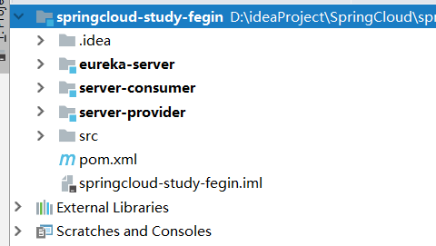
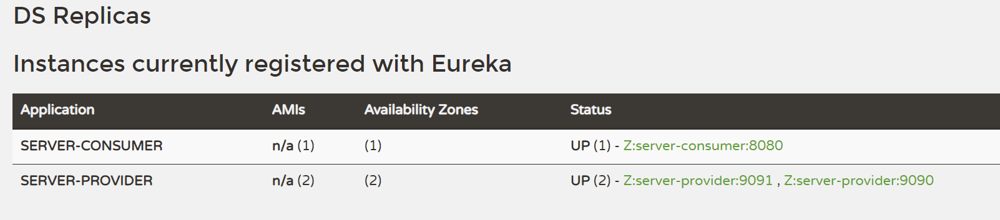
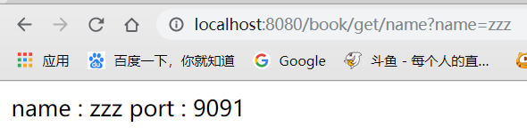
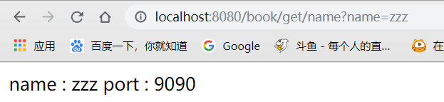
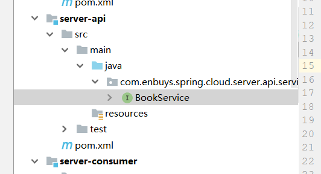

## 一、简介

在之前，我们学习了`Ribbon`和`Hystrix`。微服务的负载均衡器以及服务熔断措施，大大稳定了微服务应用。

在使用`Spring Cloud Ribbon`的时候，是配合`RestTemplate`与`@LoadBalanced`使用的，`RestTemplate`封装了`http`请求，提供了一套模板化调用方法。这时我们会发现，在实际开发中，对于更多的应用以及接口的调用，要写大量的`RestTemplate`模板化内容。

这时`SpringCloud`为了方便开发，实现了`Feign`这一组件，它简化了`Ribbon`，我们只需要创建接口并使用注解配置，即可完成对服务提供方的接口绑定。它具备可插拔的注解支持，包括`Feign`注解、`JAX-RS`注解。它也支持可插拔的编码器和解码器。`Spring Cloud Feign`还扩展了对`Spring MVC`注解的支持，同时还整合了`Hystrix`来提供服务熔断。

## 二、Spring Cloud Feign 入门

接着，我们从头开始使用`Feign`来充当服务消费方的角色。

### 1.初始化项目

首先我们创建一个Maven Project，`springcloud-study-Feign`

然后创建三个`Module`，分别是

- `eureka-server`：注册中心
- `server-provider`：服务提供方
- `server-consumer`：服务消费方



### 2.添加依赖

这里为了方便，我们将所有依赖都加在父类的`pom`文件里，因为`eureka`，`ribbon`依赖之前都讲过，这里只展示出`Feign`的依赖。

```xml
<!-- 依赖 Feign -->
<dependency>
    <groupId>org.springframework.cloud</groupId>
    <artifactId>spring-cloud-starter-feign</artifactId>
</dependency>
```

### 3.配置Eureka 注册中心

创建一个启动类，添加`Eureka Server`注解

```java
@SpringBootApplication
@EnableEurekaServer
public class MainApplication {
    public static void main(String[] args) {
        SpringApplication.run(MainApplication.class,args);
    }
}
```

配置`application.properties`

```properties
spring.application.name=eureka-server
server.port=10001

# 取消向注册中心注册
eureka.client.register-with-eureka=false
eureka.client.fetch-registry=false
# 取消多节点启动
eureka.instance.hostname=localhost
```

### 4.配置服务提供方

创建一个启动类，添加`Eureka Client`注解

```java
@SpringBootApplication
@EnableEurekaClient
public class ProviderApplication {
    public static void main(String[] args) {
        SpringApplication.run(ProviderApplication.class,args);
    }
}
```

配置`application.properties`

```properties
spring.application.name=server-provider
server.port=9090

# 向注册中心注册
eureka.client.service-url.defaultZone=http://127.0.0.1:10001/eureka
```

编写`Controller`类

```java
@RestController
public class BookController {

    @Value("${server.port}")
    private Integer port;

    @GetMapping("/book/get/name")
    public String get(@RequestParam("name") String name){
        return "name : "+ name + " port : " + port;
    }
}
```

### 5.配置服务消费方（Feign）

这时我们的重头戏就来了，首先是老套路，编写主程序类和配置。

```java
@SpringBootApplication
@EnableEurekaClient
@EnableFeignClients
public class ConsumerApplication {
    public static void main(String[] args) {
        SpringApplication.run(ConsumerApplication.class,args);
    }
}
```

```properties
spring.application.name=server-consumer
server.port=8080

# 向注册中心注册
eureka.client.service-url.defaultZone=http://127.0.0.1:10001/eureka
# 服务提供方名称
provider.service.name=server-provider
```

配置完这两项之后，我们需要写一个`Sevice`接口，用来消费服务，注意，**这里的接口，就相当于之前使用Ribbon时编写的`RestTemplate`发送请求**。

```java
@FeignClient(name = "${provider.service.name}")
public interface BookFeignService {

    @GetMapping("/book/get/name")
    String get(@RequestParam("name") String name);

}
```

#### 使用Feign实现服务消费接口

- 创建一个接口

- 添加`@FeignClient`注解，具有一些属性
  - `name`：服务提供方的应用名称，这里我动态的配置
  - `fallback`：使用服务熔断后，可以配置这个，来进行服务熔断后的请求类，我们之后再细说
- 使用`SpringMVC`注解，配置提供方的请求路径，并且入参和返回值要相同

编写`Controller`，注入`Service`接口，并调用服务。

```java
@RestController
public class BookController {

    @Autowired
    private BookFeignService bookFeignService;

    @GetMapping("/book/get/name")
    public String get(@RequestParam("name") String name){
        return bookFeignService.get(name);
    }
}
```

### 6.测试

这里先开启`eureka-server`

然后开启两个服务提供方，`9090`和`9091`

最后开启服务消费方



正确启动后访问我们的消费方接口



可以看到，正确负载均衡访问服务提供方，证明我们的`Feign`使用成功。

## 三、Spring Cloud Feign 改造

在上面的例子中，我们写了至少三次的api方法，即，服务提供方一次，服务调用方一次，Feign接口一次，如果接口越来越多，大量的复制粘贴是不可取的，这时，我们就需要改造一下我们的工程。

将接口抽象出来，以供提供方与消费方引用实现。

### 1.新建api工程

新建一个api工程，将所有的`service-api`类存放在这里，以便公共调用实现



创建`BookService`接口

```java
public interface BookService {
    
    @GetMapping("/book/get/name")
    String get(@RequestParam("name") String name);

}
```

### 2.重构服务提供方

首先需要在`pom`中添加`api`工程的引用

```xml
<dependencies>
    <dependency>
        <groupId>com.enbuys</groupId>
        <version>1.0-SNAPSHOT</version>
        <artifactId>server-api</artifactId>
    </dependency>
</dependencies>
```

其次就是修改`Controller`了

```java
@RequestMapping("/book")
@RestController
public class BookController implements BookService {

    @Value("${server.port}")
    private Integer port;

    @Override // /book/get/name
    public String get(@RequestParam("name") String name){
        return "name : "+ name + " port : " + port;
    }
}
```

在之前的基础上，添加一个`BookService`的实现即可，这样我们只需重新接口中的方法即可，不用大量的复制粘贴。

==注意，这里就不用再写一遍`@GetMapping`了==，因为接口的映射会自动带过来

### 3.重构服务消费方

也需要先添加`api`工程引用

然后重构`BookFeignService`接口

```java
@FeignClient(name = "${provider.service.name}")
public interface BookFeginService extends BookService {
}
```

这里只需集成`BookService`接口即可，并删除其中之前的方法

然后重构`Controller`

```java
@RestController
@RequestMapping("/book")
public class BookController implements BookService {

    @Autowired
    private BookService bookService;

    @Override // /book/get/name
    public String get(@RequestParam("name") String name){
        return bookService.get(name);
    }
}
```

对于Controller来说也非常简单，实现`BookService`接口即可，会把`@GetMapping`注解带过来，==就不用再写一遍@GetMapping了==，因为接口的映射会自动带过来

此时，我们的`Feign`工程就改造完毕了，利用继承的特性，更好的实现接口定义与依赖共享

## 四、Spring Cloud Feign 与 Hystrix

之前说过`Feign`是将`Ribbon`与`Hystrix`整合起来，让用户更方便的实现负载均衡和服务熔断，通过刚刚的代码，可以看到`Feign`与`Ribbon`客户端有很大区别，`HystrixCommand`被封装了起来，那么便不能使用`@HystrixCommand`注解方式来使用熔断，它提供了一种更好的方式来进行熔断。

我们通过改造我们上面的代码，来进行实现

### 开启熔断配置

首先要在配置文件中开启配置，因为在`SpringCloud Dalston`版本后，`Feign`的`Hystrix`默认是关闭的

`server-consumer/application.properties`

```properties
# 开启Fegin的Hystrix熔断
feign.hystrix.enabled=true
```

### 新建FallBack类实现

```java
@Component
public class BookServiceFallBack implements BookFeginService {
    @Override
    public String get(String name) {
        return "error fallback";
    }
}
```

这里实现我们刚刚重构过会的`BookFeignService`接口，这样就可以直接重写方法了，而不是复制粘贴一遍。

==注意要开启`@Component`注解，加载到容器中==

### 配置FeignClient

最后一步，需要在刚刚的`@FeignClient`中添加`fallback`属性

```java
@FeignClient(name = "${provider.service.name}",fallback = BookServiceFallBack.class)
public interface BookFeginService extends BookService {
}
```

这里使用了`fallback`属性。

还有一种方式是使用`fallbackFactory`，即工厂，那么实现了就需要继承自`FallBackFactory`类，并在泛型上使用`BookFeginService`接口。

### 测试

这里我们想测试熔断，只需将服务提供方关闭即可


可以看到，正确执行我们设置熔断后`fallback`方法