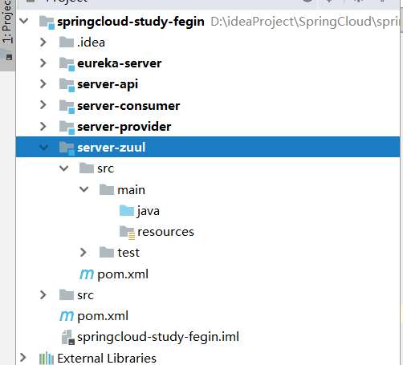
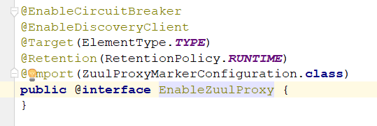
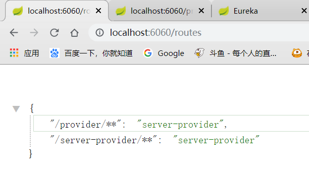

## 一、SpringCloud Zuul入门

服务网关是微服务架构中一个不可或缺的部分。通过服务网关统一向外系统提供REST API的过程中，除了具备服务路由、均衡负载功能之外，它还具备了权限控制等功能。Spring Cloud Netflix中的Zuul就担任了这样的一个角色，为微服务架构提供了前门保护的作用，同时将权限控制这些较重的非业务逻辑内容迁移到服务路由层面，使得服务集群主体能够具备更高的可复用性和可测试性。

Zuul在微服务中，便处于一个网关的地位，他自身整合了Ribbon和Hystrix，用作转发时的负载均衡和熔断。

我们接着上一节学习Feign的项目，来进行Zuul的学习。

### 1.创建server-zuul模块

首先我们为zuul，单独创建一个模块



### 2.添加Zuul依赖

在父pom文件中添加依赖，当然也可以直接添加子模块里，我这里为了方便直接放在父pom中了

```xml
<!-- 依赖 Zuul -->
<dependency>
    <groupId>org.springframework.cloud</groupId>
    <artifactId>spring-cloud-starter-zuul</artifactId>
</dependency>
```

### 3.创建启动类

启动类上主要要添加@EnableZuulProxy注解来开启Zuul的使用

```java
@SpringBootApplication
@EnableZuulProxy
public class ZuulApplication {
    public static void main(String[] args) {
        SpringApplication.run(ZuulApplication.class,args);
    }
}
```



这里可以看到，这个注解上带有了服务发现和服务熔断的注解，我们就不用再写一遍了。

### 4.添加配置

首先我们需要添加通用配置：

```properties
spring.application.name=server-zuul
server.port=6060
management.security.enabled=false
```

Zuul这时便不需要配置其他东西了，如果配合Eureka使用，会自动拉取注册中心上的服务进行映射

#### 单独使用Zuul时的配置

上面说的情况是配合Eureka使用时，那么如果没有Eureka，我们单独启动provider应用和Zuul应用应该如何配置呢？

```properties
# zuul映射规则
# zuul.routes.${service-id} = ${url-pattern}
# /** 代表匹配全路径
zuul.routes.server-provider=/provider/**
# ribbon应用名称与地址映射
server-provider.ribbon.listOfServers=http://127.0.0.1:9090
```

便使用这种方式，创建应用名与路径映射规则

然后再使用ribbon进行应用名与路径映射

##### 映射规则

如同上面设置的，对于访问`127.0.0.1:6060/provider/** `的路径会映射到`127.0.0.1:9090/**`

127.0.0.1:6060/provider/book/get  ====> 127.0.0.1:9090/book/get 

##### 启动测试

启动provider与Zuul，注意要把Eureka给关闭掉`eureka.client.enabled=false`

访问<http://localhost:6060/provider/book/get>

正常来说，会请求provider的<http://localhost:9090/book/get>


正确请求

#### 整合Eureka时

配置：

```properties
spring.application.name=server-zuul
server.port=6060
management.security.enabled=false

#eureka.client.enabled=false

# zuul映射规则
# zuul.routes.${service-id} = ${url-pattern}
# /** 代表匹配全路径
zuul.routes.server-provider=/provider/**
# ribbon应用名称与地址映射
server-provider.ribbon.listOfServers=http://127.0.0.1:9090

eureka.client.service-url.defaultZone=http://127.0.0.1:10001/eureka
```

需要添加eureka的注册信息，这里我们**不删除刚刚配置的路径映射**

##### 启动测试

分别启动eureka，provider，zuul

访问<http://localhost:6060/provider/book/get>

可以发现还是正常访问的

这时我们可以打开zuul的endpoint，routes端点，看看所有的路由规则

##### routes端点



可以看到除了我们刚刚配的`/provider/**`外，还自动配置了一个`/server-provider/**`

就是从eureka上拉取的，默认使用应用名称/**的路径，来映射应用名称

这时我们访问<http://localhost:6060/server-provider/book/get>


也是正确访问的

## 二、SpringCloud Zuul 进阶

### Zuul获取Routes规则

在上面，我们可以看到，在配置文件中配置路由，或者注册到注册中心中，就可以获取路由配置。

那么问题来了，这是如何做到的呢？

我们带着问题，可以先看下`RoutesEndPoint`这个类

#### RoutesEndPoint

```java
@ManagedResource(description = "Can be used to list the reverse proxy routes")
@ConfigurationProperties(prefix = "endpoints.routes")
public class RoutesEndpoint extends AbstractEndpoint<Map<String, String>> {

   private static final String ID = "routes";

   private RouteLocator routes;

   private ApplicationEventPublisher publisher;

   @Autowired
   public RoutesEndpoint(RouteLocator routes) {
      super(ID, true);
      this.routes = routes;
   }

   @ManagedAttribute
   public Map<String, String> invoke() {
      Map<String, String> map = new LinkedHashMap<>();
      for (Route route : this.routes.getRoutes()) {
         map.put(route.getFullPath(), route.getLocation());
      }
      return map;
   }
}
```

这里首先看到一段介绍：Can be used to list the reverse proxy routes（可用于列出反向代理路由）

说明我们找对了地方，然后我们可以看到有一个`@Autowired`类，`RouteLocator`，应该是我们要找的路由类

#### RouteLocator

```java
public interface RouteLocator {

   /**
    * Ignored route paths (or patterns), if any.
    */
   Collection<String> getIgnoredPaths();

   /**
    * A map of route path (pattern) to location (e.g. service id or URL).
    */
   List<Route> getRoutes();

   /**
    * Maps a path to an actual route with full metadata.
    */
   Route getMatchingRoute(String path);

}
```

这里有三个抽象方法

- `getIgnoredPaths`：获取被忽略的路由
- `getRoutes`：获取所有路由
- `getMatchingRoute`：获取匹配的路由

紧接着我们找他的实现类`DiscoveryClientRouteLocator`

#### DiscoveryClientRouteLocator

```java
public class DiscoveryClientRouteLocator extends SimpleRouteLocator
      implements RefreshableRouteLocator {

   @Override
   protected LinkedHashMap<String, ZuulRoute> locateRoutes() {
      LinkedHashMap<String, ZuulRoute> routesMap = new LinkedHashMap<String, ZuulRoute>();
      routesMap.putAll(super.locateRoutes());
      if (this.discovery != null) {
         Map<String, ZuulRoute> staticServices = new LinkedHashMap<String, ZuulRoute>();
         for (ZuulRoute route : routesMap.values()) {
            String serviceId = route.getServiceId();
            if (serviceId == null) {
               serviceId = route.getId();
            }
            if (serviceId != null) {
               staticServices.put(serviceId, route);
            }
         }
         // Add routes for discovery services by default
         List<String> services = this.discovery.getServices();
         String[] ignored = this.properties.getIgnoredServices()
               .toArray(new String[0]);
         for (String serviceId : services) {
            // Ignore specifically ignored services and those that were manually
            // configured
            String key = "/" + mapRouteToService(serviceId) + "/**";
            if (staticServices.containsKey(serviceId)
                  && staticServices.get(serviceId).getUrl() == null) {
               // Explicitly configured with no URL, cannot be ignored
               // all static routes are already in routesMap
               // Update location using serviceId if location is null
               ZuulRoute staticRoute = staticServices.get(serviceId);
               if (!StringUtils.hasText(staticRoute.getLocation())) {
                  staticRoute.setLocation(serviceId);
               }
            }
            if (!PatternMatchUtils.simpleMatch(ignored, serviceId)
                  && !routesMap.containsKey(key)) {
               // Not ignored
               routesMap.put(key, new ZuulRoute(key, serviceId));
            }
         }
      }
      if (routesMap.get(DEFAULT_ROUTE) != null) {
         ZuulRoute defaultRoute = routesMap.get(DEFAULT_ROUTE);
         // Move the defaultServiceId to the end
         routesMap.remove(DEFAULT_ROUTE);
         routesMap.put(DEFAULT_ROUTE, defaultRoute);
      }
      LinkedHashMap<String, ZuulRoute> values = new LinkedHashMap<>();
      for (Entry<String, ZuulRoute> entry : routesMap.entrySet()) {
         String path = entry.getKey();
         // Prepend with slash if not already present.
         if (!path.startsWith("/")) {
            path = "/" + path;
         }
         if (StringUtils.hasText(this.properties.getPrefix())) {
            path = this.properties.getPrefix() + path;
            if (!path.startsWith("/")) {
               path = "/" + path;
            }
         }
         values.put(path, entry.getValue());
      }
      return values;
   }
```

**这里有个locateRoutes重要方法，在第7行我们可以看到**


```java
protected Map<String, ZuulRoute> locateRoutes() {
   LinkedHashMap<String, ZuulRoute> routesMap = new LinkedHashMap<String, ZuulRoute>();
   for (ZuulRoute route : this.properties.getRoutes().values()) {
      routesMap.put(route.getPath(), route);
   }
   return routesMap;
}
```

首先获取本地配置中的路由，`locateRoutes`，然后循环将静态服务保存起来，这里的静态服务，其实就是我们在配置文件中配置的那些静态配置。

**接着在第20行**


通过注释也可以得知，添加所有在注册中心上的服务，即将Eureka上的服务也添加到路由List中去。

所以，大致就是通过这个方法，将配置和注册中心中的服务通通存储到List里，**这里需要注意的是List是`LinkedArrayList`**，即有序插入，所以我们在刚刚看`routes`节点的时候，配置文件中的排在前面，服务排在后面