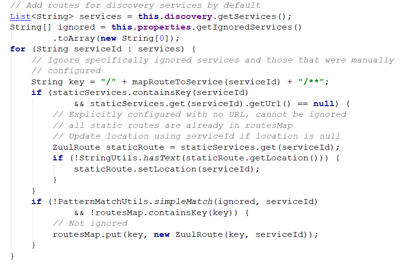
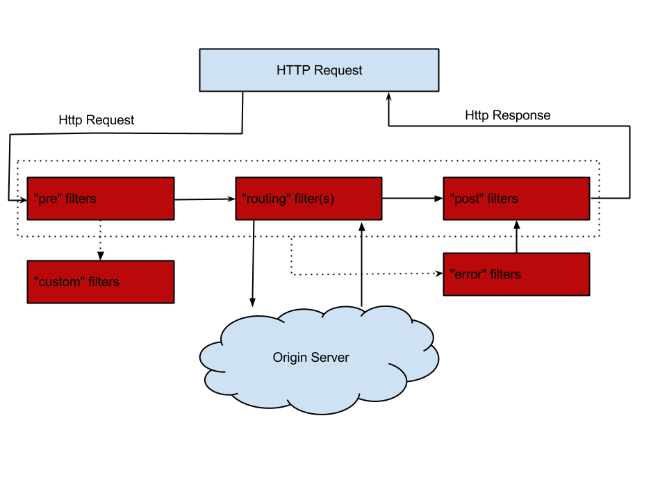
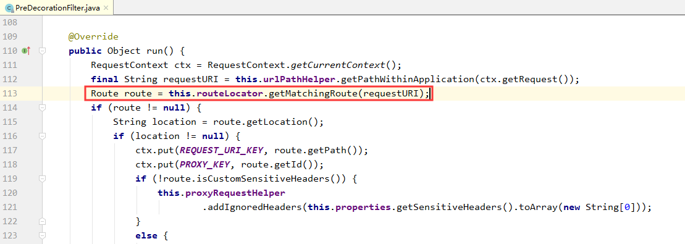
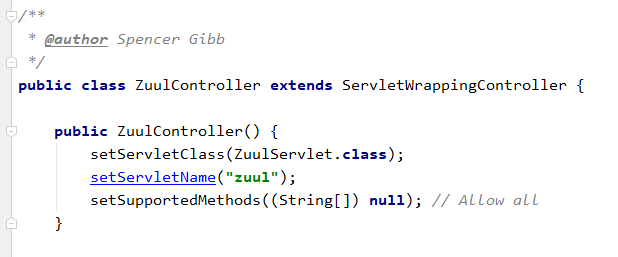
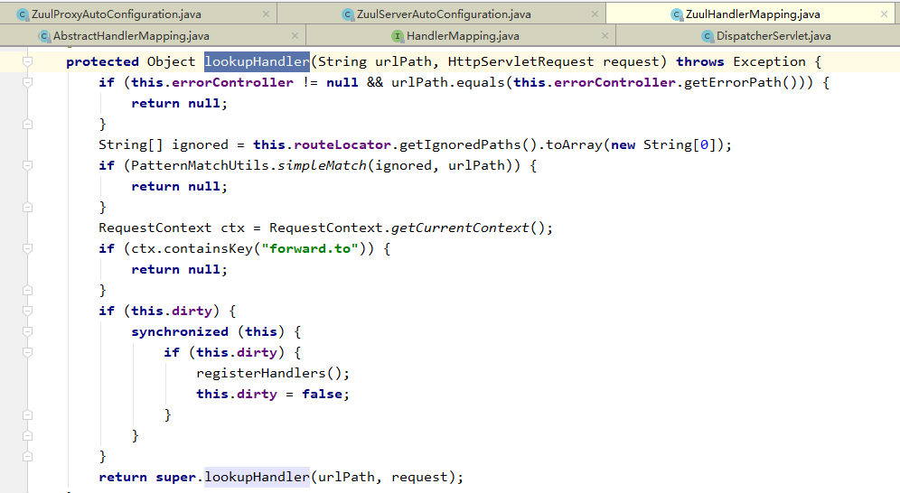
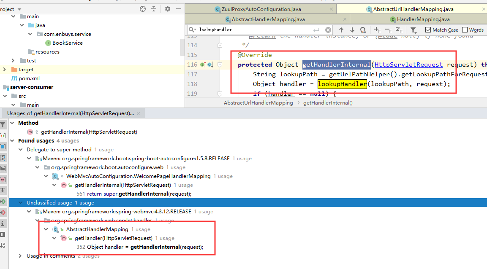
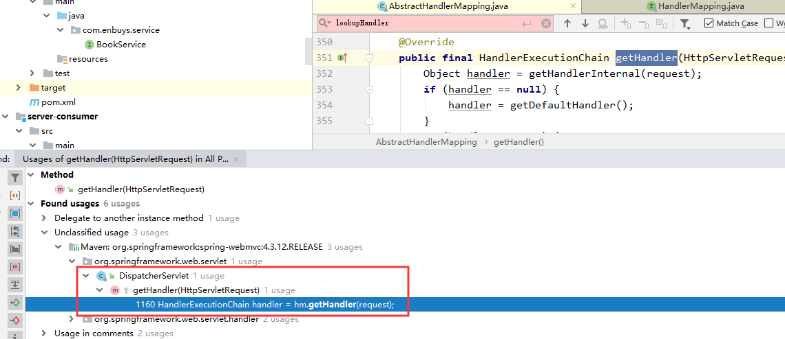
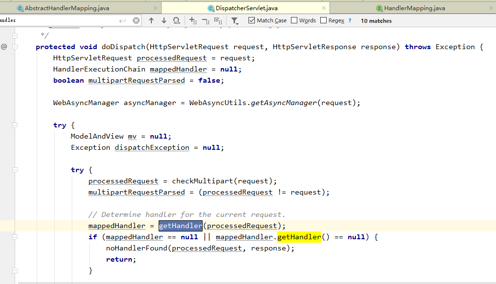

## 一、Zuul获取Routes规则

在上面，我们可以看到，在配置文件中配置路由，或者注册到注册中心中，就可以获取路由配置。

那么问题来了，这是如何做到的呢？

我们带着问题，可以先看下`RoutesEndPoint`这个类

### RoutesEndPoint

```java
@ManagedResource(description = "Can be used to list the reverse proxy routes")
@ConfigurationProperties(prefix = "endpoints.routes")
public class RoutesEndpoint extends AbstractEndpoint<Map<String, String>> {

   private static final String ID = "routes";

   private RouteLocator routes;

   private ApplicationEventPublisher publisher;

   @Autowired
   public RoutesEndpoint(RouteLocator routes) {
      super(ID, true);
      this.routes = routes;
   }

   @ManagedAttribute
   public Map<String, String> invoke() {
      Map<String, String> map = new LinkedHashMap<>();
      for (Route route : this.routes.getRoutes()) {
         map.put(route.getFullPath(), route.getLocation());
      }
      return map;
   }
}
```

这里首先看到一段介绍：Can be used to list the reverse proxy routes（可用于列出反向代理路由）

说明我们找对了地方，然后我们可以看到有一个`@Autowired`类，`RouteLocator`，应该是我们要找的路由类

### RouteLocator

```java
public interface RouteLocator {

   /**
    * Ignored route paths (or patterns), if any.
    */
   Collection<String> getIgnoredPaths();

   /**
    * A map of route path (pattern) to location (e.g. service id or URL).
    */
   List<Route> getRoutes();

   /**
    * Maps a path to an actual route with full metadata.
    */
   Route getMatchingRoute(String path);

}
```

这里有三个抽象方法

- `getIgnoredPaths`：获取被忽略的路由
- `getRoutes`：获取所有路由
- `getMatchingRoute`：获取匹配的路由

紧接着我们找他的实现类`DiscoveryClientRouteLocator`

### DiscoveryClientRouteLocator

```java
public class DiscoveryClientRouteLocator extends SimpleRouteLocator
      implements RefreshableRouteLocator {

   @Override
   protected LinkedHashMap<String, ZuulRoute> locateRoutes() {
      LinkedHashMap<String, ZuulRoute> routesMap = new LinkedHashMap<String, ZuulRoute>();
      routesMap.putAll(super.locateRoutes());
      if (this.discovery != null) {
         Map<String, ZuulRoute> staticServices = new LinkedHashMap<String, ZuulRoute>();
         for (ZuulRoute route : routesMap.values()) {
            String serviceId = route.getServiceId();
            if (serviceId == null) {
               serviceId = route.getId();
            }
            if (serviceId != null) {
               staticServices.put(serviceId, route);
            }
         }
         // Add routes for discovery services by default
         List<String> services = this.discovery.getServices();
         String[] ignored = this.properties.getIgnoredServices()
               .toArray(new String[0]);
         for (String serviceId : services) {
            // Ignore specifically ignored services and those that were manually
            // configured
            String key = "/" + mapRouteToService(serviceId) + "/**";
            if (staticServices.containsKey(serviceId)
                  && staticServices.get(serviceId).getUrl() == null) {
               // Explicitly configured with no URL, cannot be ignored
               // all static routes are already in routesMap
               // Update location using serviceId if location is null
               ZuulRoute staticRoute = staticServices.get(serviceId);
               if (!StringUtils.hasText(staticRoute.getLocation())) {
                  staticRoute.setLocation(serviceId);
               }
            }
            if (!PatternMatchUtils.simpleMatch(ignored, serviceId)
                  && !routesMap.containsKey(key)) {
               // Not ignored
               routesMap.put(key, new ZuulRoute(key, serviceId));
            }
         }
      }
      if (routesMap.get(DEFAULT_ROUTE) != null) {
         ZuulRoute defaultRoute = routesMap.get(DEFAULT_ROUTE);
         // Move the defaultServiceId to the end
         routesMap.remove(DEFAULT_ROUTE);
         routesMap.put(DEFAULT_ROUTE, defaultRoute);
      }
      LinkedHashMap<String, ZuulRoute> values = new LinkedHashMap<>();
      for (Entry<String, ZuulRoute> entry : routesMap.entrySet()) {
         String path = entry.getKey();
         // Prepend with slash if not already present.
         if (!path.startsWith("/")) {
            path = "/" + path;
         }
         if (StringUtils.hasText(this.properties.getPrefix())) {
            path = this.properties.getPrefix() + path;
            if (!path.startsWith("/")) {
               path = "/" + path;
            }
         }
         values.put(path, entry.getValue());
      }
      return values;
   }
```

**这里有个locateRoutes重要方法，在第7行我们可以看到**


```java
protected Map<String, ZuulRoute> locateRoutes() {
   LinkedHashMap<String, ZuulRoute> routesMap = new LinkedHashMap<String, ZuulRoute>();
   for (ZuulRoute route : this.properties.getRoutes().values()) {
      routesMap.put(route.getPath(), route);
   }
   return routesMap;
}
```

首先获取本地配置中的路由，`locateRoutes`，然后循环将静态服务保存起来，这里的静态服务，其实就是我们在配置文件中配置的那些静态配置。

**接着在第20行**



通过注释也可以得知，添加所有在注册中心上的服务，即将Eureka上的服务也添加到路由List中去。

所以，大致就是通过这个方法，将配置和注册中心中的服务通通存储到List里，**这里需要注意的是List是`LinkedArrayList`**，即有序插入，所以我们在刚刚看`routes`节点的时候，配置文件中的排在前面，服务排在后面


## 二、Zuul请求的生命周期

这里我们先放一张官方图（**Zuul1.x**）

 

对于请求会经过`pre - routing - post`，其实就是过滤器，前置方法，执行方法，后置方法。

这里使用到的过滤器是`ZuulServlet`

### ZuulServlet

`ZuulServlet`定义了对zuul整个过程的处理，如下：

```java
public void service(javax.servlet.ServletRequest servletRequest, javax.servlet.ServletResponse servletResponse) throws ServletException, IOException {
    try {
        init((HttpServletRequest) servletRequest, (HttpServletResponse) servletResponse);

        // Marks this request as having passed through the "Zuul engine", as opposed to servlets
        // explicitly bound in web.xml, for which requests will not have the same data attached
        RequestContext context = RequestContext.getCurrentContext();
        context.setZuulEngineRan();

        try {
            preRoute();
        } catch (ZuulException e) {
            error(e);
            postRoute();
            return;
        }
        try {
            route();
        } catch (ZuulException e) {
            error(e);
            postRoute();
            return;
        }
        try {
            postRoute();
        } catch (ZuulException e) {
            error(e);
            return;
        }

    } catch (Throwable e) {
        error(new ZuulException(e, 500, "UNHANDLED_EXCEPTION_" + e.getClass().getName()));
    } finally {
        RequestContext.getCurrentContext().unset();
    }
}
```

####  Pre阶段

前置阶段是由 `PreDecorationFilter `过滤器来寻找路由规则：



如图，`getMatchingRoute()`就是我们上一节说到的，在`RouteLocator`中的方法，获取匹配的路由

#### Routing阶段

 `RibbonRoutingFilter`真正的对服务发起请求，并得到响应结果 

```java
	@Override
	public Object run() {
		RequestContext context = RequestContext.getCurrentContext();
		this.helper.addIgnoredHeaders();
		try {
			RibbonCommandContext commandContext = buildCommandContext(context);
			ClientHttpResponse response = forward(commandContext);
			setResponse(response);
			return response;
		}
		catch (ZuulException ex) {
			throw new ZuulRuntimeException(ex);
		}
		catch (Exception ex) {
			throw new ZuulRuntimeException(ex);
		}
	}
```

通过`run`方法，可以看到调用了`forward`方法

```java
	protected ClientHttpResponse forward(RibbonCommandContext context) throws Exception {
		Map<String, Object> info = this.helper.debug(context.getMethod(),
				context.getUri(), context.getHeaders(), context.getParams(),
				context.getRequestEntity());

		RibbonCommand command = this.ribbonCommandFactory.create(context);
		try {
			ClientHttpResponse response = command.execute();
			this.helper.appendDebug(info, response.getStatusCode().value(),
					response.getHeaders());
			return response;
		}
		catch (HystrixRuntimeException ex) {
			return handleException(info, ex);
		}

	}
```

这里可以看到，通过工厂创建出`RibbonCommand`，然后真正的服务调用`command.execute()`

接着回到`run()`方法中，下一行执行`setResponse(response);`方法

```java
protected void setResponse(ClientHttpResponse resp)
			throws ClientException, IOException {
    RequestContext.getCurrentContext().set("zuulResponse", resp);
    this.helper.setResponse(resp.getStatusCode().value(),
                            resp.getBody() == null ? null : resp.getBody(), resp.getHeaders());
}
```

即，将响应的内容写入到`RequestContext`中。

 `ROUTE`还有两个过滤器`SendForwardFilter（forward请求转发）`、`SimpleHostRoutingFilter（url请求转发）`，根据不同的路由类型匹配相应的过滤器。 

#### Post阶段

`SendResponseFilter`对内容进行响应

```java
@Override
	public Object run() {
		try {
			addResponseHeaders();
			writeResponse();
		}
		catch (Exception ex) {
			ReflectionUtils.rethrowRuntimeException(ex);
		}
		return null;
	}
```

还是先看`run()`方法，这里对于响应，核心方法是`writeResponse();`

```java
private void writeResponse() throws Exception {
		RequestContext context = RequestContext.getCurrentContext();
		// there is no body to send
		if (context.getResponseBody() == null
				&& context.getResponseDataStream() == null) {
			return;
		}
		HttpServletResponse servletResponse = context.getResponse();
		if (servletResponse.getCharacterEncoding() == null) { // only set if not set
			servletResponse.setCharacterEncoding("UTF-8");
		}
		OutputStream outStream = servletResponse.getOutputStream();
		InputStream is = null;
		try {
			if (RequestContext.getCurrentContext().getResponseBody() != null) {
				String body = RequestContext.getCurrentContext().getResponseBody();
				writeResponse(
						new ByteArrayInputStream(
								body.getBytes(servletResponse.getCharacterEncoding())),
						outStream);
				return;
			}
			boolean isGzipRequested = false;
			final String requestEncoding = context.getRequest()
					.getHeader(ZuulHeaders.ACCEPT_ENCODING);

			if (requestEncoding != null
					&& HTTPRequestUtils.getInstance().isGzipped(requestEncoding)) {
				isGzipRequested = true;
			}
			is = context.getResponseDataStream();
			InputStream inputStream = is;
			if (is != null) {
				if (context.sendZuulResponse()) {
					// if origin response is gzipped, and client has not requested gzip,
					// decompress stream
					// before sending to client
					// else, stream gzip directly to client
					if (context.getResponseGZipped() && !isGzipRequested) {
						// If origin tell it's GZipped but the content is ZERO bytes,
						// don't try to uncompress
						final Long len = context.getOriginContentLength();
						if (len == null || len > 0) {
							try {
								inputStream = new GZIPInputStream(is);
							}
							catch (java.util.zip.ZipException ex) {
								log.debug(
										"gzip expected but not "
												+ "received assuming unencoded response "
												+ RequestContext.getCurrentContext()
												.getRequest().getRequestURL()
												.toString());
								inputStream = is;
							}
						}
						else {
							// Already done : inputStream = is;
						}
					}
					else if (context.getResponseGZipped() && isGzipRequested) {
						servletResponse.setHeader(ZuulHeaders.CONTENT_ENCODING, "gzip");
					}
					writeResponse(inputStream, outStream);
				}
			}
		}
		finally {
			try {
				Object zuulResponse = RequestContext.getCurrentContext()
						.get("zuulResponse");
				if (zuulResponse instanceof Closeable) {
					((Closeable) zuulResponse).close();
				}
				outStream.flush();
				// The container will close the stream for us
			}
			catch (IOException ex) {
			log.warn("Error while sending response to client: " + ex.getMessage());
			}
		}
	}
```

这里源码比较长，大致的意思就是创建一些`IO`类，从之前`RequestContext`中取出`response`，然后进行一系列的判断，最后将`response`响应。

#### error阶段

当`PRE`、`ROUTE`、`POST`阶段的过滤器发生错误时，会调用`ERROR`过滤器。默认的`error`过滤器有`SendErrorFilter`

## 三、Zuul的自动装配

看自动装配前，我们先看下我们开启的注解

### @EnableZuulProxy

```java
@EnableCircuitBreaker
@Target(ElementType.TYPE)
@Retention(RetentionPolicy.RUNTIME)
@Import(ZuulProxyMarkerConfiguration.class)
public @interface EnableZuulProxy {
}
```

对此注解，`import`了`ZuulProxyMarkerConfiguration`：

```java
@Configuration
public class ZuulProxyMarkerConfiguration {
	@Bean
	public Marker zuulProxyMarkerBean() {
		return new Marker();
	}

	class Marker {
	}
}
```

可以看到，这里仅仅是往容器中添加了`ZuulProxyMarkerConfiguration.Marker`这个Bean

所以`@EnableZuulProxy`的作用就是，向容器中添加`ZuulProxyMarkerConfiguration`与`ZuulProxyMarkerConfiguration.Marker`


接着，我们要看自动装配，就肯定要找`AutoConfiguration`类，即`ZuulProxyAutoConfiguration`

### ZuulProxyAutoConfiguration

```java
@Configuration
@Import({ RibbonCommandFactoryConfiguration.RestClientRibbonConfiguration.class,
		RibbonCommandFactoryConfiguration.OkHttpRibbonConfiguration.class,
		RibbonCommandFactoryConfiguration.HttpClientRibbonConfiguration.class,
		HttpClientConfiguration.class })
@ConditionalOnBean(ZuulProxyMarkerConfiguration.Marker.class)
public class ZuulProxyAutoConfiguration extends ZuulServerAutoConfiguration {
    
	// pre filters
	@Bean
	public PreDecorationFilter preDecorationFilter(RouteLocator routeLocator,
			ProxyRequestHelper proxyRequestHelper) {
		return new PreDecorationFilter(routeLocator, this.server.getServletPrefix(),
				this.zuulProperties, proxyRequestHelper);
	}

	// route filters
	@Bean
	public RibbonRoutingFilter ribbonRoutingFilter(ProxyRequestHelper helper,
			RibbonCommandFactory<?> ribbonCommandFactory) {
		RibbonRoutingFilter filter = new RibbonRoutingFilter(helper, ribbonCommandFactory,
				this.requestCustomizers);
		return filter;
	}

	@Bean
	@ConditionalOnMissingBean(SimpleHostRoutingFilter.class)
	public SimpleHostRoutingFilter simpleHostRoutingFilter(ProxyRequestHelper helper, ZuulProperties zuulProperties) {
		return new SimpleHostRoutingFilter(helper, zuulProperties);
	}
	···
}
```

这里几个重点代码我保留了一下，

#### 自动装配条件

```java
@ConditionalOnBean(ZuulProxyMarkerConfiguration.Marker.class)
```

可以看到，容器中有这个Bean时，自动配置才会加载，这也是我们开启`EnableZuulProxy`才能使用的原因

#### 初始化类

再往下可以清楚的看到，自动配置类向容器中添加了几个类

- `PreDecorationFilter `：Pre阶段Filter
- `RibbonRoutingFilter：Route`阶段Filter
- `SimpleHostRoutingFilter`：URL请求转发时使用的Filter

#### 继承父类Server

还有一个重点` extends ZuulServerAutoConfiguration`，即扩展了父类，所以我们再到父类一看

### ZuulServerAutoConfiguration

```java
@Configuration
@EnableConfigurationProperties({ ZuulProperties.class })
@ConditionalOnClass(ZuulServlet.class)
@ConditionalOnBean(ZuulServerMarkerConfiguration.Marker.class)
// Make sure to get the ServerProperties from the same place as a normal web app would
@Import(ServerPropertiesAutoConfiguration.class)
public class ZuulServerAutoConfiguration {
    ···
        
    @Bean
	public ZuulController zuulController() {
		return new ZuulController();
	}

	@Bean
	public ZuulHandlerMapping zuulHandlerMapping(RouteLocator routes) {
		ZuulHandlerMapping mapping = new ZuulHandlerMapping(routes, zuulController());
		mapping.setErrorController(this.errorController);
		return mapping;
	}

	@Bean
	@ConditionalOnMissingBean(name = "zuulServlet")
	public ServletRegistrationBean zuulServlet() {
		ServletRegistrationBean servlet = new ServletRegistrationBean(new ZuulServlet(),
				this.zuulProperties.getServletPattern());
		// The whole point of exposing this servlet is to provide a route that doesn't
		// buffer requests.
		servlet.addInitParameter("buffer-requests", "false");
		return servlet;
	}
    ···
}
```

这个类的重点，自动装配了

- `ZuulController`
- `ZuulHandlerMapping`
- `ZuulServlet`

这几个类都是Zuul的重点类

### Zuul重点类

#### RibbonRoutingFilter

这里我们一层层向上递进，我们知道，请求时最终调用的是`ZuulFilter`即`RibbonRoutingFilter`

#### ZuulServlet

由第二章代码可知，是由``ZuulServlet`调用的`ZuulFilter`的`run()`方法

#### ZuulController



由`ZuulController`代码可知，`ZuulServlet`是由他委派

#### ZuulHandlerMapping

```java
	@Bean
	public ZuulHandlerMapping zuulHandlerMapping(RouteLocator routes) {
		ZuulHandlerMapping mapping = new ZuulHandlerMapping(routes, zuulController());
		mapping.setErrorController(this.errorController);
		return mapping;
	}
```

而在刚刚`Server`的自动配置类中，`ZuulHandlerMapping`的实例化又添加了`ZuulController`

#### DispatchServlet

最后我们开始探查`ZuulHandlerMapping`的`lookupHandler`即请求调用者







	

通过一步步向上探查，最后发现是`DIspatchServlet`的`doDispatch()`方法调用，这个方法我们并不陌生，就是前端控制器的请求分发方法，即`SpringMVC`中的类。

#### 总结

所以最后总结一下request请求Zuul过程

- DispatchServlet ---> doDispatch()
  - ZuulHandlerMapping ---> lookupHandler()
    - ZuulController ---> handleRequest()
      - ZuulServlet ---> service()
        - ZuulFilter(RibbonRoutingFilter) ---> run()