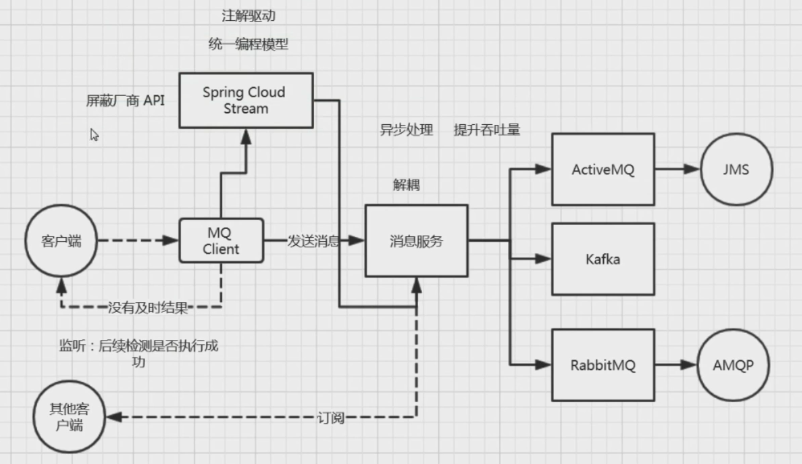
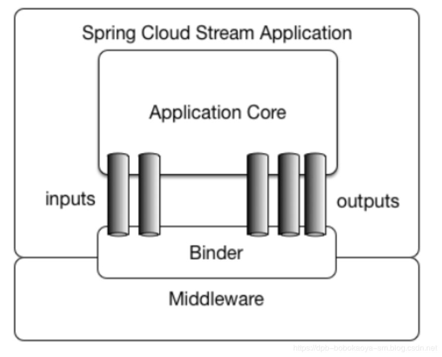
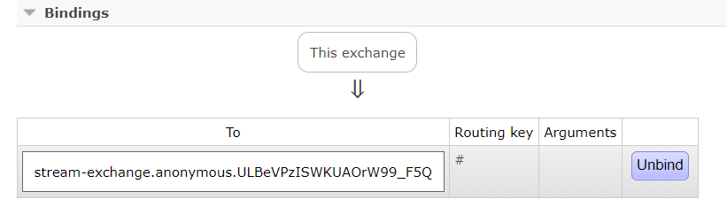
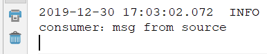
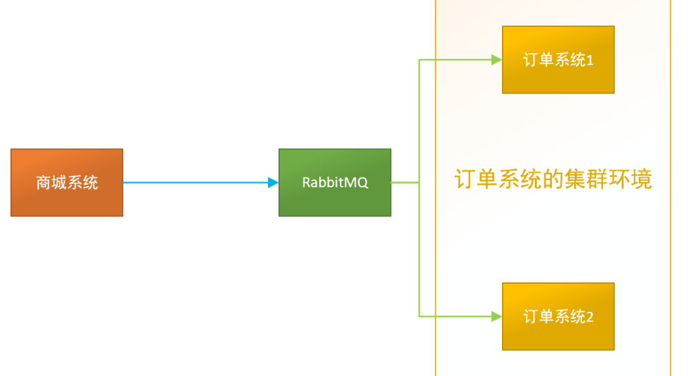
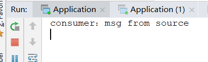
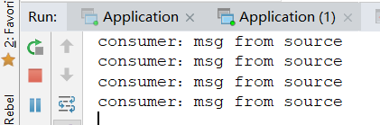
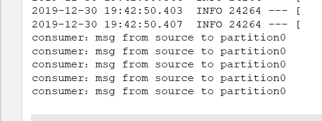
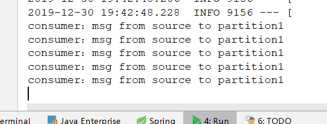

## Spring Cloud Stream

### 简介

Spring Cloud Stream 是一个消息驱动的微服务应用。

主要用途是，简化开发，统一抽象，使微服务对于消息中间件的使用与切换更加方便。



### 基本概念

Source：Stream发送源

- 近义词：producer，publisher

Sink：Stream接收器

- 近义词：Consumer，subscriber

Processor：发送与接收之间的东西，比如管道，一种过程

#### 官方架构图



| 组成        | 说明                                                         |
| ----------- | ------------------------------------------------------------ |
| Middleware  | 中间件，目前只支持RabbitMQ和Kafka                            |
| Binder      | Binder是应用与消息中间件之间的封装，目前实行了Kafka和RabbitMQ的Binder，通过Binder可以很方便的连接中间件，可以动态的改变消息类型(对应于Kafka的topic，RabbitMQ的exchange)，这些都可以通过配置文件来实现 |
| inputs      | 输入管道，用来消费消息                                       |
| outputs     | 输出管道，用来发送消息                                       |
| application | 应用                                                         |

#### 重要注解

- `@Input ` 注解标识输入通道，通过该输入通道接收到的消息进入应用程序  
- `@Output`  注解标识输出通道，发布的消息将通过该通道离开应用程序  
- `@StreamListener`  监听队列，用于消费者的队列的消息接收 
- `@EnableBinding`  指信道channel和exchange绑定在一起

对于SpringCloud整合消息中间件，使用这四个注解非常关键，配合一些配置的使用，可以非常简单方便实现

## 快速入门

这里我们使用RabbitMQ进行整合

### 准备工作

RabbitMQ的安装与启动，包括一些RabbitMQ的基础知识，如果没学过的，可以先看一下这个博客<https://pacee1.github.io/categories/rabbitmq/>

这里我们分为生产端和消费端，需创建两个Module，两个Module的Maven依赖是一样的：

```xml
<parent>
    <groupId>org.springframework.boot</groupId>
    <artifactId>spring-boot-starter-parent</artifactId>
    <version>1.5.13.RELEASE</version>
</parent>

<dependencyManagement>
    <dependencies>
        <dependency>
            <groupId>org.springframework.cloud</groupId>
            <artifactId>spring-cloud-dependencies</artifactId>
            <version>Dalston.SR5</version>
            <type>pom</type>
            <scope>import</scope>
        </dependency>
    </dependencies>
</dependencyManagement>
<dependencies>
    <dependency>
        <groupId>org.springframework.boot</groupId>
        <artifactId>spring-boot-starter-web</artifactId>
    </dependency>
    <dependency>
        <groupId>org.springframework.cloud</groupId>
        <artifactId>spring-cloud-starter-eureka</artifactId>
    </dependency>
    <dependency>
        <groupId>org.springframework.cloud</groupId>
        <artifactId>spring-cloud-starter-stream-rabbit</artifactId>
    </dependency>
    <dependency>
        <groupId>org.springframework.boot</groupId>
        <artifactId>spring-boot-starter-test</artifactId>
        <scope>test</scope>
    </dependency>
</dependencies>
```

### 生产端

**1.创建Source接口**

```java
public interface MySource {

    @Output("stream-exchange")
    MessageChannel send();
}
```

这里非常简单

- 编写一个方法，方法的返回值固定为`MessageChannel`或其子类`SubscribableChannel`
- 并添加`@Output`注解
  - 其参数值是Exchange的名称
  - 这里也可以在配置文件中修改，如果不配置，默认为Exchange名称
  - 如果Rabbit中没有此Exchange，会进行自动创建

**2.创建主程序类**

```java
@SpringBootApplication
@EnableBinding(MySource.class)
public class Application {
    public static void main(String[] args) {
        SpringApplication.run(Application.class,args);
    }
}
```

主程序类主要是使用`@EnableBinding`注解，将接口绑定

**3.添加配置文件**

```properties
spring.application.name=stream-producer
server.port=8081

#rebbitmq 链接信息
spring.rabbitmq.host=192.168.56.120
spring.rabbitmq.port=5672
spring.rabbitmq.username=guest
spring.rabbitmq.password=guest
spring.rabbitmq.virtualHost=/
```

主要是添加rabbitmq配置，这里其实还可以配置很多东西，比如消息限流，签收模式修改等等，因为主要是说SpringCloud，所以就不过多介绍了

**4.创建Send发送的单元测试类**

```java
@RunWith(SpringRunner.class)
@SpringBootTest(classes=Application.class)
public class SendTest {

    @Autowired
    private MySource source;

    @Test
    public void send(){
        String msg = "msg from source";
        Message message = MessageBuilder
                .withPayload(msg.getBytes())
                .build();
        source.send().send(message);
    }
}
```

这里简单的发送了一条消息，使用`MessageBuilder`构建

### 消费端

**1.创建Sink接口**

```java
public interface MySink {

    @Input("stream-exchange")
    SubscribableChannel consume();

}
```

对于消息消费，使用`@Input`

**2.创建主程序类**

```java
@SpringBootApplication
public class Application {
    public static void main(String[] args) {
        SpringApplication.run(Application.class,args);
    }
}
```

**3.添加配置文件**

```properties
spring.application.name=stream-consumer
server.port=8080

#rebbitmq 链接信息
spring.rabbitmq.host=192.168.56.120
spring.rabbitmq.port=5672
spring.rabbitmq.username=guest
spring.rabbitmq.password=guest
spring.rabbitmq.virtualHost=/
```

**4.创建监听Service**

```java
@Service
@EnableBinding(MySink.class)
public class ConsumerService {

    @StreamListener("stream-exchange")
    public void consume(byte[] msg){
        System.out.println("consumer：" + new String(msg));
    }
}
```

监听Service有几个重要步骤

- 添加`@Service`注解，主要是将Bean注入到容器中
- 添加`@EnableBinding`，将接口绑定
- 添加`@StreamListener`，表名这是一个监听方法，其值是监听的Exchange
- 方法的入参是消息格式，默认是`byte[]`二进制格式，也可以重载方法使用String，Object

### 测试

**先开启消费端**

```
declaring queue for inbound: stream-exchange.anonymous.ULBeVPzISWKUAOrW99_F5Q, bound to: stream-exchange
Attempting to connect to: [192.168.56.120:5672]
Created new connection: rabbitConnectionFactory#5fd8dd66:0/SimpleConnection@762a10b6 [delegate=amqp://guest@192.168.56.120:5672/, localPort= 3811]
started inbound.stream-exchange.anonymous.ULBeVPzISWKUAOrW99_F5Q
Adding {message-handler:inbound.stream-exchange.default} as a subscriber to the 'bridge.stream-exchange' channel
started inbound.stream-exchange.default
```

在控制台日志中可以看到，连接了RabbitMQ服务器，并且因为没有`stream-exchange`交换机，进行创建并创建Queue进行绑定，接着看下RabbitMQ的控制台：



可以看到，默认创建了一个`queue`，为`topic`类型交换机，路由键为`#`，即所有消息都会被映射

**接着我们执行生产端的单元测试，发送一条消息**



消息成功被消费

## 消息分组与分区

### 消息分组

在快速入门中，如果有多个消息接收者，那么消息生产者发送的消息会被多个消费者都接收到，这种情况在某些实际场景下是有很大问题的，比如在如下场景中，订单系统我们做集群部署，都会从RabbitMQ中获取订单信息，那如果一个订单同时被两个服务获取到，那么就会造成数据错误，我们得避免这种情况。这时我们就可以使用**Stream**中的消息分组来解决了！



在Stream中处于同一个`group`中的多个消费者是竞争关系。就能够保证消息只会被其中一个应用消费一次。不同的组是可以消费的，同一个组内会发生竞争关系，只有其中一个可以消费。

通过案例我们来演示看看，我们改造之前的服务，为其再添加一个消费端`stream-consumer2`

#### 改造生产端

**1.新创建一个Source接口**

```java
public interface GroupSource {

    String OUTPUT = "streamGroupExchange";

    @Output(GroupSource.OUTPUT)
    SubscribableChannel send();
}
```

这里我们使用`Channel`名称为`streamGroupExchange`，之后需要在配置文件中配置

**2.修改启动器类绑定**

```java
@SpringBootApplication
@EnableBinding(GroupSource.class)
public class Application {
    public static void main(String[] args) {
        SpringApplication.run(Application.class,args);
    }
}
```

**3.修改配置文件**

```properties
spring.application.name=stream-producer
server.port=8081

#rebbitmq 链接信息
spring.rabbitmq.host=192.168.56.120
spring.rabbitmq.port=5672
spring.rabbitmq.username=guest
spring.rabbitmq.password=guest
spring.rabbitmq.virtualHost=/

spring.cloud.stream.bindings.streamGroupExchange.destination=stream-group-exchange
```

主要是最后一局，规则为：

`spring.cloud.stream.bindings.(Channel通道名).destination`，这样就绑定交换机为`stream-group-exchange`

**4.修改发送消息单元测试类**

```java
@RunWith(SpringRunner.class)
@SpringBootTest(classes=Application.class)
public class SendTest {

    @Autowired
    private GroupSource source;

    @Test
    public void send(){
        String msg = "msg from source";
        Message message = MessageBuilder
                .withPayload(msg.getBytes())
                .build();
        source.send().send(message);
    }
}
```

#### 改造消费端

**1.新创建一个Sink接口**

```java
public interface GroupSink {

    String INPUT = "streamGroupExchange";

    @Input(GroupSink.INPUT)
    SubscribableChannel consume();
}
```

**2.修改监听器类**

```java
@Service
@EnableBinding(GroupSink.class)
public class ConsumerService {

    @StreamListener(GroupSink.INPUT)
    public void consume(byte[] msg){
        System.out.println("consumer：" + new String(msg));
    }
}
```

**3.修改配置文件**

```properties
spring.cloud.stream.bindings.streamGroupExchange.destination=stream-group-exchange
spring.cloud.stream.bindings.streamGroupExchange.group=consumer
```

添加`group`，分组

**4.创建一个consumer2，配置和consumer一样**

#### 测试

我们将consumer1和consumer2的`group`设置一样的，启动测试





可以看到，被consumer2消费4条，consumer1只消费了1条，他俩是竞争关系。

**通过消息分组，解决了重复消费的问题**

### 消息分区

消息分区是为了解决消息分组中竞争问题的，通过消息分区，可以实现**同一个消息始终是一个消费者进行接收消费**。

**修改consumer1配置文件**

```properties
## 分区
# 开启分区
spring.cloud.stream.bindings.streamGroupExchange.consumer.partitioned=true
# 应用数量
spring.cloud.stream.instanceCount=2
# 分区索引
spring.cloud.stream.instanceIndex=1
```

**修改consumer2配置文件**

```properties
## 分区
# 开启分区
spring.cloud.stream.bindings.streamGroupExchange.consumer.partitioned=true
# 应用数量
spring.cloud.stream.instanceCount=2
# 分区索引
spring.cloud.stream.instanceIndex=1
```

**修改producer生产者配置文件**

```properties
## 消息分区配置
# 分区键配置，可以根据不同业务场景进行配置，这里使用headers中的partitionKey值
# 如果分区键值为0，则使消费方instanceIndex=0的消费
# 同样如果为1，则使instanceIndex=1的消费
spring.cloud.stream.bindings.streamGroupExchange.producer.partition-key-expression=headers['partitionKey']
# 设置分区数量，这里我们有两个消费者，所以为2
spring.cloud.stream.bindings.streamGroupExchange.producer.partition-count=2
```

**修改单元测试**

```java
@Test
public void send2(){
    String msg = "msg from source to partition0";
    Message message = MessageBuilder
            .withPayload(msg.getBytes())
            .setHeader("partitionKey",0)
            .build();
    for (int i = 0; i < 5; i++) {
        source.send().send(message);
    }

    String msg2 = "msg from source to partition1";
    Message message2 = MessageBuilder
            .withPayload(msg2.getBytes())
            .setHeader("partitionKey",1)
            .build();
    for (int i = 0; i < 5; i++) {
        source.send().send(message2);
    }
}
```

这里我是**在Header中添加了自定义的`partitionKey`属性，在配置文件中使用`headers['partitionKey']`**，这样这10条消息会分别发给分区一5条，分区二5条

重启两个消费端，并启动生产端单元测试查看：





正确消费属于各自分区的消息