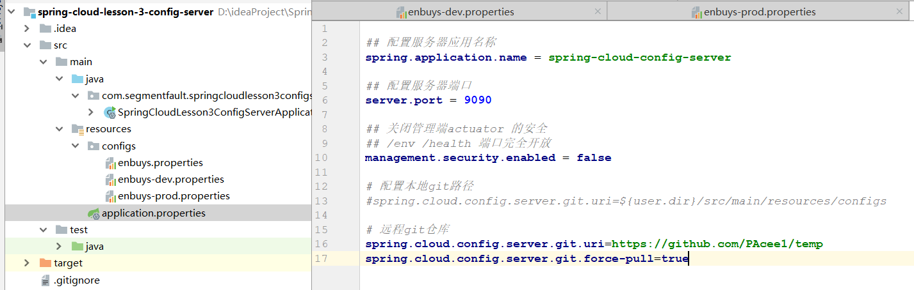
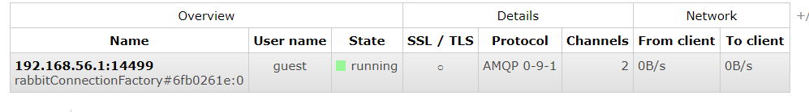
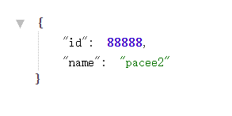
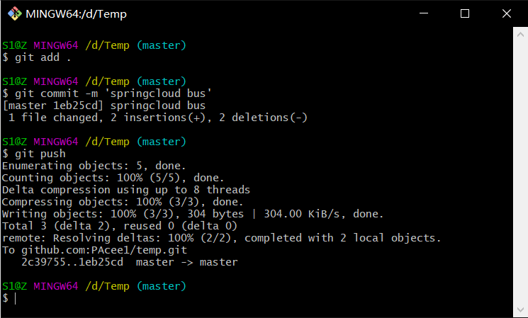
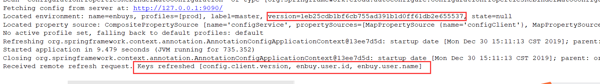
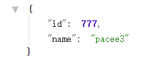

## Spring Cloud Bus

学习消息总线之前，我们先回顾一下第三篇笔记，在说到SpringCloud Config如何实现自动拉取服务器上配置时，我们使用的方式是**定时器配合`ContextRefresh`进行刷新**，虽然实现简单，但是循环执行肯定会造成性能消耗，这里我们讲另一种方式，就需要使用到Spring Cloud Bus，通过发布订阅的消息中间件，进行Config的动态刷新。

这里我们用一张图来介绍Spring Cloud Bus的配置机制：


根据此图我们可以看出利用Spring Cloud Bus做配置更新的步骤:

1. 提交代码触发webhook，发送post请求给clientA
2. clientA接收请求后从Server更新配置，并发送Message给Bus，告知配置更新了
3. Bus接收到消息会被ClientB和ClientC监听到进行消费
4. clientB和C就会请求config-server获取最新配置
5. 从而全部客户端获取到最新配置，实现动态更新

## RabbitMQ实现

### 准备工作

首先是RabbitMQ的安装启动，以及基本概念，这里没学过RabbitMQ的可以看下[我的博客](<https://pacee1.github.io/categories/rabbitmq/>)

接着是准备两个工程

- `config-server`：配置服务器
- `config-client`：配置客户端

这里在第三节创建过，直接接着使用即可，就不再代码演示了

### 代码回顾

**Config-Server：**



一开始我们使用本地配置，后面将配置文件加载到github上使用


主要使用prod环境的配置，配置了user的信息，以便client使用

**Config-Client：**

```properties
## 配置客户端应用关联的应用
## spring.cloud.config.name 是可选的
## 如果没有配置，采用 ${spring.application.name}
spring.cloud.config.name = enbuys
## 关联 profile
spring.cloud.config.profile = prod
## 关联 label
spring.cloud.config.label = master
## 配置配置服务器URI
spring.cloud.config.uri = http://127.0.0.1:9090/
```

```java
@RestController
@EnableConfigurationProperties(User.class)
public class UserController {

    //通过构造器注入
    private final User user;

    @Autowired
    public UserController(User user) {
        this.user = user;
    }

    @GetMapping("/user")
    public User user() {
        return user;
    }
}
```

在Client中，配置文件拉取Config信息，并通过访问`/user`获取user信息

### RabbitMQ整合

接着我们进行整合，其实非常简单

**1.扩展config-client的依赖**

```xml
<dependency>
    <groupId>org.springframework.cloud</groupId>
    <artifactId>spring-cloud-starter-bus-amqp</artifactId>
</dependency>
```

**2.配置文件添加RabbitMQ的配置**

```properties
spring.rabbitmq.virtual-host=/
spring.rabbitmq.username=guest
spring.rabbitmq.password=guest
spring.rabbitmq.addresses=192.168.56.120:5672
```

这时，我们对于Bus的配置就完成了，就是这么简单

**3.启动测试**

首先将`config-server`启动起来，然后启动`config-client`，在控制台可以看到如下信息

```
# /bus/refresh
EndpointHandlerMapping     : Mapped "{[/bus/refresh],methods=[POST]}" onto public void org.springframework.cloud.bus.endpoint.RefreshBusEndpoint.refresh(java.lang.String)
Created new connection: rabbitConnectionFactory#6fb0261e:0/SimpleConnection@19d53ab4 [delegate=amqp://guest@192.168.56.120:5672/, localPort= 14499]
```

并且在RabbitMQ控制台可以看到一条`Connection`



接着我们访问<http://localhost:8080/user>



打印出信息，我们修改配置文件，并提交到github上



接着我们用post请求访问`/bus/refresh`，这里可以查看控制台



拉取了最新的版本，并且修改了`user.id`和`user.name`

接着重新访问，发现配置已经修改



这里会发现，手动刷新的，没有自动刷新啊，因为这里我们没有使用github的`webhook`，使用`webhook`，当git变化时，会配置他自动请求某个路径，比如我们的http://localhost:8080/bus/refresh即可。

## 架构优化

在上面的流程中，我们已经到达了利用消息总线触发一个客户端`bus/refresh`,而刷新所有客户端的配置的目的。但这种方式并不优雅。原因如下：

- 打破了微服务的职责单一性。微服务本身是业务模块，它本不应该承担配置刷新的职责。
- 破坏了微服务各节点的对等性。
- 有一定的局限性。例如，微服务在迁移时，它的网络地址常常会发生变化，此时如果想要做到自动刷新，那就不得不修改WebHook的配置。

因此我们将上面的架构模式稍微改变一下，**让Config Server承担配置刷新并发送消息的职责**


这时，SpringCloud Bus更新配置的步骤就为：

1. 提交代码后，webhook发送post请求给Config Server
2. server端接收到请求并发送给Spring Cloud Bus消息
3. 三个客户端监听Bus中的消息变化，进行消费
4. 向Sever获取最新配置
5. 全部客户端获取到最新配置，实现动态更新

这里代码就不演示了，就是将config-server添加依赖，并在配置文件中添加RabbitMQ的信息

## 局部刷新

某些场景下（例如灰度发布），我们可能只想刷新部分微服务的配置，此时可通过`/bus/refresh`端点的`destination`参数来定位要刷新的应用程序。

例如：`/bus/refresh?destination=customers:8000`，这样消息总线上的微服务实例就会根据`destination`参数的值来判断是否需要要刷新。其中，`customers:8000`指的是各个微服务的`ApplicationContext `：`ID`。

`destination`参数也可以用来定位特定的微服务。例如：`/bus/refresh?destination=customers:**`，这样就可以触发`customers`微服务所有实例的配置刷新。