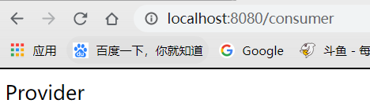
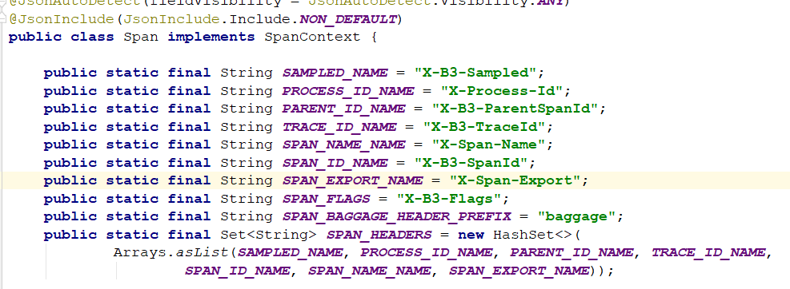

## 一、分布式服务跟踪

### 简介

通过之前的学习，我们已经可以搭建起一套比较完善的微服务架构了，进而慢慢添加我们所需的业务需求。

随着业务增多，系统规模也会逐渐扩大，各个服务间互相调用也更加复杂，通常一个由客户端发起的请求在后端系统中会经过多个不同的微服务调用来协同产生最后的请求结果。

这时，便需要一个服务跟踪技术，用来对前端请求后的服务调用链路进行跟踪，通过跟踪，可以找到哪条链路延迟高，或出现失败问题。

通过实现对请求调用的跟踪可以帮助我们快速的发现错误根源以及监控分析每条请求链路上的性能瓶颈等好处。

针对上面所述的分布式服务跟踪问题，Spring Cloud Sleuth提供了一套完整的解决方案。

### 集成

对于Spring Cloud Sleuth来说，他和Stream一样，是一种开放式的类似接口的架构，可以与不同的服务跟踪技术进行整合，只要按照它的规定，如：

- Logstash：ELK中的日志采集技术
- Zipkin：Twitter的开源项目，专门处理服务链路跟踪问题

## 二、快速入门

### 准备工作

首先我们需要先创建一个工程，并创建三个模块

- eureka模块
- service-consumer模块
- service-provider模块

需要将消费者和提供者注册到eureka上，这里就不再赘述了，不会的可以看之前的笔记

依赖方面需要添加：

- spring-boot-web
- spring-cloud-eureka
- spring-cloud-ribbon：需要使用RestTemplate进行服务间调用

#### service-provider

这里主要看下Controller

```java
@RestController
public class ProviderController {

    private final Logger logger = LoggerFactory.getLogger(getClass());

    @GetMapping(value = "/provider")
    public String trace() {
        logger.info("===<call provider>===");
        return "Provider";
    }
}
```

提供了一个`/provider`的接口，然后日志打印并返回

#### service-consumer

在Application中，注入了一个RestTemplate，也是老套路了

```java
@SpringBootApplication
@EnableDiscoveryClient
public class ConsumerApplication {
    public static void main(String[] args) {
        SpringApplication.run(ConsumerApplication.class,args);
    }

    @Bean
    @LoadBalanced
    RestTemplate restTemplate(){
        return new RestTemplate();
    }
}
```

Controller中，使用RestTemplate调用provider应用提供的服务

```java
@RestController
public class ConsumerController {

    private final Logger logger = LoggerFactory.getLogger(getClass());

    @Autowired
    private RestTemplate restTemplate;

    @GetMapping("/consumer")
    public String trace(){
        logger.info("===<call consumer>===");
        String s = restTemplate.getForObject("http://service-provider/provider", String.class);
        return s;
    }
}
```

启动后测试是否正确请求



正确请求，就可以往后研究链路跟踪了

## 三、实现跟踪

为provider和consumer添加服务跟踪功能对于SpringCloud来说非常简单，**只需在两个应用的pom文件中添加`spring-cloud-starter-sleuth`依赖即可**。

```xml
<dependencies>
    <dependency>
        <groupId>org.springframework.cloud</groupId>
        <artifactId>spring-cloud-starter-sleuth</artifactId>
    </dependency>
</dependencies>
```

到这里，我们已经为服务跟踪做好了基础。

这时我们重启两个服务，再次请求<http://localhost:8080/consumer>，看看控制台有什么不同

```
- consumer -
[service-consumer,5494d48b7ca217cf,5494d48b7ca217cf,false] 6152 --- [nio-8080-exec-1] c.e.s.c.controller.ConsumerController    : ===<call consumer>===

- provider -
[service-provider,5494d48b7ca217cf,ae0e8f824958b7a3,false] 15524 --- [nio-9090-exec-9] c.e.s.p.controller.ProviderController    : ===<call provider>===
```

可以看到，控制台打印的信息多出来了`[service-consumer,5494d48b7ca217cf,ae0e8f824958b7a3,false]`日志信息，这些元素正式服务跟踪的重要组成部分：

- 第一个值：`service-consumer`，应用名称
- 第二个值：`5494d48b7ca217cf`，TraceID，由Sleuth生成，**标识一条请求链路的ID，其中一条链路只有一个TraceID，但有多个SpanID**
- 第三个值：`ae0e8f824958b7a3`，SpanID，这时就可以看到，对于consumer和provider在一条链路，但是SpanID不同，**因为SpanID代表一条链路的某个阶段**，比如在consumer阶段，或者provider阶段。**所以有多个SpanID**
- 第四个值：`false`，表示是否要将此信息输出到Zipkin这种采集应用中

## 四、跟踪原理

在上一节，我们简单的添加一个Sleuth依赖，即实现了分布式的服务跟踪，可谓是非常简单，对于它的实现原理也不难理解，通过TraceID与SpanID来进行解释：

- TraceID：为了实现请求跟踪，就需要在请求发送到分布式第一个入门端点时，创建一个跟踪整个链路的唯一标识符，这里即使用了TraceID，通过在微服务中流转过程中，需要一直保持这个唯一标识，直到返回给请求方。通过TraceID，就可以将所有请求过程中的日志关联起来。
- SpanID：对于请求到了各个服务组件时，也可以通过创建一个特殊标识，来记录到达的信息，以及离去的信息，就是我们说的SpanID，这样，就可以统计出每个Span即服务组件阶段的时间延迟，还可以记录一些组件名称，请求信息等等。

### 默认跟踪的请求

在Spring Boot应用中，通过在工程中引入`spring-cloud-starter-sleuth`依赖之后， 它会自动的为当前应用构建起各通信通道的跟踪机制，比如：

- 通过诸如RabbitMQ、Kafka（或者其他任何Spring Cloud Stream绑定器实现的消息中间件）传递的请求
- 通过Zuul代理传递的请求
- 通过`RestTemplate`发起的请求

### 请求头

在快速入门示例中，由于请求是通过`RestTemplate`实现的，所以`spring-cloud-starter-sleuth`组件会对该请求进行处理，在发送到`provider`之前sleuth会为在该请求的Header中增加实现跟踪需要的重要信息，主要有下面这几个（更多关于头信息的定义我们可以通过查看`org.springframework.cloud.sleuth.Span`的源码获取）



- `X-B3-TraceId`：一条请求链路（Trace）的唯一标识，必须值
- `X-B3-SpanId`：一个工作单元（Span）的唯一标识，必须值
- `X-B3-ParentSpanId`：标识当前工作单元所属的上一个工作单元，`Root Span`（请求链路的第一个工作单元）的该值为空
- `X-B3-Sampled`：是否被抽样输出的标志，1表示需要被输出，0表示不需要被输出
- `X-Span-Name`：工作单元的名称

这时，我们就可以修改一下`ProviderController`的日志信息，来打印出一些请求头中具有的链路信息：

```java
@GetMapping(value = "/provider")
public String trace(HttpServletRequest request) {
    //logger.info("===<call provider>===");
    logger.info("===<call trace-2, TraceId={}, SpanId={}, ParentSpanID={}>===",
                request.getHeader("X-B3-TraceId"),
                request.getHeader("X-B3-SpanId"),
                request.getHeader("X-B3-ParentSpanId"));
    return "Provider";
}
```

我们将请求头中的`TraceID`与`SpanID`与`ParentSpanID`打印出来

```
- consumer -
2019-12-19 10:44:19.511  INFO [service-consumer,b495b93dfafc03b0,b495b93dfafc03b0,false] 6152 --- [nio-8080-exec-9] c.e.s.c.controller.ConsumerController    : ===<call consumer>===

- provider -
2019-12-19 10:44:19.695  INFO [service-provider,b495b93dfafc03b0,ae6d5409dd1afea7,false] 19044 --- [nio-9090-exec-1] c.e.s.p.controller.ProviderController    : ===<call trace-2, TraceId=b495b93dfafc03b0, SpanId=ae6d5409dd1afea7, ParentSpanID=b495b93dfafc03b0>===
```

这里可以明确看到，`ParentSpanID`就是`consumer`的`SpanID`，说明服务跟踪完全正确