## 一、Sleuth与Zipkin整合

### Zipkin简介

Zipkin是Twitter的开源项目，致力于服务器间的链路追踪，它通过RESTAPI接口来辅助我们查询跟踪链路，以实现对分布式系统的服务链路监控，从而找到延迟高等问题。

它的一大特点是自带图形化界面，像Hystrix的Hystrix-dashboard一样，很直观的查看和搜索链路间的明细。

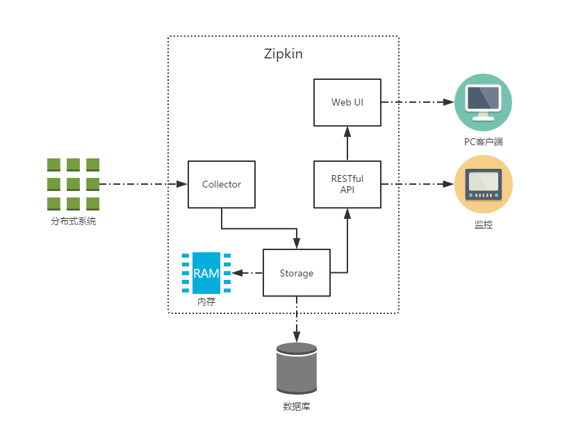

上图就是Zipkin的基础架构，分为四大组件：

- Collector：收集器，它主要用于处理从外部系统发送过来的跟踪信息，将这些信息转换为Zipkin内部处理的Span格式，以支持后续的存储、分析、展示等功能。
- Storage：存储器，将跟踪到的信息存储，默认存储到内存中；可以修改它的存储策略，使之存储到数据库中。
- RESTful API：API组件，外部访问接口
- Web UI：UI组件，即图形化界面，调用API层接口，直观的显示链路信息

### Http收集

接着，我们来整合一下Zipkin，SpringCloud Sleuth对Zipkin的整合实现了自动化配置，整合方式非常简单。

这里我们还是使用RestTemplate来进行服务间调用

#### 搭建Zipkin Server

创建一个Zipkin模块

添加pom依赖，这里在Zipkin模块的pom中添加，而不是父pom

```xml
<dependencies>
  <dependency>
  	<groupId>io.zipkin.java</groupId>
  	<artifactId>zipkin-server</artifactId>
  </dependency>
  <dependency>
  	<groupId>io.zipkin.java</groupId>
  	<artifactId>zipkin-autoconfigure-ui</artifactId>
  </dependency>
</dependencies>
```

创建启动器类

```java
@SpringBootApplication
@EnableZipkinServer
public class ZipkinApplication {
    public static void main(String[] args) {
        SpringApplication.run(ZipkinApplication.class,args);
    }
}
```

添加配置文件

```properties
spring.application.name=zipkin
# 9411 是Zipkin默认的端口
# 如果设置为9411，那么在Client端就可以不用设置 spring.zipkin.base-url
server.port=9411
```

非常简单的经典三步走，就完成了Zipkin Server的搭建，这时便可以启动起来，去看看WebUI界面

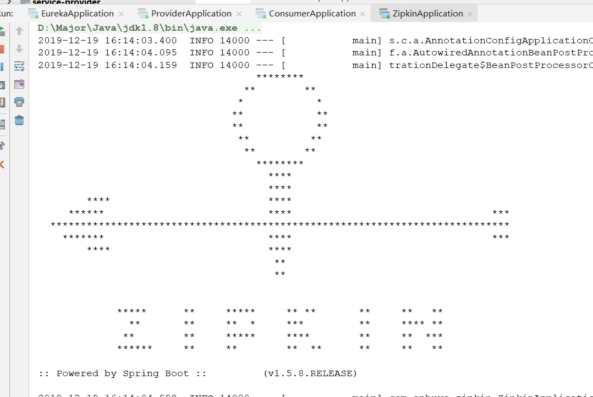

启动时也可以看到Zipkin的Banner，然后访问<http://localhost:9411/zipkin/>，即可看到UI界面

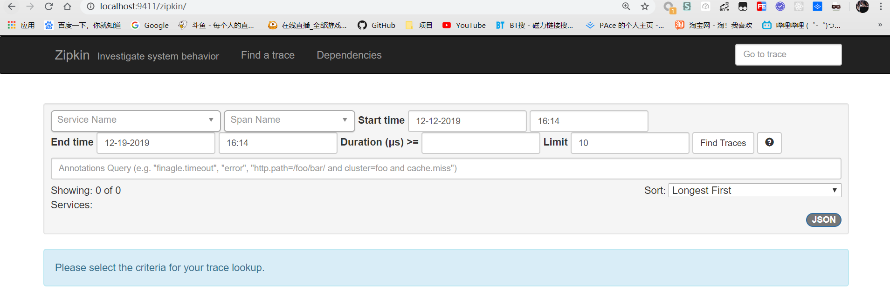

#### 应用引入Zipkin

这里我们接着Basic中的provider和consumer进行修改

首先对两个应用的pom中添加Zipkin依赖：`spring-cloud-starter-zipkin

```xml
<dependency>
    <groupId>org.springframework.cloud</groupId>
    <artifactId>spring-cloud-starter-zipkin</artifactId>
</dependency>
```

对两个应用的配置文件进行修改

```properties
spring.zipkin.base-url=http://127.0.0.1:9411
```

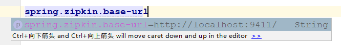

这里也可以看到，默认就是9411，所以我们端口如果设置了9411，也可以不写

#### 启动测试

这样，就整合完成了，我们重启服务，再次访问consumer使之调用provider接口看看：

==有时应用对于Zipkin的连接比较慢，需要等一会==

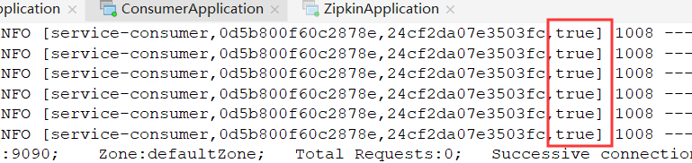

首先可以看到收集变成了true

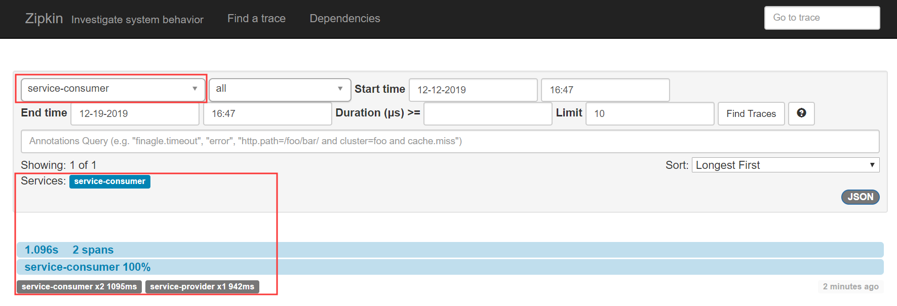

点击下方`service-consumer`端点的跟踪信息，我们还可以得到Sleuth收集到的跟踪到详细信息，其中包括了我们关注的请求时间消耗等。

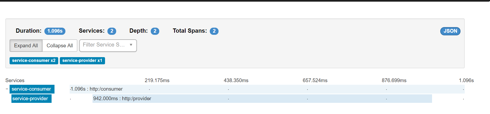

再点击一条链路，还可以看更详细的信息

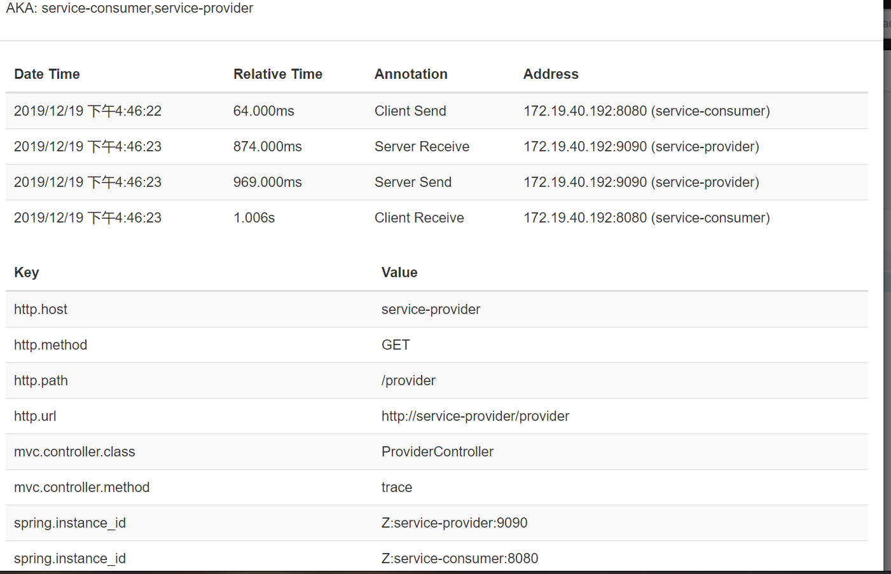

在dependencies里，也有服务调用关系图


### 消息中间件（Stream）收集

TODO


## 二、Zipkin收集原理

### 数据模型

首先我们要了解Zipkin的基础概念

- Span：一个基础的工作单元，以Http请求来说，一次完整的请求过程包含多种事件状态（Annotation下面介绍），每一个不同的工作单元都通过一个64位的ID来唯一标识，称为Span ID。而对于将这些请求，即工作单元串起来，串成一个完整的请求链路的，叫Trace，也具有一个TraceID。

- Trace：将具有相同TraceID的Span串联，串成一颗树型结构。

- Annotation：用来标记每一个事件，对于一个HTTP请求来说，在Sleuth中定义了下面四个核心Annotation来标识一个请求的开始和结束：

  - cs（Client Send）
  - sr（Server Received）
  - ss（Server Send）
  - cr（Client Received）

  对于他们很好理解，即客户端Http请求发送，服务接收请求，发送请求，客户端再接收请求

  根据不同的阶段时间戳的差，可以计算一些损耗时间：

  - sr - cs ：Http请求的网络延迟

  - ss - sr ：服务端处理时间

  - cr - cs ：总的响应时间

### 收集机制

接着我们看看服务链路足迹的收集机制

#### http收集

我们直接从Zipkin的UI界面来探究

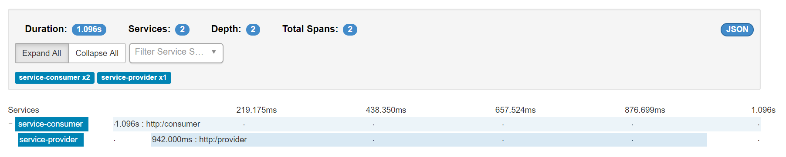

可以看到，这里有两端链路，/consumer和/provider

一个个点进去查看

##### consumer


可以明确的看到，对于consumer来说，经历了两段事件

- sr：接收客户端的http请求
- ss：响应数据给客户端

对应的traceID与spanID如下图


##### provider

再查看provider的

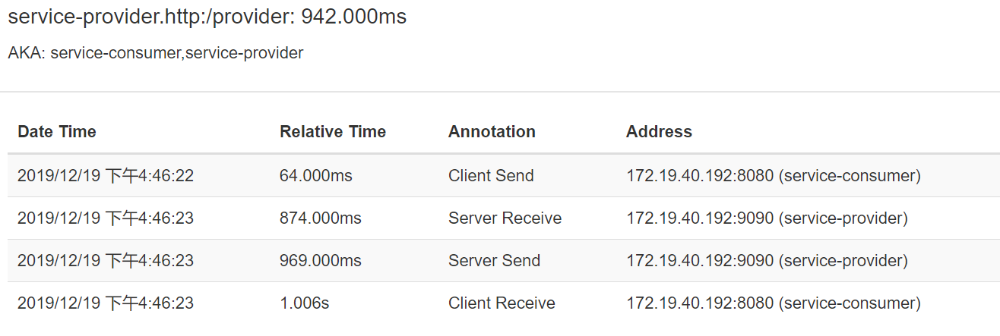

对于provider来说，经历了四段事件

- cs：`consumer`发送请求过来
- sr：接收`consumer`的请求
- ss：发送响应给`consumer`
- cr：`consumer`接收到响应数据

对应的traceID与spanID如下图

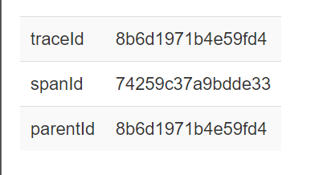

##### 总结

由上面的信息，我们可以画一张链路图，来理解Span收集过程

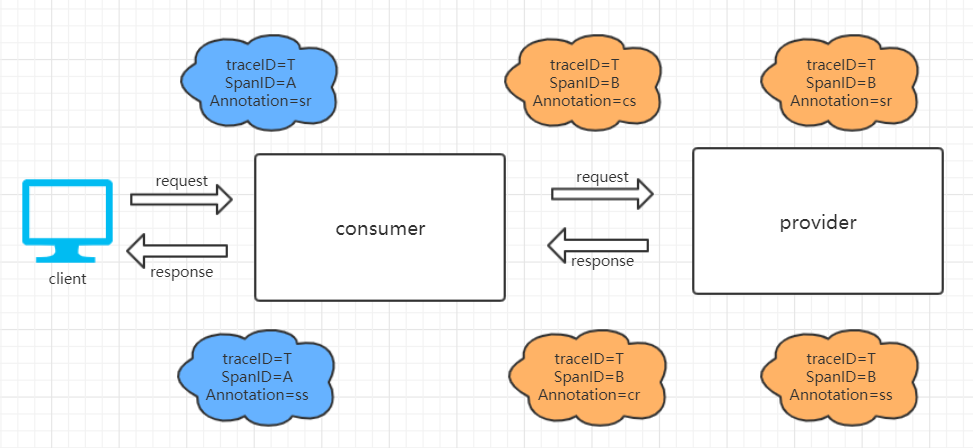

如上图，一共产生了2个不同ID的Span，对应2个工作单元：

- SpanA：客户端请求到达`consumer`和`consumer`发送请求响应的两个事件，通过他们 可以计算出请求的总延迟
- SpanB：记录了`consumer`转发请求给`provider`，`provider`接收请求，发送响应，`consumer`接收响应的过程。通过他们，可以计算出`consumer`调用`provider`的总体依赖时间（cr - cs），也可以计算出`consumer`到`provider`的网络延迟（sr - cs），也可以计算出`provider`应用用于处理客户端请求的内部逻辑花费的时间延迟（ss - sr）。

对于源码跟踪，我们在下一节中间件收集中调试研究。

#### 中间件收集

TODO