## 一、前景回顾

### 1.回顾SpringBoot的配置

具有application.yaml和application.properties两种，在源码中也反应出来：

通过`PropertySourcesLoader.load()`中的`PropertySourceLoader`，具有两种实现方式

- YamlPropertySourceLoader
- PropertiesPropertySourceLoader

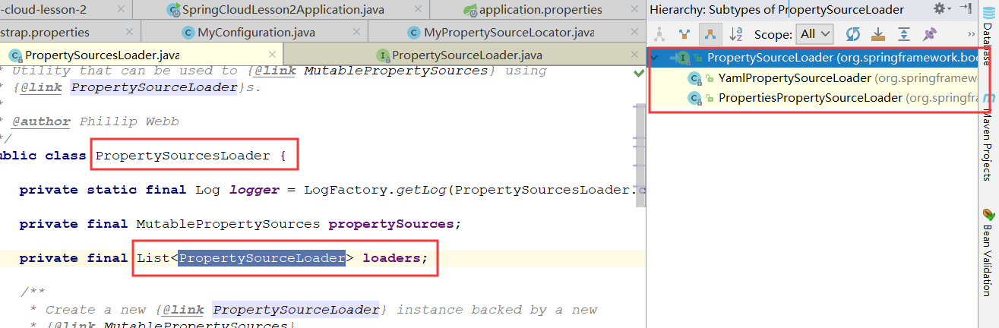

因为对于配置文件的加载也是事件监听模式，所以对于Application配置文件的监听器为`ConfigFileApplicationListener`

### 2.Environment 端点

上节我们了解到使用`/env`可以观察应用的一些环境信息，其实环境信息就是配置。

#### 环境与配置的关系

简单说下`Environment`和`PropertySources`和`PropertySource`的关系：

`Environment `：`PropertySources`（1：1）

`PropertySources `：`PropertySource`（1：n）

例如：我们在`application.propertis`添加些配置，当然，需要先关闭`env`安全

```properties
spring.application.name = spring-cloud-config-client
## 关闭 env 安全
endpoints.env.sensitive = false
```

访问`localhost:8080/env`查看：

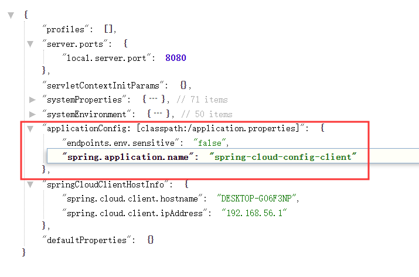

可以看到正确显示在`Environment`环境中，便应证了我们说法

#### HTTP请求修改配置

这些配置可以通过http请求进行修改，这里我们使用`postman`

首先get请求一下：

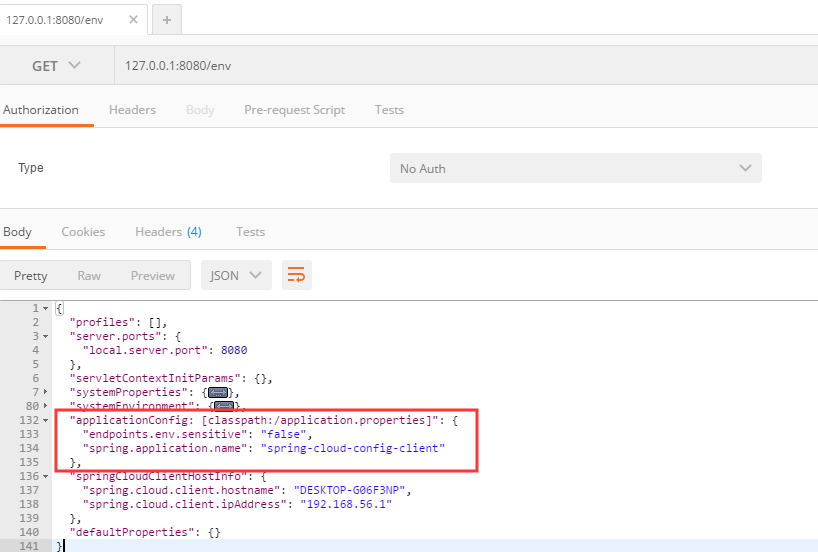

可以看到正确显示

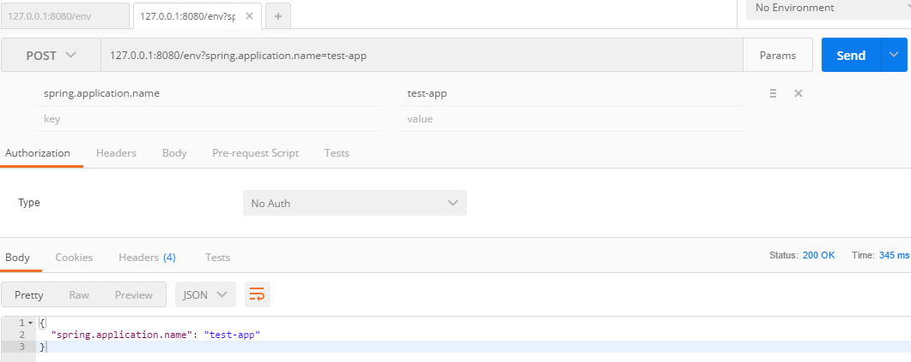

修改后再去浏览器访问：

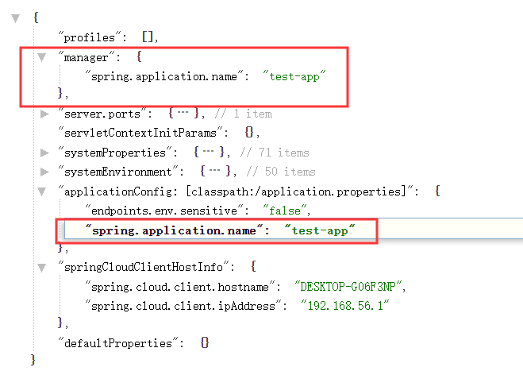

可以看到正确修改，这里我们还可以发现一个问题，`manager`这个property跑到第一位去了，可以翻阅源码看一下

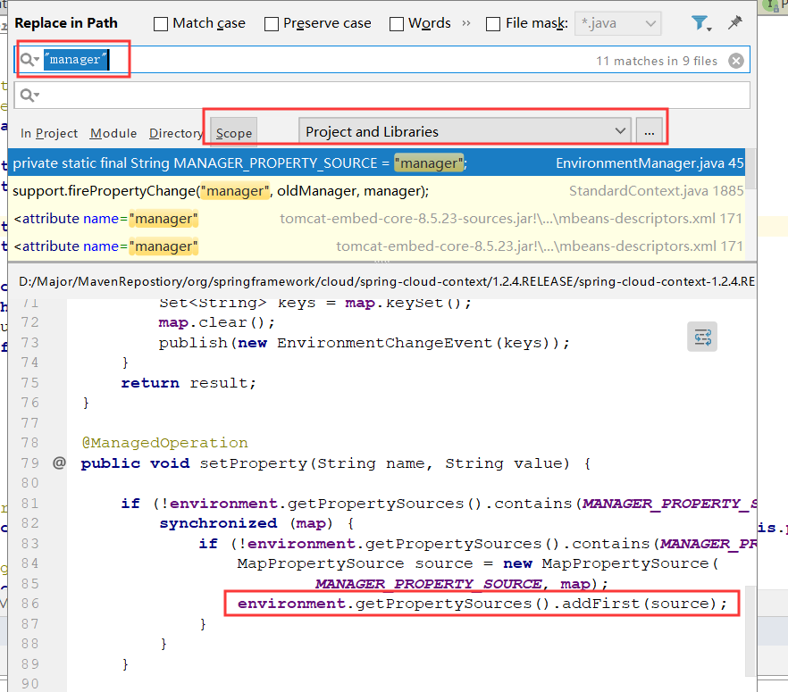

可以清楚的看到，确实在修改时，会调用`addFirst()`的方法，将`manager`放到第一位

------

下面开始研究我们的重点内容，BootStrap配置属性

## 二、BootStrap配置属性

### 1.BootStrap的配置文件

首先，关于BootStrap配置可以参考`BootstrapApplicationListener`

```java
String configName = environment
				.resolvePlaceholders("${spring.cloud.bootstrap.name:bootstrap}");
```

可以看到，源码中如果`spring.cloud.bootstrap.name`不存在，则使用默认的`bootstrap`作为配置文件名称

我们创建一个`bootstrap.properties`看看效果：

```properties
spring.application.name=spring-cloud-bootstrap-config
```

和`application`相同，也设置一个`application.name`

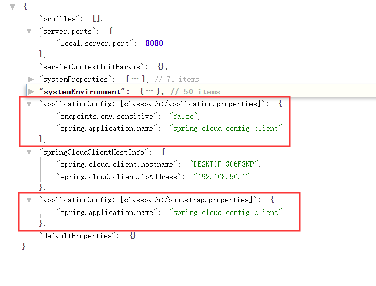

- 首先，bootstrap.properties被正确加载到容器中
- 其次，新添加的bootstrap配置文件排在了后面
- 因为，application.properties先进入配置List，所以先被读取，而bootstrap的便没有再被读取

### 2.调整BootStrap配置

#### 1.调整BootStrap上下文不被加载

在`BootStrapApplicationListener`源码中可以看到这么一个配置：

```java
if (!environment.getProperty("spring.cloud.bootstrap.enabled", Boolean.class,
				true)) {
    return;
}
```

即当配置`spring.cloud.bootstrap.enabled`为false时，BootStrapContext便不会再加载

我们在application.properties添加这个配置试一下：

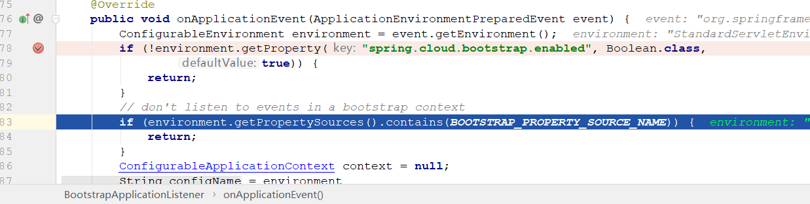

debug启动时，发现并没有成功return，而且执行到下一行代码。原因是：

> BootstrapApplicationListener的启动顺序为：Ordered.HIGHEST_PRECEDENCE + 5;即6
>
> ConfigFileApplicationListener的启动顺序为：Ordered.HIGHEST_PRECEDENCE + 10;即11
>
> 因为排序小的先执行，所以在application配置文件生效前，BootStrap上下文已经加载完毕了。

所以我们应该在优先级更高的地方修改，比如应用的启动参数：

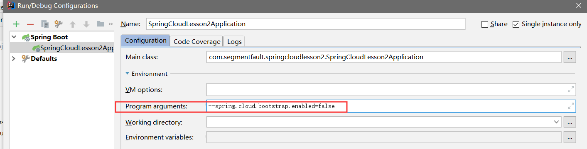

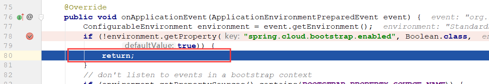

可以看到，正确直接return回去，而没有往下执行创建上下文对象

==所以，如果我们想调整BootStrap上下文行为配置，必须要更高优先级，比如启动项参数==

#### 2.调整BootStrap配置文件名称

上面我们说到：

```java
String configName = environment
				.resolvePlaceholders("${spring.cloud.bootstrap.name:bootstrap}");
```

默认使用的bootstrap配置文件名称为bootstrap

我们修改一下试试：改为spring-cloud

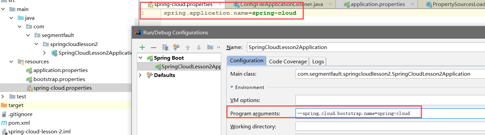

这时我们有三个配置文件，看看他们的加载情况，以及application.name的值

- application.properties：`spring.application.name = spring-cloud-config-client`
- bootstrap.properties：`spring.application.name=spring-cloud-bootstrap-config`
- spring-cloud.properties：`spring.application.name=spring-cloud`

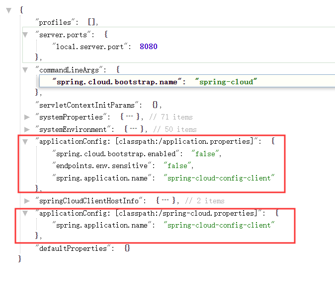

可以看到，和我们想的一样，修改后名称被加载，而值还是根据先后顺序使用的application配置文件中的值

#### 3.修改BootStrap配置文件路径

也是一样，在启动参数上加上location：

```
--spring.cloud.bootstrap.location=config
```

我们在resource路径下添加一个config文件夹：

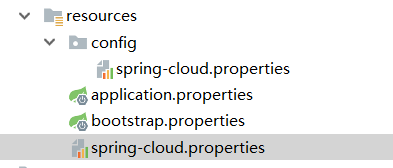

启动访问查看：

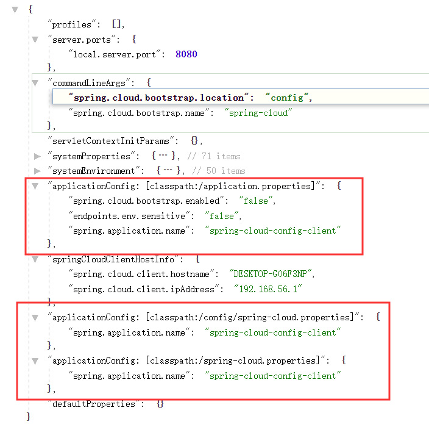

#### 4.覆盖远程配置属性

主要针对我们上面说的HTTP请求修改配置，

`spring.cloud.config.allowOverride=true`

通过程序启动参数，调整这个值为"**false**"

```properties
--spring.cloud.config.allowOverride=false
```

启动后，重新Postman 发送 POST 请求，调整`spring.application.name` 值为 "**spring-cloud-new**"

> 注意官方文档的说明：the remote property source has to grant it permission by setting `spring.cloud.config.allowOverride=true` (it doesn’t work to set this locally).
>
> 即，本地服务不会生效，所以无法本地测试


#### 5.自定义BootStrap配置

根据官方文档可知，自定义一个BootStrap配置分三步走：

1.创建一个自己的配置类：`MyPropertySource`

2.在配置类里向容器添加一个自己配置的PropertySource

```java
@Configuration
public class MyPropertySource implements ApplicationContextInitializer {
    @Override
    public void initialize(ConfigurableApplicationContext applicationContext) {
        // 1. 从上下文对象中获取环境对象
        ConfigurableEnvironment environment = applicationContext.getEnvironment();
        // 2. 从环境对象中获取可修改配置
        MutablePropertySources propertySources = environment.getPropertySources();
        // 3. 添加我们自己的配置
        propertySources.addFirst(createPropertySource());
    }

    /**
     * 创建自己的PropertySource
     * @return
     */
    private PropertySource createPropertySource(){
        Map<String,Object> source = new HashMap<>();
        source.put("spring.application.name","pace-spring-cloud");
        PropertySource propertySource = new MapPropertySource("my-property-source",source);
        return propertySource;
    }
}
```

主要步骤：

- 实现`ApplicationContextInitiallzer`，这样容器初始化的时候就会执行我们的初始化方法
- 创建一个自己的`PropertySource`，通过``new MapPropertySource`
- 从上下文中获取环境对象，根据环境对象获取可修改`PropertySource`对象
- 在`MutablePropertySource`中添加我们自己的`PropertySource`

3.创建一个`META-INF/spring.factories`文件，并添加BootStrapConfiguration映射我们的类

```properties
org.springframework.cloud.bootstrap.BootstrapConfiguration= \
com.segmentfault.springcloudlesson2.bootstrap.MyPropertySource
```

这样在项目启动时，就会加载我们的Configuration类

#### 6.自定义BootStrap配置属性源

其实这个和上面的实现方式基本雷同，区别是：

- 一个是实现Spring的`ApplicationContextInitializer`
- 一个是实现SpringCloud的`PropertySourceLocator`

1.创建一个MyPropertySourceLocator

```java
@Configuration
public class MyPropertySourceLocator implements PropertySourceLocator {

    @Override
    public PropertySource<?> locate(Environment environment) {
        if(environment instanceof ConfigurableEnvironment){
            ConfigurableEnvironment configurableEnvironment = ConfigurableEnvironment.class.cast(environment);
            MutablePropertySources propertySources = configurableEnvironment.getPropertySources();
            propertySources.addFirst(createPropertySource());
        }
        return null;
    }

    /**
     * 创建自己的PropertySource
     * @return
     */
    private PropertySource createPropertySource(){
        Map<String,Object> source = new HashMap<>();
        source.put("spring.application.name","pace-spring-cloud-locator");
        PropertySource propertySource = new MapPropertySource("my-property-source-locator",source);
        return propertySource;
    }
    
}
```

2.在`META-INF/spring.factories`中添加此Configuration类

```properties
org.springframework.cloud.bootstrap.BootstrapConfiguration= \
com.segmentfault.springcloudlesson2.bootstrap.MyPropertySource,\
com.segmentfault.springcloudlesson2.bootstrap.MyPropertySourceLocator
```

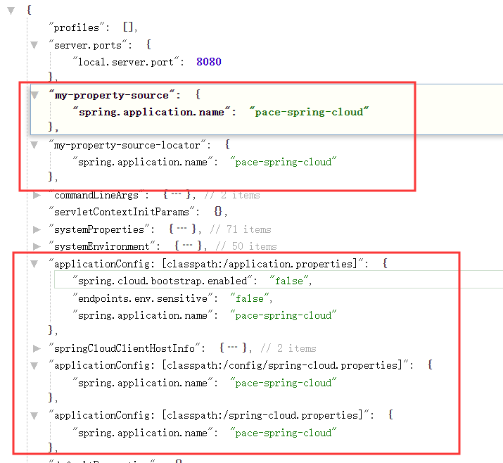

可以看到效果，两个BootStrap配置都加载到`Environment`中了，并且由于优先顺序，下面几个配置文件中的属性也都变成我们所配置的`pace-spring-cloud`

对于我们自定义的BootStrap配置，SpringCloud官方文档推荐使用`@Order`注解来进行排序