## SpringCloud 大整合

首先放一张自己制作的SpringCloud拓扑图

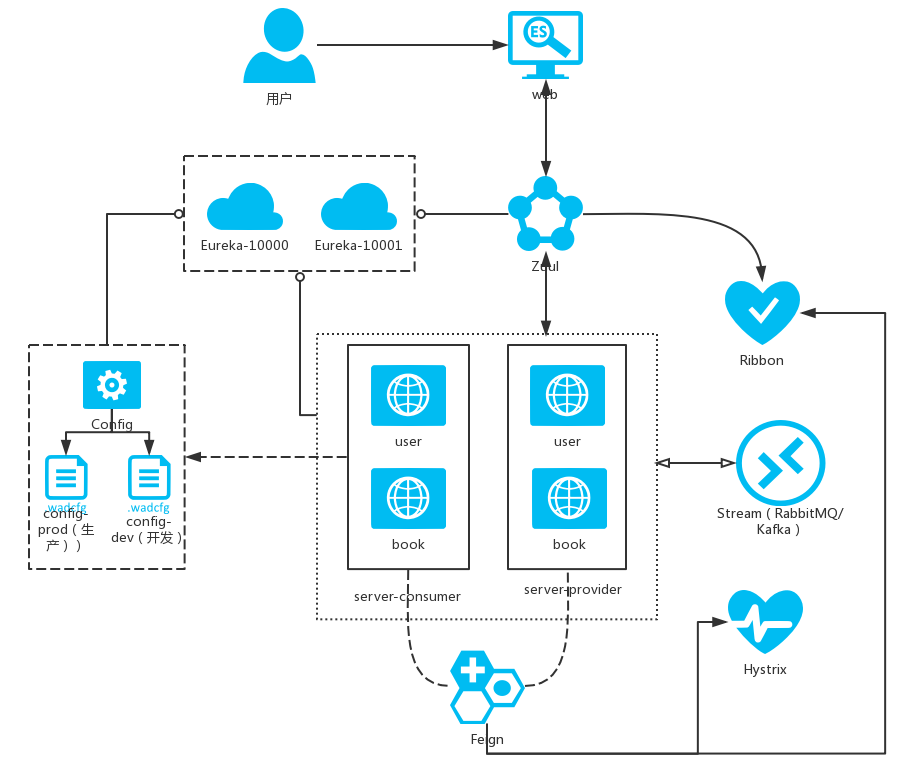

根据这张图我们进行整合

- SpringCloud Eureka
- SpringCloud Config
- SpringCloud Feign
- SpringCloud Hystrix
- SpringCloud Zuul

### 1.工程创建

首先我们要创建一个工程，Maven工程

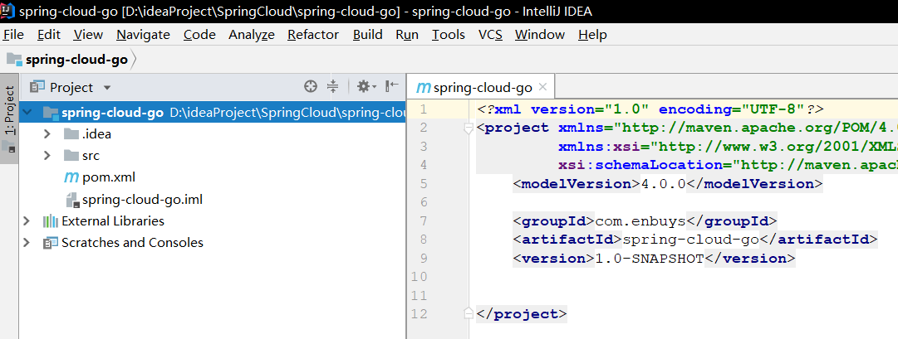

### 2.依赖添加

这里我们直接在pom中添加我们需要的依赖，SpringBoot，SpringCloud等

SpringBoot版本：1.5.8

SpringCloud版本：Dalston.SR4

```xml
<dependencyManagement>
    <dependencies>
        <!-- Spring Boot 依赖 -->
        <dependency>
            <groupId>org.springframework.boot</groupId>
            <artifactId>spring-boot-dependencies</artifactId>
            <version>1.5.8.RELEASE</version>
            <type>pom</type>
            <scope>import</scope>
        </dependency>

        <!-- Spring Cloud 依赖 -->
        <dependency>
            <groupId>org.springframework.cloud</groupId>
            <artifactId>spring-cloud-dependencies</artifactId>
            <version>Dalston.SR4</version>
            <type>pom</type>
            <scope>import</scope>
        </dependency>
    </dependencies>
</dependencyManagement>

<dependencies>
    <!-- SpringBoot相关 -->
    <dependency>
        <groupId>org.springframework.boot</groupId>
        <artifactId>spring-boot-starter-actuator</artifactId>
    </dependency>
    <dependency>
        <groupId>org.springframework.boot</groupId>
        <artifactId>spring-boot-starter-web</artifactId>
    </dependency>
    <dependency>
        <groupId>org.springframework.boot</groupId>
        <artifactId>spring-boot-starter-test</artifactId>
        <scope>test</scope>
    </dependency>

    <!-- 依赖 Spring Cloud Netflix Eureka -->
    <dependency>
        <groupId>org.springframework.cloud</groupId>
        <artifactId>spring-cloud-starter-eureka-server</artifactId>
    </dependency>
    
    <!-- 依赖 Ribbon -->
    <dependency>
        <groupId>org.springframework.cloud</groupId>
        <artifactId>spring-cloud-starter-ribbon</artifactId>
    </dependency>

    <!-- 依赖 Fegin -->
    <dependency>
        <groupId>org.springframework.cloud</groupId>
        <artifactId>spring-cloud-starter-feign</artifactId>
    </dependency>

    <!-- 依赖 Hystrix -->
    <dependency>
        <groupId>org.springframework.cloud</groupId>
        <artifactId>spring-cloud-starter-hystrix</artifactId>
    </dependency>

    <!-- 依赖 Zuul -->
    <dependency>
        <groupId>org.springframework.cloud</groupId>
        <artifactId>spring-cloud-starter-zuul</artifactId>
    </dependency>
</dependencies>

<build>
    <plugins>
        <plugin>
            <groupId>org.springframework.boot</groupId>
            <artifactId>spring-boot-maven-plugin</artifactId>
        </plugin>
    </plugins>
</build>
```

这里有个小细节，除了Spring Cloud Config，其他都添加了，为什么呢？我们后面整合时再说

### 3.整合Eureka

首先创建一个Eureka模块


创建启动类，开启`@EnableEurekaServer`注解

```java
@SpringBootApplication
@EnableEurekaServer
public class EurekaApplication {
    public static void main(String[] args) {
        SpringApplication.run(EurekaApplication.class,args);
    }
}
```

编写配置文件，application.properties

```properties
# 应用名称
spring.application.name=server-eureka
# 服务端口
server.port=10001

# 因为单机，所以关闭向注册中心拉取服务和注册
eureka.client.fetch-registry=false
eureka.client.register-with-eureka=false

eureka.instance.hostname=localhost
```

### 4.创建Service Provider与Consumer

#### 创建Service Provider

首先创建模块

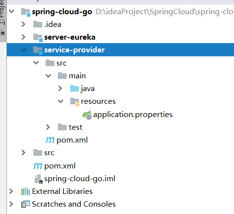

创建启动器类，并开启`@EnableDiscoveryClient`注解

```java
@SpringBootApplication
@EnableDiscoveryClient
public class ProviderApplication {
    public static void main(String[] args) {
        SpringApplication.run(ProviderApplication.class,args);
    }
}
```

创建一个`Controller`类以供调用

```java
@RestController
public class ProviderController {

    @GetMapping("/get")
    public String getName(@RequestParam("id")Integer id){
        return id == 1 ? "Pacee" : "ZZZ";
    }

}
```

创建配置文件，`application.properties`

```properties
# 应用名称
spring.application.name=service-provider
# 服务端口
server.port=9090

# 向注册中心注册
eureka.client.service-url.defaulteZone=http://127.0.0.1:10001/eureka
```

#### 创建Service Consumer

首先创建模块


创建启动器类，并开启`@EnableDiscoveryClient`注解

```java
@SpringBootApplication
@EnableDiscoveryClient
public class ConsumerApplication {
    public static void main(String[] args) {
        SpringApplication.run(ConsumerApplication.class,args);
    }
}
```

创建一个`Controller`类以供调用

```java
@RestController
public class ConsumerController {
    
    @GetMapping("/get")
    public String get(@RequestParam("id") Integer id){
        return null;
    }
}
```

这里我们先return null，之后整合Feign再进行改造，来调用服务提供方的服务。

创建配置文件，`application.properties`

```properties
# 应用名称
spring.application.name=service-consumer
# 服务端口
server.port=8080

# 向注册中心注册
eureka.client.service-url.defaulteZone=http://127.0.0.1:10001/eureka
```

### 5.整合Feign与Hystrix

这里使用Feign与Hystrix，都是在服务消费方改造的

`Service-Consumer`添加`@FeignClient`接口

```java
@FeignClient(name = "${provider.service.name}",fallback = FeignFallback.class)
public interface FeignService {

    @GetMapping("/get")
    String getName(@RequestParam("id") Integer id);
}
```

再添加`FallBack`类，即熔断后执行的方法

```java
@Component
public class FeignFallback implements FeignService {
    public String getName(Integer id) {
        return "fallback:error";
    }
}
```

调整`FeignService`接口

```java
@FeignClient(name = "${provider.service.name}",fallback = FeignFallback.class)
public interface FeignService {

    String getName(Integer id);
}
```

修改`Controller`：

```java
@RestController
public class ConsumerController {

    @Autowired
    private FeignService feignService;

    @GetMapping("/get")
    public String get(@RequestParam("id")Integer id){
        return feignService.getName(id);
    }
}
```

修改配置文件：

```properties
# 应用名称
spring.application.name=service-consumer
# 服务端口
server.port=8080

# 向注册中心注册
eureka.client.service-url.defaulteZone=http://127.0.0.1:10001/eureka

# 服务提供方名称
provider.service.name=service-provider
# 开启Hystrix
feign.hystrix.enabled=true
```

整合到这里，我们可以测试一下。按顺序启动：`eureka - provider - consumer`，然后访问<`http://localhost:8080/get?id=1`>


正确访问，就没有问题，继续往下整合

### 6.整合Config

对于SpringCloud配置平台来说，主要的使用方是服务消费者，所以我们这里要做两件事

- 创建Config Server
- 改造Service Consumer

#### 创建Config Server

创建一个工程，`server-config`

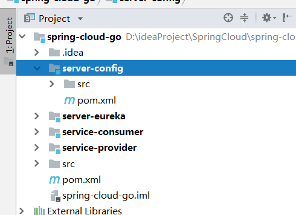

添加依赖

```xml
<dependencies>
    <dependency>
        <groupId>org.springframework.cloud</groupId>
        <artifactId>spring-cloud-config-server</artifactId>
    </dependency>
</dependencies>
```

创建启动器类

```java
@SpringBootApplication
@EnableDiscoveryClient
@EnableConfigServer
public class ConfigApplication {
    public static void main(String[] args) {
        SpringApplication.run(ConfigApplication.class,args);
    }
}
```

这里主要添加`@EnableConfigServer`

添加配置，`application.properties`

```properties
# 应用名称
spring.application.name=server-config
# 服务端口
server.port=7070
management.security.enabled = false

# 向注册中心注册
eureka.client.service-url.defaultZone=http://127.0.0.1:10001/eureka

# 使用本地git地址
spring.cloud.config.server.git.uri=${user.dir}/server-config/src/main/resources/config
```

在`resources`下`configs`文件夹，在其下面添加`enbuys.properties`，为服务消费者准备

```properties
# 服务提供方名称
provider.service.name=service-provider
# 开启Hystrix
feign.hystrix.enabled=true
```

将配置文件添加到`git`仓库中，在`configs`目录下进行git初始化

```
> git init
> git add .
> git commit -m "first commit"
```

#### 修改Service Consumer

添加依赖

```xml
<dependencies>
    <dependency>
        <groupId>org.springframework.cloud</groupId>
        <artifactId>spring-cloud-starter-config</artifactId>
    </dependency>
</dependencies>
```

修改`application.properties`

```properties
# 服务端口
server.port=8080
management.security.enabled = false
## 服务提供方名称
#provider.service.name=service-provider
## 开启Hystrix
#feign.hystrix.enabled=true
```

==这里将服务提供方名称，以及Hystrix的开启注释掉，因为整合了Config，配置直接使用配置服务器上的==

创建`bootstrap.properties`

```properties
# 应用名称
spring.application.name=service-consumer
# 向注册中心注册
eureka.client.service-url.defaultZone=http://127.0.0.1:10001/eureka

## 配置客户端应用关联的应用
## spring.cloud.config.name 是可选的
## 如果没有配置，采用 ${spring.application.name}
spring.cloud.config.name = service
## 关联 profile
spring.cloud.config.profile = default
## 关联 label
spring.cloud.config.label = master
#spring.cloud.config.enabled=true
## 激活 Config Server 服务发现
spring.cloud.config.discovery.enabled = true
## Config Server 服务器应用名称
spring.cloud.config.discovery.service-id=server-config
```

这里为何要将应用名称和注册中心地址放在bootstrap配置文件里，可以看之前第三个笔记 `SpringCloud Config Sever`

#### 为何依赖要添加在子模块里

==经测试，在父pom文件中添加config-server依赖，会导致config client端，即服务消费者拉取不了config server==，所以要分开添加依赖

### 7.整合Zuul

创建一个Zuul模块

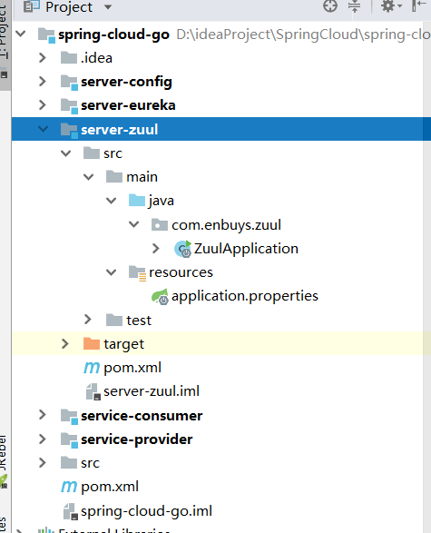

创建启动器类

```java
@EnableZuulProxy
@SpringBootApplication
@EnableDiscoveryClient
public class ZuulApplication {
    public static void main(String[] args) {
        SpringApplication.run(ZuulApplication.class,args);
    }
}
```

添加配置文件

```properties
spring.application.name=server-zuul
server.port=6060
management.security.enabled=false
eureka.client.service-url.defaultZone=http://127.0.0.1:10001/eureka
```

### 8.测试

启动Eureka -> Config -> Service Provider -> Service Consumer -> Zuul

#### Eureka测试

首先我们可以访问<http://localhost:10001/>，查看各个服务是否启动成功

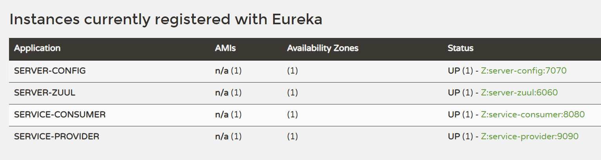

出现4个服务说明启动成功

#### Config测试

访问<http://localhost:7070/enbuys-default.properties>

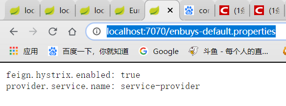

#### Provider测试

访问http://localhost:9090/get?id=1>是否正确请求

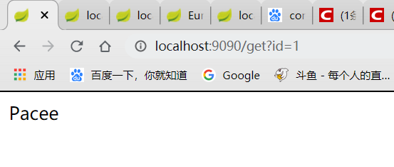

#### Consumer测试

访问<http://localhost:8080/get?id=1>是否正确请求

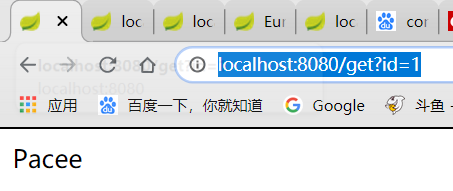

查看<http://localhost:8080/env>，是否加载了配置中心的配置


#### Zuul测试

然后我们可以访问<http://localhost:6060/routes>，查看zuul是否正确路由

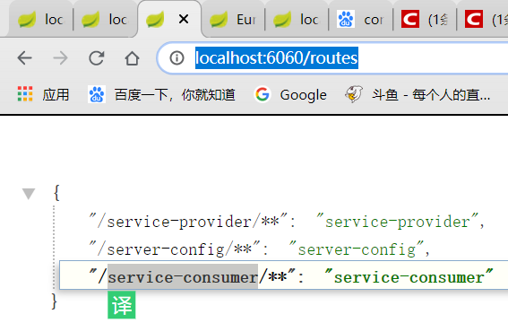

如下3个路由规则，说明正确路由

#### 最终测试

接着我们可以访问<http://localhost:6060/service-consumer/get?id=1>

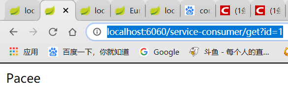

出现Pacee，说明大功告成，我们的大整合成功。


