在上一节中，我们发现SpringBoot会自动配置Security，让我们跳转到表单登录页面，输入默认的用户名和随机生成的密码。

其实在springboot1.x版本中，并不是跳转到表单登录页，而是弹出一个对话框，在对话框里输入信息，我们可以修改代码尝试一下。

## 两种认证方式

首先我们在browser模块创建一个`BrowserSecurityConfig`类

```java
@Configuration
public class BrowserSecurityConfig extends WebSecurityConfigurerAdapter {

    @Override
    protected void configure(HttpSecurity http) throws Exception {
        // 以http方式认证 springboot1.x时默认
        // 以form表单方式认证 springboot2.x默认
        http.httpBasic()
                .and()
                .authorizeRequests() // 下面是认证信息
                .anyRequest() // 所有请求
                .authenticated(); // 都需要认证
    }
}
```

这个类继承了`WebSecurityConfigurerAdapter`，安全配置适配器类，并重写`configure`方法，这里`configure`有三种重载方法，我们这里先使用Http形式的。

通过代码很好理解，即通过一系列配置，使用了`httpBasic`的方式进行身份认证的拦截。

重启`Application`，查看认证方式（注意需要把之前关闭自动配置的代码给注释掉）

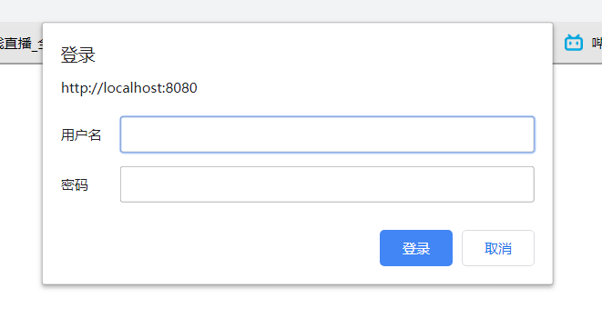

登录方式成为了弹出框的形式

## 图解基本原理

对于SpringSecurity的基本原理，这里先放一张图，根据这张图我们进行简单了解

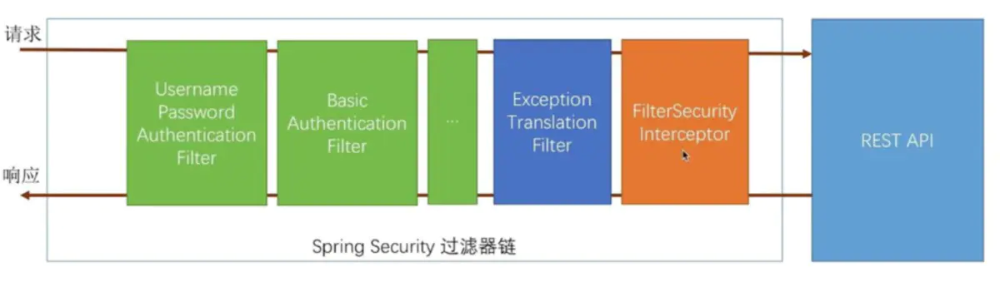

这里首先分为Security的过滤器链，由多个过滤器组成，和REST API即我们编写的服务需要被保护的服务。

再进行API请求时，会先走一遍过滤器链，成功认证后才会调用，返回时会再走一遍

### 绿色过滤器

这里有两个`UsernamePasswordAuthenticationFilter`和`BasicAuthenticationFilter`，通过名字我们可以联想到刚刚实现的两种认证方式，第一个就是表单认证过滤器，第二个是弹出登录框的基础Http认证过滤器。

这里还能看到有第三个绿色框，其实还有很多种认证方式，比如短信验证，第三方登录等等。

请求通过绿色过滤器之后如果认证成功会加一个标记，然后进入橙色过滤器`FilterSecurityInterceptor`里，如果没有认证成功也会进去，只不过没有认证成功的标记。

### 橙色过滤器

`FilterSecurityInterceptor`是非常重要的过滤器，会根据我们的配置进行拦截判断，比如我们刚刚的代码：

```java
@Override
protected void configure(HttpSecurity http) throws Exception {
    http.httpBasic()
        .and()
        .authorizeRequests() // 下面是认证信息
        .anyRequest() // 所有请求
        .authenticated(); // 都需要认证
}
```

这里的配置都会被它读取，从绿色过滤器过来之后会判断是否有成功标记，如果没有抛出异常，如果有再判断是否有其他的一些认证配置，比如vip用户认证，判断用户是否为vip用户，不是还是抛出异常，如果全部认证通过会放行请求API接口

### 蓝色过滤器

`ExceptionTranslationFilter`，看名字也知道是异常捕获的过滤器，即当`FilterSecurityInterceptor`抛出异常后，会被此过滤器拦截。

比如`Interceptor`抛出没有身份认证的异常，`Exception Translation Filter`会看看前面究竟配置的是什么样的Filter，然后做出相应的处理。比如说前面配置的是`Username Password Authentication Filter`，那么就会跳转到带表单的登录页面。但如果说前面配置的是`BasicAuthenticationFilter`，那么就会弹出登录框等待用户输入信息。

再比如用户没有输入用户名密码，`Interceptor`抛出认证失败异常，此过滤器就会抛出401异常

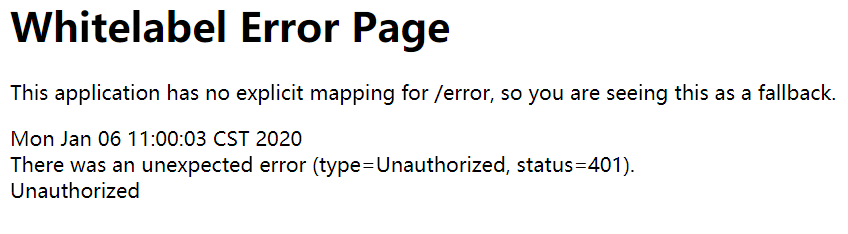

## 源码查看

**首先是FilterSecurityInterceptor：**

```java
public void invoke(FilterInvocation fi) throws IOException, ServletException {
   if ((fi.getRequest() != null)
         && (fi.getRequest().getAttribute(FILTER_APPLIED) != null)
         && observeOncePerRequest) {
      // filter already applied to this request and user wants us to observe
      // once-per-request handling, so don't re-do security checking
      fi.getChain().doFilter(fi.getRequest(), fi.getResponse());
   }
   else {
      // first time this request being called, so perform security checking
      if (fi.getRequest() != null && observeOncePerRequest) {
         fi.getRequest().setAttribute(FILTER_APPLIED, Boolean.TRUE);
      }

      InterceptorStatusToken token = super.beforeInvocation(fi);

      try {
         fi.getChain().doFilter(fi.getRequest(), fi.getResponse());
      }
      finally {
         super.finallyInvocation(token);
      }

      super.afterInvocation(token, null);
   }
}
```

这里简单的看一下，主要是else里的代码，获取请求信息，然后调用`super.beforeInvocation()`来判断是否有权限调用API，如果有权限放行，如果没有权限抛出异常，这里代码就不放出来了，可以自己去看，我们主要目的是查看调用链的执行过程。

**然后查看ExceptionTranslationFilter：**

```java
public void doFilter(ServletRequest req, ServletResponse res, FilterChain chain)
      throws IOException, ServletException {
   HttpServletRequest request = (HttpServletRequest) req;
   HttpServletResponse response = (HttpServletResponse) res;

   try {
      chain.doFilter(request, response);

      logger.debug("Chain processed normally");
   }
   catch (IOException ex) {
      throw ex;
   }
   catch (Exception ex) {
      // Try to extract a SpringSecurityException from the stacktrace
      Throwable[] causeChain = throwableAnalyzer.determineCauseChain(ex);
      RuntimeException ase = (AuthenticationException) throwableAnalyzer
            .getFirstThrowableOfType(AuthenticationException.class, causeChain);

      if (ase == null) {
         ase = (AccessDeniedException) throwableAnalyzer.getFirstThrowableOfType(
               AccessDeniedException.class, causeChain);
      }

      if (ase != null) {
         if (response.isCommitted()) {
            throw new ServletException("Unable to handle the Spring Security Exception because the response is already committed.", ex);
         }
         handleSpringSecurityException(request, response, chain, ase);
      }
      else {
         // Rethrow ServletExceptions and RuntimeExceptions as-is
         if (ex instanceof ServletException) {
            throw (ServletException) ex;
         }
         else if (ex instanceof RuntimeException) {
            throw (RuntimeException) ex;
         }

         // Wrap other Exceptions. This shouldn't actually happen
         // as we've already covered all the possibilities for doFilter
         throw new RuntimeException(ex);
      }
   }
}
```

因为是捕获异常的过滤器，重要代码都在catch里，对不同异常进行不同处理

**最后查看UsernamePasswordAuthenticationFilter：**

```java
public Authentication attemptAuthentication(HttpServletRequest request,
      HttpServletResponse response) throws AuthenticationException {
   if (postOnly && !request.getMethod().equals("POST")) {
      throw new AuthenticationServiceException(
            "Authentication method not supported: " + request.getMethod());
   }

   String username = obtainUsername(request);
   String password = obtainPassword(request);

   if (username == null) {
      username = "";
   }

   if (password == null) {
      password = "";
   }

   username = username.trim();

   UsernamePasswordAuthenticationToken authRequest = new UsernamePasswordAuthenticationToken(
         username, password);

   // Allow subclasses to set the "details" property
   setDetails(request, authRequest);

   return this.getAuthenticationManager().authenticate(authRequest);
}
```

提取请求中的用户名密码，进行校验，成功则设置认证成功。

### 断点调试

接着我们对这几个类进行打断点，并DEBUG启动测试，看一下执行流程

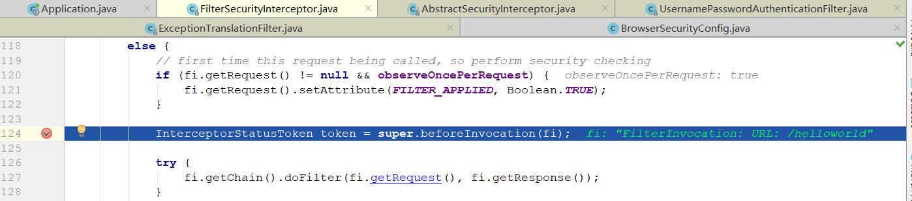

首先进入Interceptor，这是因为第一次访问需要验证过滤

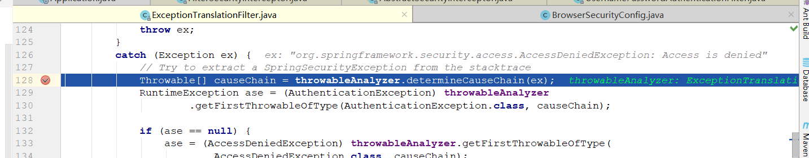

接着进入`Exception`过滤器，捕获到`Interceptor`抛出的`AccessDeniedException: Access is denied`异常，这里可以深入的跟一下

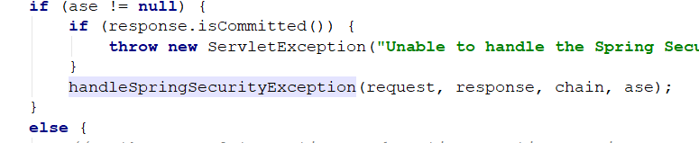

首先调用`handleSpringSecurityException()`方法

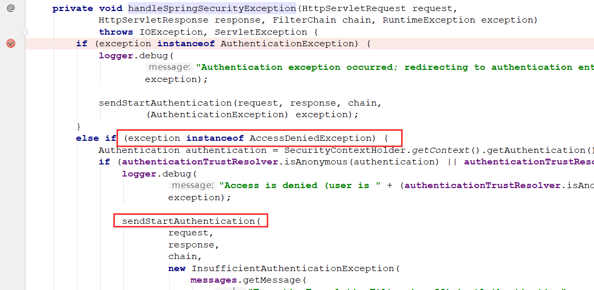

因为异常是`AccessDeniedException`，所以调用`sendStartAuthentication()`方法

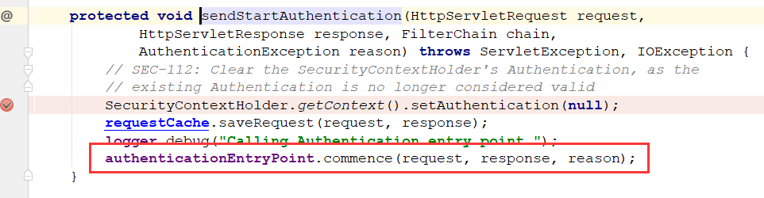

最后进入`authenticationEntryPoint.commence()`方法，因为我们使用表单方式，所以进入`LoginUrlAuthenticationEntryPoint`类

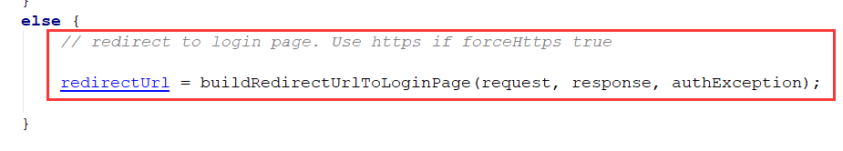

调用这个方法，通过注释也可知道是转发到`login`界面了

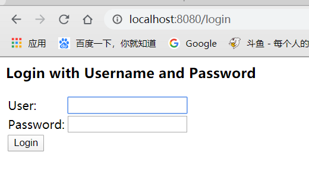

接着我们输入用户名密码，再次查看调用拦截链路

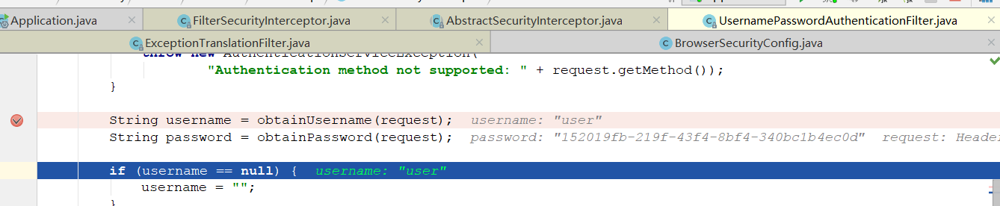

这里就会进入到第一个绿色框了即表单登录拦截器，这里判断用户名密码正确后会在`request`中添加`token`

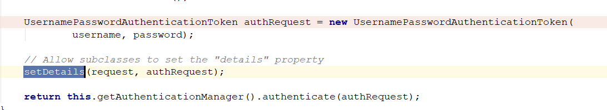

最后到`Interceptor`的时候判断请求头具有`token`认证，即放行，成功请求到API方法

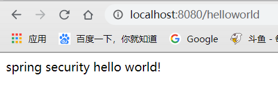


总结一下，拦截链路为：

**Interceptor -> ExceptionFilter -> /login页面 -> 表单验证Filter -> Interceptor -> API接口**


