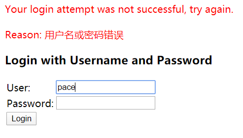
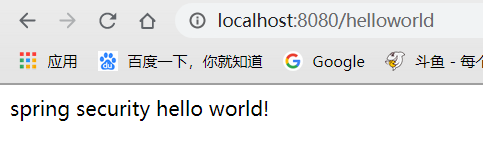
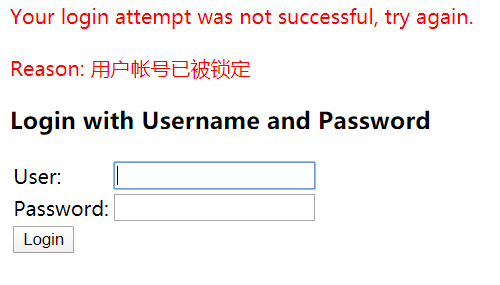
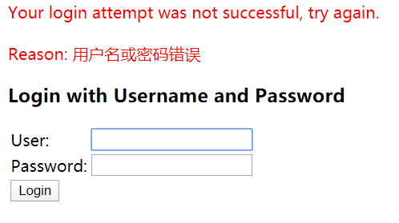
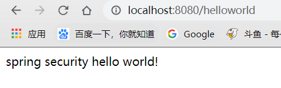
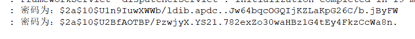

在上一节，我们使用的都是默认的用户名密码进行登录，这一节我们将研究如何自定义用户名及密码，进行自定义的用户认证逻辑。

自定义用户认证逻辑涉及三个方面：

- 处理用户信息获取逻辑
- 处理用户校验逻辑
- 处理密码加密解密

## 用户信息获取逻辑

表示我们获取用户时可以从mysql、redis、ldap中获取用户的信息，而不再使用SpringSecurity默认提供的user信息。

实现起来非常简单，因为SpringSecurity已经预留了相应的接口，我们只需实现它重新方法即可。

### UserDetailsService

```java
public interface UserDetailsService {
   // ~ Methods
   // ========================================================================================================

   /**
    * Locates the user based on the username. In the actual implementation, the search
    * may possibly be case sensitive, or case insensitive depending on how the
    * implementation instance is configured. In this case, the <code>UserDetails</code>
    * object that comes back may have a username that is of a different case than what
    * was actually requested..
    *
    * @param username the username identifying the user whose data is required.
    *
    * @return a fully populated user record (never <code>null</code>)
    *
    * @throws UsernameNotFoundException if the user could not be found or the user has no
    * GrantedAuthority
    */
   UserDetails loadUserByUsername(String username) throws UsernameNotFoundException;
}
```

这个接口是我们自定义用户认证的重要接口，它的方法返回`UserDetails`也是重要的类接口，对于这个接口，SpringSecurity也通过User类实现了此接口，所以我们只需创建SpringSecurity提供的User类即可


### 实战

**1.创建Bean实现UserDetailsService接口**

```java
@Component
public class MyUserDetailService implements UserDetailsService {
    @Override
    public UserDetails loadUserByUsername(String username) throws UsernameNotFoundException {
        // 第一个参数，用户名；第二个参数，密码；第三个参数，用户所拥有的权限
        // 这里我们写死了密码和权限，实际开发中需要根据业务需求进行查库动态配置
        return new User(username,"123456",AuthorityUtils.commaSeparatedStringToAuthorityList("admin"));
    }
}
```

**2.测试报错**

```
java.lang.IllegalArgumentException: There is no PasswordEncoder mapped for the id "null"
```

这是因为在SpringSecurity5.x，SpringBoot2.x版本后，对于密码加密方式的改变，因为没有指定加密方式而报错

- 在5.x使用**`DelegatingPasswordEncoder`**，他必须指定加密方式才可以，并在比较时进行加密解密比较
- 在之前版本使用**`NoOpPasswordEncoder`**，简单比较密码内容是否相同，并不加密解密

所以这里我们解决方式是向容器添加`NoOpPasswordEncoder`，从而禁止`DelegatingPasswordEncoder`自动配置

```java
@Bean
public static NoOpPasswordEncoder passwordEncoder() {
  return (NoOpPasswordEncoder) NoOpPasswordEncoder.getInstance();
}
```

**3.启动测试**



首先输入错误密码，发现显示了SpringSecurity自带的错误信息，接着我们输入正确的密码



正确转到期望页面，说明我们自定义用户信息获取逻辑成功

## 用户校验逻辑

用户检验逻辑有多种

- 一种就是密码的校验，就像刚刚的代码，我们把密码作为第二个参数传过去，**SpringSecurity就会自己帮我们校验**。
- 另一种就是判断用户是否冻结，是否过期，是否可用，这一小节我们主要研究这个

我们先去看看`UserDetails`这个接口

### UserDetails

```java
public interface UserDetails extends Serializable {
    
    //返回用户的权限信息
    Collection<? extends GrantedAuthority> getAuthorities();

    /**
     * 返回用户的密码
     */
    String getPassword();

    /**
     * 返回用户的userName
     */
    String getUsername();

    /**
     * 判断用户账户是否过期
     */
    boolean isAccountNonExpired();

    /**
     *判断用户账户是否被锁定
     */
    boolean isAccountNonLocked();

    /**
     * 判断用户的密码是否过期
     */
    boolean isCredentialsNonExpired();

    /**
     * 判断用户是否可用（比如被删除了就不能被用了）
     */
    boolean isEnabled();
}
```

后面四个布尔类型的变量，就是我们刚刚说的那些，**这些是我们自己执行校验逻辑，然后将结果赋值给实现类比如刚刚的User返回给SpringSecurity**，SpringSecurity根据true或false进行处理

### 修改MyUserDetailService实现

```java
@Component
public class MyUserDetailService implements UserDetailsService {
    @Override
    public UserDetails loadUserByUsername(String username) throws UsernameNotFoundException {
        // 第一个参数，用户名；第二个参数，密码；第三个参数，用户所拥有的权限
        // 这里我们写死了密码和权限，实际开发中需要根据业务需求进行查库动态配置
        String password = "123456";
        //return new User(username,password,AuthorityUtils.commaSeparatedStringToAuthorityList("admin"));

        // 这里我们需要自己写一些校验逻辑，比如用户是否被冻结，是否过期，是否可用
        Boolean enabled = true;
        Boolean accountNonExpired = true;
        Boolean credentialsNonExpired = true;
        Boolean accountNonLocked = false;
        return new User(username,password,
                enabled,accountNonExpired,credentialsNonExpired,accountNonLocked,
                AuthorityUtils.commaSeparatedStringToAuthorityList("admin"));
    }
}
```

这里我们一样是写死的，根据业务逻辑自行修改代码，然后进行传递。

这里我们将`accountNonLocked`设置为`false`，这样用户就被锁定了

### 启动测试

我们这里重启后，输入正确的密码



发现因为`accountNonLocked`为`false`，即被锁定

## 密码加密解密

我们之前密码全是明文显示的，这样肯定会有问题，所以我们需要使用`PasswordEncoder`进行加密，在之前我们介绍过SpringSecurity5.x使用`DelegatingPasswordEncoder`作为默认的加密器，但是这个非常不好用，必须再密码前面加上`{id}`（id是加密器的id，它根据不同加密器定义了多个id）。

### PasswordEncoder

```tsx
public interface PasswordEncoder {

    /**
     * 对用户密码进行加密
     */
    String encode(CharSequence rawPassword);

    /**
     * 判断加密以后的密码是否和前台传递的密码一样
     */
    boolean matches(CharSequence rawPassword, String encodedPassword);

    default boolean upgradeEncoding(String encodedPassword) {
        return false;
    }
}
```

`encode(CharSequence rawPassword);`这个方法应该是我们在注册用户时，应用调用的，将用户的密码加密后存储到数据库中。

而`matches()`方法应该是SpringSecurity来调用的，他会把返回的`UserDetails`的密码和前台加密后的密码作一个比对，相同返回true，否则返回false。

### 实战

**1.指定PasswordEncoder**

这里实现类有非常多，我们使用`BCryptPasswordEncoder`来实现

```java
@Bean
public PasswordEncoder passwordEncoder() {
    return new BCryptPasswordEncoder();
}
```

**这里我们需要将之前添加的NoOpPasswordEncoder注释掉，并且上一节中的锁定设为true**

**2.启动测试**



输入正确密码后，发现并不正确，因为我们的处理类上没有对密码进行加密，这时就需要修改处理类

**3.修改MyUserDetailService实现**

```java
@Component
public class MyUserDetailService implements UserDetailsService {

    private Logger logger = LoggerFactory.getLogger(getClass());
    @Autowired
    private PasswordEncoder passwordEncoder;

    @Override
    public UserDetails loadUserByUsername(String username) throws UsernameNotFoundException {
        // 第一个参数，用户名；第二个参数，密码；第三个参数，用户所拥有的权限
        // 这里我们写死了密码和权限，实际开发中需要根据业务需求进行查库动态配置
        String password = "123456";
        //return new User(username,password,AuthorityUtils.commaSeparatedStringToAuthorityList("admin"));

        // 这里我们需要自己写一些校验逻辑，比如用户是否被冻结，是否过期，是否可用
        Boolean enabled = true;
        Boolean accountNonExpired = true;
        Boolean credentialsNonExpired = true;
        Boolean accountNonLocked = true;

        // 对密码进行加密
        String encodePassword = passwordEncoder.encode(password);
        logger.info("密码为：" + encodePassword);
        return new User(username,encodePassword,
                enabled,accountNonExpired,credentialsNonExpired,accountNonLocked,
                AuthorityUtils.commaSeparatedStringToAuthorityList("admin"));
    }
}
```

注入`PasswordEncoder`，并对密码进行加密

**4.再次测试**



成功访问，多次登录查看控制台



可以发现每次密码是不同的，因为为了防止密码被破解，SpringSecurity对密码加了**盐值**，所以才会出现这种情况。