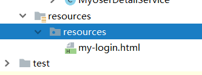
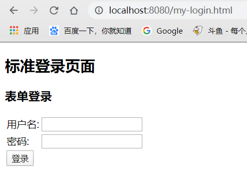
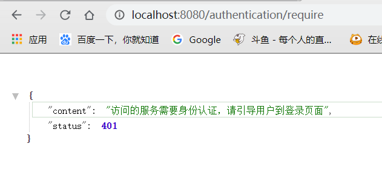
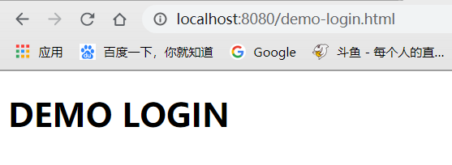
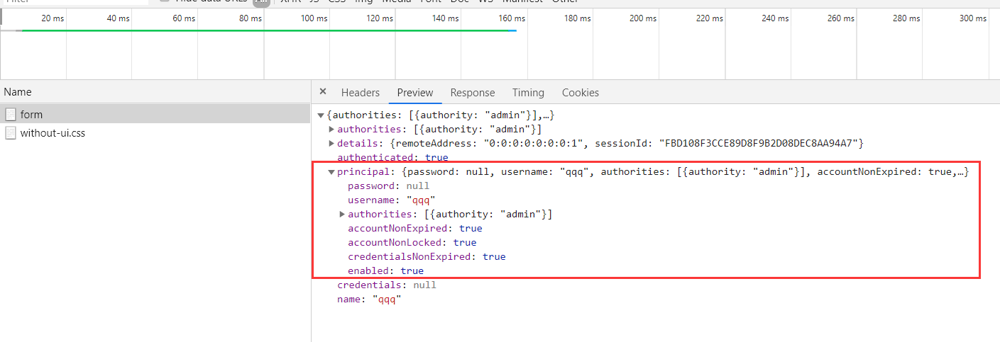
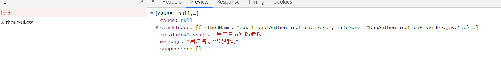

上一节我们简单介绍了如何自定义用户认证策略，包括

- 设置用户名密码，权限
- 设置用户过期，密码过期等策略
- 设置用户密码的加密与加密方式

这一节我们研究如何自定义用户认证的流程，**一个是流程一个是策略**，流程包括：

- 自定义登录页面：之前都是使用SpringSecurity默认的表单页面，这里我们要个性化一个登录页
- 自定义登录成功后处理：有时候我们希望登录成功处理后不只是简单跳转到首页，我们还希望给用户颁发优惠券等等。
- 自定义登录失败后处理：当用户登录失败后，我们有时候也希望记录日志等信息，而不是像上一章节中直接弹出登录错误的提示。

## 自定义登录页

### 简单实现

**1.创建一个html登录页**

```html
<!DOCTYPE html>
<html lang="en">
<head>
    <meta charset="UTF-8">
    <title>登录</title>
</head>
<body>
    <h2>标准登录页面</h2>
    <h3>表单登录</h3>
    <form action="/authentication/form" method="post">
        <table>
            <tr>
                <td>用户名:</td>
                <td><input type="text" name="username"></td>
            </tr>
            <tr>
                <td>密码:</td>
                <td><input type="password" name="password"></td>
            </tr>
            <tr>
                <td colspan="2"><button type="submit">登录</button></td>
            </tr>
        </table>
    </form>
</body>
</html>
```

注意，html要放在`/resources/resources/`文件夹下



**2.configure()修改**

```java
@Override
protected void configure(HttpSecurity http) throws Exception {
    http.formLogin()
            .loginPage("/my-login.html") // 自定义登录页
            .loginProcessingUrl("/authentication/form") // url映射，post表单的url交给表单拦截器处理
            .and()
            .authorizeRequests() // 下面是认证信息
            .antMatchers("/my-login.html").permitAll() // 匹配请求过滤
            .anyRequest() // 所有请求
            .authenticated() // 都需要认证
            .and()
            .csrf().disable(); // 取消csrf安全防护机制

}
```

这里主要添加了：

- `loginPage`：自定义登录页
- `loginProcessingUrl`：将表单请求路径交给表单拦截器处理
- `antMatchers().permitAll()`：释放登录页过滤，不然会一直重定向
- `csrf().disable()`：关闭csrf防护，后面说到Security安全防护会说到

**3.启动测试**



成功跳转自定义登录页，登录后成功访问

#### 问题

- 这里我们请求<http://localhost:8080/helloworld>，一个REST请求，却返回`.html`结尾的登录页，应该返回json格式响应才对，前端根据返回的json信息进行处理
- 这里的登录页是固定的，但是如果各个服务想使用不同的登录页，应该如何个性化呢？

### 代码重构

我们针对两个问题，提出解决方案

- 问题一：将认证转跳到Controller上，简单判断请求是否为html请求，如果是则转跳登录页，如果不是说明REST请求，返回Json数据
- 问题二：将登录页配置化，创建配置文件添加到容器中

#### 添加返回数据包装类

在browser模块下

```java
public class SimpleResponse {

    public SimpleResponse(Object content, Integer status) {
        this.content = content;
        this.status = status;
    }

    private Object content;

    private Integer status;

    public Object getContent() {
        return content;
    }

    public void setContent(Object content) {
        this.content = content;
    }

    public Integer getStatus() {
        return status;
    }

    public void setStatus(Integer status) {
        this.status = status;
    }

}
```

这里简单写了一下，主要返回内容和状态码

#### 创建配置相关类

在core模块下

首先创建`BrowserProperties`，为登录页地址的配置：

```java
public class BrowserProperties {

    private String loginPage="/my-login.html";

    public String getLoginPage() {
        return loginPage;
    }

    public void setLoginPage(String loginPage) {
        this.loginPage = loginPage;
    }

}
```

然后创建`SecurityProperties`，为Security的一些配置，后面需要再进行添加比如二维码配置，第三方登录配置，这里先抽象出来，这也是为什么`BrowserProperties`没有直接添加`@ConfigurationProperties`的原因

```java
@ConfigurationProperties("enbuys.security")
public class SecurityProperties {

    private BrowserProperties browser = new BrowserProperties();

    public BrowserProperties getBrowser() {
        return browser;
    }

    public void setBrowser(BrowserProperties browser) {
        this.browser = browser;
    }
}
```

创建自动装配类`SecurityCoreConfig`，将配置类注入到容器中

```java
@Configuration
@EnableConfigurationProperties(SecurityProperties.class)
public class SecurityCoreConfig {

}
```

这样，我们就可以在配置文件中通过`enbuys.security.browser.loginPage`进行配置登录页面了

#### 在demo模块添加配置并创建登录页

`application.properties`

```properties
enbuys.security.browser.loginPage=/demo-login.html
```

`demo-login.html`

```html
<!DOCTYPE html>
<html lang="en">
<head>
    <meta charset="UTF-8">
    <title>DEMO LOGIN</title>
</head>
<body>
    <H1>DEMO LOGIN</H1>
</body>
</html>
```

需要注意，html需要放在`resources/resources/`文件夹下


#### 创建Controller类统一认证请求

在browser模块下

```java
@RestController
public class BrowserSecurityController {
    private Logger logger = LoggerFactory.getLogger(getClass());
    private RequestCache requestCache = new HttpSessionRequestCache();
    private RedirectStrategy redirectStrategy = new DefaultRedirectStrategy();
    @Autowired
    private SecurityProperties securityProperties;

    @RequestMapping("/authentication/require")
    //@ResponseStatus(code = HttpStatus.UNAUTHORIZED)
    public SimpleResponse requireAuthentication(HttpServletRequest request, HttpServletResponse response)
            throws Exception {
        SavedRequest savedRequest = requestCache.getRequest(request, response);
        if (savedRequest != null) {
            String targetUrl = savedRequest.getRedirectUrl();
            logger.info("引发跳转的请求是:" + targetUrl);
            if (StringUtils.endsWithIgnoreCase(targetUrl, ".html")) {
                redirectStrategy.sendRedirect(request, response, securityProperties.getBrowser().getLoginPage());
            }
        }
        return new SimpleResponse("访问的服务需要身份认证，请引导用户到登录页面",401);
    }
}
```

代码很简单，就是获取请求路径，判断是否以html结尾

- 是则重定向到登录页
- 不是则返回json信息，让前端进行处理

#### 修改BrowserSecurityConfig配置

```java
@Override
protected void configure(HttpSecurity http) throws Exception {
    http.formLogin()
            .loginPage("/authentication/require") // 自定义登录页
            .loginProcessingUrl("/authentication/form") // post表单的url交给表单拦截器处理
            .and()
            .authorizeRequests() // 下面是认证信息
            .antMatchers("/authentication/require",
                    properties.getBrowser().getLoginPage()).permitAll() // 匹配请求过滤
            .anyRequest() // 所有请求
            .authenticated() // 都需要认证
            .and()
            .csrf().disable(); // 取消csrf安全防护机制

}
```

这里需要将登陆请求改为controller中编写的路径，并把配置文件配置的请求进行认证过滤

#### 启动测试

首先请求<http://localhost:8080/helloworld>



正确返回Json数据，说明问题一成功解决

然后请求<http://localhost:8080/helloworld.html>看看是否转跳自定义登录页



转跳到DEMO登陆页，说明问题二也成功解决

## 自定义登录成功后处理

这很简单，SpringSecurity提供了一个`AuthenticationSuccessHandler`接口，只需重新他的唯一抽象方法`onAuthenticationSuccess()`即可

### 创建自定义成功处理类

```java
@Component
public class MyAuthenticationSuccessHandler implements AuthenticationSuccessHandler {

    @Autowired
    private ObjectMapper objectMapper;

    @Override
    public void onAuthenticationSuccess(HttpServletRequest request,
                                        HttpServletResponse response,
                                        Authentication authentication)
            throws IOException, ServletException {
        // 返回Json数据
        response.setContentType("application/json;charset=UTF-8");
        response.getWriter().write(objectMapper.writeValueAsString(authentication));
    }

}
```

这里就是将`Authentication`对象转成json返回

### 在BrowserSecurityConfig中配置

```java
http.formLogin()
        .successHandler(successHandler)
```

### 启动测试



### 代码重构

这里我们要将登录成功后的处理进行配置，根据配置文件来控制是返回JSON信息还是跳转请求页面

**修改Core模块BrowserProperties配置类**

```java
public class BrowserProperties {

    private String loginPage="/my-login.html";

    private String loginResponseType = "redirect";

    public String getLoginResponseType() {
        return loginResponseType;
    }

    public void setLoginResponseType(String loginResponseType) {
        this.loginResponseType = loginResponseType;
    }

    public String getLoginPage() {
        return loginPage;
    }

    public void setLoginPage(String loginPage) {
        this.loginPage = loginPage;
    }

}
```

**修改自定义成功处理类**

```java
@Component
public class MyAuthenticationSuccessHandler extends SimpleUrlAuthenticationSuccessHandler {

    @Autowired
    private ObjectMapper objectMapper;

    @Autowired
    private SecurityProperties properties;

    @Override
    public void onAuthenticationSuccess(HttpServletRequest request,
                                        HttpServletResponse response,
                                        Authentication authentication)
            throws IOException, ServletException {
        // 判断返回json还是redirect
        if(properties.getBrowser().getLoginResponseType().equals("json")){
            // 返回Json数据
            response.setContentType("application/json;charset=UTF-8");
            response.getWriter().write(objectMapper.writeValueAsString(authentication));
        }else{
            // 如果为redirect，调用父类方法跳转
            super.onAuthenticationSuccess(request,response,authentication);
        }
    }

}
```

**`application.properties`中添加配置**

```properties
enbuys.security.browser.loginResponseType=json
```


## 自定义登录失败后处理

和`SuccessHandler`一样，SpringSecurity提供了一个`AuthenticationFailureHandler`接口，只需重新他的唯一抽象方法`onAuthenticationFailure()`即可

### 创建自定义成功处理类

```java
@Component
public class MyAuthenticationFailHandler implements AuthenticationFailureHandler {

    @Autowired
    private ObjectMapper objectMapper;

    @Override
    public void onAuthenticationFailure(HttpServletRequest request,
                                        HttpServletResponse response,
                                        AuthenticationException exception)
            throws IOException, ServletException {
        // 返回Json数据
        response.setStatus(HttpStatus.INTERNAL_SERVER_ERROR.value()); // 500错误信息
        response.setContentType("application/json;charset=UTF-8");
        response.getWriter().write(objectMapper.writeValueAsString(exception));
    }

}
```

这里就是将`AuthenticationException`对象转成json返回，并设置状态码为500

### 在BrowserSecurityConfig中配置

```java
http.formLogin()
       .failureHandler(failHandler)
```

### 启动测试



