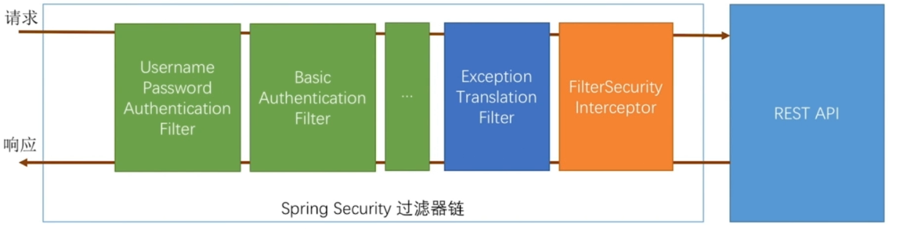
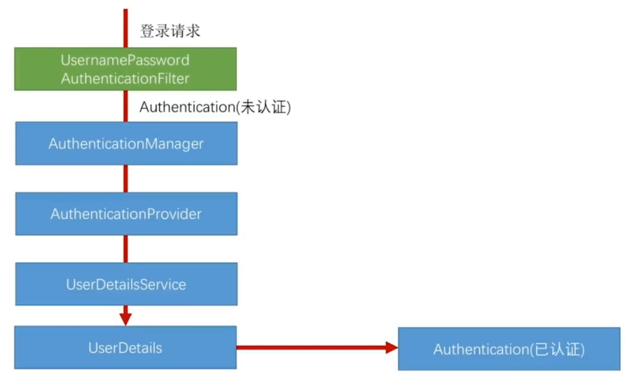
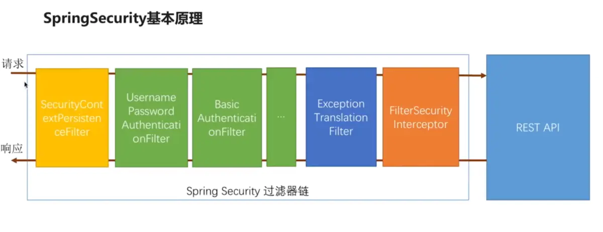
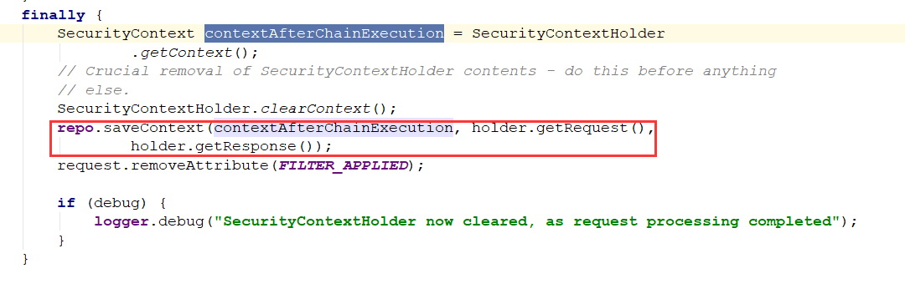
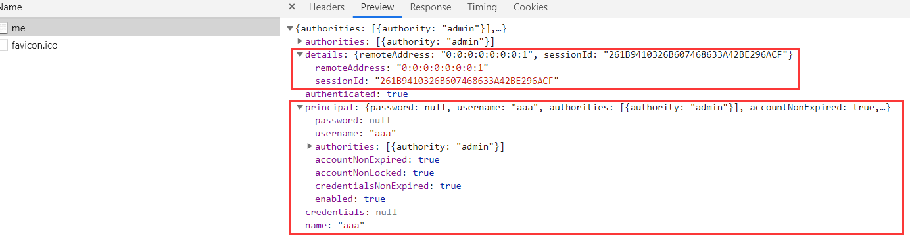
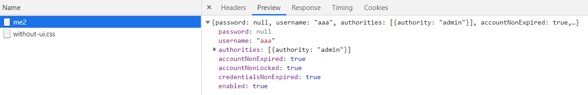
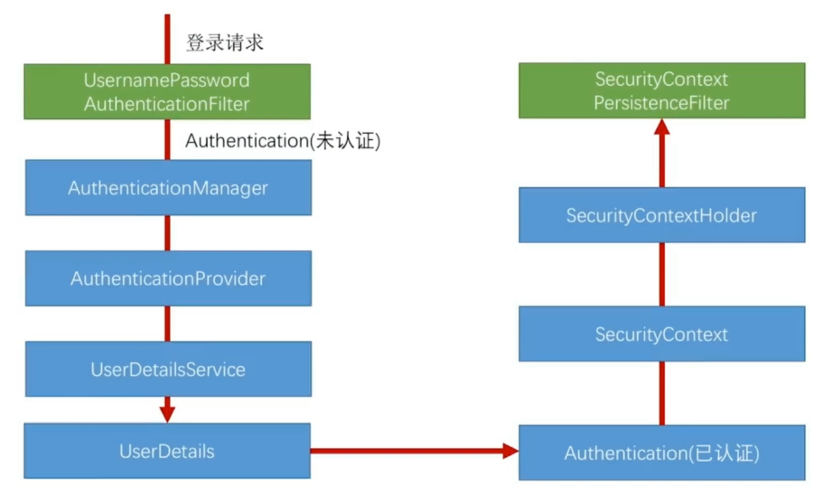

通过之前的学习，我们发现不管对于自定义认证逻辑还是流程，都是对SpringSecurity提供的接口进行实现，比如UserDetailsService，UserDetails等等，都是一些碎片化的东西，这里我们就需要研究SpringSecurity的源码，看看它是如何把这些碎片拼接成一个完整的图片的。

## 认证处理流程

还记得之前那张图



为SpringSecurity过滤器链路，这里我们主要分析的是`UsernamePasswordAuthenticationFilter`，在这个过滤器里都做了什么，涉及了哪些类，这个过滤器也是认证处理的主要类。



我们根据这张图，来进行源码分析查看，并最后做出总结，一开始我们只需简单查看了解这个流程即可。

### UsernamePasswordAuthenticationFilters

#### 创建一个未认证对象

```java
public Authentication attemptAuthentication(HttpServletRequest request,
      HttpServletResponse response) throws AuthenticationException {
   // 创建UsernamePasswordAuthenticationToken对象
   UsernamePasswordAuthenticationToken authRequest = new UsernamePasswordAuthenticationToken(
         username, password);
	/*
    public UsernamePasswordAuthenticationToken(Object principal, Object credentials) {
		super(null);
		this.principal = principal;
		this.credentials = credentials;
		setAuthenticated(false);
	}
	*/
   // Allow subclasses to set the "details" property
   setDetails(request, authRequest);

   return this.getAuthenticationManager().authenticate(authRequest);
}
```

我们从`UsernamePasswordAuthenticationFilter`类中方法上可以看到

首先创建一个`UsernamePasswordAuthenticationToken`对象，通过构造方法可知，`setAuthenticated(false)`是未认证状态

然后`setDetails()`，为对象设置请求信息

最后`getAuthenticationManager().authenticate(authRequest)`，调用`AuthenticationManager`的认证方法进行认证

### AuthenticationManager

#### 找到正确的AuthenticationProvider

`AuthenticationManager`是一个接口，实现是由`ProviderManager`进行实现，`ProvideManager`负责管理`AuthenticationProvider`，看一下源码：

```java
public Authentication authenticate(Authentication authentication)
      throws AuthenticationException {
    Class<? extends Authentication> toTest = authentication.getClass();
  	···
   // 循环获取所有的Provider
   for (AuthenticationProvider provider : getProviders()) {
       // 判断这个Provider是否能处理认证对象
      if (!provider.supports(toTest)) {
         continue;
      }
      try {
          // 调用Provider的认证方法进行认证
         result = provider.authenticate(authentication);

         if (result != null) {
            copyDetails(authentication, result);
            break;
         }
      }
   }
    ···
}
```

这里为什么要循环所有的Provider呢？，

因为对于`Provider`有`SocialAuthenticationProvider`（第三方接入的时候专用），`AbstractUserDetailsAuthenticationProvider`（我们配置的时候用到的）等等。

其实真正执行的只有一个provider，那么究竟会选择哪一个provider，我们看到有一个`supports`方法。也就是根据上一步中的`authentication`的类型来做判断。

找到正确的Provider后，调用Provider的认证方法对未认证对象进行认证

### AuthenticationProvider

#### 进行认证

这里因为我们使用用户名密码的表单登录，所以实现类为`AbstractUserDetailsAuthenticationProvider`：

```java
public Authentication authenticate(Authentication authentication)
      throws AuthenticationException {
  ···
   // 获取缓存中的对象
   UserDetails user = this.userCache.getUserFromCache(username);
    // 如果不存在，即需要登录认证
   if (user == null) {
      cacheWasUsed = false;
      try {
          // 获取UserDetails对象
         user = retrieveUser(username,
               (UsernamePasswordAuthenticationToken) authentication);
          /* 调用UserDetailsService接口，即我们的实现类，获取UserDetails对象
          protected final UserDetails retrieveUser(String username,
			UsernamePasswordAuthenticationToken authentication)
			throws AuthenticationException {
			UserDetails loadedUser = this.getUserDetailsService().loadUserByUsername(username);
			return loadedUser;
          }
          */
      }
      ···
   }

   try {
      // 前置判断
      preAuthenticationChecks.check(user);
      // 匹配用户名密码
      additionalAuthenticationChecks(user,
            (UsernamePasswordAuthenticationToken) authentication);
   }
   
	···
   // 后置判断
   postAuthenticationChecks.check(user);
	···
   // 创建认证对象
   return createSuccessAuthentication(principalToReturn, authentication, user);
}
```

这里我把源码精简了一下，可以清晰看出认证过程

首先获取`UserDetails`对象，这就是我们实现`UserDetailsService`接口编写的那个对象

##### 调用前置判断

```java
private class DefaultPreAuthenticationChecks implements UserDetailsChecker {
   public void check(UserDetails user) {
      if (!user.isAccountNonLocked()) {
         logger.debug("User account is locked");

         throw new LockedException(messages.getMessage(
               "AbstractUserDetailsAuthenticationProvider.locked",
               "User account is locked"));
      }

      if (!user.isEnabled()) {
         logger.debug("User account is disabled");

         throw new DisabledException(messages.getMessage(
               "AbstractUserDetailsAuthenticationProvider.disabled",
               "User is disabled"));
      }

      if (!user.isAccountNonExpired()) {
         logger.debug("User account is expired");

         throw new AccountExpiredException(messages.getMessage(
               "AbstractUserDetailsAuthenticationProvider.expired",
               "User account has expired"));
      }
   }
}
```

这里就是判断我们之前说的那几个布尔属性，是否被锁，是否可用，账户是否过期

##### 匹配用户名密码

```java
protected void additionalAuthenticationChecks(UserDetails userDetails,
      UsernamePasswordAuthenticationToken authentication)
      throws AuthenticationException {
   // 使用passwordEncoder的matches方法进行匹配验证
   if (!passwordEncoder.matches(presentedPassword, userDetails.getPassword())) {
      logger.debug("Authentication failed: password does not match stored value");

      throw new BadCredentialsException(messages.getMessage(
            "AbstractUserDetailsAuthenticationProvider.badCredentials",
            "Bad credentials"));
   }
}
```

##### 后置判断

```java
private class DefaultPostAuthenticationChecks implements UserDetailsChecker {
   public void check(UserDetails user) {
      if (!user.isCredentialsNonExpired()) {
         logger.debug("User account credentials have expired");

         throw new CredentialsExpiredException(messages.getMessage(
               "AbstractUserDetailsAuthenticationProvider.credentialsExpired",
               "User credentials have expired"));
      }
   }
}
```

判断用户是否过期

##### 创建认证对象

```java
protected Authentication createSuccessAuthentication(Object principal,
      Authentication authentication, UserDetails user) {
   UsernamePasswordAuthenticationToken result = new UsernamePasswordAuthenticationToken(
         principal, authentication.getCredentials(),
         authoritiesMapper.mapAuthorities(user.getAuthorities()));
   result.setDetails(authentication.getDetails());

   return result;
}
```

这里调用构造函数时传了三个参数

```java
public UsernamePasswordAuthenticationToken(Object principal, Object credentials,
      Collection<? extends GrantedAuthority> authorities) {
   super(authorities);
   this.principal = principal;
   this.credentials = credentials;
   super.setAuthenticated(true); // must use super, as we override
}
```

在代码中可以清楚的看到，`super.setAuthenticated(true);`说明为认证用户

### AbstractAuthenticationProcessingFilter

#### 失败或成功处理类调用

这个类是`UsernamePasswordAuthenticationFilter`的父类，`doFilter()`方法是由他实现的，所以创建完认证用户返回后，会执行此类的doFilter方法

```java
public void doFilter(ServletRequest req, ServletResponse res, FilterChain chain)
      throws IOException, ServletException {
    catch (AuthenticationException failed) {
        // Authentication failed
        unsuccessfulAuthentication(request, response, failed);

        return;
    }

    // Authentication success
    if (continueChainBeforeSuccessfulAuthentication) {
        chain.doFilter(request, response);
    }

    successfulAuthentication(request, response, chain, authResult);
}
```

代码很简单，就是判断用户是否认证，如果没有调用`unsuccessfulAuthentication()`方法，如果认证成功调用`successfulAuthentication()`方法

##### unsuccessfulAuthentication()

```java
protected void unsuccessfulAuthentication(HttpServletRequest request,
      HttpServletResponse response, AuthenticationException failed)
      throws IOException, ServletException {
   ···
   failureHandler.onAuthenticationFailure(request, response, failed);
}
```

这里就是我们自定义的认证失败处理类`failureHandler`的调用

##### successfulAuthentication()

由上面可以推断出，这个类其实就是调用我们自定义的认证成功处理类`successHandler`

```java
protected void successfulAuthentication(HttpServletRequest request,
      HttpServletResponse response, FilterChain chain, Authentication authResult)
      throws IOException, ServletException {

   ···
   successHandler.onAuthenticationSuccess(request, response, authResult);
}
```

### 总结


如图，走了这些方法，主要步骤为：

1. `UsernamePasswordAuthenticationFilters`创建一个未认证对象，将对象信息进行初始化
2. `AuthenticationManager`循环查找对应的`Provider`，调用`Provider`的`authenticate`对未认证对象认证
3. `AuthenticationProvider`对未认证对象进行校验，通过调用`UserDetailsService`方法，获取`UserDetails`对象，进行判断，如果成功，创建一个已认证对象，返回`UsernamePasswordAuthenticationFilters`
4. `AbstractAuthenticationProcessingFilter`进行`doFilter()`释放请求，对认证成功`Handler`或认证失败`Handler`进行调用

由此，我们上两节研究的几个接口就串起来了，主要有：`UserDetailsService`，`UserDetails`，`successHandler`，`failureHandler`

## 认证结果在多个请求间共享

将认证结果在多个请求间共享，第一想到的就是放到上下文中，其实就是这样，我们可以看一下认证成功后调用的方法：

```java
protected void successfulAuthentication(HttpServletRequest request,
      HttpServletResponse response, FilterChain chain, Authentication authResult)
      throws IOException, ServletException {

   if (logger.isDebugEnabled()) {
      logger.debug("Authentication success. Updating SecurityContextHolder to contain: "
            + authResult);
   }

   SecurityContextHolder.getContext().setAuthentication(authResult);

   rememberMeServices.loginSuccess(request, response, authResult);

   // Fire event
   if (this.eventPublisher != null) {
      eventPublisher.publishEvent(new InteractiveAuthenticationSuccessEvent(
            authResult, this.getClass()));
   }

   successHandler.onAuthenticationSuccess(request, response, authResult);
}
```

在这里可以看到`SecurityContextHolder.getContext().setAuthentication(authResult);`，将结果放到了`SecurityContext`上下文中，并且最后给`SecurityContextHolder`

`SecurityContextHolder`是一个`ThreadLocal`的包装类，即对多线程进行处理的类。

这样下次请求过来的时候，直接从context中取就可以，那么，是谁把认证信息放到context中的呢？

### SecurityContextPersistenceFilter



就是`SecurityContextPersistenceFilter`这个过滤器



在Filter的最后，如果存在认证后用户信息，就一定会把context存入到session中，这样如果用户已经登录过一次，session中可以拿到Context，context中就可以拿到`UsernamePasswordAuthenticationToken`

当然如果没有用户信息，就直接跳过

## 获取认证用户信息

```java
@RestController
@RequestMapping("/user")
public class UserController {

    @GetMapping("/me")
    public Object getCurrentUser(Authentication authentication){
        return authentication;
    }

    @GetMapping("/me2")
    public Object getCurrentUser2(@AuthenticationPrincipal UserDetails userDetails){
        return userDetails;
    }
}
```

这里有两种方法，一种直接从容器中获取Authentication，得到的是：



详细信息以及请求的一些信息，如果不想给别人这么详细的信息就可以使用第二种方式

只获取用户的信息，即Principal中的信息



## 总结

用一张图来总结：

