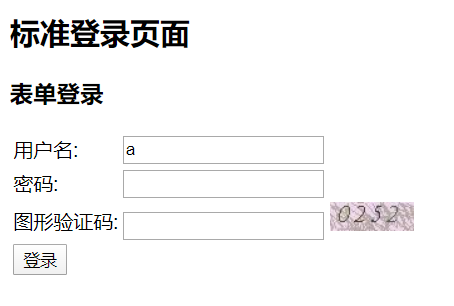
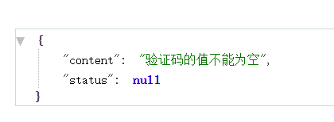
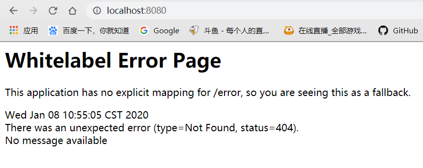
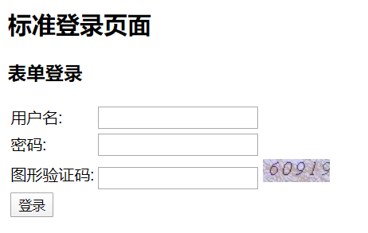
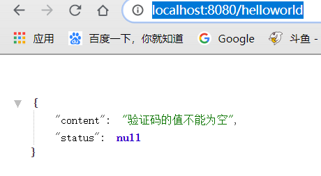
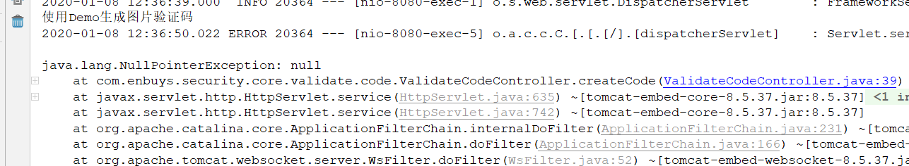
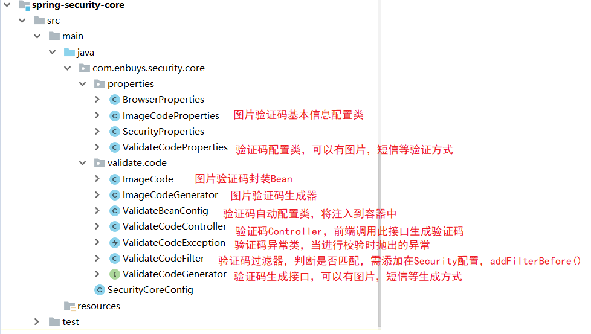

这一节，我们要做一个登录图形验证码校验的功能，为了实现可配置，我们将使用大量接口以及配置类，极大程度降低耦合性，做一个可重用的功能

## 生成图形验证码接口

### 创建验证码信息封装类

```java
public class ImageCode {

    private BufferedImage image;

    private String code;

    private LocalDateTime expireTime;

    public ImageCode(BufferedImage image, String code, int expireIn) {
        this.image = image;
        this.code = code;
        this.expireTime = LocalDateTime.now().plusSeconds(expireIn);
    }

    public ImageCode(BufferedImage image, String code, LocalDateTime expireTime) {
        this.image = image;
        this.code = code;
        this.expireTime = expireTime;
    }

    public boolean isExpired() {
        return LocalDateTime.now().isAfter(expireTime);
    }

    public BufferedImage getImage() {
        return image;
    }

    public void setImage(BufferedImage image) {
        this.image = image;
    }

    public String getCode() {
        return code;
    }

    public void setCode(String code) {
        this.code = code;
    }

    public LocalDateTime getExpireTime() {
        return expireTime;
    }

    public void setExpireTime(LocalDateTime expireTime) {
        this.expireTime = expireTime;
    }

}
```

### 创建验证码生成类

```java
@RestController
public class ValidateCodeController {

    public static final String SESSION_KEY = "SESSION_KEY_IMAGE_CODE";

    private SessionStrategy sessionStrategy = new HttpSessionSessionStrategy();

    @GetMapping("/code/image")
    public void createCode(HttpServletRequest request, HttpServletResponse response) throws IOException{
        ImageCode imageCode = createImageCode(request);
        sessionStrategy.setAttribute(new ServletWebRequest(request),SESSION_KEY,imageCode);
        ImageIO.write(imageCode.getImage(),"JPEG",response.getOutputStream());
    }

    public ImageCode createImageCode(HttpServletRequest request) {

        int width = 67;
        int height = 23;
        BufferedImage image = new BufferedImage(width, height, BufferedImage.TYPE_INT_RGB);

        Graphics g = image.getGraphics();

        Random random = new Random();

        g.setColor(getRandColor(200, 250));
        g.fillRect(0, 0, width, height);
        g.setFont(new Font("Times New Roman", Font.ITALIC, 20));
        g.setColor(getRandColor(160, 200));
        for (int i = 0; i < 155; i++) {
            int x = random.nextInt(width);
            int y = random.nextInt(height);
            int xl = random.nextInt(12);
            int yl = random.nextInt(12);
            g.drawLine(x, y, x + xl, y + yl);
        }

        String sRand = "";
        for (int i = 0; i < 4; i++) {
            String rand = String.valueOf(random.nextInt(10));
            sRand += rand;
            g.setColor(new Color(20 + random.nextInt(110), 20 + random.nextInt(110), 20 + random.nextInt(110)));
            g.drawString(rand, 13 * i + 6, 16);
        }

        g.dispose();

        return new ImageCode(image, sRand, 60);

    }

    /**
     * 生成随机背景条纹
     *
     * @param fc
     * @param bc
     * @return
     */
    private Color getRandColor(int fc, int bc) {
        Random random = new Random();
        if (fc > 255) {
            fc = 255;
        }
        if (bc > 255) {
            bc = 255;
        }
        int r = fc + random.nextInt(bc - fc);
        int g = fc + random.nextInt(bc - fc);
        int b = fc + random.nextInt(bc - fc);
        return new Color(r, g, b);
    }
}
```

这里配置在Controller里，这样哪里需要验证码，只需请求这个API即可

### 修改登录页添加二维码

```html
<tr>
    <td>图形验证码:</td>
    <td><input type="text" name="imageCode"> </td>
</tr>
```

## 认证流程中加入图形验证码校验

这里我们需要先创建一个自定义Exception类，用来处理图像验证码匹配的异常

### 创建图形验证码Exception

```java
public class ValidateCodeException extends AuthenticationException {

    private static final long serialVersionUID = -7285211528095468156L;

    public ValidateCodeException(String msg) {
        super(msg);
    }

}
```


然后添加一个自定义过滤器，用来拦截图像验证码校验

### 创建图像验证码拦截器

这里继承`OncePerRequestFilter`，为只执行一次的过滤器

```java
public class ValidateCodeFilter extends OncePerRequestFilter {

    private AuthenticationFailureHandler authenticationFailureHandler;
    private SessionStrategy sessionStrategy = new HttpSessionSessionStrategy();

    /**
     * 过滤调用方法
     * @param request
     * @param response
     * @param filterChain
     * @throws ServletException
     * @throws IOException
     */
    @Override
    protected void doFilterInternal(HttpServletRequest request, HttpServletResponse response, FilterChain filterChain) throws ServletException, IOException {
        //判断请求路径与请求方式
        if(StringUtils.equals("/authentication/form",request.getRequestURI()) &&
                StringUtils.endsWithIgnoreCase("post",request.getMethod())){
            try {
                validate(new ServletWebRequest(request));
            }catch (ValidateCodeException e){
                // 调用认证失败处理
                authenticationFailureHandler.onAuthenticationFailure(request,response,e);
                return;
            }
        }
        doFilter(request,response,filterChain);
    }

    /**
     * 校验验证码
     * @param request
     */
    private void validate(ServletWebRequest request) throws ServletRequestBindingException {
        ImageCode codeInSession = (ImageCode) sessionStrategy.getAttribute(request, ValidateCodeController.SESSION_KEY);

        String codeInRequest = ServletRequestUtils.getStringParameter(request.getRequest(), "imageCode");

        if (StringUtils.isBlank(codeInRequest)) {
            throw new ValidateCodeException("验证码的值不能为空");
        }

        if (codeInSession == null) {
            throw new ValidateCodeException("验证码不存在");
        }

        if (codeInSession.isExpired()) {
            sessionStrategy.removeAttribute(request, ValidateCodeController.SESSION_KEY);
            throw new ValidateCodeException("验证码已过期");
        }

        if (!StringUtils.equals(codeInSession.getCode(), codeInRequest)) {
            throw new ValidateCodeException("验证码不匹配");
        }

        sessionStrategy.removeAttribute(request, ValidateCodeController.SESSION_KEY);

    }

    public AuthenticationFailureHandler getAuthenticationFailureHandler() {
        return authenticationFailureHandler;
    }

    public void setAuthenticationFailureHandler(AuthenticationFailureHandler authenticationFailureHandler) {
        this.authenticationFailureHandler = authenticationFailureHandler;
    }
}
```

这里如果匹配失败，直接调用认证失败处理，然后return防止接下来的拦截器继续执行

### 修改Security配置

最后我们只需在`BrowserSecurityConfig`中添加一个前置过滤器即可，这里需要添加在`UsernamePassword`过滤器之前验证

```java
@Override
protected void configure(HttpSecurity http) throws Exception {
    ValidateCodeFilter validateCodeFilter = new ValidateCodeFilter();
    validateCodeFilter.setAuthenticationFailureHandler(failHandler);
    // 在UsernamePassword过滤器之前验证
    http.addFilterBefore(validateCodeFilter,UsernamePasswordAuthenticationFilter.class)
        .formLogin()
        .loginPage("/authentication/require") // 自定义登录页
        .loginProcessingUrl("/authentication/form") // url映射，post表单的url交给表单拦截器处理
        .successHandler(successHandler)
        .failureHandler(failHandler)
        .and()
        .authorizeRequests() // 下面是认证信息
        .antMatchers("/authentication/require","/code/image",
                properties.getBrowser().getLoginPage()).permitAll() // 匹配请求过滤
        .anyRequest() // 所有请求
        .authenticated() // 都需要认证
        .and()
        .csrf().disable(); // 取消csrf安全防护机制

}
```

### 启动测试



首先在login页面可以看到验证码，然后不输入验证码直接登录



提示验证码不能为空，输入正确的验证码



登录成功，只是我们没有默认请求，所以才404

## 代码重构

这里不难发现上面代码的几个缺点

- 图片验证码不可配置，长宽位数都是固定的
- 拦截验证的路径写死，不可配置
- 生成验证码逻辑写死，如果想用自己的生成逻辑覆盖困难

接着我们就将代码进行重构，使得变的更加可重用化

### 验证码参数可配置

思路：将几个参数封装成`Properties`配置类，添加到总的`Security`配置中，在`application.properties`中配置，修改生成二维码中的几个参数，使用配置中的参数

**1.创建ImageCodeProperties**

为长宽，位数，超时时间的基本配置

```java
public class ImageCodeProperties {

    private int width = 67;
    private int height = 23;
    private int length = 4; // 位数
    private int expireIn = 60; // 超时时间
    
    ···get/set
}
```

**2.创建ValidateCodeProperties**

因为后面可能会加上短信验证码等其他验证码，所以对验证码再进行封装一层

```java
public class ValidateCodeProperties {

    private ImageCodeProperties image = new ImageCodeProperties();

    public ImageCodeProperties getImage() {
        return image;
    }

    public void setImage(ImageCodeProperties image) {
        this.image = image;
    }
}
```

**3.修改SecurityProperties**

```java
@ConfigurationProperties("enbuys.security")
public class SecurityProperties {

    private BrowserProperties browser = new BrowserProperties();

    private ValidateCodeProperties code = new ValidateCodeProperties();

    public BrowserProperties getBrowser() {
        return browser;
    }

    public void setBrowser(BrowserProperties browser) {
        this.browser = browser;
    }

    public ValidateCodeProperties getCode() {
        return code;
    }

    public void setCode(ValidateCodeProperties code) {
        this.code = code;
    }
}
```

添加`ValidateCodeProperties`

**4.修改图像验证码生成逻辑**

```java
@Autowired
private SecurityProperties securityProperties;

public ImageCode createImageCode(HttpServletRequest request) {

    int width = securityProperties.getCode().getImage().getWidth();
    int height = securityProperties.getCode().getImage().getHeight();
    
   ···
    for (int i = 0; i < securityProperties.getCode().getImage().getLength(); i++) {
       ···
    }

    g.dispose();

    return new ImageCode(image, sRand, securityProperties.getCode().getImage().getExpireIn());

}
```

这里一些代码进行了省略，主要是长宽等基础信息从配置中读取

**5.application.properties中添加配置**

```properties
enbuys.security.code.image.length=5
```

**6.启动测试**



验证码变成了5位，说明重构成功


### 验证拦截路径可配置

思路：在配置类中添加`url`参数，配置文件中使用逗号分隔，拦截时进行分隔，循环判断次路径是否匹配

**1.修改ImageCodeProperties**

添加url参数

```java
public class ImageCodeProperties {

    ···
    private String url;
    ···
}
```

**2.修改拦截器**

```java
public class ValidateCodeFilter extends OncePerRequestFilter {
    private SecurityProperties securityProperties;
    private AuthenticationFailureHandler authenticationFailureHandler;
    private SessionStrategy sessionStrategy = new HttpSessionSessionStrategy();
    private AntPathMatcher pathMatcher = new AntPathMatcher();
    @Override
    protected void doFilterInternal(HttpServletRequest request, HttpServletResponse response, FilterChain filterChain) throws ServletException, IOException {
        // 将拦截路径切割处理
        String url = securityProperties.getCode().getImage().getUrl();
        String[] strings = url.split(",");
        boolean action = false;
        for(String s :strings){
            if (pathMatcher.match(s, request.getRequestURI())) {
                action = true;
            }
        }
        //判断请求路径与请求方式
        if(action){
            try {
                validate(new ServletWebRequest(request));
            }catch (ValidateCodeException e){
                authenticationFailureHandler.onAuthenticationFailure(request,response,e);
                return;
            }
        }
        doFilter(request,response,filterChain);
    }
}
```

这里还需要在Security配置类中添加SecurityProperties

```java
@Override
protected void configure(HttpSecurity http) throws Exception {
	// 添加SecurityProperties
    validateCodeFilter.setSecurityProperties(properties);
}
```

**3.在配置文件中添加url配置**

```properties
enbuys.security.code.image.url=/user/*,/helloworld,/authentication/form
```

**4.启动测试**

访问<http://localhost:8080/helloworld>



发现提示验证码不能为空，说明拦截成功，即配置成功


### 验证码生成逻辑可配置

思路：将生产验证码Controller中的生成方法抽离，配置成接口的形式，然后将其注入容器中，并添加上`@ConditionOnMissingBean`注解，这样如果想自定义生成逻辑，只需向容器中添加此组件即可

**1.创建ImageCodeGenerator**

```java
public class ImageCodeGenerator implements ValidateCodeGenerator {

    @Autowired
    private SecurityProperties securityProperties;

    ···· // 生成就是直接把Controller代码复制过来

}
```

**2.创建ValidateCodeGenerator接口**

```java
public interface ValidateCodeGenerator {
    ImageCode generate(ServletWebRequest request);
}
```

**3.创建ValidateBeanConfig配置类，将接口注入到容器**

```java
@Configuration
public class ValidateBeanConfig {

    @Bean
    @ConditionalOnMissingBean(name = "imageCodeGenerator")
    public ValidateCodeGenerator imageCodeGenerator(){
        ImageCodeGenerator codeGenerator = new ImageCodeGenerator();
        return codeGenerator;
    }
}
```

这里当想要自己写一个图片验证生成逻辑时，只需向容器中添加`imageCodeGenerator`的组件即可

**4.修改ValidateCodeController类**

```java
@RestController
public class ValidateCodeController {

    public static final String SESSION_KEY = "SESSION_KEY_IMAGE_CODE";
    private SessionStrategy sessionStrategy = new HttpSessionSessionStrategy();

    @Autowired
    private ValidateCodeGenerator imageCodeGenerator;

    @GetMapping("/code/image")
    public void createCode(HttpServletRequest request, HttpServletResponse response) throws IOException{
        ServletWebRequest servletWebRequest = new ServletWebRequest(request);
        // 调用图片验证码生成接口
        ImageCode imageCode = imageCodeGenerator.generate(servletWebRequest);
        sessionStrategy.setAttribute(servletWebRequest,SESSION_KEY,imageCode);
        ImageIO.write(imageCode.getImage(),"JPEG",response.getOutputStream());
    }
}
```

注入`ValidateCodeGenerator`调用方法实现生成验证码

**5.在Demo模块下创建DemoImageCodeGenerator**

这里我们在Demo模块下创建一个图片验证码生成器，看看会不会覆盖默认的

```java
@Component("imageCodeGenerator")
public class DemoImageCodeGenerator implements ValidateCodeGenerator {
    @Override
    public ImageCode generate(ServletWebRequest request) {
        System.out.println("使用Demo生成图片验证码");
        return null;
    }
}
```

**6.启动测试**



访问时可以看到控制台正确打印信息，因为返回null所以报了空指针异常

### 总结



最后工程目录如下，可配置项为：

```properties
enbuys.security.code.image.width=100
enbuys.security.code.image.height=30
enbuys.security.code.image.length=5
enbuys.security.code.image.expireIn=60
enbuys.security.code.image.url=/user/*,/helloworld,/authentication/form
```

以及自定义图片验证码生成接口，在容器中添加

```java
@Component("imageCodeGenerator")
public class DemoImageCodeGenerator implements ValidateCodeGenerator {
```

