## 记住我基本原理

记住我这个功能应该都不陌生，就是保存用户登录信息


在SpringSecurity中实现原理是：

- 第一次，浏览器发出认证请求，由`UsernamePassword`拦截器认证后，会走到`RememberMeService`类
- `RememberMeService`使用`TokenRepository`做了两件事
  - 将用户信息以Token对象保存到数据库中（Mysql，Redis等等）
  - 将Token放到Cookie中返回给浏览器
- 第二次浏览器请求后，会被`RememberMeAuthenticationFilter`拦截，这个拦截器会当前面一系列绿色拦截器拦截过后才会拦截
- `RememberMeAuthenticationFilter`请求`RemenberMeService`，将请求信息传递给他
- `RememberMeService`先读取Cookie中的Token然后使用`TokenRepository`向DB查找Token
  - 如果查到了调用`UserDetailsService`获取用户信息
  - 没查到则抛出异常，让用户去登录页

## 记住我代码实现

对于SpringSecurity来说，实现记住我非常简单

### 修改登录页面

```html
<tr>
    <td colspan="2"><input name="remember-me" type="checkbox" value="true">记住我</input></td>
</tr>
```

**注意，这里name必须写`remember-me`，才能被SpringSecurity获取**

### 配置类添加存活时间

```java
public class BrowserProperties {
	···
    private Integer rememberMeSeconds = 60 * 60;
    ···
}
```

### 向容器中注入TokenRepository

在BrowserSecurityConfig中进行注入

```java
@Configuration
public class BrowserSecurityConfig extends WebSecurityConfigurerAdapter {
    
    @Autowired
    private DataSource dataSource; // 数据源，从配置文件中取
    @Bean
    public PersistentTokenRepository tokenRepository(){
        JdbcTokenRepositoryImpl tokenRepository = new JdbcTokenRepositoryImpl();
        tokenRepository.setDataSource(dataSource); // 设置数据源
        tokenRepository.setCreateTableOnStartup(true); // 第一次需要建表
        return tokenRepository;
    }
}
```

这里我们使用`PersistentTokenRepository`来进行Token的控制，并使用Jdbc即关系型数据库进行Token的持久化

数据源就是`application.properties`配置文件中配置的

因为对于这个实现类需要单独的表进行操作，对此可以启动时自动建表，**当然第二次启动需要将其设为false或注释掉**。也可以复制SQL自行建表

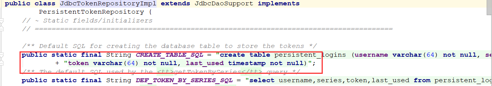

### 配置Security

```java
@Configuration
public class BrowserSecurityConfig extends WebSecurityConfigurerAdapter {
    
    @Autowired
    private UserDetailsService myUserDetailService;
    
	@Override
    protected void configure(HttpSecurity http) throws Exception {
        ValidateCodeFilter validateCodeFilter = new ValidateCodeFilter();
        validateCodeFilter.setAuthenticationFailureHandler(failHandler);
        validateCodeFilter.setSecurityProperties(properties);
        http.addFilterBefore(validateCodeFilter,UsernamePasswordAuthenticationFilter.class)
            .formLogin() // 表单配置
                .loginPage("/authentication/require") // 自定义登录页
                .loginProcessingUrl("/authentication/form") // url映射，post表单的url交给表单拦截器处理
                .successHandler(successHandler)
                .failureHandler(failHandler)
                .and()
            .rememberMe() // 记住我配置
                .tokenRepository(tokenRepository())
                .tokenValiditySeconds(properties.getBrowser().getRememberMeSeconds())
            	.userDetailsService(myUserDetailService)
                .and()
            .authorizeRequests() // 下面是认证信息
                .antMatchers("/authentication/require","/code/image",
                        properties.getBrowser().getLoginPage()).permitAll() // 匹配请求过滤
                .anyRequest() // 所有请求
                .authenticated() // 都需要认证
                .and()
            .csrf().disable(); // 取消csrf安全防护机制

    }
}
```

主要代码就是以下三行：

```java
.rememberMe() // 记住我配置
    .tokenRepository(tokenRepository())
    .tokenValiditySeconds(properties.getBrowser().getRememberMeSeconds())
    .userDetailsService(myUserDetailService)
```

设置`TokenRepository`实现类以及存活时间

### 启动测试

首先看数据库

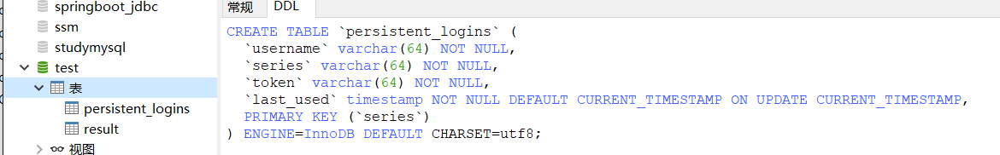
可以发现，自动创建了一张`persistent_logins`表，然后进行登录

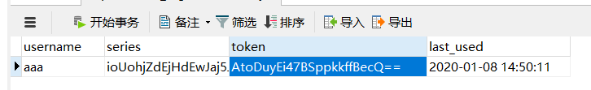

登录成功后可以发现表里多了一条数据，这时我们重启项目，清除Session，看看是否可以实现保存登录状态，

直接访问<http://localhost:8080/user/me2>

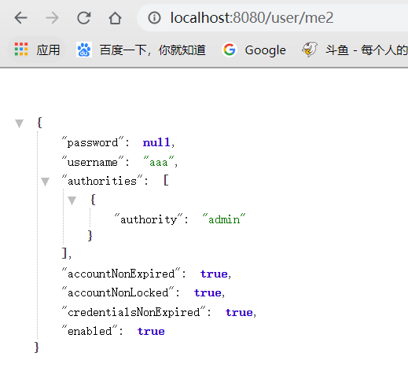

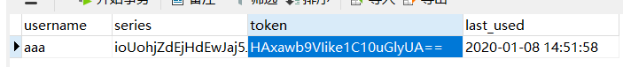

成功访问，并且最后使用时间修改了

## 记住我源码解析

### 第一次登录

源码解析前，我们先分析下从哪里下手，第一次登录，那么一定时全部认证过会，才会调用之前说的`RememberMeService`进行Token保存，所以先去看看认证成功后处理器方法

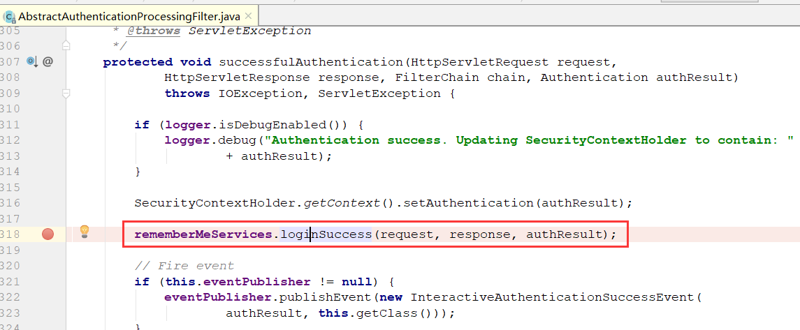

果然有一个`loginSuccess()`方法，那我们就从这里入手，Debug解析源码

```java
rememberMeServices.loginSuccess(request, response, authResult);
```

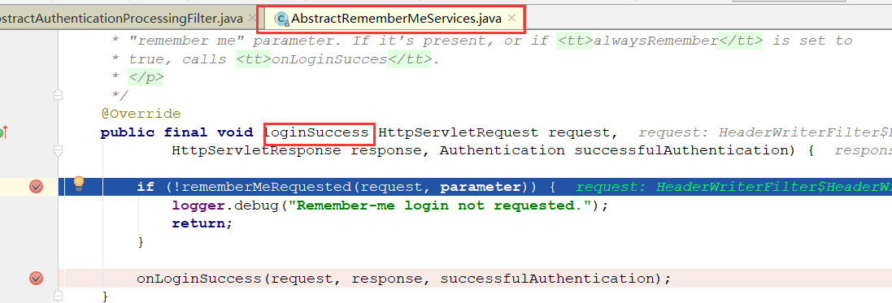

首先进入到`AbstractRememberMeServices`实现类的方法里，这里可以看到显示判断请求参数是否相同，我们看看这个参数默认是什么：

```java
private String parameter = DEFAULT_PARAMETER;
public static final String DEFAULT_PARAMETER = "remember-me";
```

就是我们知情权修改登录页面时，说的那个name值，必须固定为这个才可以，匹配上后，接着跟进`onLoginSuccess(request, response, successfulAuthentication);`方法

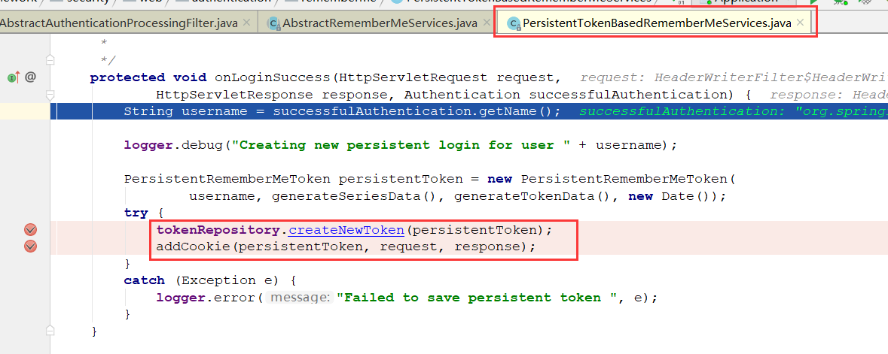

接着进入了`PersistentTokenBasedRememberMeServices`实现类，看到了两个重要方法

```java
// 创建一个新Token，保存到数据库中
tokenRepository.createNewToken(persistentToken);
// 在Cookie中添加Token
addCookie(persistentToken, request, response);
```

就是我们之前放原理图时做的两件事，这样第一次登录就基本走完了。

### 第二次登录

第二次登录就需要查看之前说的那个拦截器了`RememberMeAuthenticationFilter`，从他入手

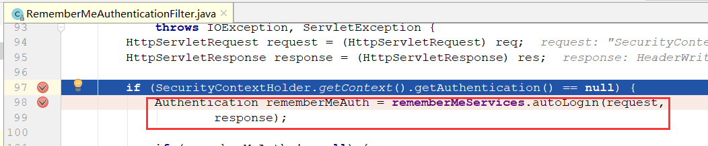

进入到拦截器中，首先判断上下文中并没有认证用户，然后去调用`RememberMeService`的`autoLogin()`方法

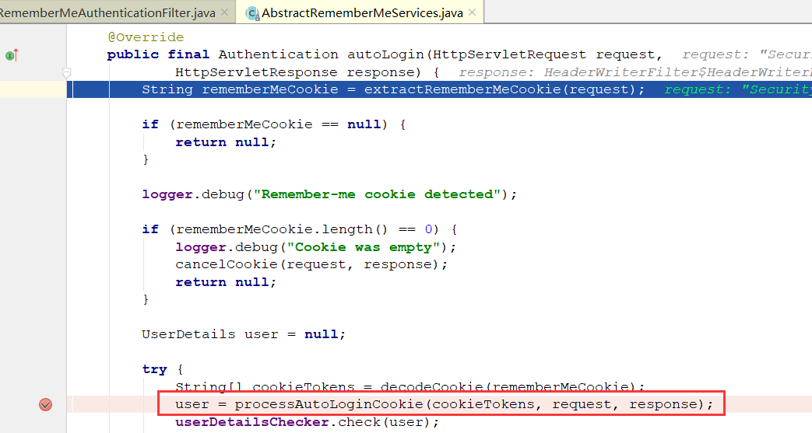

进入此方法，通过观察，最重要的方法应该就是这个`processAutoLoginCookie()`，处理自动登录Cookie，猜测应该是将Cookie中Token信息取出查库的，我们进入看看

```java
protected UserDetails processAutoLoginCookie(String[] cookieTokens,
      HttpServletRequest request, HttpServletResponse response) {
   ···
   // 使用tokenRepository向数据库查找Token
   PersistentRememberMeToken token = tokenRepository
         .getTokenForSeries(presentedSeries);
   // 如果不存在，直接抛出异常
   if (token == null) {
      // No series match, so we can't authenticate using this cookie
      throw new RememberMeAuthenticationException(
            "No persistent token found for series id: " + presentedSeries);
   }
	// 如果存在，判断时间是否过期
   if (token.getDate().getTime() + getTokenValiditySeconds() * 1000L < System
         .currentTimeMillis()) {
      throw new RememberMeAuthenticationException("Remember-me login has expired");
   }
	// 创建一个新Token并更新
   PersistentRememberMeToken newToken = new PersistentRememberMeToken(
         token.getUsername(), token.getSeries(), generateTokenData(), new Date());
   try {
      tokenRepository.updateToken(newToken.getSeries(), newToken.getTokenValue(),
            newToken.getDate());
      addCookie(newToken, request, response);
   }
   catch (Exception e) {
      logger.error("Failed to update token: ", e);
      throw new RememberMeAuthenticationException(
            "Autologin failed due to data access problem");
   }
   // 最后通过UserDetailsService查询用户信息返回
   return getUserDetailsService().loadUserByUsername(token.getUsername());
}
```

这里我直接将源码简化，更方便观察，代码很简单也很清晰。这样最终通过`UserDetailsService`获取用户信息。

最后我们再把之前的流程图放出来，应该会有更深的理解

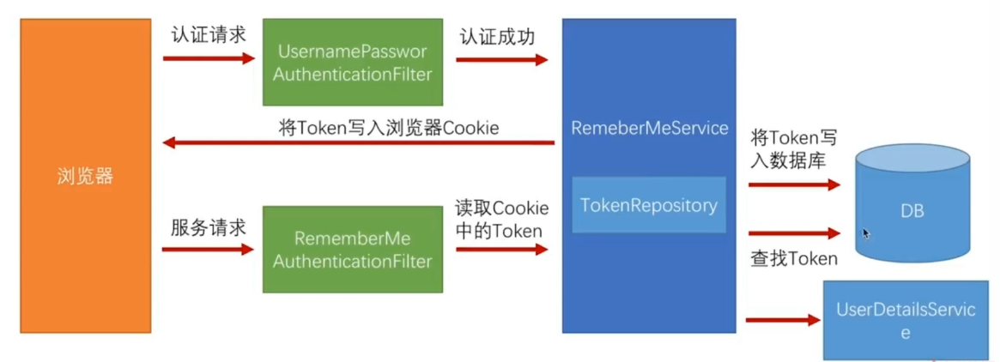