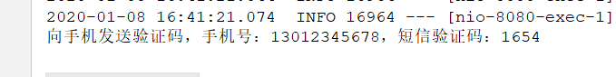
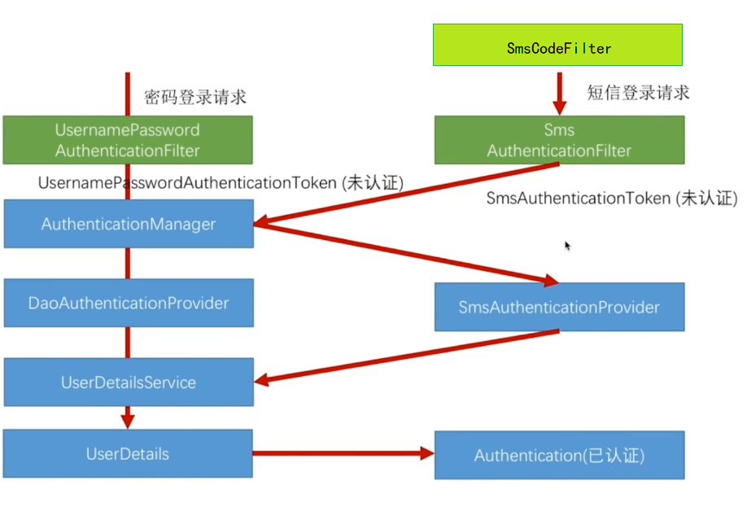
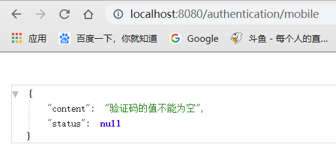
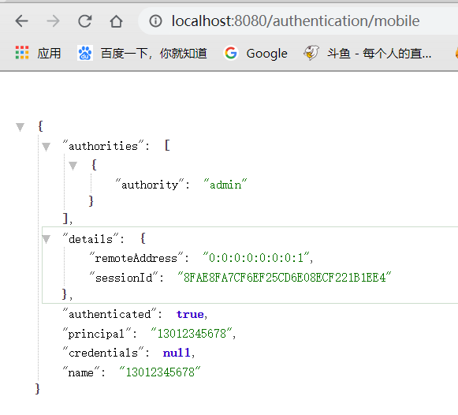
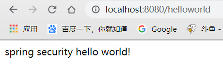

本篇文章我们研究Spring Security开发基于表单的登录的最后一块内容，基于短信验证码的接口开发。 [前面的文章我们讲解了基于图片验证码的校验](<https://pacee1.github.io/2020/01/08/ss06-SpringSecurity06-%E5%9B%BE%E7%89%87%E9%AA%8C%E8%AF%81%E7%A0%81/>)，有兴趣的同学可以翻看一下。

这篇文章除了讲解短信验证码的开发之外，我们还会对之前的代码做一次重构，我们希望短信验证码和图片验证码的逻辑的公共部分可以抽离出来。

## 开发短信验证码接口

### 实现思路

我们的代码类似于图片验证校验，进行实现

首先肯定要写一个生成短信的类，然后将这个短信通过接口发送出去（这个接口可以有很多实现，因为有不同的短信服务提供商）。

既然有短信，肯定有一个短信的封装类，还需要配置类，配置短信验证码长度，过期时间等。

### 创建短信验证码信息封装类

因为短信和图片成员变量类似，所以集体抽象出来为ValidateCode，并使两个封装类继承此类

短信验证码直接调用父类构造方法

图片验证码新增一个图片变量

```java
public class SmsCode extends ValidateCode {

    public SmsCode(String code, int expireTime) {
        super(code, expireTime);
    }

    public SmsCode(String code, LocalDateTime expireTime) {
        super(code, expireTime);
    }
}
```

### 创建短信验证码配置类

```java
public class SmsCodeProperties {

    private int length = 4;

    private int expireIn = 60;

    ···

}
```

和之前短信的类似，只不过少了长和宽，然后将此配置类放到上层ValidateCodeProperties中

```java
public class ValidateCodeProperties {

    private ImageCodeProperties image = new ImageCodeProperties();
    private SmsCodeProperties sms = new SmsCodeProperties();

    public ImageCodeProperties getImage() {
        return image;
    }

    public void setImage(ImageCodeProperties image) {
        this.image = image;
    }

    public SmsCodeProperties getSms() {
        return sms;
    }

    public void setSms(SmsCodeProperties sms) {
        this.sms = sms;
    }
}
```

### 创建短信验证码生成类

这里还是使用之前的接口，但是需要改一下返回值，改为刚刚抽象出来的封装类

```java
public interface ValidateCodeGenerator {
    ValidateCode generate(ServletWebRequest request);
}
```

短信生成类：

```java
public class SmsCodeGenerator implements ValidateCodeGenerator {

    @Autowired
    private SecurityProperties securityProperties;

    @Override
    public SmsCode generate(ServletWebRequest request) {
        String code = RandomStringUtils.randomNumeric(securityProperties.getCode().getSms().getLength());
        return new SmsCode(code, securityProperties.getCode().getSms().getExpireIn());
    }

}
```

短信生成方式很简单，就是生成配置长度的随机数，这里默认4位

### 创建短信验证码发送类

这里我们还是以可重用可替代原则，接口+实现类形式开发

```java
public interface SmsCodeSender {
    void send(String mobile,String msg);
}
```

```java
public class DefaultSmsCodeSender implements SmsCodeSender {
    @Override
    public void send(String mobile, String msg) {
        System.out.println("向手机发送验证码，手机号："+
                mobile +"，短信验证码：" + msg);
    }
}
```

**注意：因为各个短信商的接口不同，这里只需重新这个Sender方法即可，根据不同的接口调用规则进行重写**

### 将相关类注入到容器中

```java
@Configuration
public class ValidateBeanConfig {

    @Bean
    @ConditionalOnMissingBean(name = "imageCodeGenerator")
    public ValidateCodeGenerator imageCodeGenerator(){
        ImageCodeGenerator codeGenerator = new ImageCodeGenerator();
        return codeGenerator;
    }

    @Bean
    @ConditionalOnMissingBean(name = "smsCodeGenerator")
    public ValidateCodeGenerator smsCodeGenerator(){
        SmsCodeGenerator codeGenerator = new SmsCodeGenerator();
        return codeGenerator;
    }

    @Bean
    @ConditionalOnMissingBean(name = "smsCodeSender")
    public SmsCodeSender smsCodeSender(){
        SmsCodeSender smsCodeSender = new DefaultSmsCodeSender();
        return smsCodeSender;
    }
}
```

这里还是和之前一样，只需向容器中添加对应组件即可替代默认实现类

### 实现短信验证码发送接口

重用之前Controller类，再写一个发送的接口

```java
@RestController
public class ValidateCodeController {

    public static final String SESSION_KEY = "SESSION_KEY_IMAGE_CODE";
    private SessionStrategy sessionStrategy = new HttpSessionSessionStrategy();

    @Autowired
    private ValidateCodeGenerator imageCodeGenerator;
    @Autowired
    private ValidateCodeGenerator smsCodeGenerator;
    @Autowired
    private SmsCodeSender smsCodeSender;


    @GetMapping("/code/image")
    public void createCode(HttpServletRequest request, HttpServletResponse response) throws IOException{
        ServletWebRequest servletWebRequest = new ServletWebRequest(request);
        // 调用图片验证码生成接口
        ImageCode imageCode = (ImageCode) imageCodeGenerator.generate(servletWebRequest);
        sessionStrategy.setAttribute(servletWebRequest,SESSION_KEY,imageCode);
        ImageIO.write(imageCode.getImage(),"JPEG",response.getOutputStream());
    }

    @GetMapping("/code/sms")
    public void createSmsCode(HttpServletRequest request, HttpServletResponse response)
            throws IOException, ServletRequestBindingException {
        ServletWebRequest servletWebRequest = new ServletWebRequest(request);
        // 调用图片验证码生成接口
        SmsCode smsCode = (SmsCode) smsCodeGenerator.generate(servletWebRequest);
        sessionStrategy.setAttribute(servletWebRequest,SESSION_KEY,smsCode);
        String mobile = ServletRequestUtils.getRequiredStringParameter(request,"mobile");
        smsCodeSender.send(mobile,smsCode.getCode());
    }
}
```

### 修改登录页面

```html
<body>
    ···
    <h3>短信登录</h3>
    <form action="/authentication/mobile" method="post">
        <table>
            <tr>
                <td>手机号:</td>
                <td><input type="text" name="mobile" value="13012345678"></td>
            </tr>
            <tr>
                <td>短信验证码:</td>
                <td>
                    <input type="text" name="smsCode">
                    <a href="/code/sms?mobile=13012345678">发送验证码</a>
                </td>
            </tr>
            <tr>
                <td colspan="2"><button type="submit">登录</button></td>
            </tr>
        </table>
    </form>
</body>
```

在原来的基础上添加一个短信登录的表单，这里手机号是写死的，方便测试

### 启动测试


登录页面显示没问题，点击发送验证码



控制台成功打印信息，说明发送成功，即我们短信验证码接口开发完毕

## 短信验证码校验认证

其实不管短信验证码还是图片验证码，我们学习SpringSecurity更重要的是对其校验认证的实现。所以重心更应该放在认证上面。

### 认证思路



对于短信的校验和图片校验不同，因为他需要登录，而图片校验只需要校验然后再执行自带的密码拦截即可。

我们可以仿照密码认证方式，写一个短信认证，如图：

- 首先和图片校验一样，写一个短信校验拦截器，这里没有直接放在短信认证Provider中，是为了可重用，比如支付的时候也需要短信校验，那么就得再写一个拦截器才可以，放在外面可以直接使用
- 然后仿照`UsernamePassword`认证拦截器，实现一个短信认证拦截器，并编写一个短信认证Token
- 调用`AuthenticationManager`，这个是公用的，不需我们实现，因为这个只是Provider的管理器，会根据我们实现的`SMSAuthenticationToken`找到我们实现的`SmsAuthenticationProvider`
- 然后实现短信认证Provider，为的是通过获取匹配我自己生成的短信Token，来获取UserDetails，将其认证状态改为已认证

### 代码实现

#### 创建短信校验过滤器

功能：拦截表单提交，验证短信验证码是否匹配

```java
public class SmsCodeFilter extends OncePerRequestFilter {


    private SecurityProperties securityProperties;
    private AuthenticationFailureHandler authenticationFailureHandler;
    private SessionStrategy sessionStrategy = new HttpSessionSessionStrategy();
    private AntPathMatcher pathMatcher = new AntPathMatcher();

    /**
     * 过滤调用方法
     * @param request
     * @param response
     * @param filterChain
     * @throws ServletException
     * @throws IOException
     */
    @Override
    protected void doFilterInternal(HttpServletRequest request, HttpServletResponse response, FilterChain filterChain) throws ServletException, IOException {
        // 将拦截路径切割处理
        String url = securityProperties.getCode().getSms().getUrl();
        String[] strings = url.split(",");
        boolean action = false;
        for(String s :strings){
            if (pathMatcher.match(s, request.getRequestURI())) {
                action = true;
            }
        }
        //判断请求路径与请求方式
        if(action){
            try {
                validate(new ServletWebRequest(request));
            }catch (ValidateCodeException e){
                authenticationFailureHandler.onAuthenticationFailure(request,response,e);
                return;
            }
        }
        doFilter(request,response,filterChain);
    }

    /**
     * 校验验证码
     * @param request
     */
    private void validate(ServletWebRequest request) throws ServletRequestBindingException {
        SmsCode codeInSession = (SmsCode) sessionStrategy.getAttribute(request, ValidateCodeController.SESSION_SMS_KEY);

        String codeInRequest = ServletRequestUtils.getStringParameter(request.getRequest(), "smsCode");

        if (StringUtils.isBlank(codeInRequest)) {
            throw new ValidateCodeException("验证码的值不能为空");
        }

        if (codeInSession == null) {
            throw new ValidateCodeException("验证码不存在");
        }

        if (codeInSession.isExpired()) {
            sessionStrategy.removeAttribute(request, ValidateCodeController.SESSION_SMS_KEY);
            throw new ValidateCodeException("验证码已过期");
        }

        if (!StringUtils.equals(codeInSession.getCode(), codeInRequest)) {
            throw new ValidateCodeException("验证码不匹配");
        }

        sessionStrategy.removeAttribute(request, ValidateCodeController.SESSION_SMS_KEY);

    }

    public AuthenticationFailureHandler getAuthenticationFailureHandler() {
        return authenticationFailureHandler;
    }

    public void setAuthenticationFailureHandler(AuthenticationFailureHandler authenticationFailureHandler) {
        this.authenticationFailureHandler = authenticationFailureHandler;
    }

    public SecurityProperties getSecurityProperties() {
        return securityProperties;
    }

    public void setSecurityProperties(SecurityProperties securityProperties) {
        this.securityProperties = securityProperties;
    }
}
```

这里实现方式和图片验证码一样，只是改了`SessionKey`和匹配获取的路径

#### 创建短信认证Token

我们只需仿照`UsernamePasswordAuthenticationToken`来编写即可，这里我们不需要密码参数，因为我们的匹配校验是在前面`SMSCodeFilter`做的，所以关于密码的都删除。

```java
public class SmsAuthenticationToken extends AbstractAuthenticationToken {

    private static final long serialVersionUID = SpringSecurityCoreVersion.SERIAL_VERSION_UID;

    // 未认证时存放验证码，认证时存放UserDetails，需保留
    private final Object principal;
    // 删除密码参数，用不到，我们在之前进行校验，就不需要在Provider中校验了

    // 未认证构造方法
    public SmsAuthenticationToken(Object principal) {
        super(null);
        this.principal = principal;
        setAuthenticated(false);
    }

    // 认证通过构造方法
    public SmsAuthenticationToken(Object principal,
                                               Collection<? extends GrantedAuthority> authorities) {
        super(authorities);
        this.principal = principal;
        super.setAuthenticated(true); // must use super, as we override
    }

    @Override
    public Object getCredentials() {
        return null;
    }

    // 获取认证信息
    public Object getPrincipal() {
        return this.principal;
    }

    public void setAuthenticated(boolean isAuthenticated) throws IllegalArgumentException {
        if (isAuthenticated) {
            throw new IllegalArgumentException(
                    "Cannot set this token to trusted - use constructor which takes a GrantedAuthority list instead");
        }

        super.setAuthenticated(false);
    }

    @Override
    public void eraseCredentials() {
        super.eraseCredentials();
    }
}
```

#### 创建短信认证过滤器

这里实现可以仿照`UsernamePasswordAuthenticationFilter`，一样把密码相关的删除，并且使用刚刚创建的`SmsAuthenticationToken`做Token实现类，需要设置拦截路径为`/authentication/mobile`，即表单提交路径

```java
public class SmsAuthenticationFilter extends AbstractAuthenticationProcessingFilter {

    // 设置请求中获取mobile参数的值
    public static final String SPRING_SECURITY_FORM_MOBILE_KEY = "mobile";
    // 不需要密码
    //public static final String SPRING_SECURITY_FORM_PASSWORD_KEY = "password";

    private String mobileParameter = SPRING_SECURITY_FORM_MOBILE_KEY;
    private boolean postOnly = true;


    public SmsAuthenticationFilter() {
        super(new AntPathRequestMatcher("/authentication/mobile", "POST"));
    }

    // 过滤
    public Authentication attemptAuthentication(HttpServletRequest request,
                                                HttpServletResponse response) throws AuthenticationException {
        // 判断是否POST请求
        if (postOnly && !request.getMethod().equals("POST")) {
            throw new AuthenticationServiceException(
                    "Authentication method not supported: " + request.getMethod());
        }

        String mobile = obtainMobile(request);

        if (mobile == null) {
            mobile = "";
        }

        mobile = mobile.trim();

        // 这里使用我们自己的短信Token
        SmsAuthenticationToken authRequest = new SmsAuthenticationToken(mobile);

        // Allow subclasses to set the "details" property
        setDetails(request, authRequest);

        return this.getAuthenticationManager().authenticate(authRequest);
    }

    // 从请求中获取mobile参数的值
    protected String obtainMobile(HttpServletRequest request) {
        return request.getParameter(mobileParameter);
    }

    // 为Token中添加请求的一些属性
    protected void setDetails(HttpServletRequest request,
                              SmsAuthenticationToken authRequest) {
        authRequest.setDetails(authenticationDetailsSource.buildDetails(request));
    }

    public void setMobileParameter(String mobileParameter) {
        Assert.hasText(mobileParameter, "Username parameter must not be empty or null");
        this.mobileParameter = mobileParameter;
    }

    public void setPostOnly(boolean postOnly) {
        this.postOnly = postOnly;
    }

    public final String getMobileParameter() {
        return mobileParameter;
    }
}
```

#### 创建短信认证Provider

Provider只需实现`AuthenticationProvider`两个方法即可

```java
public class SmsAuthenticationProvider implements AuthenticationProvider {

    private UserDetailsService userDetailsService;

    /**
     * 根据principal获取UserDetails，然后创建一个已认证的Token返回
     * @param authentication
     * @return
     * @throws AuthenticationException
     */
    @Override
    public Authentication authenticate(Authentication authentication) throws AuthenticationException {
        // 获取principal
        String principal = (String) authentication.getPrincipal();
        // 根据principal 获取UserDetails
        UserDetails userDetails = userDetailsService.loadUserByUsername(principal);

        if (userDetails == null) {
            throw new InternalAuthenticationServiceException("无法获取用户信息");
        }

        // 根据UserDetails创建认证后的短信Token
        SmsAuthenticationToken authenticationToken = new SmsAuthenticationToken(principal,userDetails.getAuthorities());
        authenticationToken.setDetails(authentication.getDetails());

        return authenticationToken;
    }

    /**
     * 需要返回SmsAuthenticationToken，即与短信Token绑定
     * @param authentication
     * @return
     */
    @Override
    public boolean supports(Class<?> authentication) {
        return SmsAuthenticationToken.class.isAssignableFrom(authentication);
    }

    public UserDetailsService getUserDetailsService() {
        return userDetailsService;
    }

    public void setUserDetailsService(UserDetailsService userDetailsService) {
        this.userDetailsService = userDetailsService;
    }
}
```

#### 配置短信认证

这里需要先将我们自定义的短信认证相关类装配到Security组件中，这里我们在Core模块下新加一个`SecurityConfig`类，而不是使用原来的

```java
@Component
public class SmsAuthenticationSecurityConfig extends
        SecurityConfigurerAdapter<DefaultSecurityFilterChain, HttpSecurity> {

    @Autowired
    private AuthenticationSuccessHandler authenticationSuccessHandler;
    @Autowired
    private AuthenticationFailureHandler failureHandler;
    @Autowired
    private UserDetailsService myUserDetailService;

    @Override
    public void configure(HttpSecurity http) throws Exception {
        SmsAuthenticationFilter smsAuthenticationFilter = new SmsAuthenticationFilter();
        smsAuthenticationFilter.setAuthenticationManager(http.getSharedObject(AuthenticationManager.class));
        smsAuthenticationFilter.setAuthenticationSuccessHandler(authenticationSuccessHandler);
        smsAuthenticationFilter.setAuthenticationFailureHandler(failureHandler);

        SmsAuthenticationProvider smsAuthenticationProvider = new SmsAuthenticationProvider();
        smsAuthenticationProvider.setUserDetailsService(myUserDetailService);

        // 为Security配置Provider和Filter
        http.authenticationProvider(smsAuthenticationProvider)
            .addFilterBefore(smsAuthenticationFilter, UsernamePasswordAuthenticationFilter.class);
    }
}
```

这里独立出来的原因是，我们不止浏览器可以使用，APP也可以使用相同的短信认证方式，所以抽离了出来，在其他安全配置中想要引入此配置，只需编写以下代码即可：

```java
@Autowired
private SmsAuthenticationSecurityConfig smsAuthenticationSecurityConfig;

http.apply(smsAuthenticationSecurityConfig) // 追加短信安全配置
```

#### 配置短信校验

接着还需要将SmsCodeFilter对密码校验的类和之前图片验证码一样添加到`BrowserSecurityConfig`中：

```java
@Configuration
public class BrowserSecurityConfig extends WebSecurityConfigurerAdapter {

    @Autowired
    private SmsAuthenticationSecurityConfig smsAuthenticationSecurityConfig;

    ···

    @Override
    protected void configure(HttpSecurity http) throws Exception {
        ValidateCodeFilter validateCodeFilter = new ValidateCodeFilter();
        validateCodeFilter.setAuthenticationFailureHandler(failHandler);
        validateCodeFilter.setSecurityProperties(properties);

        // 添加短信校验过滤器
        SmsCodeFilter smsCodeFilter = new SmsCodeFilter();
        smsCodeFilter.setAuthenticationFailureHandler(failHandler);
        smsCodeFilter.setSecurityProperties(properties);

        http.addFilterBefore(validateCodeFilter,UsernamePasswordAuthenticationFilter.class)
            .addFilterBefore(smsCodeFilter,UsernamePasswordAuthenticationFilter.class)
            .formLogin() // 表单配置
                .loginPage("/authentication/require") // 自定义登录页
                .loginProcessingUrl("/authentication/form") // url映射，post表单的url交给表单拦截器处理
                .successHandler(successHandler)
                .failureHandler(failHandler)
                .and()
            .rememberMe() // 记住我配置
                .tokenRepository(tokenRepository())
                .tokenValiditySeconds(properties.getBrowser().getRememberMeSeconds())
                .userDetailsService(myUserDetailService)
                .and()
            .authorizeRequests() // 下面是认证信息
                .antMatchers("/authentication/require","/authentication/mobile",
                        "/code/*", properties.getBrowser().getLoginPage())
                .permitAll() // 匹配请求过滤
                .anyRequest() // 所有请求
                .authenticated() // 都需要认证
                .and()
            .csrf().disable()// 取消csrf安全防护机制
            .apply(smsAuthenticationSecurityConfig) // 追加短信安全配置
        ;
    }
}
```

这里最后需要追加短信安全的配置，**才能和这个表单进行关联**

注意！这里还需要将表单提交配置在`application.propeties`中，不然无法被`SmsCodeFilter`拦截进行校验

```properties
enbuys.security.code.sms.url=/authentication/mobile
```


### 启动测试

首先我们在短信登录表单直接登录，不输入验证码



出现错误提示，说明我们已经成功了一般，接着查看控制台输入正确验证码



返回用户信息，说明我们短信校验认证已经成功，最后访问helloworld



成功访问，说明成功保存登录状态