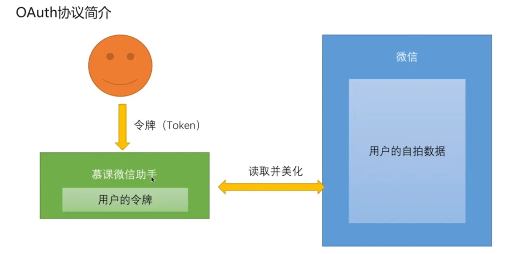
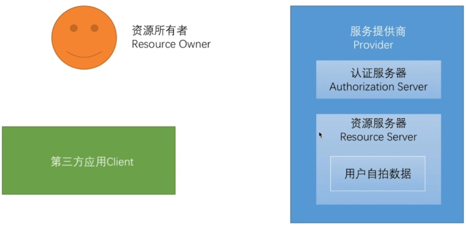
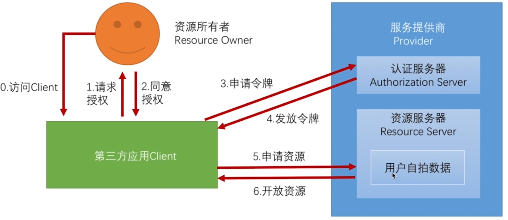
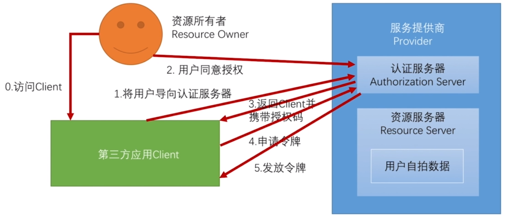
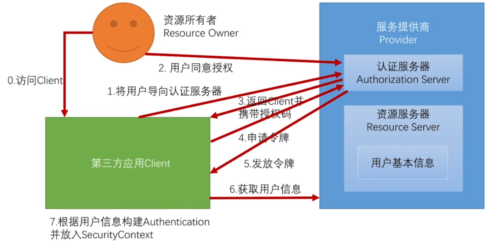
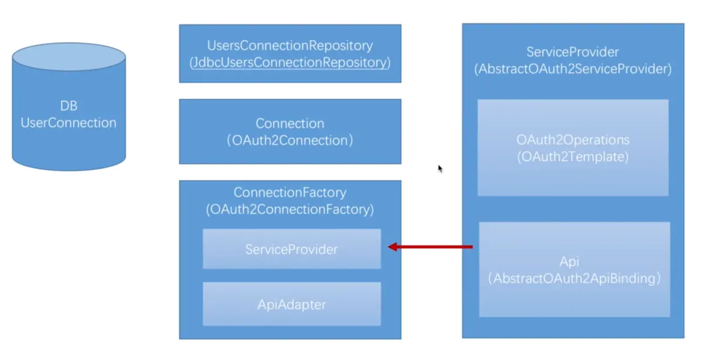

我们之前学习了SpringSecurity的基本使用方式以及原理流程。接下来我们学习SpringSecuritySocial，在第一节就介绍过，这个技术是在SpringSecurity基础上添加的，用来处理第三方登录的认证请求。

## Oauth协议介绍

这里为什么要先将Oauth协议呢？Oauth不是后面才要学到的吗？第一节介绍SpringSecurity Oauth是用于APP安全认证的。

其实Social和SpringSecurity Oauth都是基于Oauth协议开发的，所以我们学习之前要了解Oauth协议是什么?

### 问题提出

比如我们要开发一个微信助手，用来美化自拍，需要用户微信中的自拍数据，那要怎么办呢？

让用户直接把用户名密码给我们吗？这肯定不现实，因为微信有更多的隐私聊天记录，直接登录肯定会看到。

### Oauth协议解决问题

Oauth协议就是的出现就是为了解决这类问题的

- 用户不把密码告诉我们，而是给我们一个令牌，比如Token
- 我们拿着令牌去找微信要数据
- 微信根据令牌，把对应的数据传给我们，而不是所有数据

### Oauth协议中各个角色及关系

上面简单说了一下Oauth协议流程，接着我们详细说说其中的角色以及流程

- Resources Owner：资源所有者，也是调用我们提供接口的，即用户
- Client：即我们的应用
- Provider：服务提供商，包含认证服务器和资源服务器
- Authorization Server：认证服务器，认证用户身份，并且产生令牌
- Resources Server：资源服务器，保存用户资源，验证令牌

了解完五个角色，接着我们看看整个Oauth协议流程

1. 用户访问应用，应用申请用户授权
2. 用户同意授权
3. 应用访问Provider的认证服务器，申请令牌
4. 认证服务器根据应用传来的授权进行验证，如果没问题发放令牌给应用
5. 应用收到令牌后请求资源服务器获取用户数据
6. 资源服务器验证令牌是否正确，返回所需的资源

这就是Oauth协议中主要的流程，这里最重要的是第二步，用户同意授权，目前对于同意授权的模式有四种：

- 授权码模式：功能最完整，过程最严密的模式，也是使用最为广泛的
- 简化模式：应用如果没有服务器，就只能用简化模式
- 密码模式：后面学SpringSecurity Oauth时使用
- 客户端模式

### Oauth协议授权码模式

这里看一下授权码模式的流程：

1. 用户访问应用，**应用把用户导向Provider的认证服务器**
2. **用户在认真服务器上同意授权**
3. 认证服务器接收到授权信息后，返回应用授权码
4. 应用使用授权码向认证服务器申请令牌
5. 认真服务器发放令牌
6. 应用请求资源服务器，资源服务器验证令牌返回数据

这里我们明确可以看到不同之处了，这里有两个大特点，也是和其他三种模式区分开的原因：

- 用户**授权是在认证服务器完成**的，之前都是在应用上完成的，在应用上完成就可能会出现**伪造授权**的请求，认证服务器**无法确定是否真的授权**，但是在认证服务器上就确实知道用户授权了
- 第二个特点是授权通过后，会**返回应用一个授权码**，应用必须拿着授权码再请求获取令牌，而不是认证服务器直接发送令牌，这就需要**应用必须有服务器**，而不能是静态网站（只能用简化模式：直接返回令牌）

## Social基本原理

通过Oauth协议的学习了解，我们知道这是个授权协议，是帮我们我们应用在不需要知道用户密码的情况下，让应用有权限去访问用户存在服务提供商上的资源。

### Spring Social逻辑流程

Spring Social我们之前了解到，他是第三方登录，那么它请求服务提供方获取的就不是上面举例说的用户自拍数据了，而是用户的信息！如下图：

它前5步都和Oauth的流程一样，只有最后两步进行了更改，因为是使用第三方登录，所以肯定是**获取用户信息**，然后**将用户信息认证**（类似之前说的`AuthorizationToken`），然后存放到上下文中，就实现了一个登录的流程，并保存了用户登录状态。

### Spring Social基本原理

上面我们介绍的都是逻辑流程，下面我们需要了解如何将这些流程封装到SpringSocial特有的类和接口上去，包括这些类和接口的调用关系，了解这基本原理后，我们开发第三方登录会更加轻松。

Social第三方登录的实现方式会全部封装在`SocialAuthorizationFilter`过滤器里，并添加到过滤器链上，然后当有第三方登录时，这个过滤器会把请求拦下来，然后把上面那些流程走完，这就是SpringSecurity Social所要做的事情。接下来我们看看这个过滤器里都包含了哪些组件，各个组件又实现了Oauth协议流程中哪些步骤：

首先我们看这张图，我们从右往左一点一点介绍

#### ServiceProvider

这个就是服务提供商，他**封装了逻辑流程中的第一步到第六步**，SpringSocial提供了一个`AbstractOAuth2ServiceProvider`的抽象类来实现共有的东西，这里可以看到其中有两个组件

- `Oauth2Operation`：**封装了第一步到第五步的实现**，这里没有添加第六步是因为不同的服务提供方，获取用户信息接口都是不同的。`OAuth2Template`是SpringSocial的默认实现，调用他就可以实现Oauth协议基本执行过程。
- `Api`：封装了第六步，即**我们需要自己通过实现SpringSocial提供的`AbstractOAuth2APIBinding`**，来调用比如QQ或者微信的获取用户信息的接口。

到此我们前六步所需的接口与类就已经介绍完毕，从第七步开始，都是我们服务器内部的事了，和Oauth无关，接着我们介绍关于第七步封装的类和接口。

#### Connection

这个类封装了我们前六步获取到的用户信息，SpringSocial提供了`OAuth2Connection`实现类

`Connection`是由`ConnectionFactory`创建出来的

#### ConnectionFactory

`ConnectionFactory`是`Connection`的创建工厂，用来创建`Connection`

##### ServiceProvider

那么，我们可以思考一下，创建`Connection`需要什么？需要走Oauth协议的流程来获取用户信息，即调用`ServiceProvider`获取用户信息，这样就在其中封装了`ServiceProvider`。

##### ApiAdapter

这里还有一个问题，`Connection`是一个固定的类，所以其用户信息也是固定的，但我们知道QQ，微信或者微博返回的用户信息肯定都不是统一的，比如头像，有的叫`image`，有的可能叫`picture`。这里我们就需要一个类，来实现从多种不同的数据结构转化成`Connection`固定的数据结构，这里`ApiAdapter`就出现了，在Api和`Connection`直接进行适配。

#### UsersConnectionRepository

这个接口是干嘛的呢？就是将我们应用中的用户与第三方登录的用户进行映射，打个比方：

我们应用有个用户叫`Pace`，但是在QQ上他叫`阿P`，那么我们就需要在数据库中建一个表（`UserConnection`表）来对我们用户名与QQ用户进行映射，比如`Pace`映射`阿P`，然后这个接口就是用来对这个映射表进行增删改查操作的，即**用户与第三方用户做映射**的。

提供了一个默认实现`JdbcUsersConnectionRepository`，即关系型数据库映射，这里也可以使用Redis等方式进行映射

综上，SpringSocial提供了这些组件来帮助我们完成授权登录，这些组件被一个叫做`SocialAuthenticationFilter`的Spring Security过滤器使用，帮助我们完成开发第三方登录。

这里我们先对这些组件进行了解，之后学习QQ，微信登录时，会更清晰易懂。