在上一节，我们的SpringSocialQQ登录成功跑起来了，跳到QQ登录的网站上，但是报错了，我们来一点一点解决问题，直到成功登录


## Redirect Url Illegal

### Redirect Url是什么

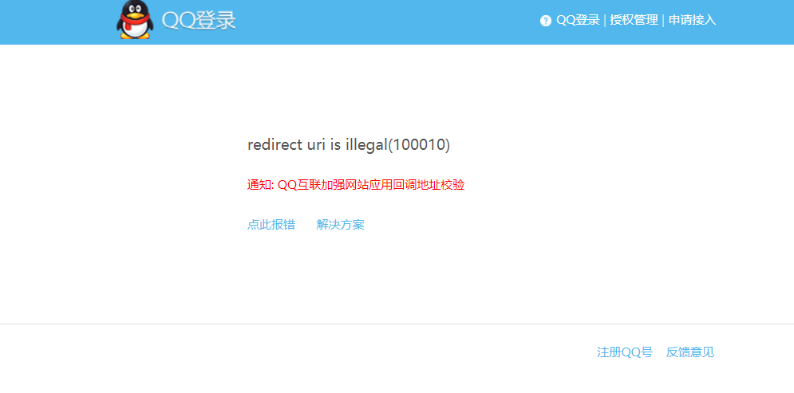

上一节我们开发完，来到这个页面，首先我们配合之前的流程图分析一下完整的QQ登录流程：


用户点击QQ登录 ——》用户扫码或者账号密码登录 ——》登录成功后QQ调用应用`回调地址`，将授权码给我们应用 ——》应用拿着授权码请求QQ获取`accesstoken `——》换到`accesstoken `后再根据它获取`openId`——》然后通过openId获取用户信息

**这里`Redirect Url`就是回调地址**

同时我们还要明确`redirect uri`不是随意生成的，而是在我们的系统在QQ上进行注册时需要填写的必填信息之一，它的填写有一定的规则，可参考[QQ互联官网](https://wiki.connect.qq.com/%E5%9B%9E%E8%B0%83%E5%9C%B0%E5%9D%80%E5%B8%B8%E8%A7%81%E9%97%AE%E9%A2%98%E5%8F%8A%E4%BF%AE%E6%94%B9%E6%96%B9%E6%B3%95)。**这里要注意，官网上明确说明了域名要包含`http://`部分**。
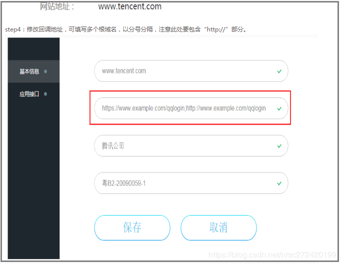

### Redirect Url Illegal的原因

为什么我们会出现这个问题呢？我们先看看请求路径

`https://graph.qq.com/oauth2.0/show?which=error&display=pc&error=100010&client_id=100550231&response_type=code&redirect_uri=http%3A%2F%2Flocalhost%3A8080%2Fauth%2Fqq&state=8f3b0533-e5a7-4dfe-a2b8-94f0119b0ad2`

这里重要的参数就是：`redirect_uri=http%3A%2F%2Flocalhost%3A8080%2Fauth%2Fqq`

其实可以很容易地猜出来就是`localhost:8080/auth/qq,`这肯定不可能是我们在QQ互联上配置的`redirect_uri`，因此当我们的项目拿着这个`redirect_uri`去请求QQ的接口时就报出了`redirect uri is illegal(100010)`的错误。

同时我们也可以看出`redirect_uri`在我们项目中的生成规则是:

```
IP+端口号（或者域名+端口）+/auth/qq
```


其中/auth和/qq我们在上篇文章中讲过它俩分别由`SocialAuthenticationFilter`和`providerId`控制。

### Redirect Url Illegal的解决方式

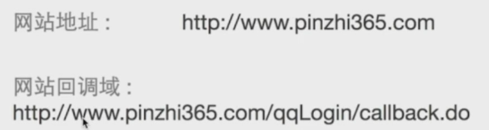

这里我在QQ互联上配置的地址和回调域如上图，所以我们就要把项目中的配置对应的进行修改

#### 修改访问域名和端口

因为我们是本机测试，所以只需修改host即可

```
127.0.0.1 www.pinzhi365.com
```

端口修改：

```properties
server.port=80
```

这里为什么改`80`就不解释了

#### 修改SocialFilter拦截的路径为qqLogin

我们上一节的最后了解到，`SocialAuthenticationFilter`的默认拦截路径为`/auth`，如果我们想修改他，应该怎么办呢？`SocialAuthenticationFilter`是由`SpringSocialConfigurer`构建的，所以我们进源码看看

```java
@Override
public void configure(HttpSecurity http) throws Exception {
   ···
   SocialAuthenticationFilter filter = new SocialAuthenticationFilter(
         http.getSharedObject(AuthenticationManager.class), 
         userIdSource != null ? userIdSource : new AuthenticationNameUserIdSource(), 
         usersConnectionRepository, 
         authServiceLocator);
   ···
   
   http.authenticationProvider(
         new SocialAuthenticationProvider(usersConnectionRepository, socialUsersDetailsService))
      .addFilterBefore(postProcess(filter), AbstractPreAuthenticatedProcessingFilter.class);
}
```

这里我们可以看到`SpringSocialConfigurer`将`SpringSocialConfigurer`添加到Security拦截器链上之前，做了一件事`postProcess()`，所以我们重新这个方法即可，后置处理，将Filter的拦截路径修改一下

##### 创建MySpringSocialConfigurer

```java
public class MySpringSocialConfigurer extends SpringSocialConfigurer {

    private String filterProcessesUrl;

    public MySpringSocialConfigurer(String filterProcessesUrl) {
        this.filterProcessesUrl = filterProcessesUrl;
    }

    /**
     * 对Filter进行后置处理，将它拦截的url变成我们想要的url，而不是默认的/auth
     * @param object
     * @param <T>
     * @return
     */
    @Override
    protected <T> T postProcess(T object) {
        SocialAuthenticationFilter filter = (SocialAuthenticationFilter) super.postProcess(object);
        // 设置拦截路径
        filter.setFilterProcessesUrl(filterProcessesUrl);
        return (T) filter;
    }
}
```

##### 修改SocialConfig

```java
@Bean
public SpringSocialConfigurer springSocialConfigurer(){
    String filterProcessesUrl = qqProperties.getFilterProcessesUrl();
    SpringSocialConfigurer configurer = new MySpringSocialConfigurer(filterProcessesUrl);
    return configurer;
}
```

这里我是把拦截路径设置成可配置的，这里要在`application.properties`中配置一下

```properties
enbuys.qq.security.filterProcessesUrl=/qqLogin
```

#### 修改providerId

因为`ProviderId`之前写在`QQProperties`中，所以只需在`application.properties`中配置一下

```properties
enbuys.qq.security.provider-id=callback.do
```

#### 修改QQ登录按钮请求路径

```html
<a href="/qqLogin/callback.do">QQ登录</a>
```

#### 启动测试


成功访问

## SignIn错误

这里我们点击登录后，会发现跳转到了认证页面

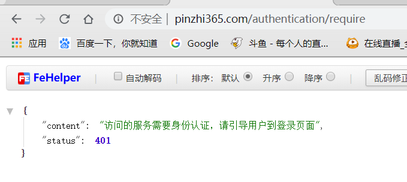

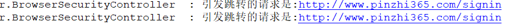

服务费输出跳转路径为`http://www.pinzhi365.com/signin`，又因为我们没有`signin`这个页面，并且没有对请求授权，所以会被之前写的Security认证拦截，因为没有登录，如果登录了或者授权放行了，应该会报出404错误

### SignIn错误原因源码分析

#### SpringSocial认证流程

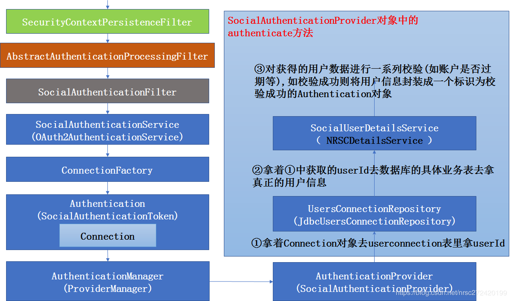


首先我们先看一下`SpringSocial`的拦截器执行流程图，这里相较前面学习的[认证流程原理](<https://pacee1.github.io/2020/01/07/ss05-SpringSecurity05-%E8%AE%A4%E8%AF%81%E6%B5%81%E7%A8%8B%E6%BA%90%E7%A0%81%E5%88%86%E6%9E%90/>)其实就多了三个组件：

- `ConnectionFactory`：需要我们自己实现，在流程里的作用就是通过授权码换取令牌（`Connection`）
- `Connection`：需要我们自己实现，令牌，被封装到`SocialAuthorizationToken`中保存
- `SocialUserDetailsService`：需要我们自己实现，根据`userId`去数据库获取用户信息

通过这个流程，我们可以发现最重要的就是`ConnectionFactory`前面的那个组件`SocialAuthorizationService`，他是请求第三方服务，获取授权码并使用授权码获取令牌的重要步骤~

我们进入源码一点点断点查看，为何会出现这个错误

#### AbstractAuthenticationProcessingFilter

首先查看`AbstractAuthenticationProcessingFilter`：

```java
public void doFilter(ServletRequest req, ServletResponse res, FilterChain chain)
      throws IOException, ServletException {
    try{
        //尝试进行登陆认证---抽象方法具体实现交给交给继承的子类,
        //在springsocial的流程里就是SocialAuthenticationFilter
        //用户名+密码登陆的流程里为UsernamePasswordAuthenticationFilter
        Authentication authResult = attemptAuthentication(request, response);
    }catch(认证失败){
        //这里会讲两个认证失败相关的逻辑
        // 	  (1)点击QQ登陆,将用户引导到QQ授权页面时
        //    (2)用户在QQ授权页面进行扫码,最终未成功登陆而是访问XXX/signin路径的逻辑
        unsuccessfulAuthentication(request, response, failed);
    }
    //认证成功
    //	-->将认证成功的Authentication对象放到线程的SecurityContext对象中
    //  -->走记住我相关的逻辑等
    successfulAuthentication(request, response, chain, authResult);
}
```

其实这个代码我们之前都看过，最重要的就是`attemptAuthentication()`方法，调用实现类的认证方法进行认证。

#### SocialAuthenticationFilter

进入到`SocialAuthenticationFilter`的`attemptAuthentication()`方法

```java
public Authentication attemptAuthentication(HttpServletRequest request, HttpServletResponse response) throws AuthenticationException {
	···
	Authentication auth = null;
	Set<String> authProviders = authServiceLocator.registeredAuthenticationProviderIds();
	//获取到ProviderId，就是我们在yml配置文件里指定的ProviderId
	String authProviderId = getRequestedProviderId(request);
	if (!authProviders.isEmpty() && authProviderId != null && authProviders.contains(authProviderId)) {
	//根据ProviderId获取相应的SocialAuthenticationService
		SocialAuthenticationService<?> authService = authServiceLocator.getAuthenticationService(authProviderId);
		//真正进行认证校验的方法
		auth = attemptAuthService(authService, request, response);
		if (auth == null) {
			throw new AuthenticationServiceException("authentication failed");
		}
	}
	return auth;
}

private Authentication attemptAuthService(final SocialAuthenticationService<?> authService, final HttpServletRequest request, HttpServletResponse response) 
      throws SocialAuthenticationRedirectException, AuthenticationException {
   // 实际调用authService.getAuthToken(）方法
   final SocialAuthenticationToken token = authService.getAuthToken(request, response);
   ···    
} 
```

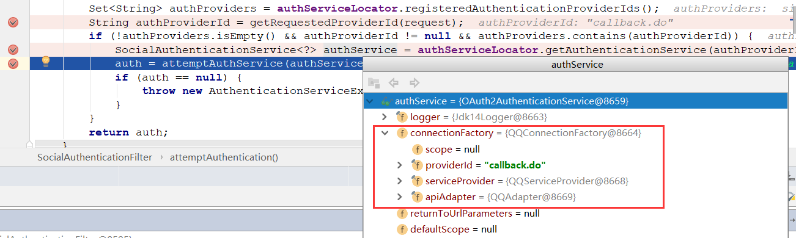

断点进去看，可以发现就是我们之前实现的QQ登录的`Connection`以及`ServiceProvider`

#### OAuth2AuthenticationService

接着我们进入到`getAuthToken()`方法中，实现类为`OAuth2AuthenticationService`，**这段代码非常关键了！！！**

```java
public SocialAuthenticationToken getAuthToken(HttpServletRequest request, HttpServletResponse response) throws SocialAuthenticationRedirectException {
   // 获取授权码
   String code = request.getParameter("code");
   // 判断是否第一次请求，如果是，重定向到第三方认证页
   if (!StringUtils.hasText(code)) {
      OAuth2Parameters params =  new OAuth2Parameters();
      params.setRedirectUri(buildReturnToUrl(request));
      setScope(request, params);
      params.add("state", generateState(connectionFactory, request));
      addCustomParameters(params);
      throw new SocialAuthenticationRedirectException(getConnectionFactory().getOAuthOperations().buildAuthenticateUrl(params));
   } else if (StringUtils.hasText(code)) {
       // 如果不是第一次请求，使用授权码获取令牌
      try {
         String returnToUrl = buildReturnToUrl(request);
         AccessGrant accessGrant = getConnectionFactory().getOAuthOperations().exchangeForAccess(code, returnToUrl, null);
         // TODO avoid API call if possible (auth using token would be fine)
         Connection<S> connection = getConnectionFactory().createConnection(accessGrant);
         return new SocialAuthenticationToken(connection, null);
      } catch (RestClientException e) {
         logger.debug("failed to exchange for access", e);
         return null;
      }
   } else {
      return null;
   }
}
```

这里因为我们的请求路径和第三方回调路径都是一样的，所以会使用授权码来判断：

- 第一次请求，抛出重定向异常，错误处理类就会重定向到第三方认证页面
- 回调请求，使用授权码获取令牌


往下走的时候，走到`exchangeForAccess()`即使用授权码获取令牌的时候报错，报了`RestClientException`异常

然后`return null；` 我们知道，如果返回`null`，那么肯定是认证失败，会进入失败处理类，这里Social失败处理类是`SocialAuthenticationFailureHandler`

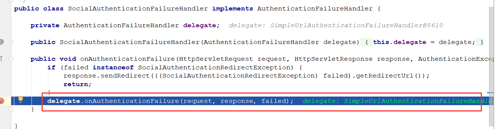

实现类是`SimpleUrlAuthenticationFailureHandler`

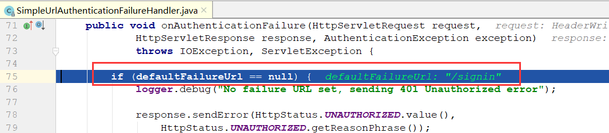

这里就看到默认重定向`URL/signin`的地址了，这也是为什么转跳`/signin`的原因

#### RestClientException异常

找到了转跳`/signin`的原因了，接着要看为啥抛出`RestClientException`异常了

这里我们直接查看报错方法`exchangeForAccess()`，我们使用的是默认的实现类即`OAuth2Template`

```java
public AccessGrant exchangeForAccess(String authorizationCode, String redirectUri, MultiValueMap<String, String> additionalParameters) {
   ···
   // 最后调用RestTemplate进行post请求，获取令牌
   return postForAccessGrant(accessTokenUrl, params);
}
```

这里在代码中可以看到，使用`RestTemplate`进行请求获取令牌，然后我们再看看报错信息

```
Could not extract response: no suitable HttpMessageConverter found for response type [interface java.util.Map] and content type [text/html]
```

意思是响应无法进行数据处理，我们看看`RestTemplate`的创建方法

```java
protected RestTemplate createRestTemplate() {
    ClientHttpRequestFactory requestFactory = ClientHttpRequestFactorySelector.getRequestFactory();
    RestTemplate restTemplate = new RestTemplate(requestFactory);
    List<HttpMessageConverter<?>> converters = new ArrayList<HttpMessageConverter<?>>(2);
    converters.add(new FormHttpMessageConverter());
    converters.add(new FormMapHttpMessageConverter());
    converters.add(new MappingJackson2HttpMessageConverter());
    restTemplate.setMessageConverters(converters);
    restTemplate.setErrorHandler(new LoggingErrorHandler());
    if (!useParametersForClientAuthentication) {
        List<ClientHttpRequestInterceptor> interceptors = restTemplate.getInterceptors();
        if (interceptors == null) {   // defensively initialize list if it is null. (See SOCIAL-430)
            interceptors = new ArrayList<ClientHttpRequestInterceptor>();
            restTemplate.setInterceptors(interceptors);
        }
        interceptors.add(new PreemptiveBasicAuthClientHttpRequestInterceptor(clientId, clientSecret));
    }
    return restTemplate;
}
```

它只加了如下三个`HttpMessageConverter`，这三个`HttpMessageConverter`并不能处理`contentType`为 `[text/html]`的返回信息，**因此走到上面的`postForAccessGrant`方法会抛出`RestClientException`异常。**

### SiginIn错误的解决方式

既然默认的`OAuth2Template`使用有问题，那么我们就继承它重新他的方法

```java
public class QQOAuth2Template extends OAuth2Template {

    private Logger logger = LoggerFactory.getLogger(getClass());

    public QQOAuth2Template(String clientId, String clientSecret, String authorizeUrl, String accessTokenUrl) {
        super(clientId, clientSecret, authorizeUrl, accessTokenUrl);
        // 设置了true 在请求时才会拼接钟 client_id 和 client_secret
        setUseParametersForClientAuthentication(true);
    }

    /**
     * 重新返回数据封装的处理
     * 父类方法是使用Map封装，因为返回的是Json
     * 这里我们返回的是字符串，所以需要自己重新封装方法
     * @param accessTokenUrl
     * @param parameters
     * @return
     */
    @Override
    protected AccessGrant postForAccessGrant(String accessTokenUrl, MultiValueMap<String, String> parameters) {
        String responseStr = getRestTemplate().postForObject(accessTokenUrl, parameters, String.class);

        logger.info("获取accessToke的响应：" + responseStr);

        String[] items = StringUtils.splitByWholeSeparatorPreserveAllTokens(responseStr, "&");

        String accessToken = StringUtils.substringAfterLast(items[0], "=");
        Long expiresIn = new Long(StringUtils.substringAfterLast(items[1], "="));
        String refreshToken = StringUtils.substringAfterLast(items[2], "=");

        return new AccessGrant(accessToken, null, refreshToken, expiresIn);
    }

    /**
     * 添加一个处理 text/html的处理器
     * @return
     */
    @Override
    protected RestTemplate createRestTemplate() {
        RestTemplate restTemplate = super.createRestTemplate();
        restTemplate.getMessageConverters().add(new StringHttpMessageConverter(Charset.forName("UTF-8")));
        return restTemplate;
    }
}
```

这里实现好之后，我们还需要将`ServiceProvider`中`OAuth2Operation`的实现方式改为我们自己的`QQOAuth2Template`

```java
public QQServiceProvider(String appId, String appSecret) {
    super(new QQOAuth2Template(appId,appSecret,URL_AUTHORIZE,URL_ACCESS_TOKEN));
    this.appId = appId;
}
```

只需这两步，就完成了`SignIn`错误的修改

### 重启测试

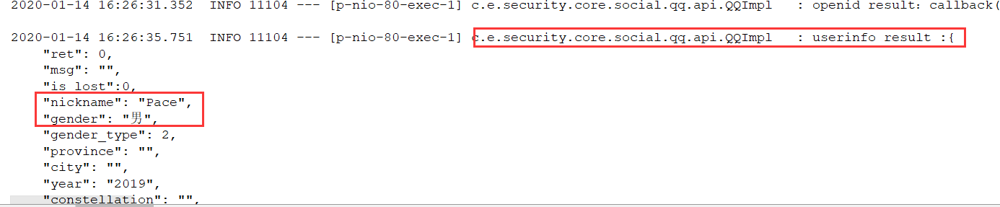

控制台正确打印信息，说明获取用户信息成功

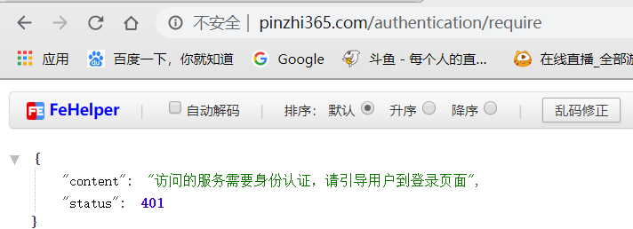

然后发现页面又又又返回401需要认证了，查看控制台

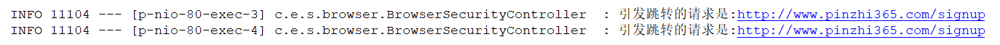

成功获取用户信息后，请求`signup`这个路径了，但是我们并没有配置过这个请求，所以返回401需要认证

## SignUp错误


在之前，我们已经获取到QQ的用户信息，即`Connection`对象，那我们是哪里出了错呢？

### SignUp错误原因源码分析

之前返回了`401`，说明没有认证，就说明认证的地方出了错，我们又知道`SpringSecurity`的认证是由`Provider`完成的，所以我们应该查看`SocialAuthorizationProvider`的源码，跟一下报错信息

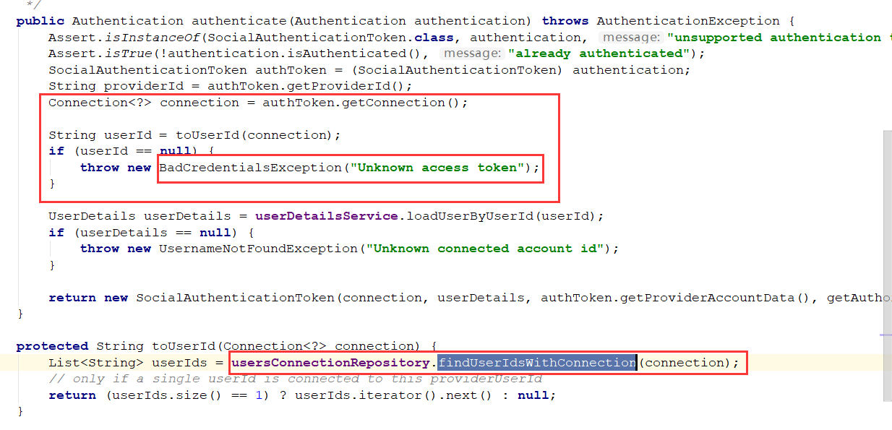

通过源码查看，其实很简单

1. 首先获取刚刚封装到`Token`中的`Connection`信息，即保存的用户信息
2. 然后拿着这个用户信息向数据库查询，查关联我们应用的用户
3. 问题！**我们没有注册逻辑，所以表里肯定没有映射，即查出来的是null**
4. 因为null，所以抛出`BadCredentialsException`异常

抛出的异常肯定是最上层捕获，我们去`SocialAuthorizationFilter`看看

```java
private String signupUrl = "/signup";

private Authentication doAuthentication(SocialAuthenticationService<?> authService, HttpServletRequest request, SocialAuthenticationToken token) {
   try {
      if (!authService.getConnectionCardinality().isAuthenticatePossible()) return null;
      token.setDetails(authenticationDetailsSource.buildDetails(request));
      Authentication success = getAuthenticationManager().authenticate(token);
      Assert.isInstanceOf(SocialUserDetails.class, success.getPrincipal(), "unexpected principle type");
      updateConnections(authService, token, success);          
      return success;
   } catch (BadCredentialsException e) {
      // connection unknown, register new user?
      if (signupUrl != null) {
         // store ConnectionData in session and redirect to register page
         sessionStrategy.setAttribute(new ServletWebRequest(request), ProviderSignInAttempt.SESSION_ATTRIBUTE, new ProviderSignInAttempt(token.getConnection()));
         throw new SocialAuthenticationRedirectException(buildSignupUrl(request));
      }
      throw e;
   }
}
```

这里的源码就清晰明了了，捕获异常后判断`signupUrl`是否存在，默认为`/signup`，所以是存在的，然后抛出重定向异常，让`SecurityExceptionFilter`进行重定向处理，转到`/signup`页面，因为我们没有这个页面并且没有做授权，所以出现了上面401问题

### SignUp问题解决方式

解决方式很简单，只需写一个注册页面，然后再`SocialConfig`中配置一下即可，这里我们把注册页面弄成可配置的

#### 创建注册页面

```html
<!DOCTYPE html>
<html lang="en">
<head>
    <meta charset="UTF-8">
    <title>注册</title>
</head>
<body>
<h2>标准注册页面</h2>
<h3>这是系统注册页面，请配置enbuys.security.browser.signupPage属性来设置自己的注册页</h3>
</body>
</html>
```

#### 在配置类中添加signup配置

```java
public class BrowserProperties {
	···
    private String signupPage="/my-signup.html";
}
```

这里是在之前创建的`BrowserProperties`中配置，上层是`SecurityProperties`，不了解的可以看一下之前`SpringSecurity`表单登录的笔记。

#### 配置SpringSocialConfig

在`SocialConfig`类中：

```java
@Bean
public SpringSocialConfigurer springSocialConfigurer(){
    String filterProcessesUrl = qqProperties.getFilterProcessesUrl();
    SpringSocialConfigurer configurer = new MySpringSocialConfigurer(filterProcessesUrl);
    // 配置注册页面
    configurer.signupUrl(securityProperties.getBrowser().getSignupPage());
    return configurer;
}
```

添加一个`signupUrl()`方法，设置为我们的注册页面路径

这里还有一个要配置的就是添加认证信息

```java
http.
    ···
    .authorizeRequests() // 下面是认证信息
    .antMatchers(
        "/authentication/require",
        "/authentication/mobile",
        "/code/*",
        properties.getBrowser().getLoginPage(),
        properties.getBrowser().getSignupPage()
    )
    .apply(springSocialConfigurer)
;
```

这时可以启动测试

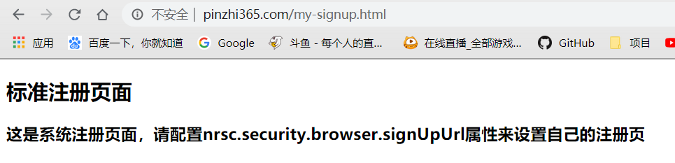

可以看到，跳转到了标准的注册页面，接着我们写一个自定义的注册页面，并在`application.properties`中设置

#### 配置自定义注册页

```html
<!DOCTYPE html>
<html lang="en">
<head>
    <meta charset="UTF-8">
    <title>注册</title>
</head>
<body>
<h2>Demo注册页</h2>

<form action="/user/regist" method="post">
    <table>
        <tr>
            <td>用户名:</td>
            <td><input type="text" name="username"></td>
        </tr>
        <tr>
            <td>密码:</td>
            <td><input type="password" name="password"></td>
        </tr>
        <tr>
            <td colspan="2">
                <button type="submit" name="type" value="register">注册</button>
                <button type="submit" name="type" value="binding">绑定</button>
            </td>
        </tr>
    </table>
</form>
</body>
</html>
```

```properties
# 注册页面配置
enbuys.security.browser.signupPage=/demo-signup.html
```

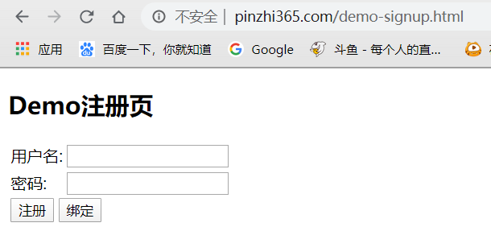

成功配置


## 剩下的问题

到此，第三方QQ登录的基本逻辑问题已经完成了，剩下还有一些问题我们之后解决，如接下来的注册逻辑，这里不只是简单的向我们的用户表插入一条数据，还包括向`userconnection`表保存应用于第三方QQ用户的映射数据