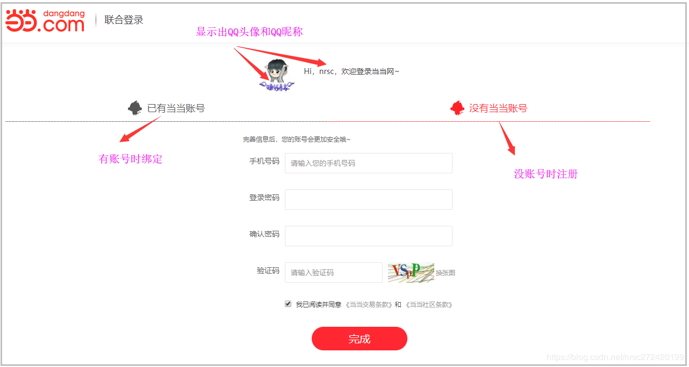
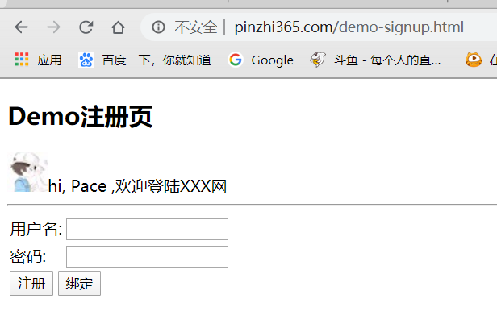
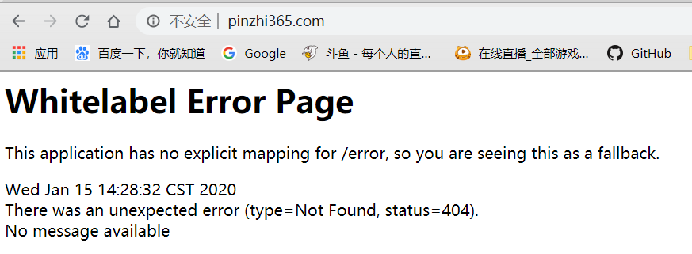
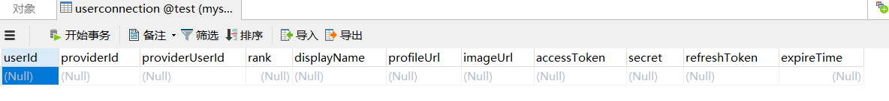
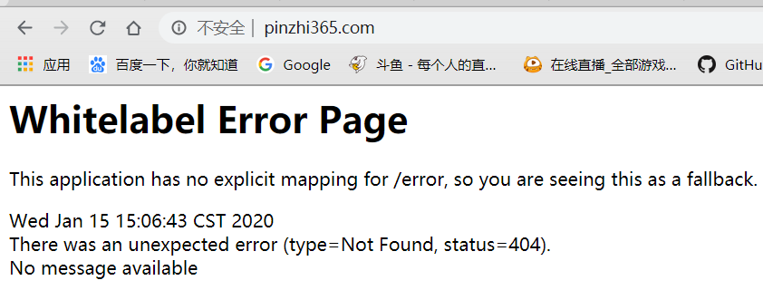
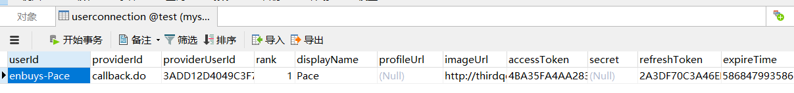

## 本篇内容概述

上一章末尾说过，由于这里的注册其实是从第三方登陆过程中重定向而来的注册，因此这种情况下的注册肯定与普通的用户注册有一定的区别。都要有哪些区别呢？其实主要在两块：

一块是上篇文章说的当用户注册完，肯定要与该第三方（即QQ、微信等）建立起关系，也就是说下次用户直接用QQ或微信等进行登陆，那肯定直接就可以登陆了。落实到代码上，就是用户注册完，需要同时往`userconnection`表里插入一条数据。

第二块在于注册页面的展示与逻辑。下面是我直接在当当网进行QQ登陆时导向的注册页面，我们可以看到人家在这种情况下的注册页面里就不光有注册功能，还同时把从QQ获取到的你的头像和昵称信息给显示了出来，让你有种亲切感。



其实大家除了见过像当当这种直接点击QQ登陆进行登陆，由于没有进行注册或绑定过，而被导向一个用户注册页面的网站，肯定也见过那种从来就没上过的网站直接点击QQ登陆或者微信登陆，但是却**可以直接登陆成功而不需要注册的网站**，而且很多。那这种又是怎么弄得呢？这一块也是本文需要讲解的内容。
因此，本文将主要讲解如下三块内容：

- 第三方登陆时用户注册页面如何拿到QQ头像和昵称等信息
- 用户注册时如何将QQ与用户信息建立关联，插入`userconnection`表
- 第三方登陆时，如何跳过注册逻辑

## 注册页面展示第三方用户信息

### ProviderSignInUtils

这个工具类，可以帮助我们拿到第三方登录时，存在`Session`中的第三方用户信息，我们在上一章源码可以看到：

```java
catch (BadCredentialsException e) {
    // connection unknown, register new user?
    if (signupUrl != null) {
        // 存储Connection到Session中
        sessionStrategy.setAttribute(new ServletWebRequest(request), ProviderSignInAttempt.SESSION_ATTRIBUTE, new ProviderSignInAttempt(token.getConnection()));
        throw new SocialAuthenticationRedirectException(buildSignupUrl(request));
    }
    throw e;
}
```

在获取用户失败，转跳注册页面时，会将用户信息保存的`Session`中，所以我们就可以使用这个工具类，来进行获取`Connection`

向容器注入`ProviderSignInUtils`

```java
/**
 * ProviderSignInUtils有两个作用：
 * （1）从session里获取封装了第三方用户信息的Connection对象
 * （2）将注册的用户信息与第三方用户信息（QQ信息）建立关系并将该关系插入到userconnection表里
 *
 * 需要的两个参数：
 * （1）ConnectionFactoryLocator 可以直接注册进来，用来定位ConnectionFactory
 * （2）UsersConnectionRepository----》getUsersConnectionRepository(connectionFactoryLocator)
 *     即我们配置的用来处理userconnection表的bean
 * @param connectionFactoryLocator
 * @return
 */
@Bean
public ProviderSignInUtils providerSignInUtils(ConnectionFactoryLocator connectionFactoryLocator){
    return new ProviderSignInUtils(connectionFactoryLocator,
            getUsersConnectionRepository(connectionFactoryLocator));
}
```

### 实现获取QQ用户信息接口

首先我们要写一个封装用户信息的类

```java
public class SocialUserInfo {
    /**提供商唯一标识*/
    private String providerId;

    /***用户在提供商的唯一标识（其实就是openId）*/
    private String providerUserId;

    /**用户在提供商的昵称*/
    private String nickName;

    /**用户在提供商的头像*/
    private String headImg;
}
```

然后再写Controller接口实现

```java
@GetMapping("/social/user")
public SocialUserInfo getSocialUser(HttpServletRequest request){
    Connection<?> connection = providerSignInUtils.getConnectionFromSession(new ServletWebRequest(request));
    SocialUserInfo userInfo = new SocialUserInfo();
    userInfo.setProviderId(connection.getKey().getProviderId());
    userInfo.setProviderUserId(connection.getKey().getProviderUserId());
    userInfo.setNickName(connection.getDisplayName());
    userInfo.setHeadImg(connection.getImageUrl());
    return userInfo;
}
```

这里直接调用`getConnectionFromSession()`方法，从`Session`中取`Connection`然后封装到QQ用户Bean中

这里还需要将获取用户信息接口授权，在`Security`配置中

```java
http.
    ···
    .antMatchers(
        "/authentication/require",
        "/authentication/mobile",
        "/code/*",
        properties.getBrowser().getLoginPage(),
        properties.getBrowser().getSignupPage(),
        "/social/user" // 授权
    )
```

### 修改注册页面

```html
<!DOCTYPE html>
<html lang="en">
<head>
    <meta charset="UTF-8">
    <title>注册</title>
    <script
            src="https://code.jquery.com/jquery-3.4.1.min.js"
            integrity="sha256-CSXorXvZcTkaix6Yvo6HppcZGetbYMGWSFlBw8HfCJo="
            crossorigin="anonymous"></script>
</head>
<body>
<h2>Demo注册页</h2>
hi, <span id="nickName"></span> ,欢迎登陆XXX网
<hr>
<form action="/user/regist" method="post">
    <table>
        <tr>
            <td>用户名:</td>
            <td><input type="text" name="username"></td>
        </tr>
        <tr>
            <td>密码:</td>
            <td><input type="password" name="password"></td>
        </tr>
        <tr>
            <td colspan="2">
                <button type="submit" name="type" value="register">注册</button>
                <button type="submit" name="type" value="binding">绑定</button>
            </td>
        </tr>
    </table>
</form>
</body>
<script type="text/javascript">
    function getSocialUserInfo() {
        $.get({
            url: "/social/user",
            type: "get",
            success: function (res) {
                $("#headImage").attr("src", res.headImg);
                $("#nickName").text(res.nickName);
            }
        })
    }

    window.onload = getSocialUserInfo;
</script>
</html>
```

这里引入`jquery`，发送`get`请求获取用户信息

### 启动测试



可以发现，成功显示用户名和头像

## 注册用户时将QQ与用户信息关联

简单来说，就是向`userconnection`表中创建一条数据，关联本应用用户和QQ用户，实现起来也是非常简单的

### 实现用户注册接口

```java
@RestController
@RequestMapping("/user")
public class UserController {

    @Autowired
    private ProviderSignInUtils providerSignInUtils;

    @PostMapping("/regist")
    public void regist(User user, HttpServletRequest request){
        // 注册逻辑
        providerSignInUtils.doPostSignUp(user.getUsername(),new ServletWebRequest(request));
    }

}
```

这里只需使用`ProviderSignInUtils`即可，传入唯一标识符，这里我使用`username`

### 将接口授权

```java
http.
    ···
    .antMatchers(
        "/authentication/require",
        "/authentication/mobile",
        "/code/*",
        properties.getBrowser().getLoginPage(),
        properties.getBrowser().getSignupPage(),
        "/social/user", // 授权
        "/user/regist"
    )
```

### 启动测试

访问页面，输入用户名密码，点击注册按钮后，可以看到数据库`userconnection`表有了一条数据


然后再次登录



qq登录后成功来到主页，因为我们没有创建index页面，所以404，这是正常现象

**这里，完成的QQ登录流程已经大功告成了！**


## 第三方登录跳过注册逻辑直接登录

之前我们说到，有很多网站直接保存你第三方的信息来当用户信息，即登陆后不需要注册，这是怎么做到的呢？其实也很简单，首先我们先看源码

### 实现逻辑源码分析

想要实现，那肯定是认证获取用户信息那里进行操作啊，直接来到`SocialAuthorizationProvider`类中，

```java
protected String toUserId(Connection<?> connection) {
   List<String> userIds = usersConnectionRepository.findUserIdsWithConnection(connection);
   // only if a single userId is connected to this providerUserId
   return (userIds.size() == 1) ? userIds.iterator().next() : null;
}
```

这个`toUserId`的方法我们也看了很多次了，我们想要不注册就登录，就要进到`findUserIdsWithConnection()`方法里看看

```java
private ConnectionSignUp connectionSignUp;

public void setConnectionSignUp(ConnectionSignUp connectionSignUp) {
    this.connectionSignUp = connectionSignUp;
}

public List<String> findUserIdsWithConnection(Connection<?> connection) {
   ConnectionKey key = connection.getKey();
   List<String> localUserIds = jdbcTemplate.queryForList("select userId from " + tablePrefix + "UserConnection where providerId = ? and providerUserId = ?", String.class, key.getProviderId(), key.getProviderUserId());    
   if (localUserIds.size() == 0 && connectionSignUp != null) {
       // 如果存在connectionSignUp这个对象，执行他的方法
      String newUserId = connectionSignUp.execute(connection);
      if (newUserId != null)
      {
          // 如果返回值不为空，创建映射关系
         createConnectionRepository(newUserId).addConnection(connection);
         return Arrays.asList(newUserId);
      }
   }
   return localUserIds;
}
```

源码一看，清晰明了，我们只需实现`ConnectionSignUp`，并重写`execute()`方法，返回返回唯一标识即可，`JdbcUsersConnectionRepository`会自动帮我们插入一条映射数据

### 实现ConnectionSignUp

```java
@Component
public class DemoConnectionSignUp implements ConnectionSignUp {
    @Override
    public String execute(Connection<?> connection) {
        // 根据业务逻辑需要，进行代码编写
        // 这里我们直接返回用户名，作为唯一标识，前面拼接 'enbuys' 标识是我们应用的
        return "enbuys-" + connection.getDisplayName();
    }
}
```

### 配置ConnectionSignUp

这里是在`SocialConfig`中配置的

```java
@Configuration
@EnableSocial
public class SocialConfig extends SocialConfigurerAdapter {

   ···
    @Autowired
    private DataSource dataSource;

    @Autowired(required = false) // 表示并不强制要求，可以实现可以不实现
    private ConnectionSignUp connectionSignUp;

    @Override
    public UsersConnectionRepository getUsersConnectionRepository(ConnectionFactoryLocator connectionFactoryLocator) {
        JdbcUsersConnectionRepository repository = new JdbcUsersConnectionRepository(dataSource,
                connectionFactoryLocator, Encryptors.noOpText());
        if(connectionSignUp != null){
            // 存在时才进行配置
            repository.setConnectionSignUp(connectionSignUp);
        }
        return repository;
    }
    
    ···
}
```

### 启动测试

我们先把数据库中数据清空



然后我们重启后用QQ登录



直接跳转Index页面，并且数据库具有一条数据，`userId`为我们设置的`enbuys-昵称`




## 总结

QQ登录注册到此也就完成了，我们总结一下干了哪些事，还是根据之前的图


- 首先创建`QQApi`接口以及实现
  - 根据文档创建一个`QQBean`，保存返回的数据
  - 根据文档调用接口，获取QQ用户信息，又需要几大参数
    - `oauth_consumer_key`：注册QQ互联时给的
    - `access_token`：授权码，用户登录后QQ给的，不需要我们提供，框架会帮我们处理
    - `open_id`：QQ用户的唯一标识，需要通过接口使用`access_token`参数获取
- 实现`QQServiceProvider`
  - 实现`QQOAuth2Template`：这里因为QQ返回数据为`[text/html]`，默认的`OAuth2Template`没有处理方式，所以需要重写`OAuth2Template`
- 实现`ConnectionFactory`
  - 实现`QQApiAdapter`，对数据进行映射处理
  - 实现`ConnectionFactory`需要我们之前实现的`QQServiceProvider`
- 实现`UsersConnectionRepository`
  - 注入`JdbcUsersConnectionRepository`
    - 可以配置免注册登录，实现`ConnectionSignUp`
  - 数据库建`userconnection`表
  - 实现`SocialUserDetailsService`，通过userId查询用户的逻辑
- 配置Social过滤器：`SpringSocialConfigurer`
  - 重写拦截方法，配置拦截的路径与QQ互联上一致
  - 配置`provider-id`与QQ互联上一致
  - 添加`SignUp`页面配置，注册页面
- 本应用注册
  - 使用`ProviderSignInUtils`
    - 获取QQ用户信息
    - 创建关联关系
  - 使用`ConnectionSignUp`，免注册登录，根据规则自动创建关联关系
  - 编写注册页面
- 向`SpringSecurity`中配置
  - `SocialAuthorizationFilter`拦截器配置
  - 授权过滤路径配置
    - QQ登录
    - 注册页面
    - 注册功能