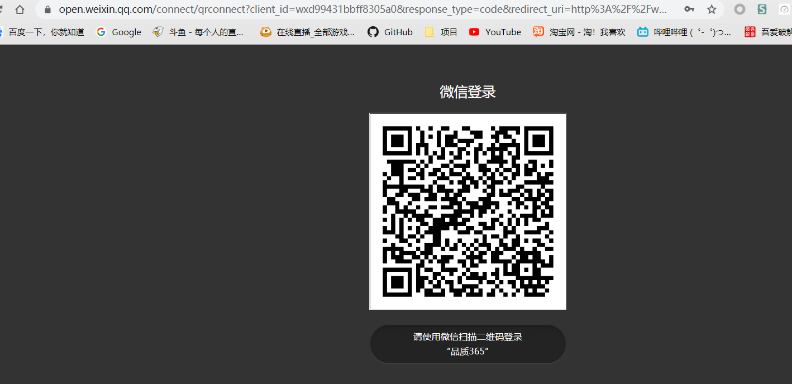
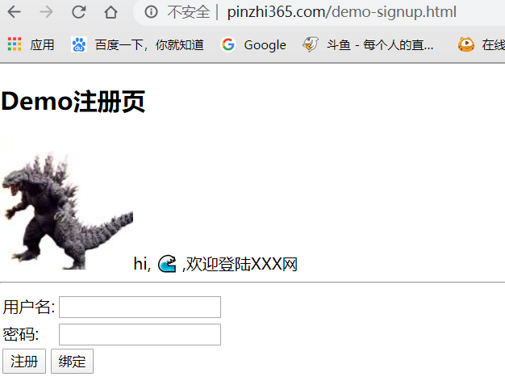
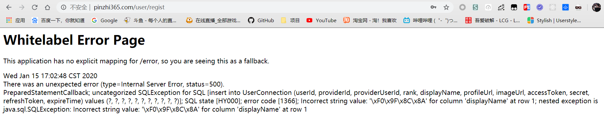
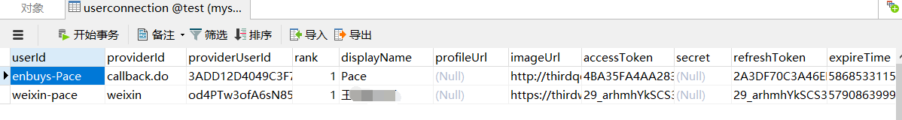
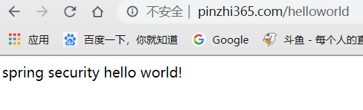

微信登录实际流程和QQ差不多，就是其获取接口入参和出差不同，所以需要进行一些修改

主要的配置有：

- Properties
- API
- OAuth2Operation
- ServiceProvider
- ConnectionFactory
- AutoConfiguration

这里不光针对微信，对于其他的第三方登录也是一样

## 微信Properties

```java
@ConfigurationProperties("enbuys.weixin.security")
public class WeixinProperties {
    private String providerId = "weixin";

    private String appId;

    private String appSecret;

    private String filterProcessesUrl;

    public String getFilterProcessesUrl() {
        return filterProcessesUrl;
    }

    public void setFilterProcessesUrl(String filterProcessesUrl) {
        this.filterProcessesUrl = filterProcessesUrl;
    }

    public String getProviderId() {
        return providerId;
    }

    public void setProviderId(String providerId) {
        this.providerId = providerId;
    }

    public String getAppId() {
        return appId;
    }

    public void setAppId(String appId) {
        this.appId = appId;
    }

    public String getAppSecret() {
        return appSecret;
    }

    public void setAppSecret(String appSecret) {
        this.appSecret = appSecret;
    }
}
```

和QQ一模一样

## 微信API

### 微信Bean

```java
public class WeixinUserInfo {
	
	/**
	 * 普通用户的标识，对当前开发者帐号唯一
	 */
	private String openid;	
	/**
	 * 普通用户昵称
	 */
	private String nickname;
	/**
	 * 语言
	 */
	private String language;
	/**
	 * 普通用户性别，1为男性，2为女性
	 */
	private String sex;
	/**
	 * 普通用户个人资料填写的省份
	 */
	private String province;
	/**
	 * 普通用户个人资料填写的城市
	 */
	private String city;
	/**
	 * 国家，如中国为CN
	 */
	private String country;
	/**
	 * 用户头像，最后一个数值代表正方形头像大小（有0、46、64、96、132数值可选，0代表640*640正方形头像），用户没有头像时该项为空
	 */
	private String headimgurl;
	/**
	 * 用户特权信息，json数组，如微信沃卡用户为（chinaunicom）
	 */
	private String[] privilege;
	/**
	 * 用户统一标识。针对一个微信开放平台帐号下的应用，同一用户的unionid是唯一的。
	 */
	private String unionid;
```

### 微信API接口

```java
public interface Weixin {

   /* (non-Javadoc)
    * @see com.ymt.pz365.framework.security.social.api.SocialUserProfileService#getUserProfile(java.lang.String)
    */
   WeixinUserInfo getUserInfo(String openId);
   
}
```

这里多了一个openId参数，是因为微信认证没有按照标准的OAuth协议，他是返回accessToken授权码时直接返回openId，因为SpringSocial使用了标准OAuth协议，调用接口是只会给你授权码，所以openId我们必须通过参数传递

### 微信API接口实现

```java
public class WeixinImpl extends AbstractOAuth2ApiBinding implements Weixin {
   
   /**
    * 
    */
   private ObjectMapper objectMapper = new ObjectMapper();
   /**
    * 获取用户信息的url
    */
   private static final String URL_GET_USER_INFO = "https://api.weixin.qq.com/sns/userinfo?openid=";
   
   /**
    * @param accessToken
    */
   public WeixinImpl(String accessToken) {
      super(accessToken, TokenStrategy.ACCESS_TOKEN_PARAMETER);
   }
   
   /**
    * 默认注册的StringHttpMessageConverter字符集为ISO-8859-1，而微信返回的是UTF-8的，所以覆盖了原来的方法。
    */
   protected List<HttpMessageConverter<?>> getMessageConverters() {
      List<HttpMessageConverter<?>> messageConverters = super.getMessageConverters();
      messageConverters.remove(0);
      messageConverters.add(new StringHttpMessageConverter(Charset.forName("UTF-8")));
      return messageConverters;
   }

   /**
    * 获取微信用户信息。
    */
   @Override
   public WeixinUserInfo getUserInfo(String openId) {
      String url = URL_GET_USER_INFO + openId;
      String response = getRestTemplate().getForObject(url, String.class);
      if(StringUtils.contains(response, "errcode")) {
         return null;
      }
      WeixinUserInfo profile = null;
      try {
         profile = objectMapper.readValue(response, WeixinUserInfo.class);
      } catch (Exception e) {
         e.printStackTrace();
      }
      return profile;
   }

}
```

## 微信ServiceProvider

### 微信AccessGrant

因为微信openId是直接返回的，所以首先需要创建一个WeixinAccessGrant添加openId字段

```java
/**
 * 微信的access_token信息。与标准OAuth2协议不同，微信在获取access_token时会同时返回openId,并没有单独的通过accessToke换取openId的服务
 * 
 * 所以在这里继承了标准AccessGrant，添加了openId字段，作为对微信access_token信息的封装。
 * 
 * @author zhailiang
 *
 */
public class WeixinAccessGrant extends AccessGrant {
   
   /**
    * 
    */
   private static final long serialVersionUID = -7243374526633186782L;
   
   private String openId;
   
   public WeixinAccessGrant() {
      super("");
   }

   public WeixinAccessGrant(String accessToken, String scope, String refreshToken, Long expiresIn) {
      super(accessToken, scope, refreshToken, expiresIn);
   }

   /**
    * @return the openId
    */
   public String getOpenId() {
      return openId;
   }

   /**
    * @param openId the openId to set
    */
   public void setOpenId(String openId) {
      this.openId = openId;
   }
   
}
```

### 微信OAuth2Template

这里需要大量调整，因为微信的入参没有按照标准OAuth协议，需要对入参和返回值进行封装，这里也不用过多研究，因为不同的第三方登录肯定都是不同的，没法面面俱到

```JAVA
/**
 * 
 * 完成微信的OAuth2认证流程的模板类。国内厂商实现的OAuth2每个都不同, spring默认提供的OAuth2Template适应不了，只能针对每个厂商自己微调。
 * 
 * @author zhailiang
 *
 */
public class WeixinOAuth2Template extends OAuth2Template {
   
   private String clientId;
   
   private String clientSecret;

   private String accessTokenUrl;
   
   private static final String REFRESH_TOKEN_URL = "https://api.weixin.qq.com/sns/oauth2/refresh_token";
   
   private Logger logger = LoggerFactory.getLogger(getClass());

   public WeixinOAuth2Template(String clientId, String clientSecret, String authorizeUrl, String accessTokenUrl) {
      super(clientId, clientSecret, authorizeUrl, accessTokenUrl);
      setUseParametersForClientAuthentication(true);
      this.clientId = clientId;
      this.clientSecret = clientSecret;
      this.accessTokenUrl = accessTokenUrl;
   }
   
   /* (non-Javadoc)
    * @see org.springframework.social.oauth2.OAuth2Template#exchangeForAccess(java.lang.String, java.lang.String, org.springframework.util.MultiValueMap)
    */
   @Override
   public AccessGrant exchangeForAccess(String authorizationCode, String redirectUri,
         MultiValueMap<String, String> parameters) {
      
      StringBuilder accessTokenRequestUrl = new StringBuilder(accessTokenUrl);
      
      accessTokenRequestUrl.append("?appid="+clientId);
      accessTokenRequestUrl.append("&secret="+clientSecret);
      accessTokenRequestUrl.append("&code="+authorizationCode);
      accessTokenRequestUrl.append("&grant_type=authorization_code");
      accessTokenRequestUrl.append("&redirect_uri="+redirectUri);
      
      return getAccessToken(accessTokenRequestUrl);
   }
   
   public AccessGrant refreshAccess(String refreshToken, MultiValueMap<String, String> additionalParameters) {
      
      StringBuilder refreshTokenUrl = new StringBuilder(REFRESH_TOKEN_URL);
      
      refreshTokenUrl.append("?appid="+clientId);
      refreshTokenUrl.append("&grant_type=refresh_token");
      refreshTokenUrl.append("&refresh_token="+refreshToken);
      
      return getAccessToken(refreshTokenUrl);
   }

   @SuppressWarnings("unchecked")
   private AccessGrant getAccessToken(StringBuilder accessTokenRequestUrl) {
      
      logger.info("获取access_token, 请求URL: "+accessTokenRequestUrl.toString());
      
      String response = getRestTemplate().getForObject(accessTokenRequestUrl.toString(), String.class);
      
      logger.info("获取access_token, 响应内容: "+response);
      
      Map<String, Object> result = null;
      try {
         result = new ObjectMapper().readValue(response, Map.class);
      } catch (Exception e) {
         e.printStackTrace();
      }
      
      //返回错误码时直接返回空
      if(StringUtils.isNotBlank(MapUtils.getString(result, "errcode"))){
         String errcode = MapUtils.getString(result, "errcode");
         String errmsg = MapUtils.getString(result, "errmsg");
         throw new RuntimeException("获取access token失败, errcode:"+errcode+", errmsg:"+errmsg);
      }
      
      WeixinAccessGrant accessToken = new WeixinAccessGrant(
            MapUtils.getString(result, "access_token"), 
            MapUtils.getString(result, "scope"), 
            MapUtils.getString(result, "refresh_token"), 
            MapUtils.getLong(result, "expires_in"));
      
      accessToken.setOpenId(MapUtils.getString(result, "openid"));
      
      return accessToken;
   }
   
   /**
    * 构建获取授权码的请求。也就是引导用户跳转到微信的地址。
    */
   public String buildAuthenticateUrl(OAuth2Parameters parameters) {
      String url = super.buildAuthenticateUrl(parameters);
      url = url + "&appid="+clientId+"&scope=snsapi_login";
      return url;
   }
   
   public String buildAuthorizeUrl(OAuth2Parameters parameters) {
      return buildAuthenticateUrl(parameters);
   }
   
   /**
    * 微信返回的contentType是html/text，添加相应的HttpMessageConverter来处理。
    */
   protected RestTemplate createRestTemplate() {
      RestTemplate restTemplate = super.createRestTemplate();
      restTemplate.getMessageConverters().add(new StringHttpMessageConverter(Charset.forName("UTF-8")));
      return restTemplate;
   }

}
```

### ServiceProvider

这个和QQ的基本一致

```java
/**
 * 
 * 微信的OAuth2流程处理器的提供器，供spring social的connect体系调用
 * 
 * @author zhailiang
 *
 */
public class WeixinServiceProvider extends AbstractOAuth2ServiceProvider<Weixin> {
   
   /**
    * 微信获取授权码的url
    */
   private static final String URL_AUTHORIZE = "https://open.weixin.qq.com/connect/qrconnect";
   /**
    * 微信获取accessToken的url
    */
   private static final String URL_ACCESS_TOKEN = "https://api.weixin.qq.com/sns/oauth2/access_token";

   /**
    * @param appId
    * @param appSecret
    */
   public WeixinServiceProvider(String appId, String appSecret) {
      super(new WeixinOAuth2Template(appId, appSecret,URL_AUTHORIZE,URL_ACCESS_TOKEN));
   }


   /* (non-Javadoc)
    * @see org.springframework.social.oauth2.AbstractOAuth2ServiceProvider#getApi(java.lang.String)
    */
   @Override
   public Weixin getApi(String accessToken) {
      return new WeixinImpl(accessToken);
   }

}
```

## 微信Adapter

和QQ基本一致

```java
/**
 * 微信 api适配器，将微信 api的数据模型转为spring social的标准模型。
 * 
 * 
 * @author zhailiang
 *
 */
public class WeixinAdapter implements ApiAdapter<Weixin> {
	
	private String openId;
	
	public WeixinAdapter() {}
	
	public WeixinAdapter(String openId){
		this.openId = openId;
	}

	/**
	 * @param api
	 * @return
	 */
	@Override
	public boolean test(Weixin api) {
		return true;
	}

	/**
	 * @param api
	 * @param values
	 */
	@Override
	public void setConnectionValues(Weixin api, ConnectionValues values) {
		WeixinUserInfo profile = api.getUserInfo(openId);
		values.setProviderUserId(profile.getOpenid());
		values.setDisplayName(profile.getNickname());
		values.setImageUrl(profile.getHeadimgurl());
	}

	/**
	 * @param api
	 * @return
	 */
	@Override
	public UserProfile fetchUserProfile(Weixin api) {
		return null;
	}

	/**
	 * @param api
	 * @param message
	 */
	@Override
	public void updateStatus(Weixin api, String message) {
		//do nothing
	}

}

```

## 微信ConnectionFactory

这里需要大量调整，因为微信的返回值openId没有按照标准OAuth协议，需要对返回值进行封装，这里也不用过多研究，因为不同的第三方登录肯定都是不同的，没法面面俱到

```java
/**
 * 微信连接工厂
 * 
 * @author zhailiang
 *
 */
public class WeixinConnectionFactory extends OAuth2ConnectionFactory<Weixin> {
   
   /**
    * @param appId
    * @param appSecret
    */
   public WeixinConnectionFactory(String providerId, String appId, String appSecret) {
      super(providerId, new WeixinServiceProvider(appId, appSecret), new WeixinAdapter());
   }
   
   /**
    * 由于微信的openId是和accessToken一起返回的，所以在这里直接根据accessToken设置providerUserId即可，不用像QQ那样通过QQAdapter来获取
    */
   @Override
   protected String extractProviderUserId(AccessGrant accessGrant) {
      if(accessGrant instanceof WeixinAccessGrant) {
         return ((WeixinAccessGrant)accessGrant).getOpenId();
      }
      return null;
   }
   
   /* (non-Javadoc)
    * @see org.springframework.social.connect.support.OAuth2ConnectionFactory#createConnection(org.springframework.social.oauth2.AccessGrant)
    */
   public Connection<Weixin> createConnection(AccessGrant accessGrant) {
      return new OAuth2Connection<Weixin>(getProviderId(), extractProviderUserId(accessGrant), accessGrant.getAccessToken(),
            accessGrant.getRefreshToken(), accessGrant.getExpireTime(), getOAuth2ServiceProvider(), getApiAdapter(extractProviderUserId(accessGrant)));
   }

   /* (non-Javadoc)
    * @see org.springframework.social.connect.support.OAuth2ConnectionFactory#createConnection(org.springframework.social.connect.ConnectionData)
    */
   public Connection<Weixin> createConnection(ConnectionData data) {
      return new OAuth2Connection<Weixin>(data, getOAuth2ServiceProvider(), getApiAdapter(data.getProviderUserId()));
   }
   
   private ApiAdapter<Weixin> getApiAdapter(String providerUserId) {
      return new WeixinAdapter(providerUserId);
   }
   
   private OAuth2ServiceProvider<Weixin> getOAuth2ServiceProvider() {
      return (OAuth2ServiceProvider<Weixin>) getServiceProvider();
   }

   
}
```

## 微信AutoConfiguration

```java
@Configuration
public class WeixinAutoConfiguration extends SocialConfig {

   @Autowired
   private WeixinProperties weixinProperties;

   /*
    * (non-Javadoc)
    * 
    * @see
    * org.springframework.boot.autoconfigure.social.SocialAutoConfigurerAdapter
    * #createConnectionFactory()
    */
   protected ConnectionFactory<?> createConnectionFactory() {
      return new WeixinConnectionFactory(weixinProperties.getProviderId(), weixinProperties.getAppId(),
            weixinProperties.getAppSecret());
   }

   public void addConnectionFactories(ConnectionFactoryConfigurer configurer, Environment environment) {
      configurer.addConnectionFactory(this.createConnectionFactory());
   }
   
}
```

和QQ一致


## 配置文件和登录页面

```properties
enbuys.weixin.security.app-id=wxd99431bbff8305a0
enbuys.weixin.security.app-secret=60f78681d063590a469f1b297feff3c4
enbuys.weixin.security.filterProcessesUrl=/qqLogin
```

```html
<a href="/qqLogin/weixin">微信登录</a>
```

## 启动测试

点击微信登录，跳转页面



扫码后因为没有注册，跳转注册页，并显示我的用户信息





这里因为我的昵称是emoji图标，所以报错，修改ID后尝试



存库成功

重新登录后访问接口



成功访问，说明认证成功