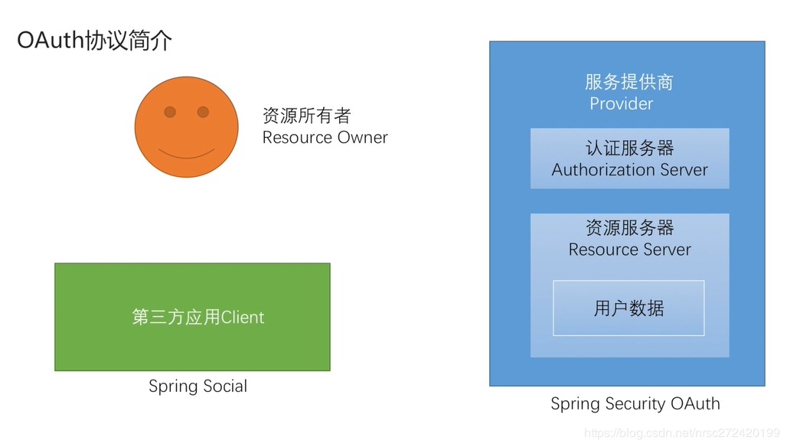
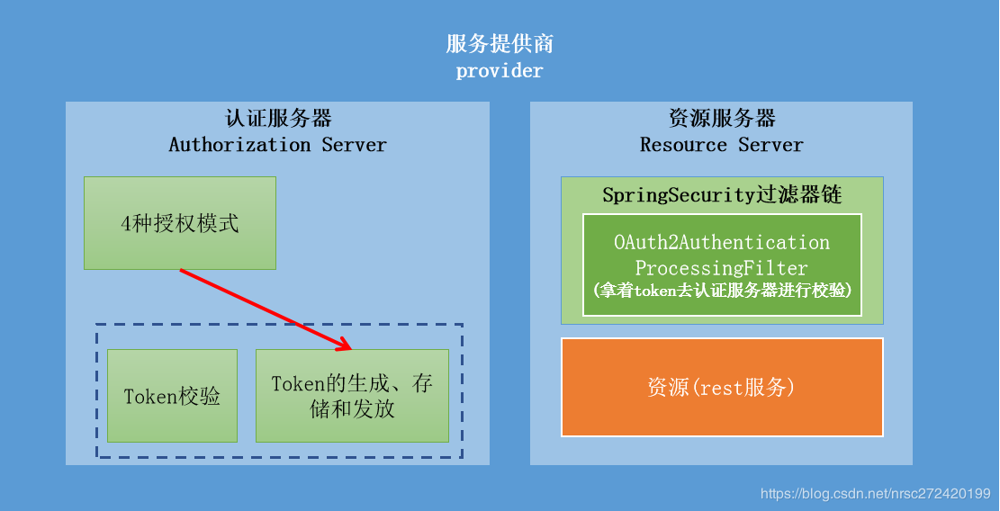
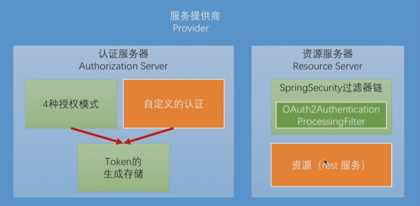

## SpringSecurityOAuth简单介绍

### Token Session Cookie

了解SpringSecurityOAuth之前，我们先说说Session，Cookie和Token。

Session和Cookie大家都不陌生，Session存在服务端类似Map，保存用户信息，Cookie是Session生成的，创建后给浏览器保存，存放的是`JSESSIONID`与`SessionId`的键值对

我们再说说看Token，Token就是在用户登陆后，由服务端通过一系列规则制造的一个对象，与用户信息绑定起来，然后存放在内存或数据库中，同时返回给浏览器。

注意，这里返回给浏览器，有很多种形式，比如**保存在请求头或参数或者url里都可以**，并没有cookie那么局限，服务器就可以通过请求中的token来判定这些请求是该用户的请求。

那么，Token的好处是什么？

- 首先Cookie是基于浏览器的，如果不使用浏览器而是手机APP那么Cookie就不复存在的，就只能使用Token了
- 还有一个问题就是安全，如果被人知道了某个用户的`SessionId`，伪造一个Cookie发请求，就会出现安全问题，而Token因为认证创建方式都是由我们自己定义的，安全性相对更高。

### SpringSecurityOAuth是什么呢

在前面的文章中，我们学习了表单登录，短信登录，第三方登录，而他们我们可以发现都是使用Cookie+Session实现的，那么如何使用Token实现的，其实如果我们自己实现，通过上面对他流程的了解也不是难事。但是更简单的方式就是使用别人造好的轮子——SpringSecurityOAuth

我们首先看上面这张图，就是我们之前开发第三方登录时（Social）使用的图。当我们开发时，编写的代码都是和我们的应用相关的，而对于服务提供商Provider，使用的是QQ或者微信提供的接口。通过他们的接口，来获取授权码换取令牌（Token），再拿着Token获取用户信息。

服务提供商中的这些操作，即生成token，返回token，验证token的流程，就是由SpringSecurity OAuth实现的

#### 简单总结

- Spring Social：对OAuth2协议中资源所有者和应用进行封装，提供调用服务提供商的接口实现
- SpringSecurity OAuth：对服务提供商进行封装，即认证服务器和资源服务器

### SpringSecurityOAuth如何实现Token认证方式

如上图，在认证服务器中，根据我们之前了解的四种授权模式，SpringSecurity进行了实现，并实现了默认的Token生成方式（稍后去源码查看），存储方式，发放方式以及校验方式。

在资源服务器中，首先资源就是我们创建的所有REST接口，在其接口至上SpringSecurityOAuth向过滤器链中添加了一个`OAuth2AuthorizationProcessingFilter`，来进行对所有REST请求拦截，这时会拿着Token去认证服务器校验，通过后才会请求服务返回资源。

#### 问题

这里有一个问题就是标准的四种授权模式，我们前面了解过，肯定没有说发送短信，通过验证码校验授权，所以我们要额外做的一件事，就是**自定义授权模式嫁接进认证服务器**。比如第三方短信，用户名密码验证，然后再调用Token生成机制生成Token返回给调用者等。

在这图里，绿色的块都是SpringSecurityOAuth已经搭好的轮子，不需要我们修改。红色的块是需要我们自己写的。

## 接下来的目标

- 实现一个标准OAuth2协议中Provider角色的功能，以及阅读SpringSecurityOAuth源码，了解大体流程
- 重构之前表单用户名密码登录，短信验证，第三方验证代码，使用Token实现，因为我们主要针对APP端，没有Cookie，所以需要使用Token来保存信息
- SpringSecurityOAuth的高级特性
  - JWT生成Token的方式
  - SSO单点登录