## 准备工作

我们之前的项目中，都是使用的都是`demo`模块依赖`Browser`模块，对于SpringSecurityOAuth来说，我们需要使用`app`模块，所以我们要进行一些配置

`demo`模块的依赖引用由`browser`改为`app`

```xml
<dependency>
    <groupId>com.enbuys</groupId>
    <artifactId>spring-security-app</artifactId>
    <version>1.0-SNAPSHOT</version>
</dependency>
```

`core`中使用到了认证失败处理器和认证成功处理器，所以要从`browser`移到`app`中，对应着`SimpleResponse`也要移动

将我们自己实现的`UserDetailsService`放到`Demo`模块中

## 实现Provider中的认证服务器

对于SpringSecurity OAuth来说，实现认证服务器非常简单，因为由上节我们知道，很多东西他都已经封装好了，比如四种认证模式，Token生成规则，返回的实现等等。

### 代码实现

所以我们只需创建一个类，添加注解即可实现标准的认证服务器

```java
@Configuration
@EnableAuthorizationServer
public class AuthorizationServerConfig {
}
```

这样一个认证服务器就创建好了，然后启动应用

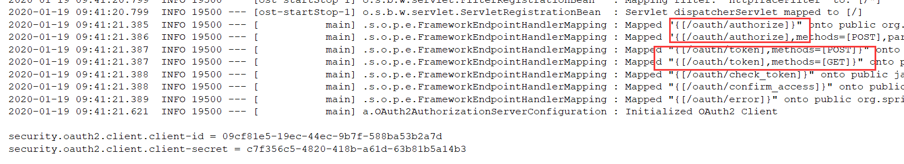

在控制台可以看到Security向容器中添加了一些控制器，

- `/oauth/authorize`：就是授权码模式授权的接口，访问这个接口就会跳转到授权页面，就比如QQ登录时的那个登录页
- `/oauth/token`：根据授权码获取`AccessToken`的接口

在下面还可以看懂自动生成的`client-id`与`secret`，因为是随机生成的，所以很不方便，我们这里配置成固定的

```properties
security.oauth2.client.client-id=enbuys
security.oauth2.client.client-secret=enbuys
```

### 授权码模式

接下来我们要开始测试通过授权码模式获取`AccessToken`令牌

>  官网文档 <https://tools.ietf.org/html/rfc6749#section-4>

OAuth协议官方文档如上，介绍了如何使用接口，需要传哪些参数

参照Oauth2协议我们拼接的访问认证服务器的url如下：

```
http://localhost:8080/oauth/authorize?response_type=code&client_id=enbuys&redirect_uri=http://www.example.com&scope=all
```

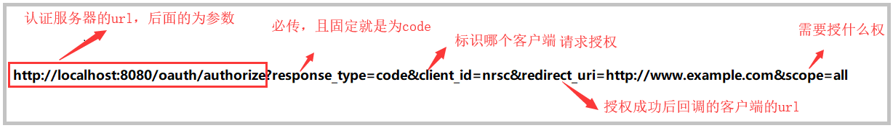

#### 问题一

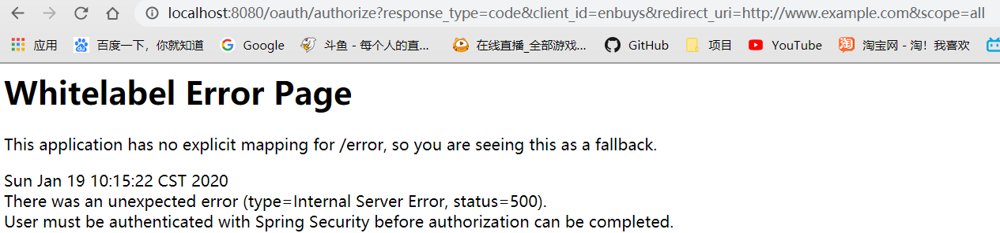

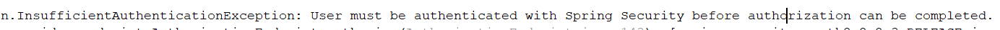

原因：因为我们是服务提供商，即QQ或者微信的角色，所以我们发放授权码需要知道三个东西

- 一是哪个应用在请求授权，即参数中的`client_id`
- 二是我的哪个用户给你授权
- 三是给你什么授权，即给你的权限。即参数中的`scope`

这里我们就会发现了，第二个东西我们是没有的，这里又因为SpringSecurity5后，默认表单登录，不会给你弹窗输入用户密码，所以抛了异常，这里我们需要修改认证方式为弹窗

在`App`模块创建一个Security配置类

```java
@Configuration
public class AppSecurityConfig extends WebSecurityConfigurerAdapter {

    @Override
    protected void configure(HttpSecurity http) throws Exception {
        http.httpBasic();
    }
}
```

重新访问

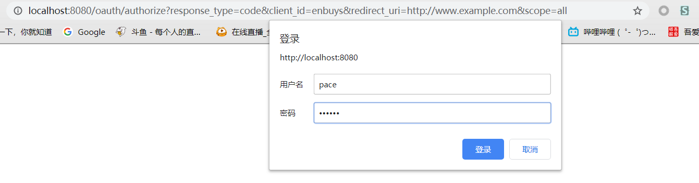

#### 问题二

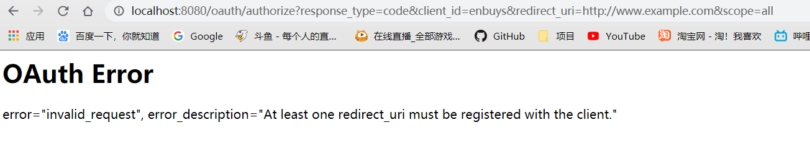

重新访问报错，这是因为我们没有配置redirect_uri，Security5后就没有默认配置了，所以我们要在配置文件中配置一下：


#### 获取授权码

再次访问

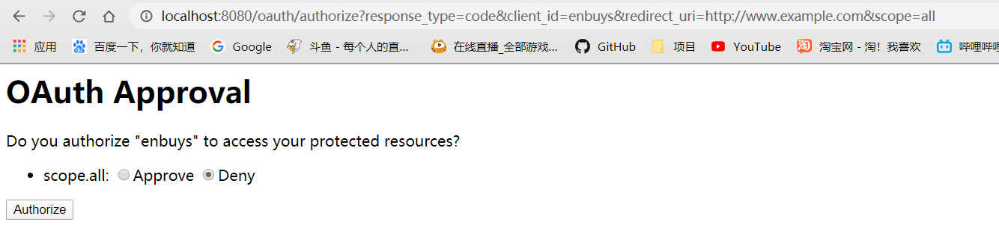

成功到授权页面，这里两个按钮，`Approve `- 同意授权，`Deny `- 拒绝授权

当选择了`Approve`，并点击`Authorize`时，认证服务器就会拿着授权码，跳回到我们指定的` redirect-uri`，这样我们就获取到了授权码。

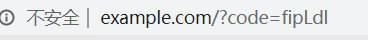

#### 获取accessToken

获取token的端点在

```
org.springframework.security.oauth2.provider.endpoint.TokenEndpoint#postAccessToken
```

只支持post请求，所以使用postman这样的工具发送；

>  发送的参数: 参考oath2文档：https://tools.ietf.org/html/rfc6749#section-4.1.3

* 唯一需要注意的是：**basic auth 填写用户名和密码的时候不是之前登录的用户信息，而是我们配置的clientId与Secret**

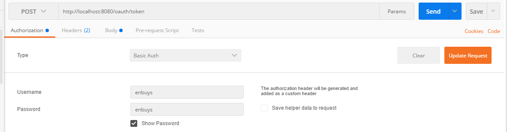

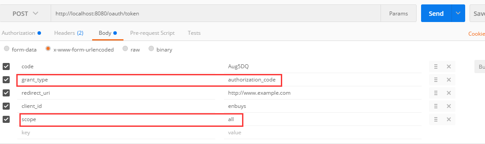

配置如图，红框中是固定的，其他是需要修改的，其中code就是获取授权码时url中返回的code

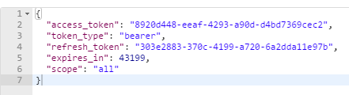

请求成功后会返回这些信息，包括令牌，令牌类型，权限，存活时间等等

### 密码模式

密码模式相较于授权码模式就非常简单了，只需一次的post请求即可，这种模式适用于前后端分离时的认证，因为都是一家公司的，对于密码来说也无所谓知不知道。

这里我们使用Talend API Tester测试

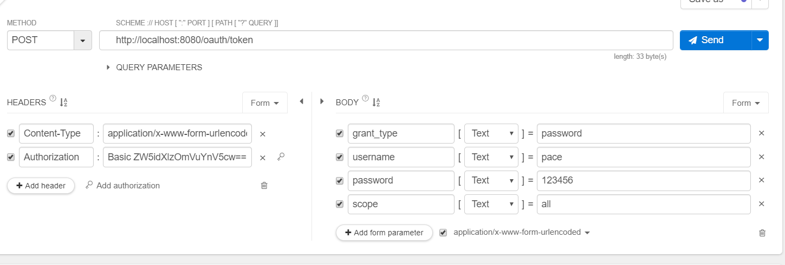

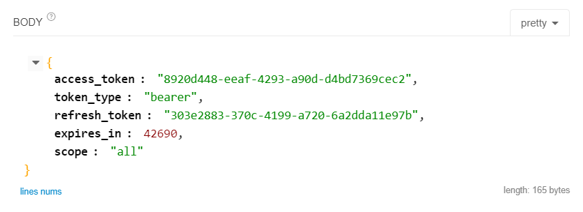

请求返回的Token可以和授权码模式的对比下，是一样的，因为我们使用了相同的用户，再一定时间内都是一样的`accessToken`

## 实现Provider中的资源服务器

资源服务器和认证服务器一样，也是非常简单，只需添加注解即可，Security对OAuth协议中的规定进行了很好的封装。

```java
@Configuration
@EnableResourceServer
public class RepositoryServerConfig {
}
```

>资源服务器和认证服务器只是逻辑上的概念,可以写在同一个配置类里,也可以写在不同的配置类,甚至可以写在不同的项目里

启动登录后直接访问资源


说访问的资源没有权限，然后我们通过密码模式获取Token

URL拼接方式访问：

`<http://localhost:8080/helloworld?access_token=23c96ec5-839f-4d18-9311-4f3da70763d0>`

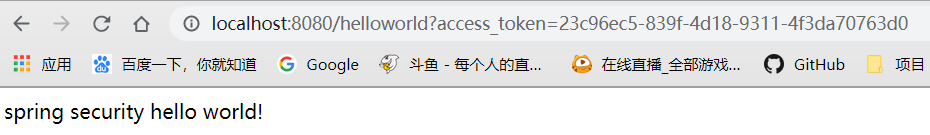

将参数放在请求头访问

格式为：`Authorization ： {token_type} 空格 {access_token}`

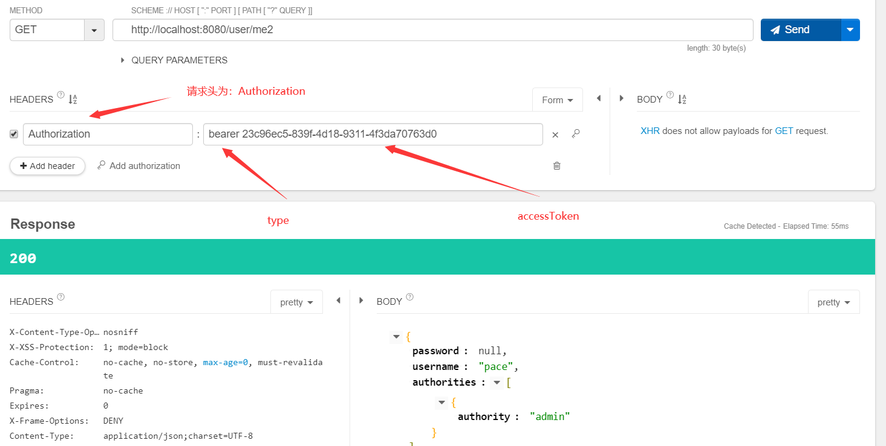

也成功访问