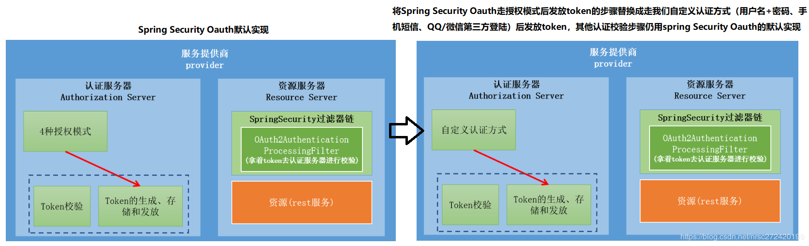
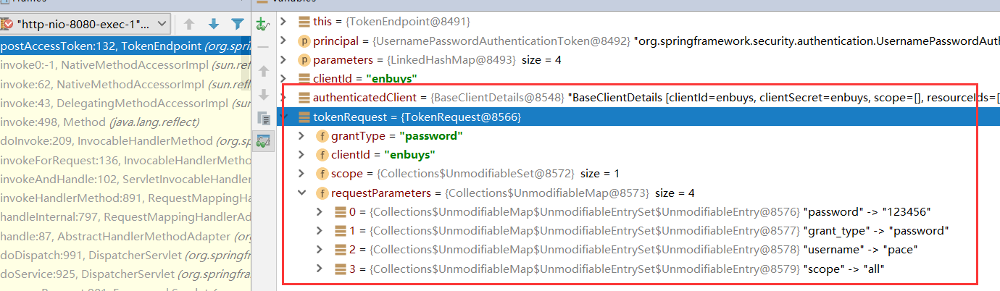
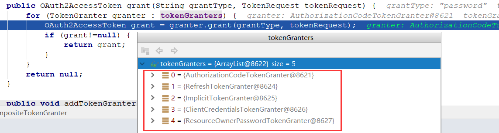
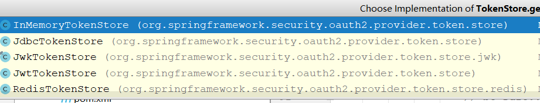
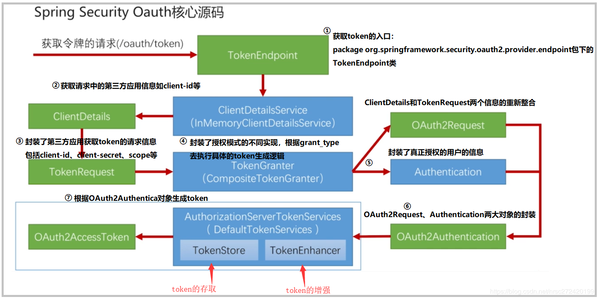

## 明确目标

还记得我们刚了解OAuth时说的，它默认只有四种认证模式，那么如果我们想用短信验证或者第三方登录验证的模式，如何自定义授权模式并嫁接到认证服务器中呢？



即我们自己实现认证方式，然后使用Security造好的Token生成存放校验逻辑进行Token管理

为了达到这个目的，我们需要对SpringSecurity OAuth源码进行解析

## 源码解析

### TokenEndPoint

首先，在我们上一章中，获取令牌的方式是向`/oauth/token`发送post请求，根据我们对springboot的了解，这个是由`EndPoint`端点控制的，所以我们直接取看`TokenEndPoint`源码。

```java
public class TokenEndpoint extends AbstractEndpoint {
    @RequestMapping(value = "/oauth/token", method=RequestMethod.POST)
	public ResponseEntity<OAuth2AccessToken> postAccessToken(Principal principal, @RequestParam
	Map<String, String> parameters) throws HttpRequestMethodNotSupportedException {

		if (!(principal instanceof Authentication)) {
			throw new InsufficientAuthenticationException(
					"There is no client authentication. Try adding an appropriate authentication filter.");
		}
		// 从请求中获取clientId
		String clientId = getClientId(principal);
         // 根据clientId，获取ClientDetails，保存了clientId，secret,scope等客户端配置的信息
		ClientDetails authenticatedClient = getClientDetailsService().loadClientByClientId(clientId);
        
		// 通过ClientDetails获取TokenRequest，其中保存grantType，username，password等就是我们请求中的那些必要参数，封装成TokenRequest对象
		TokenRequest tokenRequest = getOAuth2RequestFactory().createTokenRequest(parameters, authenticatedClient);

		··· // 进行一些校验，比如scope是否合法，授权模式判断等

         // 生成Token的步骤
		OAuth2AccessToken token = getTokenGranter().grant(tokenRequest.getGrantType(), tokenRequest);
		if (token == null) {
			throw new UnsupportedGrantTypeException("Unsupported grant type: " + tokenRequest.getGrantType());
		}

		return getResponse(token);

	}
}
```

看完源码，我们可以发生请求试试，这里我们使用密码模式，因为比较简单。



可以看到，就是我们请求中的信息，我们接着往下看生成Token的源码

`OAuth2AccessToken token = getTokenGranter().grant(tokenRequest.getGrantType(), tokenRequest);`

### 生成Token

#### 根据grantType找到正确的Token生成器

首先它会进到`TokenGranter`的实现类`CompositeTokenGranter`里

```java
public class CompositeTokenGranter implements TokenGranter {    
	public OAuth2AccessToken grant(String grantType, TokenRequest tokenRequest) {
       // 循环token的生成器，匹配grantType找到实现类，进行token的生成，如果不为null就返回
       for (TokenGranter granter : tokenGranters) {
          OAuth2AccessToken grant = granter.grant(grantType, tokenRequest);
          if (grant!=null) {
             return grant;
          }
       }
       return null;
    }
}
```



这里有四种授权模式，和一个`RefreshToken`的生成器。

#### 密码模式生成器

因为我们是密码模式，所以使用`ClientCredentialsTokenGranter`这个生成器

```java
public class ClientCredentialsTokenGranter extends AbstractTokenGranter {

   @Override
   public OAuth2AccessToken grant(String grantType, TokenRequest tokenRequest) {
      //去具体的实现类里去拿token
      OAuth2AccessToken token = super.grant(grantType, tokenRequest);
      ···
      return token;
   }

}
```

这里也是一个中间处理类，具体生成还要往下走

具体实现类为`AbstractTokenGranter`

```java
public OAuth2AccessToken grant(String grantType, TokenRequest tokenRequest) {
    //判断当前grantType是否为本实现类指定要处理的grantType---如果不是直接返回null
    if (!this.grantType.equals(grantType)) {
        return null;
    }
    //获取clientId
    String clientId = tokenRequest.getClientId();
    //通过clientId再获取一遍ClientDetails对象
    ClientDetails client = clientDetailsService.loadClientByClientId(clientId);
    //判断grantType是否合法
    validateGrantType(grantType, client);
    //打个注释
    if (logger.isDebugEnabled()) {
        logger.debug("Getting access token for: " + clientId);
    }
    //真正去具体的实现类里去拿token
    return getAccessToken(client, tokenRequest);

}
//上面的getAccessToken方法的具体实现
protected OAuth2AccessToken getAccessToken(ClientDetails client, TokenRequest tokenRequest) {
    return tokenServices.createAccessToken(getOAuth2Authentication(client, tokenRequest));
}
//上面getOAuth2Authentication方法的具体实现 --- 生成OAuth2Authentication，
//但是按照方法的加载机制如果具体实现里有该方法会先走实现类里的
//在简化+授权码+密码模式的情况下不会走下面的方法  =======================《 特别注意 》===================
protected OAuth2Authentication getOAuth2Authentication(ClientDetails client, TokenRequest tokenRequest) {
    OAuth2Request storedOAuth2Request = requestFactory.createOAuth2Request(client, tokenRequest);
    return new OAuth2Authentication(storedOAuth2Request, null);
}
```

这里我们先看`getAccessToken()`方法，他的实现分为两步

- `getOAuth2Authentication()`：先对密码进行校验
- `createAccessToken()`：然后再创建成功的令牌

然后我们会发现`getAccessToken()`方法是`protected`，所以其实实现还是要看他这个子实现类，使用的设计模式是模板模式。

#### 密码认证获取OAuth2Authentication对象

因为我们这里使用的是密码模式，不同的模式其`getOAuth2Authentication`方法的实现都是不同的，我们先看看`ResourceOwnerPasswordTokenGranter`的实现

```java
@Override
protected OAuth2Authentication getOAuth2Authentication(ClientDetails client, TokenRequest tokenRequest) {

    Map<String, String> parameters = new LinkedHashMap<String, String>(tokenRequest.getRequestParameters());
    String username = parameters.get("username");
    String password = parameters.get("password");
    // Protect from downstream leaks of password
    parameters.remove("password");
    //下面这部分代码在用户名+密码登陆时其实我们已经见过了，就是利用请求中的用户名+密码进行认证+授权校验
    //校验成功后会生成一个已经认证了的Authentication对象  --- 这里不细分析了
    //与之对应的是授权码模式会利用授权码进行校验并生成一个认证成功的Authentication对象 
    Authentication userAuth = new UsernamePasswordAuthenticationToken(username, password);
    ((AbstractAuthenticationToken) userAuth).setDetails(parameters);
    try {
        userAuth = authenticationManager.authenticate(userAuth);
    }
    
    ···
        
    //将ClientDetails 对象和TokenRequest 对象封装成一个OAuth2Request 对象
    OAuth2Request storedOAuth2Request = getRequestFactory().createOAuth2Request(client, tokenRequest);	
    //利用OAuth2Request和已经认证校验成功的 Authentication 对象new 一个OAuth2Authentication对象
    return new OAuth2Authentication(storedOAuth2Request, userAuth);
}

```

这里认证流程其实我们在最开始学习表单登录的时候已经看过了，就是对密码进行校验，如果成功创建一个授权的`Authorization`，这里还会将`OAuth2Request`和`Authentication`进行封装生成`OAuth2Authentication`

#### 真正的生成逻辑

接着我们就要看`createAccessToken()`方法了，实现类为`DefaultTokenServices`

```java
@Transactional
public OAuth2AccessToken createAccessToken(OAuth2Authentication authentication) throws AuthenticationException {
   // 从TokenStore中获取已经存在的Token,这里实现方式有多种，可以看下图
   OAuth2AccessToken existingAccessToken = tokenStore.getAccessToken(authentication);
   OAuth2RefreshToken refreshToken = null;
   
   ··· // 对刷新令牌的操作，是否过期，过期重新设置等等
   
   // 生成Token
   OAuth2AccessToken accessToken = createAccessToken(authentication, refreshToken);
   // TokenStore保存Token
   tokenStore.storeAccessToken(accessToken, authentication);
   // In case it was modified
   refreshToken = accessToken.getRefreshToken();
   if (refreshToken != null) {
      tokenStore.storeRefreshToken(refreshToken, authentication);
   }
   return accessToken;

}
```



`TokenStore`的实现有多种，这里我们还是存在内存中的

最重要的生成Token的代码终于要来了，也是这个类的私有方法

```java
private OAuth2AccessToken createAccessToken(OAuth2Authentication authentication, OAuth2RefreshToken refreshToken) {
	//利用UUID当成构造函数的参数生成一个令牌
	DefaultOAuth2AccessToken token = new DefaultOAuth2AccessToken(UUID.randomUUID().toString());
	//获取过期时间并设置到token里
	int validitySeconds = getAccessTokenValiditySeconds(authentication.getOAuth2Request());
	if (validitySeconds > 0) {
		token.setExpiration(new Date(System.currentTimeMillis() + (validitySeconds * 1000L)));
	}
	//设置刷新令牌
	token.setRefreshToken(refreshToken);
	//设置令牌的权限
	token.setScope(authentication.getOAuth2Request().getScope());
	//看是否配置了AccessTokenEnhancer的具体实现
	//如果配置了对生成的token进行增强 --- 设置Jwt时会讲
	return accessTokenEnhancer != null ? accessTokenEnhancer.enhance(token, authentication) : token;
}
```

看完之后是不是索然无味了，其实就是使用`UUID`生成的，我们在之前看到返回`accessToken`的样式时其实就能猜到。

## 总结流程



从`TokenEndpoint`开始，我们总结了以上步骤

1. `TokenEndpoint`为获取Token的API入口
2. 通过`ClientDetailsService`获取请求中的第三方应用信息`ClientDetails`，如`client-id`，`client-secret`，`scope`
3. 然后根据`ClientDetails`和请求中的信息（`grantType`，认证验证码等）组装成`TokenRequest`对象
4. 使用`TokenGranter`生成Token，根据不同的`grantType`使用正确的授权模式生成
5. 在生成Token逻辑中，首先会对密码进行验证，验证通过会将`OAuth2Request`和`Authorization`（封装了用户信息）组装成`OAuth2Authorization`对象
6. 最后使用`DefaultTokenServices`生成Token，将Token存储，并对Token增强