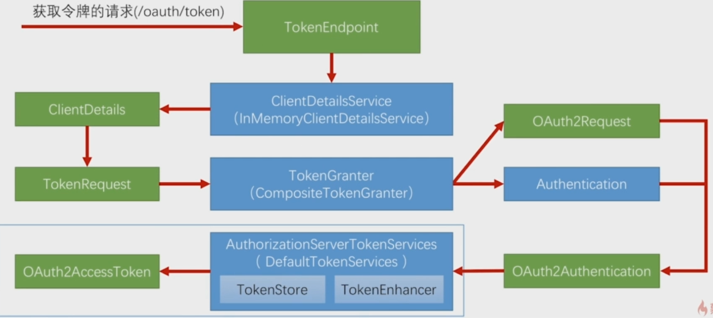
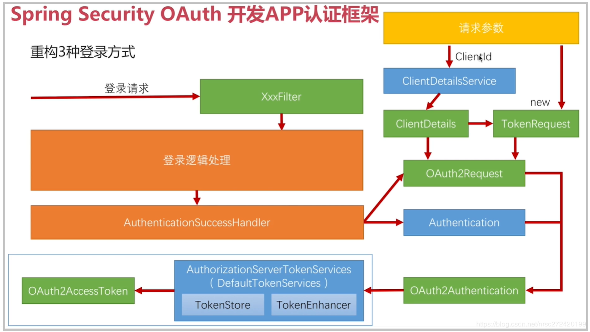
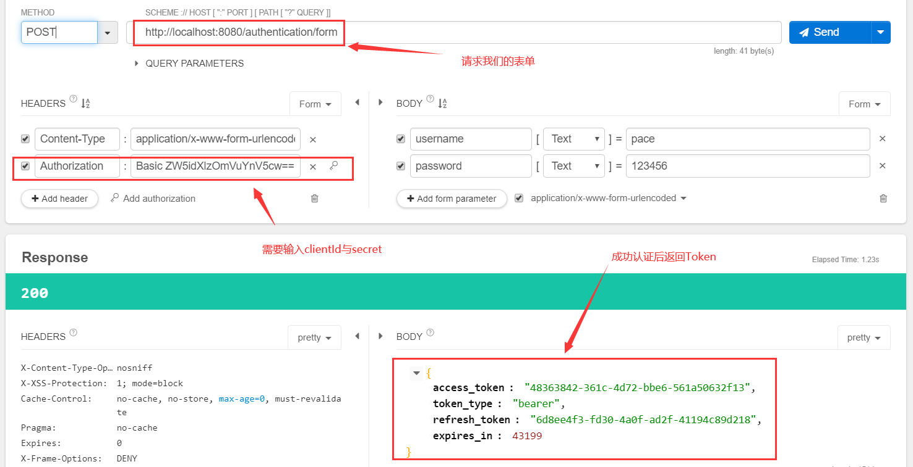
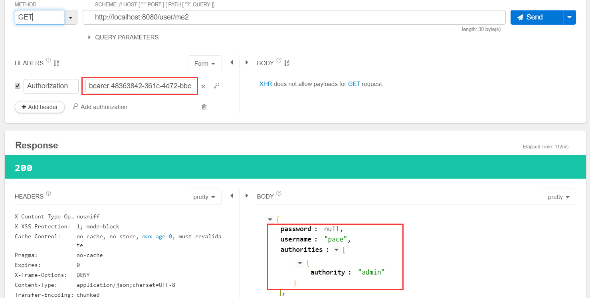
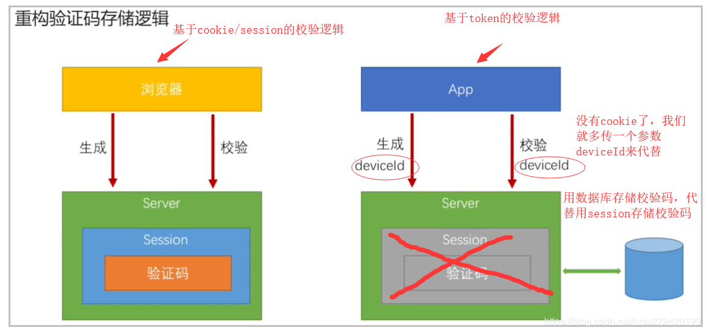
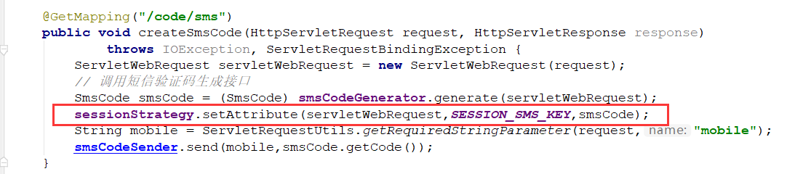

## 为何/如何重构表单登录

首先，我们需要明确一点，为什么我们要重构之前的表单登录？

因为对于App来说，没有Cookie，所以不能使用Cookie+Session的方式对登录用户信息存储，就必须使用Token，然后SpringSecurityOAuth就是封装了一系列操作，最后返回Token，但是它只有四种授权模式，并没有直接表单登录，或者短信登录的方式，所以我们需要进行一些改变，来通过SpringSecurityOAuth帮我们实现Token的生成发放，最后实现App的登录以及登录状态保存。

通过上一节的学习，我们大致了解了SpringSecurityOAuth生成Token的流程，如下图



那么，我们要用的逻辑是哪块呢？就是最下面`AuthorizationServerTokenServices`生成Token的逻辑，所以我们的实现流程就如下图：



首先我们之前的认证成功处理器的处理就是直接将`Authorization`作为json形式返回，所以我们是有`Authorization`这个对象的。

那么我们的目光就聚焦在`OAuth2Request`上了，只要有了他就能调用`DefaultTokenServices`生成Token，那么如何创建一个`OAuth2Request`对象呢？

通过上节源码可知，它是由`ClientDetails`和`TokenRequest`生成的

- `ClientDetails`是由请求参数`ClientId`作为参数，调用`ClientDetailsService`生成的
- `TokenRequest`就更简单了，是直接`new`出来的，通过请求的几个参数和`ClientDetails`

总结，使用SpringSecurity OAuth重构表单登录的思路有三点：

- 代码写在`AuthorizationSuccessHandler`成功处理器里
- 最终目标是构建出`OAuth2Request`对象
- 构建对象需要从参数`ClientId`入手

## SpringSecurityOAuth重构表单登录

### 认证成功处理器

```java
@Component
public class MyAuthenticationSuccessHandler extends SimpleUrlAuthenticationSuccessHandler {

    @Autowired
    private ObjectMapper objectMapper;

    @Autowired
    private ClientDetailsService clientDetailsService;
    @Autowired
    private AuthorizationServerTokenServices authorizationServerTokenServices;

    @Override
    public void onAuthenticationSuccess(HttpServletRequest request,
                                        HttpServletResponse response,
                                        Authentication authentication)
            throws IOException, ServletException {

        //请求头的Authorization里存放了ClientId和ClientSecret
        //从请求头里获取Authorization信息可参考BasicAuthenticationFilter类
        String header = request.getHeader("Authorization");

        if (header == null || !header.startsWith("Basic ")) {
            throw new UnapprovedClientAuthenticationException("请求头中无client信息");
        }

        String[] tokens = extractAndDecodeHeader(header, request);

        // 第一个为clientId 第二个为clientSecret
        String clientId = tokens[0];
        String clientSecret = tokens[1];

        // 根据clientId获取clientDetails
        ClientDetails clientDetails = clientDetailsService.loadClientByClientId(clientId);

        // 对获取到的clientDetails进行校验
        if (clientDetails == null) {
            throw new UnapprovedClientAuthenticationException("clientId对应的配置信息不存在:" + clientId);
        } else if (!StringUtils.equals(clientDetails.getClientSecret(), clientSecret)) {
            throw new UnapprovedClientAuthenticationException("clientSecret不匹配:" + clientId);
        }

        // 根据clientDetails获取TokenRequest
        // 1- 请求参数的map，用来获取Authorization，因为已经获得所以传空的
        // 4- grantType，因为是自定义的 所以随便传一个
        TokenRequest tokenRequest = new TokenRequest(MapUtils.EMPTY_MAP, clientId, clientDetails.getScope(), "custom");

        // 获取OAuth2Request对象
        OAuth2Request oAuth2Request = tokenRequest.createOAuth2Request(clientDetails);

        // 获取Token
        OAuth2Authentication oAuth2Authentication = new OAuth2Authentication(oAuth2Request, authentication);
        OAuth2AccessToken accessToken = authorizationServerTokenServices.createAccessToken(oAuth2Authentication);


        // 返回Json数据 返回Token
        response.setContentType("application/json;charset=UTF-8");
        response.getWriter().write(objectMapper.writeValueAsString(accessToken));
    }

    /**
     * 从header获取Authentication信息 --- 》 clientId和clientSecret
     * @param header
     * @param request
     * @return
     * @throws IOException
     */
    private String[] extractAndDecodeHeader(String header, HttpServletRequest request) throws IOException {

        byte[] base64Token = header.substring(6).getBytes("UTF-8");
        byte[] decoded;
        try {
            decoded = Base64.decode(base64Token);
        } catch (IllegalArgumentException e) {
            throw new BadCredentialsException("Failed to decode basic authentication token");
        }
        String token = new String(decoded, "UTF-8");
        int delim = token.indexOf(":");

        if (delim == -1) {
            throw new BadCredentialsException("Invalid basic authentication token");
        }
        return new String[]{token.substring(0, delim), token.substring(delim + 1)};
    }

}
```

### app模块加入安全配置

这里要加在资源服务器上配置，因为资源服务器才是需要安全认证的

```java
@Configuration
@EnableResourceServer
public class ResourcesServerConfig extends ResourceServerConfigurerAdapter {

    @Autowired
    private SecurityProperties properties;
    @Autowired
    private MyAuthenticationSuccessHandler successHandler;
    @Autowired
    private MyAuthenticationFailHandler failHandler;

    @Override
    public void configure(HttpSecurity http) throws Exception {

        http.formLogin() // 表单配置
                .loginPage("/authentication/require") // 自定义登录页
                .loginProcessingUrl("/authentication/form") // url映射，post表单的url交给表单拦截器处理
                .successHandler(successHandler)
                .failureHandler(failHandler)
            .and()
            .authorizeRequests() // 下面是认证信息
                .antMatchers(
                        "/authentication/require",
                        "/authentication/mobile",
                        "/code/*",
                        properties.getBrowser().getLoginPage(),
                        properties.getBrowser().getSignupPage(),
                        "/social/user",
                        "/user/regist",
                        "/session/invalid"
                )
                .permitAll() // 匹配请求过滤
                .anyRequest() // 所有请求
                .authenticated() // 都需要认证
            .and()
            .csrf().disable()// 取消csrf安全防护机制
        ;
    }
}
```

这里复制了之前的browser模块配置，去掉了一些，保留了有用的

### 启动测试

使用Talend API插件，Postman也可以



请求后成功返回`AccessToken`，接着我们使用这个Token去资源服务器请求



正确返回，说明我们使用SpringSecurityOAuth重构表单登录成功

## SpringSecurityOAuth重构短信登录

这里简单说一下为什么要重构短信验证，之前我们将短信的校验码是保存在Session中的，但是App没有使用Session，所以需要重构



重构方式也很简单，就是之前在代码中所有使用`sessionStrategy`进行保存，获取，移除验证码的操作都改为数据库读写操作。比如下图这行代码：



因为实现比较简单，并且对我们之前写的**认证成功处理器返回Token没有任何修改**，就不再做演示了。

## SpringSecurityOAuth重构第三方登录

*TODO*

可以看下这两篇博客：[使用简化模式重构第三方登录](<https://blog.csdn.net/nrsc272420199/article/details/102653869>)，[使用授权码模式重构第三方登录](<https://blog.csdn.net/nrsc272420199/article/details/102673112>)

