## 基本的Token配置

在之前的OAuth学习中，我们都是使用它默认生成的Token，那么我们这一节就是来自定义Token的一些配置。

### 配置Token

配置Token需要继承`AuthorizationServerConfigurerAdapter`类

```java
@Configuration
@EnableAuthorizationServer
public class AuthorizationServerConfig extends AuthorizationServerConfigurerAdapter {

    @Autowired
    private AuthenticationManager authenticationManager;
    @Autowired
    private UserDetailsService myUserDetailService;
    @Autowired
    private PasswordEncoder passwordEncoder;

    @Override
    public void configure(AuthorizationServerEndpointsConfigurer endpoints) throws Exception {
        // 如果继承AuthorizationServerConfigurerAdapter这个类，就必须配置下面两个对象
        // 认证管理器和UserDetailsService
        // Security5之后，认证管理器无法自动注入，需要向容器中添加，方式为继承WebServerConfigurerAdapter重新方法
        endpoints.authenticationManager(authenticationManager)
                .userDetailsService(myUserDetailService);

    }

    @Override
    public void configure(ClientDetailsServiceConfigurer clients) throws Exception {
        clients.inMemory()
                    .withClient("enbuys") // client id
                    // client secret 必须使用密码进行加密
                    .secret(passwordEncoder.encode("enbuys"))
                    // token过期时间
                    .accessTokenValiditySeconds(6000)
                    // 可以使用的授权模式
                    .authorizedGrantTypes("password","refresh_token")
                    // 配置授权类型，设置了这个，发送请求如果不同会报错
                    .scopes("all")
                .and() // 配置第二个客户端
                    .withClient("test")
                    .secret(passwordEncoder.encode("test"))
        ;
    }

}
```

由代码注释可见，继承此类，**必须重写方法配置`AuthorizationManager`和`UserDetailsService`**，其中`UserDetailsService`我们之前已经实现，直接注入即可，`AuthorizationManager`在SpringBoot2.x，Security5.x之后需要我们向容器注入，否则会出现无法找到类的情况，所以我们下一步需要向容器注入`AuthorizationManager`。

还有一点需要注意的是，在SpringBoot2.x，Security5.x之后，客户端密码即`clientSecret`需要进行加密，不然无法匹配。

### 向容器中注入AuthenticationManager

这里我们使用之前配置`basic`登录方式的`AppSecurityConfig`类

```java
@Configuration
public class AppSecurityConfig extends WebSecurityConfigurerAdapter {

    @Bean
    @Override
    public AuthenticationManager authenticationManagerBean() throws Exception {
        return super.authenticationManagerBean();
    }

    @Override
    protected void configure(HttpSecurity http) throws Exception {
        http.httpBasic();
    }
}
```

这样其实已经配置好了，但是还有有一点可以配置的，就是Token的保存位置。

### 使用Redis存储Token

我们之前都是使用默认内存形式保存的Token，这样应用一重启就失效了，现在我们改成使用Redis保存，为何不用Mysql我就不赘述了。

使用方式也很简单，首先向容器注入`RedisTokenStore`存储器

```java
@Configuration
public class TokenStoreConfig {

    @Autowired
    private RedisConnectionFactory redisConnectionFactory;
    
    @Bean
    public RedisTokenStore redisTokenStore(){
        return new RedisTokenStore(redisConnectionFactory);
    }
}
```

然后再刚刚配置Token的地方配置`TokenStore`

```java
@Configuration
@EnableAuthorizationServer
public class AuthorizationServerConfig extends AuthorizationServerConfigurerAdapter {

    @Autowired
    private TokenStore tokenStore;

    @Override
    public void configure(AuthorizationServerEndpointsConfigurer endpoints) throws Exception {
        endpoints.authenticationManager(authenticationManager)
                .userDetailsService(myUserDetailService)
            	// 配置TokenStore
                .tokenStore(tokenStore);

    }
    
    ···
}
```

这里Redis的配置可以自行在`application.properties`中配置

### 启动测试

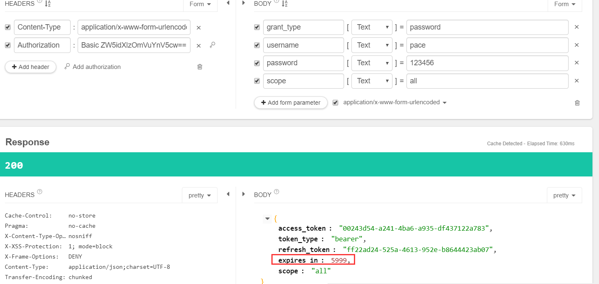

发送请求后，可以看到超时时间是我们设置的60秒

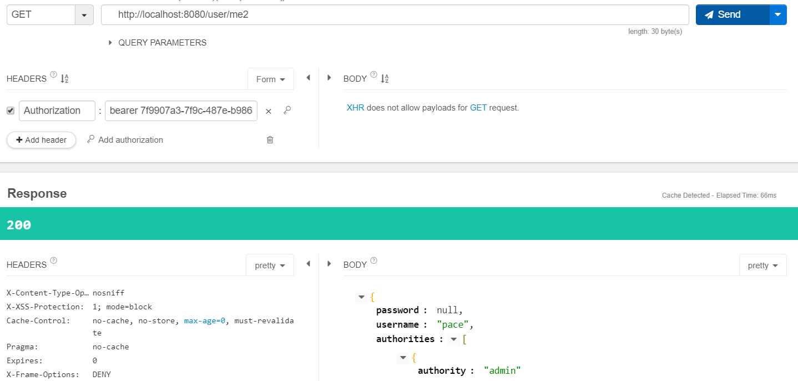

可以成功获取信息，并且Redis中保存了数据

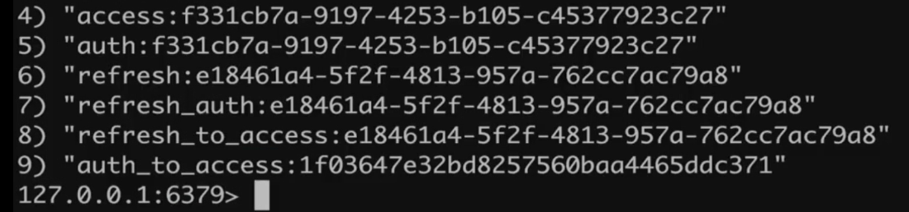


## 使用JWT替换默认Token

### JWT是什么

首先我们要先了解什么是JWT，Json Web Token，它是一种特殊的Token，有以下三个特点概况：

- 自包含：这个令牌中是**包括一些信息**的，而不是像普通的Token使用`UUID`随机生成，拿到这个令牌，**进行解析就可以获取到一些信息**，比如用户信息请求信息等。这样的好处就是不用再服务端保存Token了，普通的Token保存在Redis或者Mysql中，**如果数据库挂了，那么那些Token也就失效了**，使用JWT就不会出现这种情况。也不用担心分布式集群时的Session共享问题。
- 可扩展：它除了默认的信息外，我们可以往里面添加自定义的信息，就比如`HTTP`请求向请求头中添加自定义请求头一样。
- 密签：在生成JWT的时候，我们可以添加一个秘钥，他是一个签名，而不是加密，就是别人可以破解了解你这里面保存了什么东西，但是别人**不能篡改**。秘钥很重要，如果泄露别人就可以仿照我们的令牌进行不当操作。

### 实现JWT

在SpringSecurity OAuth中实现JWT很简单，我们之前看过源码，在生成Token的时候使用的是`DefaultTokenServices`生成，`UUID`的形式，我们想要生成JWT就需要向容器添加`TokenEnhancer`增强类，使默认生成的Token变成JWT：

- 配置`JwtAccessTokenConverter `：本质是`TokenEnhancer`，作用是将默认生成的token做进一步处理使其成为一个JWT。
- 配置`TokenStore`：和`RedisTokenStore`一样，JWT也有一个`JWTTokenStore`，因为我们其实并不需要保存JWT所以其实这个实现类就是什么都不做，不做持久化或者向添加到内存
- 将`TokenStore`以及`JwtAccessTokenConverter `添加到认证服务器配置中

**配置 JwtAccessTokenConverter 与 TokenStore**

```java
@Configuration
public class TokenStoreConfig {

    @Autowired
    private RedisConnectionFactory redisConnectionFactory;

    @Bean
    public JwtTokenStore jwtTokenStore(){
        // 实例化需要添加JwtConverter
        return new JwtTokenStore(jwtAccessTokenConverter());
    }

    @Bean
    public JwtAccessTokenConverter jwtAccessTokenConverter(){
        JwtAccessTokenConverter jwtAccessTokenConverter = new JwtAccessTokenConverter();
        // 设置签名
        jwtAccessTokenConverter.setSigningKey("enbuys");
        return jwtAccessTokenConverter;
    }

    /*@Bean
    public RedisTokenStore redisTokenStore(){
        return new RedisTokenStore(redisConnectionFactory);
    }*/
}
```

**将TokenStore以及JwtAccessTokenConverter 添加到认证服务器配置中**

```java
@Configuration
@EnableAuthorizationServer
public class AuthorizationServerConfig extends AuthorizationServerConfigurerAdapter {

    @Autowired
    private TokenStore tokenStore;
    @Autowired
    private JwtAccessTokenConverter jwtAccessTokenConverter;

    @Override
    public void configure(AuthorizationServerEndpointsConfigurer endpoints) throws Exception {
        endpoints.authenticationManager(authenticationManager)
                .userDetailsService(myUserDetailService)
                .tokenStore(tokenStore) // 添加Token存储机制
                .accessTokenConverter(jwtAccessTokenConverter) // 添加JWT增强器
        ;

    }
    ···
}
```

**然后启动测试**

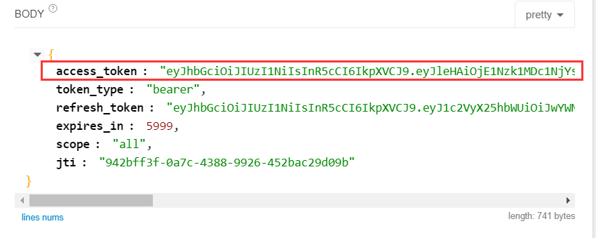

会发现Token变了，变的很长一串就是JWT了，而且每次请求不管是否超时都会重新生成新的JWT，如何查看这个Token中的内容呢？找一个解析网站解析：<https://www.jsonwebtoken.io/>


然后我们拿着Token获取用户信息

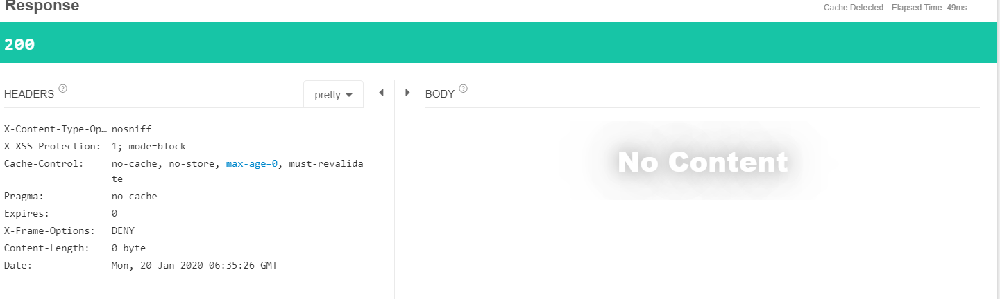

发现没有任何返回信息，为何？看看代码

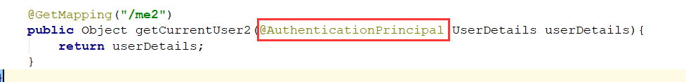

这里我们使用的是`Authorization`中的`Principal`信息，可能因为信息不正确没有映射成功，我们请求`/me`看看

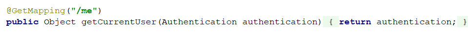

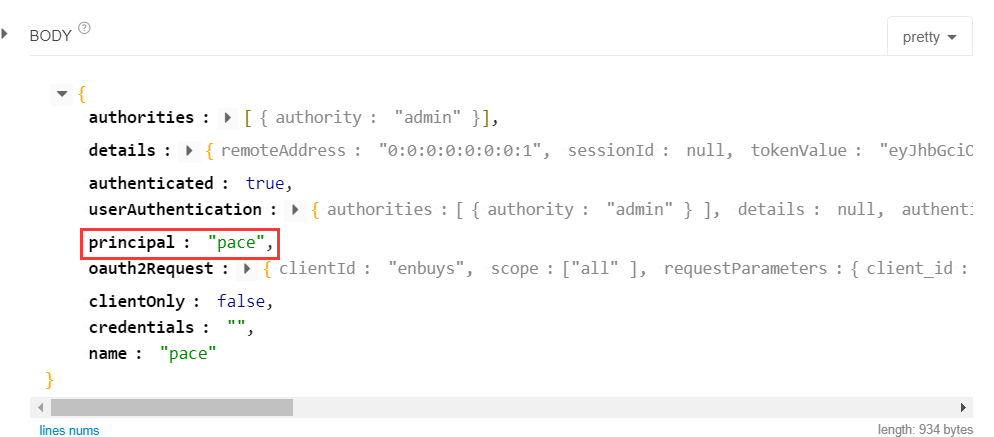

因为principal是一个字符串，所以没有返回。

这里JWT再传给资源服务器获取信息的时候，会将其解析并封装成SpringSecurity Authorization，而不是它本身包含的那些信息，这里需要根据业务需求去获取哪些信息，比如用户信息就保存在`userAuthorization`中


## JWT扩展

### 向JWT中添加附加信息

就是类似像请求头中添加自定义信息一样，我们也可以往JWT中添加自定义信息，实现也非常简单

其原理就，自己写一个Token增强器，在Token生成后，对Token进行添加自定义信息。

#### 实现自定义Token增强器

```java
@Component
public class MyJwtTokenEnhancer implements TokenEnhancer {
    @Override
    public OAuth2AccessToken enhance(OAuth2AccessToken accessToken, OAuth2Authentication authentication) {
        // 创建自定义信息，Map形式
        Map<String,Object> map = new HashMap<>();
        map.put("company","enbuys");
        // 向AccessToken中添加自定义信息
        ((DefaultOAuth2AccessToken)accessToken).setAdditionalInformation(map);
        return accessToken;
    }
}
```

#### 配置认证规则

```java
@Configuration
@EnableAuthorizationServer
public class AuthorizationServerConfig extends AuthorizationServerConfigurerAdapter {

    @Autowired
    private TokenStore tokenStore;
    @Autowired
    private JwtAccessTokenConverter jwtAccessTokenConverter;
    @Autowired
    private TokenEnhancer myJwtTokenEnhancer;

    @Override
    public void configure(AuthorizationServerEndpointsConfigurer endpoints) throws Exception {
        ···
        // 这里需要添加两个增强器，所以要使用增强器链添加
        List<TokenEnhancer> tokenEnhancerList = new ArrayList<>();
        tokenEnhancerList.add(myJwtTokenEnhancer); //自定义增强器需要放在前面
        tokenEnhancerList.add(jwtAccessTokenConverter);
        TokenEnhancerChain chain = new TokenEnhancerChain();
        chain.setTokenEnhancers(tokenEnhancerList);
        endpoints.tokenEnhancer(chain);

    }
    ···
}
```

这里我省略了之前的代码，对于需要添加多个增强器的，必须使用增强器链的形式，还有一点就是**自定义的增强器要放在`JWTConverter`前面，不然不会生效！**

#### 启动测试

发送完，再看一下解析

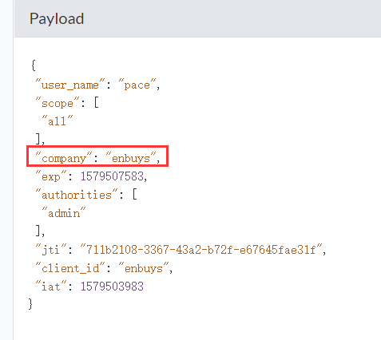

会发现多出来一个我们自定义的信息，然后我们请求`/me`接口，看看`Authorization`中的信息

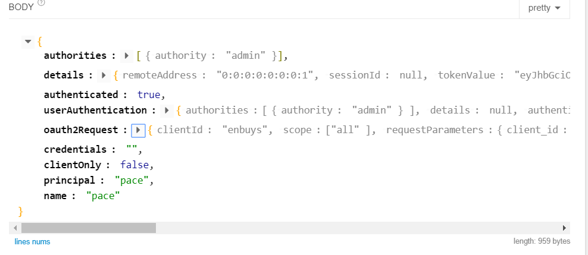

这里会发现是没有我们添加的附加信息的，所以我们需要一些操作来获取附加信息

### 服务器获取JWT附加信息

我们需要借助`jjwt`这个插件实现获取，其实原理就是将JWT解析，然后存到Map里

**加入依赖**

```xml
<dependency>
    <groupId>io.jsonwebtoken</groupId>
    <artifactId>jjwt</artifactId>
    <version>0.9.1</version>
</dependency>
```

**从请求头中获取到JWT，并利用Jwts工具借助`密钥`解析获得到扩展信息**

```java
@GetMapping("/getMyJwt")
public Object getMyJwt(Authentication authentication,HttpServletRequest request)
        throws UnsupportedEncodingException {
    //从请求头中获取到JWT
    String token = StringUtils.substringAfter(request.getHeader("Authorization"), "bearer ");
    //借助密钥对JWT进行解析,注意由于JWT生成时编码格式用的UTF-8（看源码可以追踪到）
    //但Jwts工具用到的默认编码格式不是，所以要设置其编码格式为UTF-8
    String signKey = "enbuys";
    Claims claims = Jwts.parser()
            .setSigningKey(signKey.getBytes("UTF-8"))
            .parseClaimsJws(token).getBody();
    //取出扩展信息，并打印
    String company = (String) claims.get("company");
    return company;
}
```

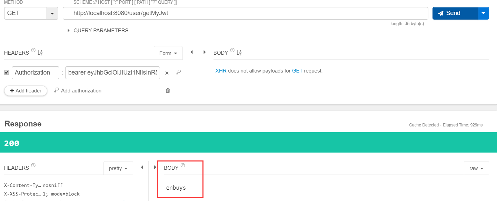

## 使用JWT实现SSO

SSO单点登录，就是在淘宝登录了，我们从淘宝点链接跳到天猫，会自动登录，不需要再次登录。

### SpringSecurity OAuth实现方式

这里简单说一下，就不放代码了

- 首先需要创建一个认证服务器应用，用来做认证
- 然后创建两个客户端，用来当做淘宝和天猫

单点登录的配置很简单，启动器类添加一个注解，然后再配置文件中配置即可！

#### 添加注解

```java
@SpringBootApplication
@RestController
@EnableOAuth2Sso // 开启单点登录
public class SsoClient1Application {
```

`@EnableOAuth2Sso` 主要是这个注解开启OAuth2单点登录

#### 配置文件配置

```properties
# 单点登录配置
security.oauth2.client.clientId = app1
security.oauth2.client.clientSecret = app1
security.oauth2.client.user-authorization-uri = http://127.0.0.1:9999/server/oauth/authorize
security.oauth2.client.access-token-uri = http://127.0.0.1:9999/server/oauth/token
security.oauth2.resource.jwt.key-uri = http://127.0.0.1:9999/server/oauth/token_key
# Security5之后需要配置
security.oauth2.resource.user-info-uri= http://127.0.0.1:9999/server/user
security.oauth2.resource.token-info-uri= http://127.0.0.1:9999/server/oauth/check_token

# 应用配置
server.port = 8080
server.context-path = /app1
```

这只是最基本的配置，还有很多需要自己去实现，比如：

- 自定义的登录页面
- 自动授权