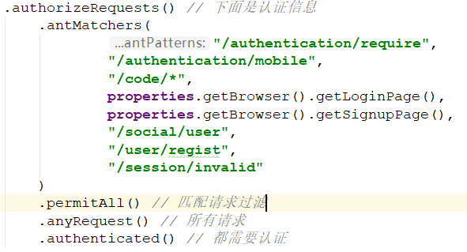
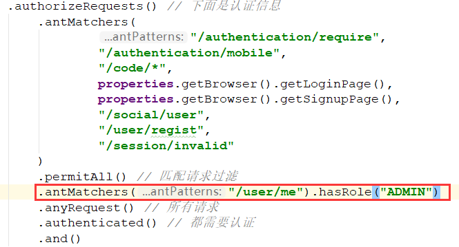
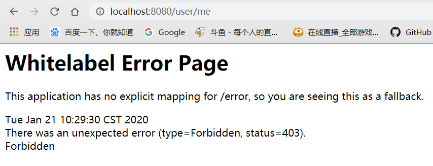
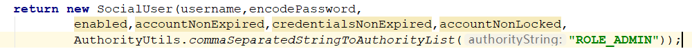
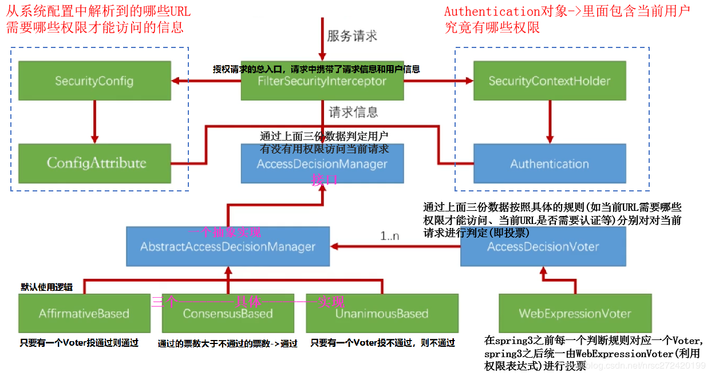
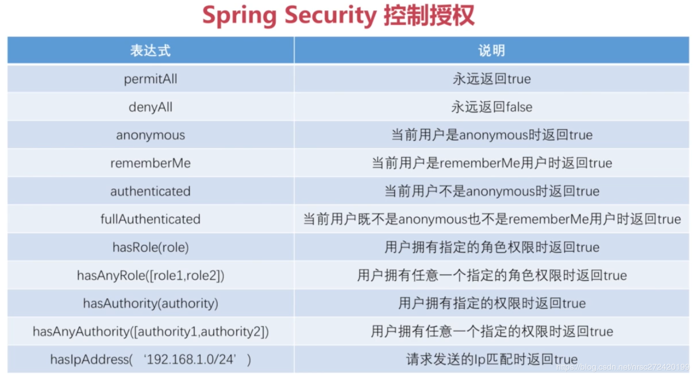
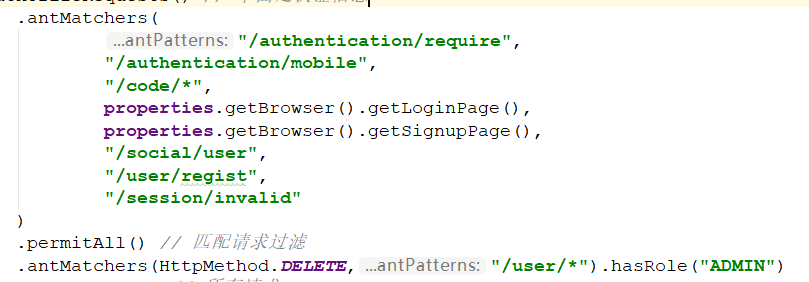

## 权限控制简单介绍

在我们之前的20篇关于SpringSecurity的笔记中，较详细的介绍了SpringSecurity关于认证的内容，接下来我们会讲一下关于授权的内容。

**认证**是指：你有一个家，你可以进行控制让谁能进来，比如你的家人，谁进不来比如陌生人，这就是认证。

**授权**是指：你的家人进到你家可以做什么事，比如你姑姑姨姨就不能随便翻你的东西，打开保险柜，而你的妻子就可以，这就是授权。

对于我们开发应用的授权有一定经验的都知道，基本适用于后台管理系统，不同职位的人有不同的操作权限，比如人事就有添加员工的权限，财务有设置工资的权限，领导有审批请假的权限等等。

那么一般情况下，如何控制授权呢？这里不止SpringSecurity


如图，系统应该有两部分信息

- 系统配置：哪些路径需要哪些权限才可以访问，比如添加用户需要A权限，审批需要B权限
- 用户权限配置：哪些用户具有哪些权限，比如人事有A权限但是没有B权限，领导既有A还有B权限

当请求发过来的时候，会先根据系统配置看看这个请求是否需要某个权限才能访问，如果有，再判断用户是否有这个权限，有才能访问。

## SpringSecurity简单权限控制

> 对于某些URL，只有某些权限的用户才能访问，这种逻辑直接写死在代码里，从技术实现上来说很简单，但真实项目中应该很少会这样用，但本文仍主要来演示一下具体的代码实现。

首先我们把`demo`项目改为引用`browser`

然后我们看一下之前的代码：



可以看到，这些都是和认证有关的，关于授权就是`.permitAll()`，意思是这些请求返回`True`，对于其他的授权控制代码也类似，如下：



意思是`/user/me`这个请求路径，必须有`ADMIN`权限才可以，这里的权限是在哪分发的呢？是之前的`UserDetailsService`类：


创建`SocialUser`时，最后一个参数就是其用户权限的配置参数，这里我们给了个`admin`，启动试试能不能访问



请求`Forbidden`了，说明没有权限，有人会想我们不是给了`admin`权限吗？

其实这里根据SpringSecurity权限控制规则，需要给`ROLE_ADMIN`，才会有`ADMIN`权限，即：



为什么要这样给，我们之后的源码分析时再研究


成功请求。

------

这里还有一个问题，就是如果是RESTful的API，`/user/1`如果是`GET`是获取用户，如果是`DELETE`是删除用户，我们只想控制`DELETE`请求能否控制，也是可以的很简单：

```java
http..authorizeRequests()
	.antMatchers(HttpMethod.DELETE,"/user/*").hasRole("ADMIN")
```

这样即可

## SpringSecurity授权整体流程



这里简单解释一下，对于SpringSecurity授权来说

主入口是`FIlterSecurityInterceptor`

系统配置`URl`为：`SecurityConfig`整合成`ConfigAttribute`

该用户有哪些权限：`SecurityContextHolder`生成带权限的`Authorization`对象

然后我们将`Authorization`对象，`ConfigAttribute `URL权限配置，以及当前访问的路径作为三个参数，传给`AccessDecisionManager`，这个接口的方法用来判断该用户是否有权限访问该`URL`。

因为是接口，所以实现类有很多，这里SpringSecurity默认使用`AffirmativeBased`进行判断，调用投票器来根据路径找到需要的权限，然后再匹配当前用户使用有权限，如果有则投一张票，然后`AffirmativeBased`只有有投票器通过，就会放行。

## SpringSecurity授权表达式



主要的表达式是这些，那么这些表达式怎么使用，在代码中怎么编写呢？其实我们之前就写过



比如这两个就是授权表达式，其规则是：`.antMatchers("匹配的URL").表达式(表达式参数)`

对于上面的`anonymous`解释一下，意思就是未登录的用户，在`Security`过滤器链中，在所有绿色过滤器链的最后，一定会有一个`AnonymousAuthorizationFilter`，他的作用就是如果认证时用户没有登录上下文中没有`Authorization`，他会创建一个类型为`Anonymous`的`Authorization`标识匿名用户

###  如何联合使用权限表达式

如下面这个需求:

>  某个URL的访问既需要用户有ADMIN权限,又必须是127.0.0.1这个IP地址发送的请求

权限表达式对应的方法不能进行链式调用,如果想完成此需求,可以使用`access()`方法拼接权限表达式:

```java
.antMatchers("/user/*").access("hasRole('ROLE_ADMIN') and hasIpAddress('127.0.0.1')")
```


