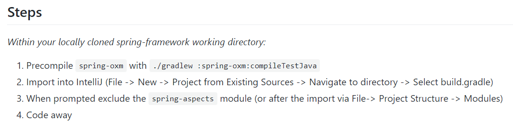
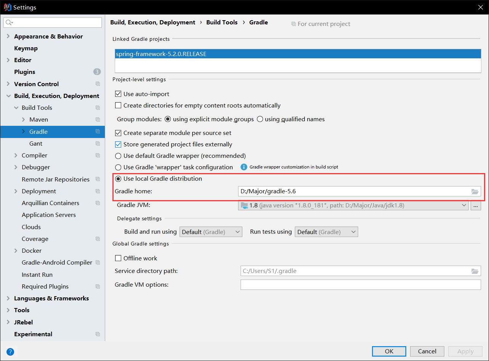
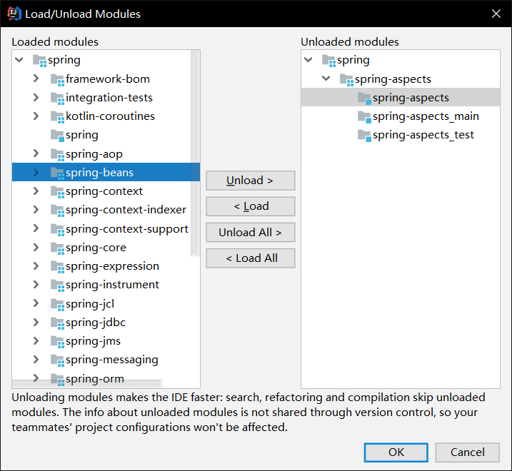
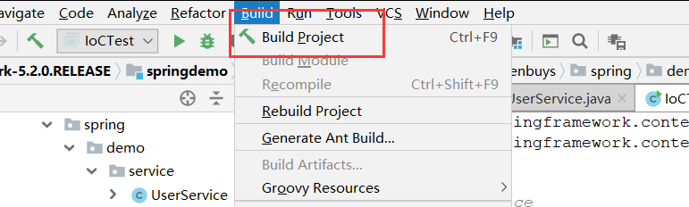
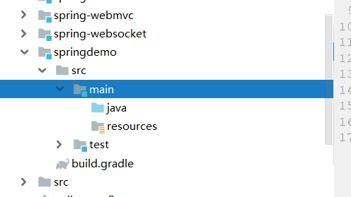
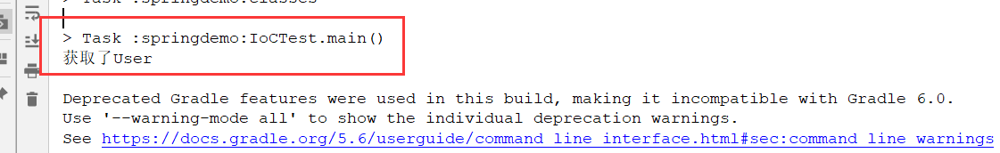

## Spring源码准备

### 下载源码

这里我使用到Spring5.2.0.RELEASE版本

进入Spring的github：<https://github.com/spring-projects/spring-framework/tree/v5.2.0.RELEASE>

直接下载Zip包就可以，下载好后，解压到某个文件夹中

### 下载Gradle

https://services.gradle.org/distributions/，可以下载5.6版本的，下bin版本就可以

下载完后解压，然后去配置一下环境变量

### 编译源码

我们可以参照Spring官方的文档教程进行编译：<https://github.com/spring-projects/spring-framework/wiki/Build-from-Source>

以及IDEA编译使用的文档：<https://github.com/spring-projects/spring-framework/blob/master/import-into-idea.md>



接下来我们就按照官方步骤，进行编译构建Spring源码

#### 配置Gradle

首先我们需要打开Spring源码下的`build.gradle`，这里面存放了构建时需要的依赖等信息，我们需要修改这个配置，**使用阿里云的镜像**进行依赖下载，就和maven的原理一样。

在`buildscript`和`allprojects`中添加`repositories`

```
buildscript {
    repositories {
        maven{ url 'http://maven.aliyun.com/nexus/content/groups/public/' }
        maven{ url 'http://maven.aliyun.com/nexus/content/repositories/jcenter'}
    }
}
allprojects {
    repositories {
        maven{ url 'http://maven.aliyun.com/nexus/content/groups/public/'}
        maven{ url 'http://maven.aliyun.com/nexus/content/repositories/jcenter'}
    }
}
```

#### 编译spring-oxm

在spring源码存放目录下，打开命令行，敲入以下命令进行编译oxm，这是spring编译的第一步

```
gradlew.bat :spring-oxm:compileTestJava
```

#### 使用IDEA导入Spring源码

这里直接import spring所在的文件夹，注意是选择gradle构建，而不是maven

如果构建时出现以下错误：

```
java.lang.AbstractMethodError: org.jetbrains.plugins.gradle.tooling.util.ModuleComponentIdentifierImpl.getModuleIdentifier()Lorg/gradle/api/artifacts/ModuleIdentifier;
```

则IDEA需要配置一下gradle的位置：



> 注意，Spring5.2版本应使用Gradle5以上版本，但是idea2018.1并不支持，所以需要升级到2019版本的IDEA

#### 移除spring-aspects

aspects有自己的编译器ajc，这个会影响jvm的加载，然后导致报错，所以需要移除掉



去除后，可以将项目再次构建一下：



到此就构建完成，然后我们可以创建一个demo，使用spring的源码来测试一下

## SpringDemo

这里我们使用刚刚编译构建好的Spring，实现一个简单的IoC功能

### 创建springdemo模块

注意是使用Gradle创建，而不是maven



### 向gradle中添加context模块

这就和maven引入依赖一样

```
dependencies {
    compile(project(":spring-context"))
    testCompile group: 'junit', name: 'junit', version: '4.12'
}
```

### 创建Service

```java
public class UserService {
	public void getUser(){
		System.out.println("获取了User");
	}
}
```

### 创建配置文件

```java
<beans xmlns="http://www.springframework.org/schema/beans"
	   xmlns:xsi="http://www.w3.org/2001/XMLSchema-instance"
	   xsi:schemaLocation="http://www.springframework.org/schema/beans
	    http://www.springframework.org/schema/beans/spring-beans.xsd">
	<bean id="userService" class="com.enbuys.spring.demo.service.UserService"/>

</beans>
```

### 测试从容器中获取Service

```java
public class IoCTest {
	public static void main(String[] args) {
		String xmlPath = "D:\\ideaProject\\spring-framework-5.2\\spring-framework-5.2.0.RELEASE\\springdemo\\src\\main\\resources\\spring\\spring-demo.xml";
		ApplicationContext applicationContext = new FileSystemXmlApplicationContext(xmlPath);
		UserService userService = (UserService) applicationContext.getBean("userService");
		userService.getUser();
	}
}
```



成功从容器中获取Service，并调用方法