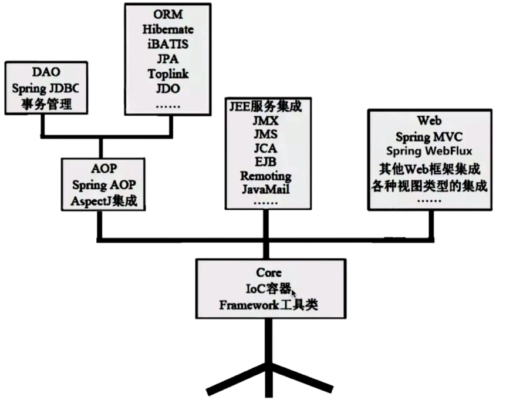
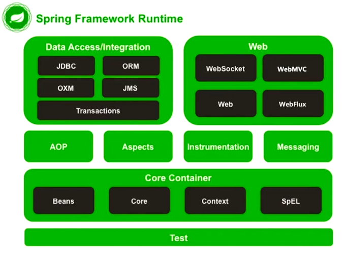

## Spring大家族

Spring家族体系有四个阶段，其中第四个阶段还在孵化

- Spring：将单体应用更方便的开发
  - Spring Core
  - Spring Data
  - Spring Security
- SpringBoot：加速开发效率，将程序从可用变为好用
- SpringCloud：推动微服务架构落地，很多时候都是先了解到SpringCloud之后，才去了解微服务的
- Spring Cloud Dataflow：将所有服务当做组件，可用实现灵活的伸缩组合

## Spring架构介绍

### Spring Core

Spring Core模块是Spring最核心最基础的模块，可以说万丈高楼平地起，地基的稳固程度是离不开的，Core就是Spring强有力的地基。

Core主要包含IOC容器，来管理对象间依赖关系，并且有一个工具类，当然这个工具类我们可以直接复制出来使用。Core中还包含很多重要的部分

- AOP：实现面向切面，与面向对象相结合
  - 事务管理
  - ORM框架
- J2EE服务集成：对于J2EE服务的支持完善，类似拔插效果，可以轻松的集成与剔除
- Web

### Spring架构

Spring下面这个架构图，可以说很常见了，他也是Spring多年来从未变过的核心架构：

- Test：Spring提供的测试模块
- **Core Container (*)**：核心模块
  - **Beans**：Bean是所有应用都要用到，IoC&DI，以及BeanFactory都是重中之重
  - **Core**：核心代码，并且不止在Core中使用，其他组件也要使用，核心工具类
  - **Context**：Spring上下文，也叫做IOC容器，可以获得Spring的Bean，ApplicationContext是BeanFactory的扩展
  - SpEL：EL表达式，运行时查询和操作对象
- **AOP(*)**：也是关键模块，面向切面编程的重要模块
  - **AOP**：轻量级的面向切面实现，基于Aspects
  - Aspects：面向切面编程的重点，AOP只是简单实现了一些功能，Aspects可以提供更多更强大的AOP实现
  - Instrumentation：资源模块，前面两个模块主要是针对方法进行切面编程，这个模块可以实现对类的切面编程
  - Messaging：消息协议支持，解读报文，实现与消息队列的整合
- Data：数据层模块
  - JDBC：简化JDBC的使用
  - ORM：主流ORM框架的支持，比如Mybatis等
  - Transaction：事务管理
  - ···
- Web：
  - Web：提供了最基础的Web支持，通过Filter或Listener来初始化IoC容器，简化请求的处理
  - **Spring MVC(*)**：也是 重点，后面详细说
  - Spring Webflux：Spring5新出的响应式编程，实现异步非阻塞事件驱动流
  - WebSocket：全双工通信协议，支持http长连接，实现双方互发消息，可以实现后端对前端发送请求，基于Messaging模块

### Spring核心模块

- spring-core
  - 包含框架最基本的核心工具类，提供其他组件使用
  - 定义资源文件的访问方式，比如properties文件
  - 对IoC & DI提供最基础服务
- spring-beans：Spring面向Bean编程的核心
  - Bean的定义
  - Bean的解析
  - Bean的创建
- spring-context：
  - 为Spring的运行提供环境，保存对象的状态
  - Bean的存储容器
  - ApplicationContext（BeanFactory的扩展）
- spring-aop：最小化的动态代理的实现，只支持部分AOP，实现20%的AOP，满足80%的需求
  - JDK实现
  - Cglib实现
  - 只能实现运行时织入，不支持编译和加载时织入
- spring-aspectj+spring-instrument：完整的AOP
  - 仅支持编译器和类加载器织入
  - 功能更加强大，但是使用起来比较麻烦，没有AOP那么方便